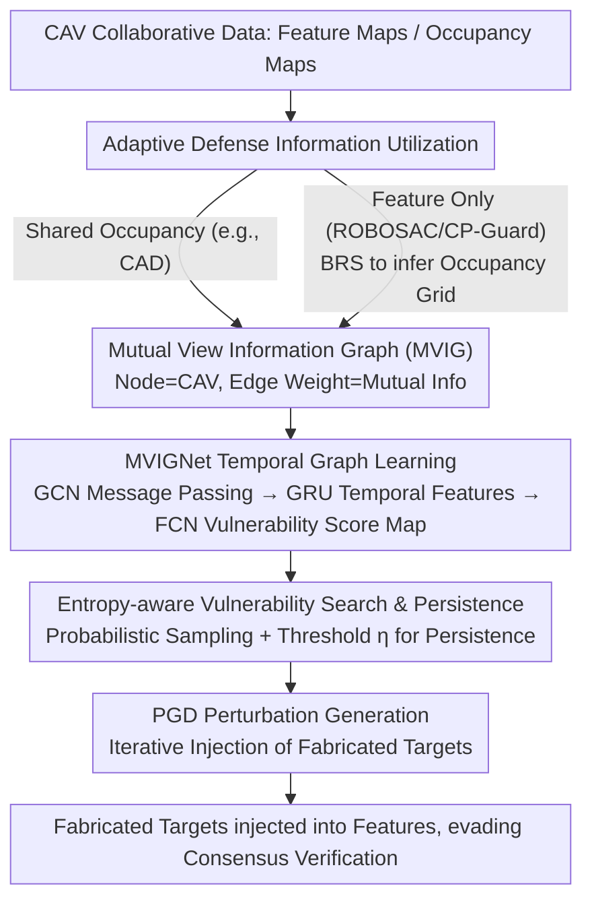

# Learning Mutual View Information Graph for Adaptive Adversarial Collaborative Perception

**Conference**: CVPR 2026  
**arXiv**: [2602.19596](https://arxiv.org/abs/2602.19596)  
**Code**: [Available](https://github.com/yihangtao/MVIG)  
**Area**: Autonomous Driving  
**Keywords**: Collaborative Perception Security, Adversarial Attacks, Graph Neural Networks, Temporal Modeling, Autonomous Driving

## TL;DR

Ours proposes the MVIG attack framework, which uniformly models the vulnerabilities of various defensive collaborative perception systems as a Mutual View Information Graph. By combining temporal graph learning with entropy-aware vulnerability searching, it achieves adaptive fabrication attacks that reduce defense success rates by up to 62%.

## Background & Motivation

### 1. Background
Collaborative Perception (CP) allows Connected Automated Vehicles (CAVs) to share perception data (e.g., feature maps), extending the perception range of individual vehicles and resolving occlusion issues. Existing defense systems such as ROBOSAC, CP-Guard, MADE, and CAD combat malicious agents through consensus verification.

### 2. Limitations of Prior Work
Existing defensive CP systems possess two critical weaknesses:
- **Lack of robustness against systematic spatiotemporal optimized attacks**: Current attack methods do not systematically determine when and where to initiate fabrication attacks, whereas attackers can develop targeted strategies against multi-vehicle consensus mechanisms.
- **Unintentional leakage of vulnerability knowledge during defense**: Collaborative data exchanged between CAVs (feature maps, occupancy maps, etc.) naturally embeds implicit confidence information about the surroundings, which attackers can exploit to identify regions of collective uncertainty.

### 3. Key Challenge
Security defense in CP systems relies on multi-vehicle consensus verification, but the data exchanged during this process exposes the system's weak points, creating a "defense-as-leakage" paradox.

### 4. Goal
Design an adaptive adversarial attack framework capable of learning vulnerabilities from different defensive CP systems to automatically optimize attack location, timing, and persistence, while maintaining generality across various defense configurations.

### 5. Key Insight
Uniformly model information leaked by different defense systems as a graph structure (MVIG), utilizing the graph's spectral properties and temporal evolution to discover vulnerable regions.

### 6. Core Idea
Construct a Mutual View Information Graph (MVIG) using CAVs as nodes and mutual information as edge weights to encode consistency and divergence in multi-vehicle perception. Future vulnerable regions are searched via temporal graph learning, and attack strategies are optimized using entropy-aware searching.

## Method

### Overall Architecture

The core objective is to identify optimal timing and locations within a CP system protected by consensus verification to inject fabricated targets without being detected. The central observation is that collaborative data (feature maps, occupancy maps) exchanged during verification reveals regions where multi-vehicle views diverge, which serve as windows for attack.

The pipeline follows this observation: First, the perception status of each CAV in every frame is compressed into a **Mutual View Information Graph (MVIG)**, where nodes represent vehicles and edge weights represent the mutual information between two vehicles (higher weights indicate higher consensus). Next, a temporal graph network, **MVIGNet**, processes historical MVIG sequences to predict vulnerability scores for each location in future frames. Given the score map, **Entropy-aware Searching** samples attack locations and decides whether the attack should persist into the next frame. Finally, PGD is used to generate feature perturbations at the selected locations to inject fabricated targets. The optimization of attack locations (masks) and perturbation values is **deliberately decoupled** into two stages to ensure quality while maintaining real-time performance. Occupancy information required for MVIG construction is adaptively acquired based on the victim system.

### Key Designs

**1. Mutual View Information Graph (MVIG): Explicitly Mapping Divergence**

Attackers seek "easy targets," which in collaborative perception are regions where multi-vehicle perceptions are contradictory or collectively uncertain—injecting targets there mimics normal viewpoint variance. MVIG models this explicitly: each CAV is a node with features comprising three parts: basic occupancy distribution $\mathbf{h}_i^{\text{basic}}$ (frequencies of free/occupied/unknown states), pose information $\mathbf{h}_i^{\text{pos}}$, and multi-scale spatial context features $\mathbf{h}_i^{\text{spatial}}$. Edge weights between vehicles quantify consensus via mutual information:

$$\mathbf{W}_{ij} = \mathbb{E}_{(x,y)}\left[\sum_{a,b} p_{ij}(a,b) \log \frac{p_{ij}(a,b)}{p_i(a) p_j(b)}\right]$$

High mutual information indicates high consensus, making attacks difficult; low mutual information indicates perceptual conflict, providing an attack window. Encoding vulnerability into a weighted graph provides generality—regardless of the underlying defense mechanism, the attacker faces the same problem of finding low-consensus regions on a graph.

**2. MVIGNet Temporal Graph Learning: Pre-empting Vulnerable Zones**

Current frame analysis is insufficient due to execution latency and vehicle movement. MVIGNet reads historical MVIG sequences to predict future vulnerability in three steps: First, GCN layers modulate message passing using edge weights to fuse node features with neighbor perspectives. Second, a GRU extracts temporal patterns $\mathbf{z}^{t+m} = \Phi_{\text{GRU}}(\{\mathbf{f}^\tau\})$ to capture dynamic blind spots caused by motion. Finally, an FCN head outputs a future vulnerability score map $\mathbf{S}_{t+m} \in [0,1]^{H \times W}$ (where $m=2$ frames), allowing the attacker to compensate for latency.

**3. Entropy-aware Vulnerability Search & Attack Persistence**

Given the score map, the next challenge is selecting specific locations and deciding whether to sustain the attack. Instead of selecting the global maximum, the score map is treated as a fabrication risk map for probabilistic sampling, adding stochasticity to avoid predictable patterns. Crucially, a persistence threshold $\eta$ determines continuation—attacks persist only if the smoothed vulnerability score in the target's neighborhood remains high:

$$\mathcal{C}_{t+m+j} = \mathbb{I}\left[\mathbb{E}_{(x,y) \in \mathcal{N}(x_c,y_c)}[\tilde{\mathbf{S}}_{t+m}(x,y)] \geq \eta\right]$$

This design (stopping when fabrication probability is low) ensures temporal coherence, making the attack appear as normal perceptual fluctuations and significantly reducing detection rates.

**4. Adaptive Defense Information Utilization**

Building MVIG requires occupancy information. For systems like CAD that share occupancy maps, the data is used directly. For others like ROBOSAC or CP-Guard that only share features, a Blind Region Segmentation (BRS) algorithm is used to infer approximate occupancy grids. This step allows MVIG to work across different defense configurations without assuming explicit occupancy map leakage.

### Loss & Training

Perturbations are optimized via PGD. For **Spoofing** (creating phantom targets), the objective $\phi(\boldsymbol{\delta}, M_t^*) = \sum_{b \in B'} \text{IoU}(b, b_t) \cdot \log(b_\sigma)$ maximizes fabrication confidence. For **Removal** (erasing real targets), the objective is negated to minimize detection confidence. Perturbations are constrained by $\|\delta\|_\infty \leq 1.0$, with 5 PGD iterations at a step size of 0.01.

MVIGNet is trained using three joint targets: a task effectiveness loss to maximize fabrication confidence while penalizing distant points; a box distinction loss to minimize overlap with existing detections; and a defense evasion loss to avoid high-consensus regions. Training is decoupled—MVIGNet uses labels generated by PGD, but gradients do not flow back to PGD, enabling real-time operation.

## Key Experimental Results

### Main Results

**Dataset**: OPV2V (Train), Adv-OPV2V (Test, 300 scenarios × spoofing/removal)

| Method | No Defense ASR | ROBOSAC DSR | CP-Guard DSR | GCP DSR | CAD DSR |
|---------|-----------|-------------|-------------|---------|---------|
| Basic [31] | 100.0 | 100.0 | 100.0 | 100.0 | 100.0 |
| RC spoof [39] | 92.4 | 12.0 | 18.1 | 12.2 | 83.5 |
| BAC [29] | 99.2 | 23.0 | 37.0 | 28.0 | 90.5 |
| **MVIG spoof** | 94.3 | **14.8** | **17.2** | **13.0** | **32.0** (-62%) |

| Method | ROBOSAC DSR | CP-Guard DSR | GCP DSR | CAD DSR |
|---------|-------------|-------------|---------|---------|
| RC remove [39] | 14.2 | 21.4 | 15.0 | 90.1 |
| **MVIG remove** | **12.2** (-14%) | 21.3 | **14.2** (-5%) | **78.2** (-13%) |

MVIG shows the most significant advantage against the CAD defense, where the spoofing DSR drops from 83.5% to 32.0% (↓62%).

### Continuous Attack (3-frame)

| Method | ROBOSAC DSR | CP-Guard DSR | GCP DSR | CAD DSR |
|---------|-------------|-------------|---------|---------|
| BAC [29] | 74.2 | 68.1 | 86.0 | 98.0 |
| RC spoof [39] | 38.1 | 24.0 | 42.1 | 100.0 |
| **MVIG spoof** | **37.0** | **26.2** | **42.0** | **63.2** (-37%) |

Under continuous attack, the DSR for BAC and RC increases sharply (due to temporal detection), whereas MVIG maintains a significant advantage.

### Ablation Study

- **Search Area**: For spoofing, increasing the range from 15m to 50m reduces DSR from 40.2% to 14.8% (more space benefits the attacker); removal attacks remain stable (72.1%-84.5%) as they must target existing objects.
- **Threshold η**: Without a threshold, DSR is 85.3%/91.7% (spoof/remove); $\eta \in [0.45, 0.50]$ proves optimal for balancing attack opportunity and detection risk.
- **Real-time Performance**: MVIG achieves 15.6-29.9 FPS, meeting real-time requirements.

### Key Findings

1. MVIG is most effective against CAD (-62%) because CAD's shared occupancy maps expose more exploitable vulnerability information.
2. Temporal consistency is key to evading detection in multi-frame attacks—BAC's spatial-only attack creates temporal anomalies (DSR > 98%), while MVIG's optimization maintains coherence (DSR = 63.2%).
3. ROC analysis shows MVIG fundamentally reduces the separability between malicious and benign transmissions (AUC 0.77 vs 0.85-0.91).
4. The attack exploits natural occlusions and viewpoint-induced perceptual conflicts, making fabrications appear as normal perception variances.

## Highlights & Insights

1. **"Defense-as-Leakage" Insight**: Systematically reveals the security paradox where CP defense mechanisms unintentionally leak system vulnerabilities during verification.
2. **Unified Graph Representation**: Using mutual information as edge weights elegantly unifies vulnerability modeling across different defense systems.
3. **Spatiotemporal Decoupled Attack**: Decoupling mask prediction from perturbation optimization ensures both attack quality and real-time constraints (29.9 FPS).
4. **Intelligent Attack Termination**: The entropy-aware persistence control is a clever design—sacrificing low-probability windows significantly improves overall stealth.

## Limitations & Future Work

1. **Space Constraints for Removal**: Removal attacks must coincide with existing objects, limiting the optimization space compared to spoofing attacks.
2. **Joint Coverage Constraints**: Attack effectiveness decreases when the joint coverage of benign CAVs is extremely high (though dynamic gaps still exist).
3. **LiDAR Focus**: The work is verified only on LiDAR; extension to Camera-based or multi-modal CP remains a potential direction.
4. **Lack of Defense Countermeasures**: As an attack paper, it offers limited concrete defense suggestions (mostly discussed in the appendix).
5. **Simulation Environment**: Evaluation is limited to the CARLA simulator; feasibility in real-world physical scenarios remains unknown.

## Related Work & Insights

- **Tu et al. [31]** (Basic): Pioneer in feature map perturbations, but modifications are too obvious and easily detected by anomaly filters.
- **Tao et al. [29]** (BAC): Utilizes victim blind spots for confusion but relies on single-vehicle knowledge and lacks multi-vehicle evasion.
- **Zhang et al. [39]** (RC + CAD): Introduced occupancy map verification, but lacks systematic spatiotemporal optimization.
- **Insight**: The "sharing-is-exposure" issue is prevalent in federated learning and multi-agent systems; the graph modeling approach of MVIG is highly transferable.

## Rating

⭐⭐⭐⭐ The security perspective is novel, the unified framework is elegant, and the experiments are comprehensive. However, the improvement in removal attacks is limited, and real-world validation is missing.

<!-- RELATED:START -->

## Related Papers

- [\[CVPR 2026\] CoLC: Communication-Efficient Collaborative Perception with LiDAR Completion](colc_communication-efficient_collaborative_perception_with_lidar_completion.md)
- [\[CVPR 2026\] CATNet: Collaborative Alignment and Transformation Network for Cooperative Perception](catnet_collaborative_alignment_and_transformation_network_for_cooperative_percep.md)
- [\[CVPR 2026\] Hybrid Robust Collaborative Perception with LiDAR-4D Radar Fusion under Adverse Weather Conditions](hybrid_robust_collaborative_perception_with_lidar-4d_radar_fusion_under_adverse_.md)
- [\[CVPR 2026\] AdaRadar: Rate Adaptive Spectral Compression for Radar-based Perception](adaradar_rate_adaptive_spectral_compression_for_radar-based_perception.md)
- [\[ICLR 2026\] Rate-Distortion Optimized Pragmatic Communication for Collaborative Perception](../../ICLR2026/autonomous_driving/rate-distortion_optimized_pragmatic_communication_for_collaborative_perception.md)

<!-- RELATED:END -->
