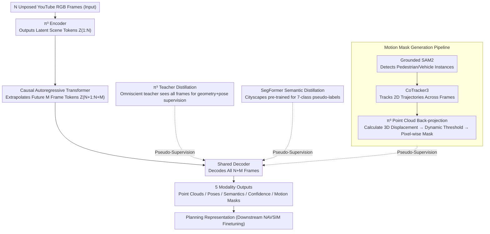

# Learning to Drive is a Free Gift: Large-Scale Label-Free Autonomy Pretraining from Unposed In-The-Wild Videos

**Conference**: CVPR 2026  
**arXiv**: [2602.22091](https://arxiv.org/abs/2602.22091)  
**Code**: [Project Page](https://lfg-ai.github.io/)  
**Area**: Autonomous Driving  
**Keywords**: Autonomous Driving Pretraining, Label-Free Learning, Video Foundation Models, 4D Scene Understanding, Planning

## TL;DR

Ours proposes LFG (Learning to drive is a Free Gift), a completely label-free, teacher-guided autonomous driving pretraining framework. It learns a unified geometry-, semantic-, and motion-aware pseudo-4D representation from large-scale unposed YouTube driving videos. On the NAVSIM benchmark, it outperforms multi-camera + LiDAR BEV methods (PDMS 85.2) using only a monocular front-facing camera and demonstrates exceptional data efficiency (achieving 81.4 PDMS with only 10% labels).

## Background & Motivation

**Background**: Massive first-person driving videos (e.g., YouTube) exist on the internet, but these data lack any annotations—no 3D labels, no camera poses, no LiDAR, and no semantic segmentation labels.  
**Limitations of Prior Work**: Existing autonomous driving methods show performance gains when scaling up but still **rely heavily on annotated data** (expert trajectories, LiDAR scans, odometry, semantic annotations).  
**Goal**: Can a powerful autonomous driving representation be pretrained from large-scale unlabeled driving videos, similar to how GPT is trained on unlabeled text corpora?  
**Key Challenge**: Existing self-supervised methods (e.g., PPGeo) mainly rely on inter-frame consistency losses (photometric consistency), implicitly assuming a static scene and failing to capture **dynamic objects**—which are critical in driving. Meanwhile, large world models (e.g., UniPAD, ViDAR) still require some degree of supervision labels.  
**Key Insight**: Safe reactive driving requires not only understanding the 3D structure of the current scene but also predicting the geometry, motion, and semantic evolution of the short-term future. Therefore, LFG adopts a feed-forward "current + future" joint prediction framework, utilizing multiple specialized teacher models (π³, SegFormer, SAM2, CoTracker3) to provide pseudo-supervision, learning a unified 4D driving representation without any ground-truth labels.

## Method

### Overall Architecture

LFG aims to verify if strong autonomous driving representations can be pretrained from massive unlabeled, unposed YouTube driving videos, akin to how GPT processes unlabeled text. Its core insight is that safe reactive driving requires predicting short-term future evolution in addition to understanding current 3D structure. The architecture is built on π³ (a feed-forward 3D reconstruction model, ~1B parameters): the π³ encoder takes $N$ unposed RGB frames and outputs latent scene tokens $\mathbf{Z}_{1:N}$. A causal autoregressive Transformer extrapolates $M$ future tokens $\mathbf{Z}_{N+1:N+M}$ from the observed tokens. A shared decoder then decodes all $N+M$ tokens into five output modalities: point cloud maps $P_t$ (pixel-wise 3D world coordinates), camera poses $T_t \in \mathbb{R}^{4 \times 4}$ (ego-trajectory), semantic segmentation $S_t \in \mathbb{R}^{7 \times H \times W}$ (7 classes: road, vehicle, pedestrian, building, vegetation, sky, background), confidence maps $C_t \in [0,1]^{H \times W}$, and motion masks $M_t \in [0,1]^{H \times W}$. The total model has approximately 1.45B parameters and runs at 5Hz on an RTX 5090. Supervision comes entirely from off-the-shelf expert teachers (π³, SegFormer, SAM2, CoTracker3) without ground-truth labels.

### Key Designs

**1. π³ Teacher Distillation (Geometry + Pose): Forcing Students to Extrapolate Future from Partial Observations**  
To learn "predicting future scene structures," an omniscient teacher that sees the future is required. The π³ teacher model sees all $N+M$ frames, while the LFG student only sees the first $N$ frames. The teacher provides point cloud maps, confidence maps, and camera poses for all frames as pseudo-supervision, forcing the student to predict both current and future 3D geometry from partial observations. The geometry loss is $\mathcal{L}_{\text{point}} = \alpha \|\mathbf{P} - \widehat{\mathbf{P}}\|_1$, and the pose loss uses geodesic distance for SO(3) rotations and Huber loss for translations.

**2. SegFormer Semantic Distillation: Free Scene Semantic Understanding**  
Driving decisions require semantics, but raw videos lack segmentation labels. LFG utilizes a pre-trained SegFormer (Cityscapes) as a semantic teacher to generate pseudo-labels for every frame. Similarly, the teacher sees all frames (including future ground-truth RGB), while the student predicts semantics for $N+M$ frames from $N$ frames, using weighted BCE loss to handle class imbalance.

**3. Motion Mask Generation Pipeline: Decoupling Dynamic Objects from Static Environments**  
Previous self-supervised methods relying on inter-frame consistency (e.g., photometric consistency) implicitly assumed static scenes, missing critical dynamic objects. LFG uses a fully automated unlabeled pipeline to explicitly mark dynamic regions: Grounded SAM2 detects instances in the first frame, CoTracker3 tracks 2D trajectories $\mathbf{u}_t^{(i)}$ across frames, and π³ teacher point clouds back-project these into 3D. The 3D temporal displacement $d_t^{(i)} = \|\bar{\mathbf{p}}_{t+1}^{(i)} - \bar{\mathbf{p}}_t^{(i)}\|_2$ is calculated; instances exceeding a threshold $\tau_{\text{motion}}$ for at least $K_{\min}$ frames are labeled dynamic, generating pixel-wise motion masks $\mathbf{M}_t$.

**4. Causal Autoregressive Transformer: Future Prediction as Next-Token Prediction**  
By formalizing future prediction as sequence modeling, the NLP paradigm can be reused. This 4-layer, 8-head attention Transformer receives encoder tokens and uses causal attention to predict future latent representations sequentially. Ablations show that removing this autoregressive head drops performance from 81.4 to 77.7 on 10% data, indicating that future prediction capability is key to planning.

### Loss & Training

Total loss is a combination of current frame loss and weighted future frame loss:

$$\mathcal{L}_{\text{total}} = \mathcal{L}_{\text{current}} + \lambda_{\text{future}} \mathcal{L}_{\text{future}}$$

Each part contains four sub-losses: $\lambda_{\text{seg}}\mathcal{L}_{\text{seg}} + \lambda_{\text{pose}}\mathcal{L}_{\text{pose}} + \lambda_{\text{point}}\mathcal{L}_{\text{point}} + \lambda_{\text{motion}}\mathcal{L}_{\text{motion}}$

- Future frame weight $\lambda_{\text{future}} = 10.0$ (emphasizing extrapolation).
- AdamW optimizer, lr=1e-4, cosine annealing.
- BF16 mixed precision, 32×A100 GPUs, 40k iterations.
- 3-stage training: ① Geometry + Pose autoregression → ② Semantic head added → ③ Motion head added.
- Training data: Subset of OpenDV YouTube driving dataset (~2M samples), multi-rate training (2/5/10 Hz).

## Key Experimental Results

### Main Results — NAVSIM Planning Benchmark

| Method | Input | NC | DAC | TTC | EP | PDMS |
|------|------|-----|-----|-----|-----|------|
| UniAD | 6Cam | 97.8 | 91.9 | 92.9 | 78.8 | 83.4 |
| TransFuser | 3Cam+LiDAR | 97.7 | 92.8 | 92.0 | 79.2 | 84.0 |
| Hydra-MDP | 3Cam+LiDAR | 96.9 | 94.0 | 94.0 | 78.7 | 84.7 |
| DiffusionDrive | 3Cam+LiDAR | 96.8 | 95.4 | 94.7 | 82.0 | 88.1 |
| **LFG (Ours)** | **1Cam** | **98.2** | 93.7 | 94.4 | 79.1 | **85.2** |

### Data Efficiency Comparison (PDMS↑)

| Method | Input | 1% Data | 10% Data | 100% Data |
|------|------|--------|---------|----------|
| PPGeo | 1Cam | 61.5 | 65.6 | 74.6 |
| π³ | 1Cam | 56.2 | 77.5 | 82.8 |
| DINOv3 | 1Cam | 60.0 | 75.8 | 81.4 |
| **LFG** | **1Cam** | **66.3** | **81.4** | **85.2** |

### Ablation Study

| Configuration | 1% Data | 10% Data | 100% Data | Description |
|------|--------|---------|----------|------|
| Full LFG | 66.3 | 81.4 | 85.2 | Baseline |
| +2× Pretraining Data | 76.6 | 82.3 | 84.8 | Massive gain for low-label regime |
| +Longer Prediction Horizon | 80.5 | 84.4 | 84.8 | +14 PDMS gain for 1% data |
| -Semantic/Motion Heads | 64.8 | 77.1 | 84.6 | Importance of multi-modal supervision |
| -Autoregressive Head | 66.3 | 77.7 | 84.2 | Future prediction is key |

### Key Findings

- **Monocular Front > Multi-Cam+LiDAR**: LFG outperforms UniAD (6 cams) and Hydra-MDP (3 cams+LiDAR) using only one front-facing camera, proving large-scale video pretraining compensates for sensor disadvantages.
- **High Data Efficiency**: Achieving 81.4 PDMS with 10% labels matches DINOv3 performance with 100% data.
- **Semantics Surpass Teacher**: LFG segmentation (PA 0.947, mIoU 0.768) on KITTI-360 exceeds the SegFormer teacher (PA 0.926, mIoU 0.677), indicating mutual benefits of multi-task learning.
- **Motion Self-Correction**: LFG correctly identifies stationary parked cars even when the pseudo-GT motion labels incorrectly mark them as dynamic, showing student performance can exceed teacher labels.

## Highlights & Insights

- **"Free Gift" Concept**: Demonstrates that YouTube driving videos are a powerful, free pretraining source without labels, poses, or LiDAR.
- **Multi-Teacher Distillation**: An elegant paradigm where complementary strengths of different expert models generate pseudo-supervision, avoiding single-teacher limitations.
- **Next-Token Prediction for Driving**: Unifies driving scene prediction with NLP paradigms by translating geometry and motion into token sequences.
- **Future Prediction for Planning**: Proves that short-term future prediction is a crucial feature for planning.

## Limitations & Future Work

- Only predicts **short-term future** (3-6 frames); long-term reasoning is limited and could be extended to multi-scale temporal horizons.
- Only uses **monocular front-facing camera**—while a characteristics of YouTube data, multi-view training (e.g., via PhysicalAI datasets) could provide further gains.
- Student performance is bottlenecked by the quality of teacher models (e.g., π³).
- Motion mask pipeline relies on heavy models (SAM2+CoTracker3+π³), leading to high preprocessing costs.
- 1.45B parameters at 5Hz remains distant from real-time deployment targets.

## Related Work & Insights

- π³ (feedforward 3D reconstruction) provides the backbone; LFG's novelty lies in adding **temporal modeling** and **multi-modal pseudo-supervision**.
- Compared to ViDAR (future point cloud prediction), LFG requires zero LiDAR data.
- PPGeo proved geometry priors help driving, but its static-scene assumption is a fundamental limitation addressed by LFG's motion pipeline.
- Validation of the large-scale unlabeled pretraining paradigm (DINOv3/GPT) in the vision-driving domain.

## Rating

- **Novelty**: ⭐⭐⭐⭐⭐ Breakthrough paradigm using unposed YouTube videos to surpass multi-sensor methods.
- **Experimental Thoroughness**: ⭐⭐⭐⭐ Solid multi-task evaluation (segmentation/depth/trajectory/planning) and efficient data scaling.
- **Writing Quality**: ⭐⭐⭐⭐ Clear motivation and well-organized narrative.
- **Value**: ⭐⭐⭐⭐⭐ High impact route for "internet-scale free data" in autonomous driving.

## Rating
- Novelty: ⭐⭐⭐⭐⭐
- Experimental Thoroughness: ⭐⭐⭐⭐
- Writing Quality: ⭐⭐⭐⭐
- Value: ⭐⭐⭐⭐⭐

<!-- RELATED:START -->

## Related Papers

- [\[CVPR 2026\] SimScale: Learning to Drive via Real-World Simulation at Scale](simscale_learning_to_drive_via_real-world_simulation_at_scale.md)
- [\[CVPR 2026\] LiREC-Net: A Target-Free and Learning-Based Network for LiDAR, RGB, and Event Calibration](lirec-net_a_target-free_and_learning-based_network_for_lidar_rgb_and_event_calib.md)
- [\[CVPR 2026\] SearchAD: Large-Scale Rare Image Retrieval Dataset for Autonomous Driving](searchad_large-scale_rare_image_retrieval_dataset_for_autonomous_driving.md)
- [\[CVPR 2026\] Unposed-to-3D: Learning Simulation-Ready Vehicles from Real-World Images](unposed-to-3d_learning_simulation-ready_vehicles_from_real-world_images.md)
- [\[CVPR 2026\] SG-NLF: Spectral-Geometric Neural Fields for Pose-Free LiDAR View Synthesis](sgnlf_spectralgeometric_neural_fields_for_posefre.md)

<!-- RELATED:END -->
