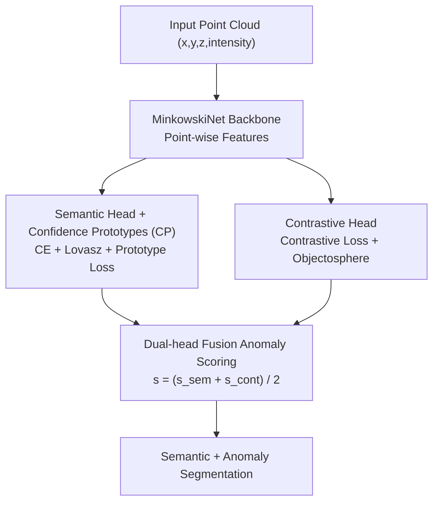

# Learning to Identify Out-of-Distribution Objects for 3D LiDAR Anomaly Segmentation

**Conference**: CVPR 2026  
**Paper**: [CVF Open Access](https://openaccess.thecvf.com/content/CVPR2026/html/Mosco_Learning_to_Identify_Out-of-Distribution_Objects_for_3D_LiDAR_Anomaly_Segmentation_CVPR_2026_paper.html)  
**Code**: https://simom0.github.io/lido-page/  
**Area**: Autonomous Driving / 3D Vision / Self-supervised Representation Learning  
**Keywords**: LiDAR Anomaly Segmentation, Out-of-Distribution Detection, Feature Space Modeling, Class Prototypes, Mixed Real-Synthetic Datasets

## TL;DR
LIDO directly models the distribution of inlier classes in the feature space using a semantic head to maintain "confidence-based prototypes" and a contrastive head to push inlier features away from the hypersphere center. During inference, it fuses cosine distance, entropy, and feature norm signals to assign anomaly scores to each point, achieving SOTA in 3D LiDAR anomaly segmentation without any anomaly samples. The authors also contribute a mixed real-synthetic OoD dataset to address the lack of evaluation benchmarks in this field.

## Background & Motivation

**Background**: LiDAR semantic segmentation is central to autonomous driving perception, but most methods rely on a closed-set assumption—performing point-wise classification within a fixed set of classes seen during training. In reality, unseen objects (anomalies / Out-of-Distribution, OoD) frequently appear. Anomaly segmentation aims to perform semantic segmentation while simultaneously assigning an "anomaly probability" to each point.

**Limitations of Prior Work**: Research on anomaly segmentation is heavily concentrated in the 2D image domain, with 3D LiDAR being under-explored. Existing 3D methods either adapt 2D post-processing techniques (softmax thresholding, Max Logit) or rely on Deep Ensembles, which are computationally expensive and slow for inference. Some open-set methods treat unlabelled/void regions in training data as anomalies, which essentially "peeks" at anomaly priors. Dataset availability is also limited: the only public real-world LiDAR anomaly dataset, STU, uses 128-beam high-resolution data that has a significant domain gap with standard training data and only provides binary masks.

**Key Challenge**: Anomalies are inherently "unlike any known class," yet closed-set softmax layers tend to force anomaly points into known classes with high confidence, leading to missed detections. Avoiding this usually requires introducing anomaly samples during training or using ensembles, which come with costs of "prior leakage" or "computational explosion."

**Goal**: (1) Design a lightweight 3D anomaly segmentation method that does not rely on anomaly samples or unlabelled regions. (2) Create a public evaluation set characterized by frequent anomalies, diverse environments, semantic labels, and various LiDAR resolutions.

**Key Insight**: Rather than focusing on the output softmax layer, it is more effective to model the inlier class distribution directly in the **feature space**. By pulling features of the same class toward "class prototypes" and pushing all inlier features away from the hypersphere center, any point falling outside this distribution can be identified as an anomaly.

**Core Idea**: Combine "confidence-based prototypes + contrastive/objectosphere constraints" to shape a discriminative feature space and fuse multiple geometric/entropy signals for anomaly scoring, without ever exposing the model to anomaly samples.

## Method

### Overall Architecture
LIDO (Learning to Identify Out-of-Distribution) utilizes MinkowskiNet as a sparse convolutional backbone to extract point-wise features, followed by two parallel heads: the **semantic head** outputs point-wise class predictions and maintains "confidence-based prototypes" (CP) in the feature space; the **contrastive head** shapes the feature distribution using contrastive and objectosphere losses to ensure inlier features are both separated and distant from the hypersphere center. During inference, signals from both heads are fused into a final anomaly score.

### Key Designs

**1. Semantic Head + Confidence-based Prototypes: Discriminative Class Centers**

The semantic head performs classification while constructing a robust prototype for each inlier class. It uses weighted cross-entropy $\mathcal{L}_{ce}=-\frac{1}{N}\sum_n w_c\,y_n\log(\sigma(f_n))$. Prototypes are aggregated from true positive points (predicted class = ground truth) weighted by confidence: $\mathrm{CP}_c=\big(\sum_{p\in\hat{X}_c}\kappa_p f_p\big)/\big(\sum_{p\in\hat{X}_c}\kappa_p\big)$, where confidence $\kappa_p=\max(f_p)$ is the maximum pre-softmax component. This ensures prototypes are "clean" and not biased by boundary points. A cosine embedding loss $\mathcal{L}_{prot}=\frac{1}{N}\sum_c\sum_{p\in X_c}(1-\langle\mathrm{CP}^{e-1}_c,f_p\rangle)$ pulls features toward prototypes of previous epochs.

**2. Contrastive Head: Geometric Distribution Shaping**

The contrastive head further sculpts the feature space. It calculates the class-wise mean of contrastive features $\bar{f}_c=\frac{1}{|X_c|}\sum_{p\in X_c}f'_p$ and uses a contrastive loss to align $\bar{f}_c$ with normalized prototypes: $\mathcal{L}_{cont}=-\sum_c\log\frac{\exp(\langle\bar{f}_c,\mathrm{CP}^{e-1}_c\rangle/\tau)}{\sum_i\exp(\langle\bar{f}_c,\mathrm{CP}^{e-1}_c\rangle/\tau)}$. Crucially, the objectosphere loss $\mathcal{L}_{obj}$ enforces $\max(r-\|f'_p\|^2,0)$ for inlier points, pushing their norms above threshold $r$. Unlike prior work, LIDO **does not** use unlabelled/void regions; it learns only from inlier distributions so that "small norm = close to center = anomaly."

**3. Dual-head Fusion Anomaly Scoring: Multimodal Signals**

Inference combines three complementary signals. The semantic head provides two: cosine distance $s^{cos}_n=1-\max_c(\mathrm{sim}_{n,c})$ and normalized Shannon entropy $s^{ent}_n=-\frac{1}{\log C}\sum_c p_{n,c}\log p_{n,c}$. These multiply to form $s^{sem}_n=s^{cos}_n\cdot s^{ent}_n$. The contrastive head contributes $s^{cont}_n=\max(0,1-\|f'_n\|^2/r)$. The final score $s_n=\frac{1}{2}(s^{sem}_n+s^{cont}_n)$ captures "distance from prototypes," "classification uncertainty," and "feature norm magnitude."

**4. Mixed Real-Synthetic OoD Dataset & Physical Insertion Protocol**

To address data scarcity, the authors built a benchmark based on SemanticKITTI, SemanticPOSS, and nuScenes (64/40/32 beams). Anomaly objects from ModelNet are injected via a physically realistic protocol: synthetic objects are placed in real scans and re-projected to range images to simulate occlusions and beam sampling. Intensity is calculated via a Lambertian model $i=\rho\cdot\max(0,-\langle n,r\rangle)/d^2$, which is more realistic than distance-only approximations.

### Loss & Training
The total loss is the sum of semantic and contrastive head losses. Hyperparameters include $r=5.0$, $\tau=0.1$. Training is performed on an NVIDIA A40 for 64 epochs with SGD, cosine annealing, and a linear warm-up. Standard augmentation (rotation, flip, scale) is used without ensembles or test-time augmentation.

## Key Experimental Results

Metrics: **AUROC** (Area Under ROC), **FPR@95** (False Positive Rate at 95% TPR), **AP** (Average Precision) for anomalies; **mIoU** for semantics.

### Main Results

Comparison on the real-world STU dataset (Val / Test):

| Method | AUROC↑(val) | FPR@95↓(val) | AP↑(val) | AUROC↑(test) | AP↑(test) |
|------|------|------|------|------|------|
| Mask4Former3D + Max Logit | 87.27 | 68.76 | 2.02 | 84.53 | 0.95 |
| Mask4Former3D + Void Classifier | 89.77 | 79.50 | 2.62 | 85.99 | 3.92 |
| Mask4Former3D + Deep Ensemble | 90.93 | 37.34 | 6.94 | 86.74 | 5.17 |
| **Ours (LIDO)** | **95.05** | **34.86** | **27.53** | **93.67** | **14.99** |

On STU, LIDO outperforms all baselines. Its AP is approximately 4x that of Deep Ensemble on the validation set (+9.82% improvement), demonstrating the robustness of feature space modeling under significant domain gaps.

### Ablation Study

Efficiency (nuScenes-OoD, A40):

| Method | Params (M) | Runtime (ms) | Memory (GB) |
|------|------|------|------|
| Mask4Former3D | 39.6 | 168 | 1.8 |
| Deep Ensemble (Sequential) | 118.8 | 861 | 1.9 |
| Deep Ensemble (Parallel) | 118.8 | 287 | 5.7 |
| **Ours (LIDO)** | **21.7** | **38** | **0.6** |

### Key Findings
- **SOTA on Real Data, Mixed on Synthetic**: While LIDO dominates on STU, Deep Ensembles remain competitive on low-resolution synthetic data like nuScenes-OoD, where sparse distant points and similar surfaces are often misclassified as anomalies.
- **Lightweight Advantage**: LIDO is significantly faster (38ms) and more resource-efficient than Deep Ensembles, making it suitable for deployment.
- **AP Bottleneck**: Average Precision remains generally low across all methods due to extreme class imbalance and inherent LiDAR sensor noise (e.g., ghost points).
- **Semantic Preservation**: Adding anomaly detection losses only slightly impacts standard semantic segmentation performance (e.g., mIoU on KITTI-OoD single drops from 64.99 to 61.34).

## Highlights & Insights
- **Pure Inlier Modeling**: By explicitly avoiding anomaly samples and unlabelled regions during training, the model avoids "peeking" and naturally scales to open-world scenarios.
- **Confidence-weighted Prototypes**: Using pre-softmax confidence to weight prototypes ensures cleaner class centers, a technique transferable to other few-shot or open-set tasks.
- **Triple-signal Fusion**: Combining cosine distance, entropy, and feature norms allows the model to characterize "strangeness" from three orthogonal perspectives.
- **Physical Insertion Protocol**: The reflection-based intensity modeling and beam alignment protocol provide a high-fidelity paradigm for future 3D anomaly dataset synthesis.

## Limitations & Future Work
- **Performance in Sparse Scenes**: nuScenes-OoD results indicate that as points become sparser, false positives increase due to reduced feature information.
- **Overall AP levels**: Absolute AP values are still below practical thresholds for safety-critical deployment.
- **Backbone Dependency**: The anomaly scores are tightly coupled with the semantic head; degradation in the backbone's semantic performance directly impacts anomaly detection.

## Related Work & Insights
- **Comparison with Post-processing**: Traditional 2D techniques like Max Logit or softmax thresholding perform poorly in 3D due to high FPR. LIDO replaces these with learned feature space constraints.
- **Comparison with Objectosphere [55]**: LIDO adapts the idea of modeling inlier feature distributions but removes the requirement for unlabelled/void data, making it more suitable for realistic open-set settings.
- **Dataset Contribution**: LIDO’s mixed real-synthetic benchmark fills a gap in the literature, offering multi-resolution evaluation that standard datasets like STU lack.

## Rating
- Novelty: ⭐⭐⭐⭐ 
- Experimental Thoroughness: ⭐⭐⭐⭐⭐ 
- Writing Quality: ⭐⭐⭐⭐ 
- Value: ⭐⭐⭐⭐

<!-- RELATED:START -->

## Related Papers

- [\[CVPR 2026\] Neural Distribution Prior for LiDAR Out-of-Distribution Detection](neural_distribution_prior_for_lidar_ood_detection.md)
- [\[CVPR 2026\] ProOOD: Prototype-Guided Out-of-Distribution 3D Occupancy Prediction](proood_prototype-guided_out-of-distribution_3d_occupancy_prediction.md)
- [\[CVPR 2026\] ClimaOoD: Improving Anomaly Segmentation via Physically Realistic Synthetic Data](climaood_improving_anomaly_segmentation_via_physically_realistic_synthetic_data.md)
- [\[NeurIPS 2025\] Extremely Simple Multimodal Outlier Synthesis for Out-of-Distribution Detection and Segmentation](../../NeurIPS2025/autonomous_driving/extremely_simple_multimodal_outlier_synthesis_for_out-of-distribution_detection_.md)
- [\[CVPR 2026\] TerraSeg: Self-Supervised Ground Segmentation for Any LiDAR](terraseg_self-supervised_ground_segmentation_for_any_lidar.md)

<!-- RELATED:END -->
