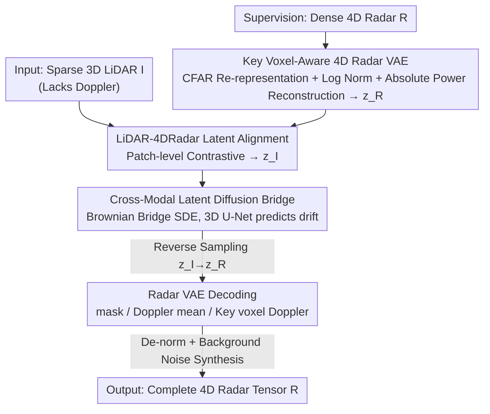

# LiDAR-to-4DRadar Diffusion Bridge via Cross-Modal Alignment and Translation in Latent Space

**Conference**: CVPR 2026  
**Paper**: [CVF Open Access](https://openaccess.thecvf.com/content/CVPR2026/html/Shen_LiDAR-to-4DRadar_Diffusion_Bridge_via_Cross-Modal_Alignment_and_Translation_in_Latent_CVPR_2026_paper.html)  
**Code**: None (Not publicly available)  
**Area**: Autonomous Driving / Diffusion Models / Cross-Modal Generation  
**Keywords**: 4D mmWave Radar, LiDAR-to-Radar, Diffusion Bridge, Latent Space Alignment, Data Augmentation  

## TL;DR
L2RLDB is the first to translate sparse 3D LiDAR into complete 4D radar tensors including the Doppler dimension. It employs a "Key Voxel-Aware VAE" to compress high-dimensional noisy radar into a low-dimensional latent space, aligns LiDAR latent codes via patch-level contrastive learning, and completes cross-modal translation using a Brownian diffusion bridge in the aligned latent space. The synthesized radar significantly improves downstream 3D detection accuracy.

## Background & Motivation
**Background**: Millimeter-wave (mmWave) radar is increasingly critical in autonomous driving perception due to its all-weather and all-day robustness. Its native 4D tensor (Doppler, Range, Azimuth, Elevation) simultaneously encodes spatial structure and motion information. However, collecting and labeling large-scale 4D radar data is extremely costly, making the generation of synthetic radar data for dataset augmentation a popular research direction.

**Limitations of Prior Work**: Constrained by the complexity of 4D radar distributions, early works only generated simplified 2D representations (Range-Doppler or Range-Azimuth maps) or simplified the task to LiDAR-guided generation of sparse radar point clouds or 3D Cartesian tensors (e.g., L2RDaS generating 3D spatial cubes). these methods lose information—specifically the Doppler velocity, which is unique to radar and vital for detection—leading to limited downstream performance.

**Key Challenge**: Generating "complete 4D native polar radar tensors" faces three difficulties: ① The variables of 4D dense tensors grow exponentially, and the dynamic range of signal power is massive (spanning several orders of magnitude) with significant electromagnetic scattering/diffraction noise, making the distribution extremely difficult to model; ② LiDAR consists of sparse 3D point clouds while radar is a dense 4D voxel tensor, presenting huge differences in dimensionality and sparsity that hinder semantic and spatial alignment; ③ The two modalities focus on different aspects of a scene (LiDAR lacks Doppler), creating a natural information gap in feature distributions.

**Goal**: Define and solve a new task, **LiDAR-to-4DRadar Translation**: given a sparse 3D LiDAR tensor $I\in\mathbb{R}^{R\times A\times E}$, generate a corresponding dense 4D radar tensor $R\in\mathbb{R}^{D\times R\times A\times E}$, while maintaining native polar coordinates to avoid distortion from coordinate transformation.

**Key Insight**: Rather than forced translation in the original high-dimensional space, both modalities are compressed into an **aligned latent space**. Translation is then modeled as a **diffusion bridge** process that directly connects the two distributions, allowing the source LiDAR domain to guide both forward and reverse processes, bypassing the "domain gap" problem of standard conditional diffusion.

**Core Idea**: Use a three-stage pipeline consisting of "Key Voxel-Aware VAE Compression + Patch-level Contrastive Alignment + Brownian Diffusion Bridge Translation" to bridge Doppler-less LiDAR to full 4D radar in the aligned latent space.

## Method

### Overall Architecture
L2RLDB is a three-stage serial pipeline: **Compression → Alignment → Translation**. ① Compression: Train a key voxel-aware 4D radar VAE to encode noisy high-dimensional radar tensors into a compact latent space $z_R$ while learning to distinguish key object voxels from background noise. ② Alignment: Fix the radar VAE and train a LiDAR VAE with an identical structure using patch-level contrastive learning to align LiDAR latent codes $z_I$ semantically and spatially with the radar latent space. ③ Translation: Train a Brownian diffusion bridge (using a 3D U-Net to predict drift) in the aligned latent space to bridge $z_I$ to $z_R$. The radar VAE decoder then restores the full 4D radar tensor, followed by de-normalization and background noise synthesis. Each module is trained separately and linked during inference according to Alg. 1.

### Key Designs

**1. Key Voxel-Aware 4D Radar VAE: Compressing Noisy High-Dimensional Tensors into Reconstructible Latent Codes**

Directly modeling dense radar tensors $\mathbb{R}^{D\times R\times A\times E}$ is hindered by the massive dynamic range of signal power and electromagnetic background clutter. This work first performs **radar re-representation**: clutter is modeled as Gaussian white noise, and a Constant False Alarm Rate (CFAR) detector (using adaptive thresholds to maintain a fixed false alarm rate) identifies key object voxels on the Range-Azimuth-Elevation grid, producing a binary mask $M_{key}\in\{0,1\}^{R\times A\times E}$ (key voxels occupy ~1.5%). Key voxels retain the original $D$-dimensional Doppler power vector, while background voxels are summarized by the mean power along the Doppler axis $\bar{R}_{p'}=\frac{1}{D}\sum_d R_{d,r',a',e'}$. Omitted per-bin fluctuations are later modeled using a "Gaussian white noise + softmax" distribution to maintain total power. Thus, radar is represented as the triplet $\{\bar{R}, M_{key}, R_{key}\}$.

The VAE inputs $\bar{R}$ and $R_{key}$ undergo **log + z-score normalization** to compress the dynamic range, are concatenated along the Doppler axis, and fed into a 3D ResNet encoder (with self-attention for long-range dependencies) to produce $z_R\in\mathbb{R}^{C\times R/l\times A/l\times E/l}$. The decoder utilizes three heads to reconstruct the binary mask $\hat{M}_{key}$, Doppler mean $\hat{\bar{R}}'$, and key voxel Doppler $\hat{R}'_{key}$. The training objective (Eq. 3) uses BCE for the mask and L2 for continuous variables. Crucially, an **additional L1 loss is applied to the de-normalized absolute power $(\hat{R},\hat{R}_{key})$**, ensuring the model fits the real signal power values beyond the normalized space. Ablations show that removing L1 drops key voxel IoU from 0.2885 to 0.2843 and downstream AP3D@0.5 from 56.00 to 54.84.

**2. LiDAR-4DRadar Latent Alignment: Patch-level Contrastive Learning for Modality Matching**

Once the radar VAE is pre-trained, it is fixed. A LiDAR VAE with an **identical structure but single input channel** is trained so that its latent code $z_I\in\mathbb{R}^{C\times R/l\times A/l\times E/l}$ matches the radar latent shape and dimension, and each latent patch $c_{I_i}=z_I(r,a,e)$ shares the same receptive field as the corresponding radar patch $c_{R_i}$. To ensure semantic alignment beyond reconstruction, **patch-level contrastive learning** is introduced: for a paired sample $(I_i,R_i)$, the LiDAR latent code $c_{I_{i,j}}$ and radar latent code $c_{R_{i,j}}$ at the **same spatial position** $(r,a,e)$ form a positive pair, while different positions or different samples form negative pairs. The InfoNCE contrastive loss is used (Eq. 4):

$$\mathcal{L}_{cont}=\sum_{i,j}\log\frac{\exp(\mathrm{sim}(c_{I_{i,j}},c_{R_{i,j}})/\tau)}{\sum_{k,l}\exp(\mathrm{sim}(c_{I_{i,j}},c_{R_{k,l}})/\tau)}$$

The total LiDAR encoder loss is $\mathcal{L}_I=\mathcal{L}^{vae}_I-\lambda_{cl}\mathcal{L}_{cont}$. This step is a prerequisite for the diffusion bridge—only when the latent spaces are aligned semantically and spatially can the bridge transition smoothly from the LiDAR end to the radar end.

**3. Cross-Modal Latent Diffusion Bridge: Brownian Bridge SDE for Direct Distribution Connection**

Standard conditional diffusion starts from pure noise and uses LiDAR as a condition, still facing a massive domain gap. This work adopts a **Brownian Diffusion Bridge**: translation is modeled as a double-boundary stochastic process, where $t=1$ is the LiDAR latent $z_I$ and $t=0$ is the radar latent $z_R$. Given a pair $(z_I,z_R)$, a linear interpolation is constructed as $z_t=(1-t)z_R+tz_I+\sigma_t\epsilon$ (Eq. 5), where the variance $\sigma_t=\sigma\sqrt{t(1-t)}$ vanishes at both boundaries and peaks in the middle. Its temporal evolution is an SDE with drift $v(z_t,t)=(z_R-z_t)/t$ (Eq. 6). A 3D U-Net is trained to regress the drift, minimizing $\mathbb{E}[\|(z_R-z_t)/t-v_\theta(z_t,t)\|_2^2]$ (Eq. 7).

During inference, non-Markovian accelerated sampling (similar to DDIM) is used (Eq. 8-9) to iteratively generate $\hat{z}_R$ from $z_I$. When $\delta=0$, it degrades to a deterministic sampler. Compared to Latent Diffusion, the bridge allows the source domain to guide both forward and reverse paths, progressively coordinating the latent trajectory.

## Loss & Training
Modules are trained in stages: ① Radar VAE loss $\mathcal{L}^{vae}_R=\mathbb{E}[D_R]+\beta\mathrm{KL}$, where $D_R$ contains BCE (mask) + L2 (normalized reconstruction) + L1 (absolute power, Eq. 3); ② LiDAR VAE loss $\mathcal{L}_I=\mathcal{L}^{vae}_I-\lambda_{cl}\mathcal{L}_{cont}$; ③ Diffusion bridge drift regression $\mathcal{L}_{db}$ (Eq. 7). Key hyperparameters: $\delta=2.0$, $\lambda_{bce}=0.5$, $\lambda_{cl}=0.3$, $\sigma=1.0$, linear noise schedule over 1000 steps, latent downsampling factor of 4, 2×A800 GPUs, batch size 32, Adam optimizer, and lr 1e-4 with warm-up.

## Key Experimental Results

The **K-Radar** dataset (35K paired 4D radar-LiDAR frames, multiple weather conditions) is used. The native polar grid is $(63,192,96,32)$ for Doppler/Range/Azimuth/Elevation. CFAR false alarm rate 0.1. The downstream detector is the K-Radar official baseline RTNH.

### Main Results (4D Radar Synthesis Quality)

As the first complete 4D (RAE+Doppler) synthesis task, several baselines were constructed. Metrics are calculated in both XYZ (Cartesian) and RAE (Polar) spaces for MAE/PSNR/SSIM, with IoU for key voxels.

| Model | Doppler | XYZ-PSNR↑ | XYZ-SSIM↑ | RAE-PSNR↑ | Key Voxel IoU↑ |
|------|---------|-----------|-----------|-----------|---------------|
| L2RDaS (3D, no Doppler) | ✗ | 31.01 | 0.897 | - | - |
| Pix2PixHD RAE (3D) | ✗ | 30.13 | 0.8875 | 25.95 | - |
| Latent Pix2PixHD (4D) | ✓ | 31.36 | 0.8980 | 28.23 | 0.1960 |
| Latent Diffusion (4D) | ✓ | 29.51 | 0.8786 | 27.07 | 0.1350 |
| **L2RLDB (Ours)** | ✓ | **33.01** | **0.9092** | **29.21** | **0.2885** |

L2RLDB leads across all metrics. Observations: ① Latent models outperform non-latent adversarial models, suggesting cross-modal alignment is beneficial; ② Bridge matching significantly outperforms conditional diffusion.

### Ablation Study

| Configuration | XYZ-PSNR↑ | Key Voxel IoU↑ | Synthetic Det AP3D@0.5↑ | Augmented Det AP3D@0.5↑ |
|------|-----------|---------------|--------------------|--------------------|
| Full L2RLDB | 33.01 | 0.2885 | 30.71 | 56.00 |
| w/o L1 (Absolute Power) | 32.72 | 0.2843 | 29.90 | 54.84 |
| w/o $\mathcal{L}_{cont}$ (Alignment) | 32.85 | 0.2626 | 28.27 | 52.49 |

Downstream 3D detection results (K-Radar, AP@0.3/0.5, BEV/3D):

| Setting | Method | APbev@0.3 | AP3D@0.5 |
|------|------|-----------|----------|
| Synthetic Only | Real Upper Bound | 62.50 | 36.14 |
| Synthetic Only | Latent Diffusion | 7.314 | 1.790 |
| Synthetic Only | **L2RLDB** | **57.37** | **30.71** |
| Real+Synth Aug | Real Baseline | 71.98 | 49.25 |
| Real+Synth Aug | **L2RLDB** | **77.14** | **56.00** |

### Key Findings
- **Synthetic-only training** achieves ~80%–92% of the performance of real data (e.g., APbev@0.3 reaches 91.9% of real), proving the high fidelity of 4D synthesis. Conditional methods like Latent Diffusion fail almost entirely (AP3D@0.5 of 1.79).
- **Data augmentation** with L2RLDB pushes detection performance significantly higher than real-only training (106%–116% relative to real).
- **Extreme weather** (fog/sleet) shows limited gains or slight drops because the LiDAR input degrades significantly, impacting the bridge guidance.
- RAE space metrics are generally higher than XYZ, likely due to artifacts and information loss during **polar-to-cartesian interpolation and re-voxelization**.

## Highlights & Insights
- **CFAR + Triplet re-representation** is a clever solution: separating "key voxels vs. background noise" converts an implicit VAE burden into explicit supervision, allowing the model to focus on the 1.5% foreground. 
- **Absolute power L1 loss** compensates for numerical realism. Pure normalized reconstruction loses cross-magnitude power differences; adding L1 on de-normalized output is a simple yet effective trick.
- **Diffusion bridge replaces conditional diffusion**: In cross-modal translation with large domain gaps, "learning the bridge between two distributions" is vastly superior to "conditional generation from noise."

## Limitations & Future Work
- **Vulnerability to extreme weather**: Performance drops when LiDAR serves as degraded input. The method lacks robustness mechanisms to compensate for source modality failure.
- **Coordinate transformation artifacts**: XYZ metrics are lower than RAE metrics, suggesting unresolved interpolation losses during coordinate conversion.
- **Paired data dependency**: Both patch-level alignment and bridge training require strictly paired samples, requiring new strategies for unpaired scenarios.

## Related Work & Insights
- **vs. L2RDaS / L2RGAN**: Prior works generate 2D/3D Cartesian radar without Doppler via cGAN. This work generates full 4D native polar tensors and uses a diffusion bridge for higher stability and fidelity.
- **vs. Latent Diffusion**: While both operate in latent space, Latent Diffusion treats LiDAR as a cross-attention condition, failing to bridge the domain gap effectively. The Brownian bridge coordinates the latent trajectory.

## Rating
- Novelty: ⭐⭐⭐⭐⭐ First to solve complete 4D (inc. Doppler) radar generation with a self-consistent latent diffusion bridge.
- Experimental Thoroughness: ⭐⭐⭐⭐ Extensive quality and detection metrics on K-Radar, though limited to a single dataset.
- Writing Quality: ⭐⭐⭐⭐ Clear motivation and complete formulations.
- Value: ⭐⭐⭐⭐ Directly addresses radar data scarcity; synthetic data is high-quality enough for independent training and effective augmentation.

<!-- RELATED:START -->

## Related Papers

- [\[CVPR 2026\] Look Before You Fuse: 2D-Guided Cross-Modal Alignment for Robust 3D Detection](look_before_you_fuse_2d-guided_cross-modal_alignment_for_robust_3d_detection.md)
- [\[CVPR 2026\] x2-Fusion: Cross-Modality and Cross-Dimension Flow Estimation in Event Edge Space](x2-fusion_cross-modality_and_cross-dimension_flow_estimation_in_event_edge_space.md)
- [\[CVPR 2026\] Structure-to-Intensity Diffusion for Adverse-Weather LiDAR Generation](structure-to-intensity_diffusion_for_adverse-weather_lidar_generation.md)
- [\[ICLR 2026\] x²-Fusion: Cross-Modality and Cross-Dimension Flow Estimation in Event Edge Space](../../ICLR2026/autonomous_driving/x2-fusion_cross-modality_and_cross-dimension_flow_estimation_in_event_edge_space.md)
- [\[CVPR 2026\] L3DR: 3D-aware LiDAR Diffusion and Rectification](l3dr_3d-aware_lidar_diffusion_and_rectification.md)

<!-- RELATED:END -->
