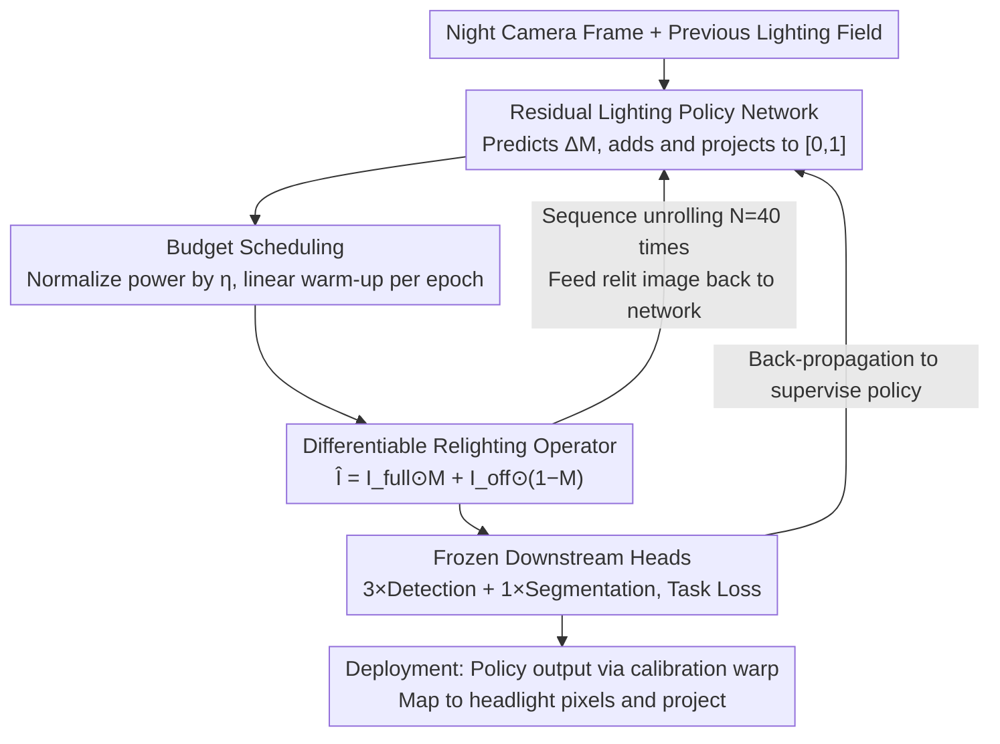

# LiDAS: Lighting-driven Dynamic Active Sensing for Nighttime Perception

**Conference**: CVPR 2026  
**Paper**: [CVF Open Access](https://openaccess.thecvf.com/content/CVPR2026/html/de_Moreau_LiDAS_Lighting-driven_Dynamic_Active_Sensing_for_Nighttime_Perception_CVPR_2026_paper.html)  
**Code**: Project Page https://simondemoreau.github.io/LiDAS/  
**Area**: Autonomous Driving / Nighttime Perception  
**Keywords**: Active Lighting, Nighttime Perception, Closed-loop Control, Differentiable Relighting, HD Headlights  

## TL;DR
LiDAS treats High-Definition (HD) headlights as "visual actuators," utilizing a learned lighting policy network to dynamically determine where to project light in a closed loop. This enables day-trained detection/segmentation models to achieve zero-shot nighttime availability—improving performance by +10.4% mAP50 / +6.8% mIoU in synthetic scenes and +18.7% mAP50 / +5.0% mIoU in real-world closed-loop tests—while saving up to 40% power without retraining downstream models.

## Background & Motivation

**Background**: Nighttime is a high-risk period for serious traffic accidents, yet camera-only perception pipelines suffer catastrophic performance degradation in low-light or unlit road conditions. Prevailing solutions follow two paths: Domain Adaptation/Generalization (DA/DG) to adapt day-trained models to nighttime distributions, or adding active/non-visible light sensors like LiDAR, Radar, or Thermal Infrared.

**Limitations of Prior Work**: DA/DG often fails when scenes are severely underexposed or deviate significantly from the training distribution; since the camera captures insufficient photons, the model cannot compensate for the lack of raw information. Adding sensors increases costs, making them inaccessible for low-to-mid-tier vehicles. Previously, rare works using headlights for perception were either task-specific or restricted to theoretical analysis in single simulations without real-world closed-loop validation.

**Key Challenge**: Standard perception pipelines **passively** rely on existing illumination in the scene, which is a design convention rather than a physical necessity. Modern HD headlights can control exactly where and how much light is projected, yet this controllable degree of freedom has never been directly exploited by perception tasks—lighting and sensing remain decoupled stages.

**Goal**: Integrate "illumination" into the perception optimization loop, allowing the vehicle to autonomously determine the **optimal lighting field for downstream perception**. The system must satisfy three constraints: ① Keep downstream models frozen (no retraining); ② Real-time (frame-by-frame closed loop); ③ Power-constrained to minimize energy consumption.

**Key Insight**: Rather than uniformly brightening the entire scene (which is energy-intensive and reduces contrast in already lit areas), it is more effective to "redistribute" finite light—removing it from empty regions and concentrating it on target areas. The authors observe that perception performance depends not on total luminous flux, but on the **spatial distribution** of light.

**Core Idea**: Train a lighting policy network supervised directly by downstream task losses. Utilizing a **differentiable relighting operator** for end-to-end learning, the system forms a "perception → light adjustment → projection → re-perception" closed loop for deployment.

## Method

### Overall Architecture
LiDAS takes the current nighttime camera frame as input and outputs a lighting field in image space $M \in [0,1]^{H\times W}$ (per-pixel intensity), which is projected back into the real scene by HD headlights to modify the next camera frame. During training, since physical light cannot be adjusted at every gradient step, a **differentiable relighting operator** acts as a proxy, approximating the "projection → imaging" process as a differentiable operation. This allows the system to be supervised end-to-end by the task losses of frozen downstream perception heads. At deployment, only the policy network is retained as a "plugin" module between the headlights and cameras, leaving the native perception stack untouched.

The process is a closed loop: **Task-driven supervision** provides signals for where light is needed → **Differentiable relighting operator** converts the lighting field into a relit image → **Residual lighting policy network + Budget scheduling** predicts the subsequent lighting field → **Sequence unrolling (closed-loop simulation)** allows the model to iterate under its own lighting to approximate real-world behavior.

### Key Designs

**1. Task-Driven Supervision: Defining "Good Illumination" via Frozen Perception Losses**

A major difficulty is that "good illumination" is hard to define manually—heuristics like brightness histograms or saliency do not equate to better downstream performance. LiDAS uses the downstream task loss itself as the objective. Relit images are fed into three COCO-pretrained detectors (YOLO11L, YOLOv8L, YOLOv8L-Worldv2) and one Cityscapes-pretrained segmenter (Mask2Former). The training loss is a weighted sum of their task losses. Observations show different tasks pull for different lighting styles: **local/patch-based** tasks like detection favor localized high-contrast spots, while **scene-level semantic** tasks like segmentation prefer spatially broader light for fine-tuning salient regions. Multi-task supervision acts as a regularizer, preventing the policy from over-fitting to a single head's bias. A critical benefit is that downstream models remain frozen, ensuring performance gains come **purely from lighting control**, allowing the use of models trained on large-scale daytime data without overfitting to sparse nighttime data.

**2. Differentiable Relighting Operator: Linear Interpolation for Differentiable Imaging**

End-to-end training requires a fast, differentiable proxy for how projected light translates into a camera image. Instead of expensive physical rerendering, LiDAS uses linear interpolation between two extreme rendering frames: an "all-on" image $I_{\text{full}}$ (headlights at max intensity across the FOV) and an "all-off" image $I_{\text{off}}$. Given a lighting field $M$, the relit image is defined as:

$$\hat{I} = I_{\text{full}} \odot M + I_{\text{off}} \odot (1 - M)$$

where $\odot$ denotes element-wise multiplication. This formulation is differentiable with respect to $M$ and captures ambient light and other vehicle lights (present in both $I_{\text{off}}$ and $I_{\text{full}}$). For baseline comparisons (LB/HB), the authors model scene geometry by unprojecting pixels to 3D using depth and re-projecting into the headlight frame using measured angular intensity distributions $\Phi_{\text{LB/HB}}$.

**3. Residual Lighting Policy Network + Power Budget Scheduling**

The network inputs include the RGB image $I$, the previous lighting field $M_{t-1}$, and CoordConv channels $C=(x,y)$. Feeding $M_{t-1}$ helps the network distinguish its own light from environmental light, while coordinate channels provide spatial priors. The architecture is an encoder-decoder with skip connections (subsampling to 1/16, upsampling to 1/4, then resizing to full resolution) with 54M parameters. A key design is learning the **residual** illumination: the head predicts an increment $\Delta M_t \in [-1,1]$, which is added to the previous frame and projected to the valid range:

$$\widetilde{M}_t = \min(\max(M_{t-1} + \Delta M_t, 0), 1)$$

The lighting field is then normalized by the power budget $\eta$ (where $\bar m_t$ is the mean of $\widetilde M_t$): $M_t = \frac{\eta}{\max(\epsilon,\ \bar m_t)} \widetilde M_t$. During training, the budget is linearly increased per epoch $\eta(e) = \eta_{\text{final}}\big(\alpha + (1-\alpha)\tfrac{e}{E_{\max}}\big)$ with $\alpha=10\%$. This forces the model to prioritize critical regions under tight budgets before learning fine-grained illumination.

**4. Sequence Unrolling for Closed-Loop Simulation**

Although supervision occurs on individual frames, deployment is closed-loop. To align with this, LiDAS **unrolls the policy for $N=40$ steps** on a single training image: each step generates $\hat I_t$ via the relighting operator and feeds it back as $M_{t+1} = \text{LiDAS}(\hat I_t, M_t, C)$. Downstream losses are back-propagated $K=5$ times across random steps. Crucially, **gradients do not propagate across iterations** (each step treats $(\hat I_t, M_t)$ as a constant for the next), encouraging stability in long-term closed loops while avoiding the overhead of full BPTT.

### Loss & Training
Trained for 60 epochs using AdamW (lr $10^{-4}$ with exponential decay $\gamma=0.96$) and mixed precision. Initialization uses blockwise constant noise for $M_0$ and a 50% probability of a black field $M_0=0$ to force the network to learn "re-lighting" dark areas. Inference takes 6.8 ms on an RTX 4090, adding negligible overhead to the pipeline.

## Key Experimental Results

### Main Results
On a synthetic dataset (Applied Intuition simulator, streetlights off to simulate worst-case lighting), power is normalized such that Low Beam (LB) = 1.

| Method [Power] | mAP50 ↑ | mAP50-90 ↑ | mIoU ↑ | mAcc ↑ |
|------|------|------|------|------|
| No Ego Light[0] | 21.5 | 11.6 | 47.6 | 65.4 |
| Static[1] | 42.6 | 26.3 | 68.7 | 82.7 |
| Low Beam[1] | 36.9 | 21.5 | 66.0 | 80.5 |
| High Beam[1.8] | 43.0 | 26.8 | 67.9 | 82.4 |
| Uniform[4] | 44.5 | 28.2 | 71.9 | 86.1 |
| **LiDAS[0.6] (40% Power Saved)** | 45.9 | 29.1 | 70.0 | 84.1 |
| **LiDAS[1]** | **47.3** | **30.0** | **72.8** | **85.6** |
| **LiDAS[1.8]** | 47.6 | 30.4 | 73.5 | 87.0 |

- At equal power, LiDAS[1] outperforms Low Beam[1] by +10.4% mAP50 and +6.8% mIoU, even exceeding High Beam[1.8] which uses 1.8× the power.
- LiDAS[0.6] saves 40% power while still outperforming all baselines, including Uniform[4] which brightens the whole scene. This confirms that **perception relies more on spatial distribution than total flux**.

Real-world zero-shot closed-loop deployment (test track with 12 pedestrians and 10 vehicles) showed LiDAS achieving **+18.7% mAP50** and **+5.0% mIoU** compared to LB, validating the sim-to-real transferability.

### Ablation Study
Zero-shot cross-environment (lit urban / rainy):

| Scenario | Method [Power] | mAP50 ↑ | mIoU ↑ | Notes |
|------|------|------|------|------|
| Lit Urban | Low Beam[1] | 48.3 | 76.6 | Sufficient ambient light |
| Lit Urban | LiDAS[1] | 47.4 | 81.5 | Comparable results; Seg. still gains |
| Rainy | Low Beam[1] | 29.3 | 57.6 | Unseen adverse weather |
| Rainy | LiDAS[1] | 39.2 | 59.4 | Strong zero-shot generalization |

### Key Findings
- **Static vs. Dynamic**: A "Static" average of LiDAS predictions outperforms LB/HB but remains inferior to dynamic LiDAS, proving that per-scene adaptation provides unique benefits.
- **Budget Adaptation**: Under tight budgets, LiDAS illuminates only critical regions; as budget increases, it expands coverage to global scene structures.
- **Interpretability**: LiDAS reduces near-field light to avoid self-glare and reallocates energy to distant targets. It actively dims light on already bright areas (e.g., other car lights, white clothing) to enhance local contrast.

## Highlights & Insights
- **Integrating Actuators into Perception**: Unlike traditional "passive" sensing, LiDAS treats active lighting as a learnable degree of freedom. This shift from headlights as "lighting equipment" to "visual actuators" is a significant paradigm shift.
- **Differentiable Camera Model via Interpolation**: Using $I_{\text{full}}$ and $I_{\text{off}}$ for interpolation provides an efficient, gradient-preserving proxy that includes ambient light without complex physical rendering.
- **Power Efficiency and Performance**: The fact that LiDAS[0.6] outperforms all baselines challenges the "brighter is better" intuition, offering real value for EV range and power management.
- **Bolt-on Deployment**: The model works as an external module without modifying the native perception stack, significantly lowering the barrier for engineering adoption.

## Limitations & Future Work
- **Relighting Approximation Errors**: The operator does not model material reflectance properly; detalles lost in overexposed areas of $I_{\text{full}}$ cannot be recovered by dimming.
- **Hardware Dependency**: Requires pixel-level controllable HD headlights and one-time camera-headlight calibration.
- **Simulation-to-Real Gap**: While zero-shot transfer succeeded, training on a single simulator may limit generalization across more diverse real-world conditions or extreme weather.
- Potential improvements include upgrading the differentiable operator to include HDR/material properties and explicitly modeling cross-frame temporal dependencies.

## Related Work & Insights
- **vs. DA/DG (e.g., SoMA)**: While DA/DG adapts models to nighttime distributions, it cannot overcome physical sensor limits; LiDAS modifies the input distribution to match the training distribution. These methods are complementary.
- **vs. Specialized Sensors**: LiDAR/Infrared are light-insensitive but expensive; LiDAS leverages existing cameras and headlights for a low-cost, scalable solution.
- **vs. Heuristic ADB**: Previous headlight control relied on manual saliency or simple cues; LiDAS optimizes directly for downstream task loss with demonstrated closed-loop performance.

## Rating
- Novelty: ⭐⭐⭐⭐⭐ Treat active lighting as a learnable freedom in perception.
- Experimental Thoroughness: ⭐⭐⭐⭐ Solid synthetic and real-world results, though training is limited to one simulator.
- Writing Quality: ⭐⭐⭐⭐ Clear motivation and method logic.
- Value: ⭐⭐⭐⭐⭐ Direct safety and energy-efficiency benefits for nighttime autonomous driving.

<!-- RELATED:START -->

## Related Papers

- [\[CVPR 2026\] Learnability-Driven Submodular Optimization for Active Roadside 3D Detection](learnability-driven_submodular_optimization_for_active_roadside_3d_detection.md)
- [\[CVPR 2026\] Mind the Hitch: Dynamic Calibration and Articulated Perception for Autonomous Trucks](mind_the_hitch_dynamic_calibration_and_articulated_perception_for_autonomous_tru.md)
- [\[CVPR 2026\] Perception Characteristics Distance: Measuring Stability and Robustness of Perception System in Dynamic Conditions under a Certain Decision Rule](perception_characteristics_distance_measuring_stability_and_robustness_of_percep.md)
- [\[CVPR 2026\] ActiveAD: Planning-Oriented Active Learning for End-to-End Autonomous Driving](activead_planning-oriented_active_learning_for_end-to-end_autonomous_driving.md)
- [\[CVPR 2026\] Beyond Rule-Based Agents: Active Markov Games for Realistic Multi-Agent Interaction in Autonomous Driving](beyond_rule-based_agents_active_markov_games_for_realistic_multi-agent_interacti.md)

<!-- RELATED:END -->
