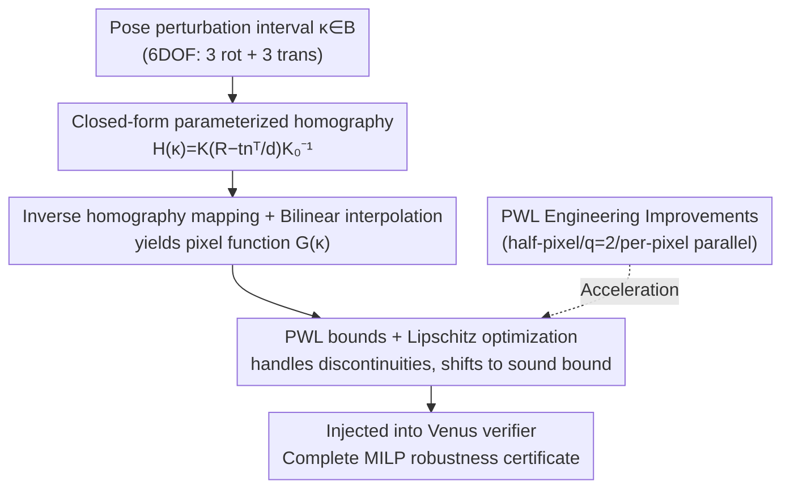

# Lipschitz Optimization for Formal Verification of Homographies

**Conference**: CVPR 2026  
**arXiv**: [2605.23203](https://arxiv.org/abs/2605.23203)  
**Code**: https://github.com/jeangud/homography-verification (Available)  
**Area**: Autonomous Driving / Formal Verification of Neural Networks  
**Keywords**: Formal Verification, Homography, Lipschitz Optimization, Camera Pose Robustness, Piecewise Linear Bounds

## TL;DR
By formulating "camera 6-DOF pose perturbation → pixel values" as a closed-form homography and extending the piecewise linear + Lipschitz optimization bounds of Batten et al. from affine to non-affine projective transformations, this work performs the **first** formal verification of "camera motion robustness" for neural networks. Compared to prior work, it achieves up to 89% speedup and 7% tighter bounds, while revealing systematic vulnerabilities to 3D perspective perturbations in VNN-COMP networks and runway visibility classifiers.

## Background & Motivation
**Background**: Deploying vision neural networks in regulated, safety-critical scenarios such as aviation, autonomous driving, and healthcare requires more than just statistical "test set accuracy." Regulators demand **formal robustness guarantees**—mathematical proof that the network output remains invariant under specific classes of perturbations. Currently, the vast majority of neural network verification (VNN) targets only $\ell_p$ norm ball perturbations (pixel-level noise, contrast, hue) or simple 2D affine transformations.

**Limitations of Prior Work**: Many real-world perturbations **originate from the physical space of the scene** (perspective changes, camera shake), occurring before imaging and mapping to pixels via projective geometry. Using a sufficiently large $\ell_p$ ball to "cover" these perturbed image manifolds results in severe **over-approximation**, including many noise patterns that could never physically occur. This leads to bounds that are too loose to prove anything. Camera motion robustness is critical for deploying vision systems but has remained an unsolved problem.

**Key Challenge**: Changes in camera perspective correspond to **non-affine projective transformations (homographies)**. The pixel coordinate mapping includes a "divided by ray depth" denominator (perspective normalization), which is highly non-linear and potentially discontinuous. Existing verification methods capable of providing **complete** guarantees (such as Lipschitz optimization-based piecewise linear bounds) only handle affine transformations (where the denominator is constant at 1) and cannot represent perspective effects.

**Goal**: (1) Formulate the homography induced by 6-DOF pose perturbations into a closed-form, parameterized representation compatible with verifiers; (2) Extend piecewise linear bounds and Lipschitz optimization to these non-affine, potentially discontinuous transformations to provide provably tight pixel value bounds; (3) Use this to perform the first robustness "physical exam" on standard benchmarks and real-world safety-critical classifiers.

**Key Insight**: The authors observe that for scenes **dominated by planar structures** (ground, traffic signs, road markings, robotic arm work surfaces), the mapping between two perspectives is strictly a homography matrix. This represents a "middle ground" that can express perspective while remaining analytically tractable—fitting the real manifold better than $\ell_p$ balls while being much lighter than "complex simulation + proxy networks + explicit imaging models."

**Core Idea**: By establishing the analytical chain "camera pose → closed-form homography → inverse homography for original image coordinates → bilinear interpolation for pixel values," the pixel function $G(\bm{\kappa})$ of the projective transformation is explicitly defined. This is then fed into the generalized Lipschitz piecewise linear bounding algorithm to obtain provably complete robustness certificates.

## Method

### Overall Architecture
The core problem addressed is: given an original image $\bm{x_0}$ and a set of **camera pose perturbation intervals** $\bm{\kappa}\in\mathcal{B}$ (e.g., yaw $\Delta\psi\in[0°,5°]$), prove that the network produces the same output for **all** possible perspectives within this interval. The overall pipeline is an analytical chain: first, derive the closed-form homography matrix $\bm{H}(\bm{\kappa})$ from pose perturbations; then, for each pixel $(i,j)$, find its corresponding floating-point coordinates in the original image via the inverse homography $T^{-1}$ and perform bilinear interpolation to obtain the pixel value function $G(\bm{\kappa})$. Next, fit piecewise linear upper and lower bounds in the parameter space and use Lipschitz optimization to translate "unreliable bounds" into "sound bounds." Finally, the linear constraints for each pixel are passed into a network verifier (Venus) for complete verification.

### Key Designs

**1. Closed-form Parameterized Homography: Translating "Camera Motion" to "Pixel Change"**

The pain point is that $\ell_p$ balls cannot represent perspective changes, and explicit imaging simulation is too heavy. Starting from classical multi-view geometry, for a planar feature (taking the world system $z=0$ plane with normal $\bm{\pi}^W=(0,0,1,0)^\top$), the homography between two views has the standard form $\bm{H}=\bm{K}\left(\bm{R}-\tfrac{1}{d}\bm{t}\bm{n}^\top\right)\bm{K_0}^{-1}$, where $\bm{K}$ is the camera intrinsic matrix, $\bm{R},\bm{t}$ are the relative rotation and translation between views, and $(\bm{n},d)$ are plane parameters. The key contribution is the **complete parameterization** into a 12D vector $\bm{\kappa}=(\Delta\phi,\Delta\theta,\Delta\psi,\Delta x,\Delta y,\Delta z, \phi, \theta, \psi, x, y, z)^\top$—where the first 6 dimensions are perturbation amounts (roll/pitch/yaw Euler increments + three translation increments) and the latter 6 are the reference pose. Thus, $\bm{H}(\bm{\kappa})$ becomes a closed-form function differentiable with respect to perturbations.

To make the bounding algorithm tractable, the authors further analytically simplify single-perturbation scenarios. For example, under pure yaw $\Delta\psi$ (with camera center fixed), the homography reduces to $\bm{H}=\bm{K}\bm{R}\bm{K}^{-1}$, independent of the reference pose. The inverse transform yields closed-form original coordinates:

$$u_0(\Delta\psi)=x_c+f\cdot\frac{f\sin\Delta\psi+(u-x_c)\cos\Delta\psi}{f\cos\Delta\psi-(u-x_c)\sin\Delta\psi},\quad v_0(\Delta\psi)=y_c+f\cdot\frac{v-y_c}{f\cos\Delta\psi-(u-x_c)\sin\Delta\psi}$$

Note that the term $f\cos\Delta\psi-(u-x_c)\sin\Delta\psi$ in the denominator is exactly the "perspective normalization" term—the source of perspective distortion that affine transforms cannot express. This step allows projective transformations to be integrated into the verification pipeline without simulation, proxy networks, or explicit imaging models.

**2. Extending Lipschitz Piecewise Linear Bounds to Non-Affine, Discontinuous Projective Transforms**

Prior work by Batten et al. (PWL) only handled affine transformations, where the pixel functions are everywhere continuous and Lipschitz constants are easy to estimate. The trouble with homographies is that the denominator above can go to zero, causing the inverse mapping $T^{-1}$ to be discontinuous at a **critical angle** $\Delta\psi_c=\arctan\!\big(\tfrac{f}{u-x_c}\big)$, breaking the Lipschitz property. The authors handle this by explicitly removing singularities from the differentiable domain $\mathrm{Diff}(\mathcal{B})=\mathcal{B}\setminus\{\Delta\psi_c\!\!\pmod\pi\}$ and arguing that for small perturbations (near $\Delta\psi=0°$), the critical angles fall in $[72°, 90°]$, well outside the parameter interval, making it effectively safe. Even if pixel coordinates diverge at critical angles, the interpolation is capped by padding values, keeping $G$ bounded.

Mechanistically, the parameter space is first partitioned $\mathcal{B}=\biguplus_j\mathcal{B}_j$. Each subdomain is sampled at $n_s$ points to fit an **unreliable** linear bound (Eq. 11) via error minimization. Then, for the "bound violation" cost function $\underline{J}(\bm{\kappa})=\mathrm{LB}(\bm{\kappa})-G(\bm{\kappa})$, Lipschitz maximization is performed to find the analytical supremum $\widehat{\underline{J}^*}$ with an $\epsilon$-certificate. By shifting the entire bound $\mathrm{LB}^*(\bm{\kappa})=\mathrm{LB}(\bm{\kappa})-(\widehat{\underline{J}^*}+\epsilon)$, a **sound lower bound** is obtained (upper bounds are handled symmetrically). To this end, the authors derived a set of analytical maximum gradient candidates (Eq. 13–14) for the homography case: the maximum gradient for $u_0$ falls at the interval endpoints or $\arctan\!\big(\tfrac{x_c-u}{f}\big)$, and at endpoints for $v_0$. This provides the correct and tight Lipschitz constant upper bound, which is the theoretical core of migrating the method from affine to projective geometry.

**3. PWL Algorithm Rewrite + Venus Verifier Adaptation: Making it "Fast and Tight"**

Theory alone is insufficient, so the authors re-implemented PWL with five engineering improvements: ① Half-pixel correction for precise gradients; ② Inclusion of previously omitted $\bm{\kappa}$ values into $\mathrm{Diff}(\mathcal{B})$ to complete Lipschitz constant candidates; ③ Binary subdivision of $\mathcal{B}$ from the first iteration to reduce Branch-and-Bound (BaB) steps; ④ Using $q=2$ segments for both upper and lower bounds for tighter approximation; ⑤ **Pixel-level parallelism**. Simultaneously, the Venus verifier was modified so its bound propagation framework can derive pre-activation bounds from linear input constraints (rather than fixed intervals), enabling tighter ReLU relaxations and better constraining the underlying MILP. This decoupled "frontend modeling + backend solving" design makes the bounds independent of the solver and portable to other verification engines.

### A Complete Example
Consider a pixel $\bm{p}=(34,47)$ on an MNIST image under yaw perturbation $\Delta\psi\in[0°,10°]$: As the camera rotates around the yaw axis, the original image coordinates corresponding to this pixel move along a non-linear path defined by Eq. 10 (e.g., $T^{-1}=(34.4,53.5)$ at some $\Delta\psi$). The pixel value changes non-linearly from black → white → gray via bilinear interpolation. The algorithm partitions subdomains in $[0°,10°]$, samples and fits, obtaining a piecewise linear bound with 0, 1, or 2 split points (Fig. 5: linear curve with 0 splits, PWL with 1 split, Ours with 2 splits for complex curves). Lipschitz optimization then shifts the dashed "unreliable bound" down to a solid "sound bound." This process is repeated for every pixel in the image to obtain sound linear constraints for the entire transformed image. Finally, the collection is sent to Venus to determine if the network output remains constant over this interval.

## Key Experimental Results

The experimental environment was a laptop (Intel i7-13800H / 32GB / RTX 2000). Benchmark datasets included MNIST, CIFAR-10, and GTSRB from VNN-COMP (100 images each), plus a runway visibility classifier trained on the LARD dataset. The verification backend used Venus (the only solver supporting complete MILP for piecewise linear bounds).

### Main Results: Speed and Tightness vs. Prior Work PWL (2D Rotation, as PWL only supports affine)

| Dataset | Perturbation | Metric | PWL | Ours |
|--------|------|------|-----|------|
| MNIST | 5° | BaB Steps ↓ | 124.0 | **17.5** |
| MNIST | 5° | Time(s) ↓ | 87.6 | **7.0** |
| CIFAR-10 | 5° | Time(s) ↓ | 910.3 | **98.7** |
| MNIST | 5° | Polytope Area (×10⁻³) ↓ | 9.48 | **9.42** |
| MNIST | 20° | BaB Steps ↓ | 137.0 | **72.5** |
| CIFAR-10 | 20° | Time(s) ↓ | 891.0 | **530.9** |

For small angle perturbations, BaB iterations were reduced by >71% with a total speedup of **89%**. For large angles, the overhead of candidates that failed to converge in splits became dominant, reducing the speedup to ~40%. Given a fixed BaB budget, per-pixel parallelism remained 53–85% faster. $q=2$ tightened the bounds by up to **7%** on complex pixel curves.

### VNN-COMP Network Robustness Checkup (% Robust Samples, $\mathcal{B}$ as below)

| Perturbation | Interval | MNIST | CIFAR-10 | GTSRB |
|------|------|-------|----------|-------|
| $\Delta\phi$ roll | [0,5]° | 61 | 69 | 0 |
| $\Delta\theta$ pitch | [0,5]° | 5 | 10 | 0 |
| $\Delta\psi$ yaw | [0,5]° | 25 | 7 | 0 |
| $\Delta x$ | [0,1] m | 50 | 21 | 0 |
| $\Delta y$ | [0,1] m | 73 | 83 | 0 |
| $\Delta z$ | [0,1] m | 53 | 24 | 0 |

Even PGD-adversarially trained networks are very fragile to pure perspective perturbations like pitch, yaw, $\Delta x$, and $\Delta z$. Roll and $\Delta y$ are more robust because, under the paper's assumptions, they degenerate into affine transforms (rotation/shear) already better covered by data augmentation and $\ell_p$ attacks. Most striking is that the **autonomous driving GTSRB model showed zero certified robustness for all 3D perturbations** (with 178 timeouts), confirming these networks cannot even withstand simple $\ell_p$ attacks.

### Sensitivity and Case Studies

| Analysis | Configuration | Key Figure |
|------|------|---------|
| Yaw Magnitude (MNIST Verif. %) | 1° / 5° / 10° / 20° | 76 / 25 / 0 / 0 |
| Padding (CIFAR-10, [0,5]°) | Black / Copy / Reflect | 7 / 8 / 9 |
| Runway Classifier (LARD) | 10cm Trans / 1° Rot | Only 16% / 1% Cert. |

### Key Findings
- **Magnitude is the primary enemy**: Increasing yaw from 1° to 5° caused the verification rate to collapse from 76% to 25%, reaching zero after 10°. Large transformations amplify the non-linearity of pixel curves, necessitating input partitioning—which aligns with the "near-linear small angle" planar assumption.
- **Padding affects robustness**: Copy/Reflective padding (extending image content) is more robust than black/gray border padding because sharp boundaries introduce distribution shifts. However, the overall conclusion remains unchanged with reflective padding, reconfirming the intrinsic fragility of the networks.
- **Safety-critical classifiers are concerning**: A runway visibility classifier without robust training achieved only 16% certification under 10cm translation and 1% under 1° rotation, highlighting the real-world challenge of camera motion robustness in certification.

## Highlights & Insights
- **Returning Physical Space Perturbations to the Verification Mainstream**: The core insight is that "for planar scenes, perspective change strictly equals a homography." Replacing heavy imaging simulation/proxy networks with analytical homographies is both faithful to the real perturbation manifold and analytically tractable—this "pose → closed pixel function" approach can be transferred to any geometric perturbation verification dominated by planar structures.
- **Engineering Cleverness in Handling Discontinuities**: Instead of avoiding the singularities caused by the perspective denominator, the authors explicitly characterize the critical angle, prove it falls outside the parameter interval, and derive analytical candidates for the maximum gradient, cleanly resolving what appeared to be a breakdown of the Lipschitz property.
- **Decoupled Frontend/Backend, Solver-Agnostic**: Separating transformation modeling (frontend) from the network verification engine (backend) allows the bounds to be ported to different verifiers, a very practical system design.
- **Value in Honest "Bad News"**: One of the paper's greatest contributions is the first systematic revelation of the fragility of SOTA networks (including those with PGD training and autonomous driving models) against 3D camera motion, providing realistic evidence rather than optimistic illusions for regulatory certification.

## Limitations & Future Work
- **Strong Planar Assumption**: The method is only applicable to scenes dominated by planar structures with limited parallax and occlusion; homographies no longer hold precisely for non-planar scenes with strong parallax.
- **Degradation under Large Transformations**: As perturbation magnitude increases, piecewise linear bounds loosen rapidly and verification rates collapse (zeroing at 10° yaw). The practical interval is small, requiring more aggressive input partitioning or adaptive segmentation.
- **Inherent Latency of Complete Verification**: Dependent on complete BaB solvers, verification times on GTSRB can reach thousands of seconds with numerous timeouts; scalability is limited by network size.
- **Verification Only, No Training**: The paper focuses on verifying pre-trained models and does not address how to **train robustly** against camera motion—a direction explicitly listed for future work.
- **Single-Parameter Dominance**: Evaluation mostly focuses on single perturbation dimensions (e.g., pure yaw or pure translation); the scalability and tightness for multi-DOF joint perturbations require further verification.

## Related Work & Insights
- **vs. Batten et al. (PWL)**: PWL used piecewise linear + Lipschitz optimization for tight bounds on 2D **affine** transforms. This work extends it directly to **non-affine homographies** (handling perspective denominators and discontinuities) and rewrites the implementation to deliver 89% speedup and 7% tighter bounds—a dual achievement in theoretical extension and engineering optimization.
- **vs. Balunovic et al.**: They associated geometric parameters with pixel value bounds and verified bilinear interpolation, but were similarly limited to 2D transforms. This work extends that chain to 3D pose-induced projective transformations.
- **vs. $\ell_p$-norm Verification (α-β-CROWN / Venus / Marabou)**: Mainstream verifiers focus on $\ell_p$ balls, which over-approximate the real perturbation manifold and cannot directly express perspective changes. This work provides geometric perturbation modeling fitting the manifold and reuses Venus as a backend.
- **vs. Statistical/Simulation Methods**: Statistical methods only provide probabilistic guarantees, and simulation with explicit 3D scene models is too heavy. This work uses homography as a principled "middle ground"—both expressive of perspective and analytically verifiable.

## Rating
- Novelty: ⭐⭐⭐⭐⭐ First expansion of formal verification to projective geometry/camera motion robustness, with substantial theoretical and system advances.
- Experimental Thoroughness: ⭐⭐⭐⭐ Covers three benchmarks plus a real runway classifier, including magnitude/padding sensitivity, though mostly single-parameter perturbations.
- Writing Quality: ⭐⭐⭐⭐ Rigorous geometric derivation and clear motivation, though the high formula density presents a steep threshold for non-verification experts.
- Value: ⭐⭐⭐⭐⭐ Directly addresses a real pain point in aviation/autonomous driving certification, revealing SOTA network vulnerabilities with strong deployment significance.

<!-- RELATED:START -->

## Related Papers

- [\[CVPR 2026\] UFO: Unifying Feed-Forward and Optimization-based Methods for Large Driving Scene Modeling](ufo_unifying_feed-forward_and_optimization-based_methods_for_large_driving_scene.md)
- [\[CVPR 2026\] Learnability-Driven Submodular Optimization for Active Roadside 3D Detection](learnability-driven_submodular_optimization_for_active_roadside_3d_detection.md)
- [\[CVPR 2025\] PIDLoc: Cross-View Pose Optimization Network Inspired by PID Controllers](../../CVPR2025/autonomous_driving/pidloc_cross-view_pose_optimization_network_inspired_by_pid_controllers.md)
- [\[ICCV 2025\] A Constrained Optimization Approach for Gaussian Splatting from Coarsely-posed Images and Noisy Lidar Point Clouds](../../ICCV2025/autonomous_driving/a_constrained_optimization_approach_for_gaussian_splatting_from_coarsely-posed_i.md)
- [\[ICCV 2025\] MAESTRO: Task-Relevant Optimization via Adaptive Feature Enhancement and Suppression for Multi-task 3D Perception](../../ICCV2025/autonomous_driving/maestro_task-relevant_optimization_via_adaptive_feature_enhancement_and_suppress.md)

<!-- RELATED:END -->
