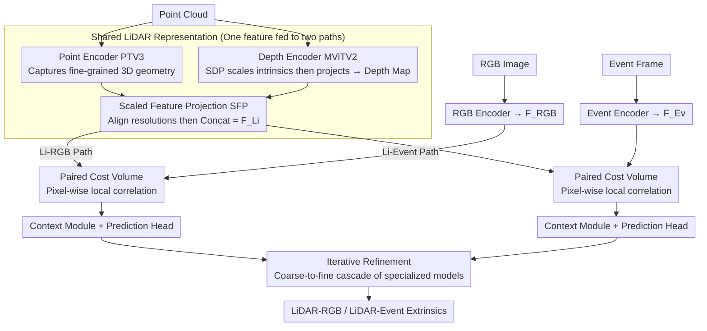

# LiREC-Net: A Target-Free and Learning-Based Network for LiDAR, RGB, and Event Calibration

**Conference**: CVPR 2026  
**arXiv**: [2602.21754](https://arxiv.org/abs/2602.21754)  
**Code**: None  
**Area**: Autonomous Driving  
**Keywords**: Multi-sensor calibration, Target-free calibration, Tri-modal fusion, Event camera, Extrinsic estimation

## TL;DR

Ours proposes LiREC-Net, the first unified framework to simultaneously perform target-free extrinsic calibration for LiDAR-RGB and LiDAR-Event cameras. By utilizing a shared LiDAR representation (fusing 3D point features and projected depth features) and paired cost volumes for cross-modal alignment, it achieves calibration accuracies of 1.80cm/0.11° on KITTI, and 2.51cm/0.14° (LiDAR-RGB) and 1.18cm/0.07° (LiDAR-Event) on DSEC.

## Background & Motivation

Autonomous driving systems rely on multi-sensor fusion to construct a consistent environmental perception. The prerequisite for sensor fusion is **accurate extrinsic calibration**—knowing the relative pose of each sensor in a common coordinate system. However, in practical deployment, vehicle vibrations, temperature changes, minor collisions, and routine maintenance cause sensor poses to drift gradually, rendering initial calibrations inaccurate.

Traditional **target-based calibration** (checkerboards, ArUco markers, etc.) offers high precision but requires specialized controlled scenes, careful placement, repeated collection, and manual supervision, making it **impossible to execute frequently during operation**. **Target-free methods** calibrate directly from natural driving scenes without special setups and can be repeated at any time.

Deep learning-based target-free calibration methods (LCCNet, RegNet, CalibNet, etc.) have made progress but suffer from a critical limitation: **they only process a single modal pair**. For instance, LCCNet only handles LiDAR-RGB, while MULiEv only handles LiDAR-Event. When a system contains all three sensors, **two independent networks must be trained**, which not only increases computational redundancy but may also lead to **calibration inconsistency**—the estimated LiDAR-RGB and LiDAR-Event transformations from independent networks might not be self-consistent in 3D space.

The **Core Idea** of LiREC-Net is to **design a shared LiDAR representation**, allowing the same LiDAR features to serve both LiDAR-RGB and LiDAR-Event calibration paths, thereby reducing redundancy and ensuring consistency.

## Method

### Overall Architecture

LiREC-Net aims to solve a specific problem: how a vehicle equipped with LiDAR, RGB, and Event cameras can calibrate both LiDAR-RGB and LiDAR-Event extrinsics using a **single** network rather than training separate ones. The approach is to extract LiDAR features once and share them across both calibration paths. The point cloud is processed through a shared LiDAR branch to obtain a unified representation. RGB and Event branches have their own encoders to extract visual/event features, which are then used to build paired cost volumes with the shared LiDAR features. Finally, two context modules and prediction heads regress the respective extrinsic parameters; the entire network employs a coarse-to-fine multi-stage cascade for iterative refinement.

### Key Designs

**1. Shared LiDAR Representation: Feeding two calibration paths with a single LiDAR feature**

Equipping LiDAR-RGB and LiDAR-Event with independent LiDAR encoders would double computational costs and potentially lead to spatial inconsistencies. LiREC-Net encodes LiDAR once, ensuring the representation contains both fine-grained geometry and dense spatial context through two complementary encoders: a Point Encoder using Point-Transformer-V3 (PTV3) to process unordered 3D points via space-filling curve serialization for efficient local attention, and a Depth Encoder that projects the point cloud onto the image plane to extract dense spatial context using MViTV2. The two features are aligned via Scaled Feature Projection (SFP) and concatenated: $\mathbf{F}^{\text{Li}} = \text{Concat}(\text{SFP}(\mathbf{F}^{\text{point}}), \mathbf{F}^{\text{depth}})$. Ablation studies show that removing point features causes LiDAR-RGB translation error to surge from 2.51cm to 14.43cm due to the loss of dense spatial context.

**2. Scaled Depth/Feature Projection (SDP & SFP): Scale intrinsics before projection**

Traditional methods project point clouds using original intrinsics and then resize the image, which introduces blurring artifacts and destroys fine-grained alignment. SDP instead scales the intrinsic matrix before projection: $R' = \text{diag}\left(\frac{W'}{W}, \frac{H'}{H}, 1\right), \quad \mathbf{K'}_{\text{Cam}} = R' \mathbf{K}_{\text{Cam}}$, ensuring projected points land accurately from the start. Removing SDP/SFP degrades LiDAR-Event error from 1.18cm/0.07° to 3.35cm/0.30°, indicating that projection precision is a bottleneck in sub-centimeter calibration tasks.

**3. Paired Cost Volume: Explicitly measuring cross-modal alignment via pixel-wise local correlation**

To measure the discrepancy between aligned LiDAR and camera features, ours draws inspiration from PWC-Net and LCCNet. For each pixel $\mathbf{p}=(x,y)$, a channel-wise inner product is calculated within a displacement window $(\Delta x, \Delta y)$: $\mathcal{C}(y,x,\Delta x,\Delta y) = \frac{1}{C}\sum_{c=1}^{C} \mathbf{F}^{\text{Li}}_{c,y,x} \cdot \mathbf{F}^{\text{Cam}}_{c,y+\Delta y,x+\Delta x}$, resulting in a cost volume of dimensions $H'' \times W'' \times (2d+1)^2$. This explicitly encodes local alignment into the features for the prediction head to regress pose offsets.

**4. Iterative Refinement: Coarse-to-fine cascade of specialized models**

A single network struggles to handle both large deviations ($\pm 20^{\circ}$) and sub-degree fine-tuning. LiREC-Net trains multiple independent models, each specialized for a specific error range (from $\pm 20^{\circ}/150\text{cm}$ down to $\pm 1^{\circ}/10\text{cm}$), applied in a cascade: $\hat{\mathbf{T}}^{v,(k)} = \Delta\hat{\mathbf{T}}^{v,(k)} \hat{\mathbf{T}}^{v,(k-1)}$. This specialization is why a 5-stage setup (2.51cm/0.14°) significantly outperforms 2 stages (2.62cm/0.30°) on DSEC.

### Loss & Training

The total loss is the sum of the losses for both modal pairs: $\mathcal{L}_{\text{total}} = \mathcal{L}^{\text{Li-RGB}} + \mathcal{L}^{\text{Li-Ev}}$

Each pair's loss consists of three components:

$$\mathcal{L}^v = (1-w)(\lambda_t \mathcal{L}^v_{\text{trans}} + \lambda_r \mathcal{L}^v_{\text{rot}}) + w \mathcal{L}^v_{\text{pcd}}$$

- **Translation Loss**: Smooth L1 loss on $\hat{\mathbf{t}}^v$.
- **Rotation Loss**: Angular distance between predicted and ground-truth quaternions $\theta(\hat{\mathbf{q}}^v, \mathbf{q}^v)$.
- **Point Cloud Distance Loss**: L2 distance between point clouds transformed by predicted vs. ground-truth extrinsics to ensure geometric consistency.

Training details: Adam optimizer, lr=3e-4 with milestone decay (×0.5); 150 epochs for the first stage on DSEC, 70 epochs for subsequent stages; batch size 64 across 4×A6000/L40S GPUs.

## Key Experimental Results

### Main Results — KITTI Dataset

| Method | LiDAR-RGB Error | LiDAR-Event Error |
|------|-------------|----------------|
| RegNet | 6.00cm / 0.28° | — |
| CalibNet | 4.34cm / 0.41° | — |
| LCCNet | 1.59cm / 0.16° | — |
| PseudoCal | **1.18cm / 0.05°** | — |
| **LiREC-Net** | 1.80cm / 0.11° | **1.82cm / 0.12°** |

### Main Results — DSEC Dataset (5 stages)

| Method | LiDAR-RGB Error | LiDAR-Event Error |
|------|-------------|----------------|
| MULiEv (2 stages) | — | 0.81cm / 0.10° |
| LiREC-Net (2 stages) | 2.62cm / 0.30° | 2.05cm / 0.25° |
| **LiREC-Net (5 stages)** | **2.51cm / 0.14°** | **1.18cm / 0.07°** |

### Ablation Study — Feature Fusion (DSEC)

| Point Feature | Depth Feature | LiDAR-RGB | LiDAR-Event |
|-----------|-----------|-----------|-------------|
| ✓ | ✗ | 14.43cm/0.70° | 14.05cm/0.64° |
| ✗ | ✓ | 2.97cm/0.70° | 2.16cm/0.60° |
| ✓ | ✓ | **2.51cm/0.14°** | **1.18cm/0.07°** |

### Tri-modal vs. Bi-modal Efficiency Comparison

| Configuration | Inference Time (s) | Params (B) | Memory (GiB) |
|------|------------|----------|-----------|
| Bi-modal (KITTI, two independent nets) | 0.51 | 1.9 | 14.6 |
| **Tri-modal (KITTI, unified net)** | **0.33** | **1.7** | **11.1** |
| Bi-modal (DSEC) | 0.44 | 1.9 | 14.6 |
| **Tri-modal (DSEC)** | **0.31** | **1.7** | **11.1** |

### Key Findings

- **Point and Depth features are both indispensable**: Translation error jumps 5.8x (2.51 to 14.43cm) without depth features due to missing spatial context; rotation error increases 5x (0.14 to 0.70°) without point features due to loss of 3D structural details.
- **Tri-modal is superior to Bi-modal**: It achieves comparable or better accuracy (shared features provide regularization) with higher efficiency (35% faster inference, 24% less memory).
- **SDP and SFP projection accuracy is vital**: Both scaling methods contribute complementary gains to precision.
- **MViTV2 > ResNet**: The global modeling capability of Transformers is more beneficial for cross-modal alignment.

## Highlights & Insights

- **The concept of "Tri-modal Unification" has practical value**: As event cameras become more common (e.g., Prophesee), unified multi-sensor calibration is a practical necessity.
- **Shared LiDAR representation offers both efficiency and accuracy**: It eliminates inconsistencies inherent in using two independent LiDAR encoders.
- **Engineering insights on SDP/SFP are valuable**: Blurring artifacts from resizing are a major bottleneck in fine-grained alignment tasks.
- Ours establishes the first LiDAR-RGB calibration baseline on DSEC (no prior work reported LiDAR-RGB results on this dataset).

## Limitations & Future Work

- **Assumes RGB and Event cameras are pre-calibrated**: Specifically, $\mathbf{T}^{\text{Ev} \to \text{RGB}}$ is known. The authors suggest jointly estimating this in the future.
- Only handles LiDAR/RGB/Event, and has not yet been extended to thermal or radar sensors.
- High training cost due to training independent models for each stage (5 stages = 5 models).
- Fixed point cloud sampling (20,000 for KITTI, 5,000 for DSEC) lacks flexibility.
- The impact of the cost volume window size $d$ across different error ranges has not been fully analyzed.

## Related Work & Insights

- Directly inspired by LCCNet, extending its core ideas (cost volume + iterative refinement) from bi-modal to tri-modal.
- Choice of Point-Transformer-V3 as the point encoder is notable—its space-filling curve serialization makes it more efficient than PointNet++.
- MULiEv is the only preceding work in LiDAR-Event calibration but only handles single pairs.
- Unlike CalibNet's self-supervised approach, LiREC-Net uses supervised regression relying on manually perturbed misalignments.

## Rating

- **Novelty**: ⭐⭐⭐⭐ Tri-modal unified calibration defines a novel and meaningful problem; the shared LiDAR representation is creative.
- **Experimental Thoroughness**: ⭐⭐⭐⭐ Solid results across two datasets with comprehensive ablations and efficiency analysis, though validation on real-world (non-simulated) misalignments is missing.
- **Writing Quality**: ⭐⭐⭐⭐ Clear structure, rigorous formulation, and intuitive charts.
- **Value**: ⭐⭐⭐⭐ Directly applicable to multi-sensor autonomous driving systems; establishes useful tri-modal baselines.

## Rating
- Novelty: TBD
- Experimental Thoroughness: TBD
- Writing Quality: TBD
- Value: TBD

<!-- RELATED:START -->

## Related Papers

- [\[CVPR 2026\] DSERT-RoLL: Robust Multi-Modal Perception for Diverse Driving Conditions with Stereo Event-RGB-Thermal Cameras, 4D Radar, and Dual-LiDAR](dsert-roll_robust_multi-modal_perception_for_diverse_driving_conditions_with_ste.md)
- [\[CVPR 2026\] Learning to Drive is a Free Gift: Large-Scale Label-Free Autonomy Pretraining from Unposed In-The-Wild Videos](learning_to_drive_is_a_free_gift_large-scale_label-free_autonomy_pretraining_fro.md)
- [\[CVPR 2026\] SG-NLF: Spectral-Geometric Neural Fields for Pose-Free LiDAR View Synthesis](sgnlf_spectralgeometric_neural_fields_for_posefre.md)
- [\[CVPR 2026\] FlashCap: Millisecond-Accurate Human Motion Capture via Flashing LEDs and Event-Based Vision](flashcap_millisecond-accurate_human_motion_capture_via_flashing_leds_and_event-b.md)
- [\[CVPR 2025\] RC-AutoCalib: An End-to-End Radar-Camera Automatic Calibration Network](../../CVPR2025/autonomous_driving/rc-autocalib_an_end-to-end_radar-camera_automatic_calibration_network.md)

<!-- RELATED:END -->
