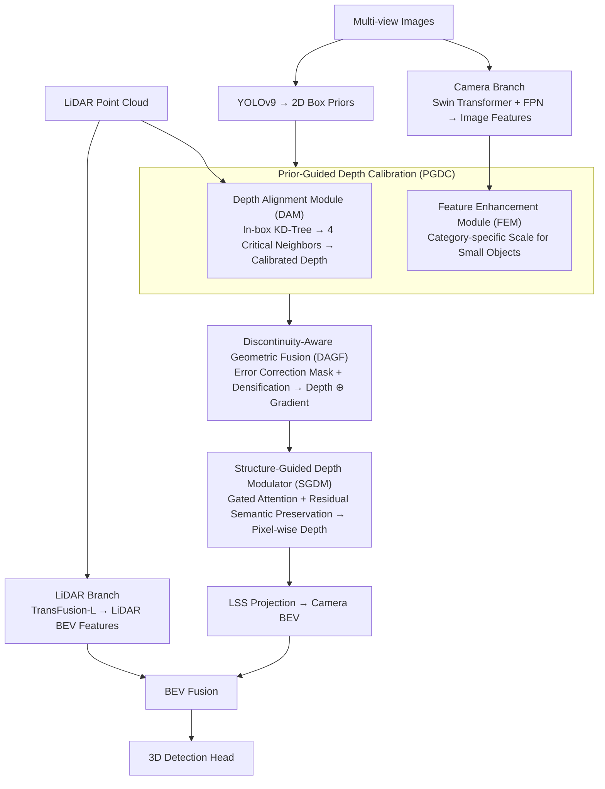

# Look Before You Fuse: 2D-Guided Cross-Modal Alignment for Robust 3D Detection

**Conference**: CVPR 2026  
**arXiv**: [2507.16861](https://arxiv.org/abs/2507.16861)  
**Code**: None  
**Area**: Autonomous Driving  
**Keywords**: 3D Object Detection, LiDAR-Camera Fusion, Cross-Modal Alignment, BEV Perception, Depth Estimation

## TL;DR

This paper reveals that feature misalignment in LiDAR-Camera fusion is primarily concentrated at **foreground-background depth discontinuity boundaries**. It proposes three collaborative modules—PGDC (Prior-Guided Depth Calibration), DAGF (Discontinuity-Aware Geometric Fusion), and SGDM (Structure-Guided Depth Modulator)—to actively correct misalignment before fusion. The method achieves SOTA performance on the nuScenes validation set with 71.5% mAP and 73.6% NDS.

## Background & Motivation

LiDAR-Camera fusion is a dominant paradigm in autonomous driving 3D perception. Cameras provide rich semantic information but lack accurate depth, while LiDAR provides precise geometry but is sparse and lacks semantics. Fusing both into a unified BEV representation is the core approach of current SOTA methods like BEVFusion.

However, these methods face a **fundamental technical bottleneck: cross-modal spatial misalignment**. Misalignment stems from two sources:

**Background**:
- **Extrinsic Calibration Errors**: Inaccurate relative poses between sensors.
- **Rolling Shutter Effect**: Motion distortion caused by row-by-row exposure in CMOS cameras.

**Limitations of Prior Work**:
Existing strategies have fundamental flaws:
- **TransFusion**: Uses attention to query single-modality features, avoiding projection errors but **sacrificing complementary information**.
- **MetaBEV/RobBEV**: Designs more robust fusion modules but **cannot correct already misaligned features**, effectively "cleverly fusing erroneous data."
- **GraphBEV**: Global alignment techniques can eliminate misalignment in high-depth-gradient regions but **over-smooth already aligned areas**, damaging correct depth values.

**Key Insight**:
The **Core Idea** of this paper is that **misalignment is not randomly distributed but highly predictable**—it concentrates at boundaries where sharp depth jumps occur between foreground objects and the background. Projection errors are larger at long ranges and most severe at depth discontinuities. **2D object detectors can reliably locate these regions**.

**Goal**:
The strategy is "**Look Before You Fuse**"—using 2D object priors to actively locate and correct misalignment before fusion occurs, while keeping already aligned regions intact.

## Method

### Overall Architecture

To address cross-modal spatial misalignment, the framework corrects misaligned depth that would otherwise contaminate camera branch supervision and lead to incorrect BEV feature association. Built upon BEVFusion, the LiDAR branch generates BEV features via TransFusion-L, while the camera branch extracts features using Swin Transformer + FPN. PGDC utilizes 2D box priors for local depth calibration and feature enhancement. DAGF converts calibrated sparse depth into dense depth and gradient representations. SGDM employs gated attention to modulate pixel-wise depth prediction using geometric cues. Finally, features are projected into BEV via LSS and fused with LiDAR features for 3D detection.

### Key Designs

**1. Prior-Guided Depth Calibration (PGDC): Targeted Correction at Discontinuity Boundaries**

**Design Motivation**: Misalignment is concentrated at FG-BG depth boundaries. PGDC restricts correction to 2D boxes to avoid affecting aligned areas.
- **Mechanism**: **Depth Alignment Module (DAM)** uses YOLOv9 2D boxes $\{B_j^{(i)}\}$. For each LiDAR point $p$, it finds 10 nearest neighbors via KD-Tree and selects 4 critical neighbors $\mathcal{N}_{\text{critical}}$ (2 minimum and 2 maximum depths) to capture depth consistency and jumps. These are concatenated $f_p = \text{concat}(d_p, \{d_q\}_{q \in \mathcal{N}_{\text{critical}}})$ and passed through a light conv to get $d'_{\text{aligned}}(p)$.
- **Feature Enhancement Module (FEM)** uses category-specific coefficients $\alpha_k$ to scale image features $F_{\text{enhanced}}(p,c) = \alpha_k \cdot F_{\text{img}}(p,c)$, where smaller objects (pedestrians) get larger $\alpha_k$ to avoid being submerged during fusion.

**2. Discontinuity-Aware Geometric Fusion (DAGF): Error-Correcting Densification**

- **Mechanism**: Calculates difference $\Delta = |D_{\text{raw}} - D_{\text{aligned}}|$. Pixels exceeding 10% deviation are masked as unreliable, suppressing errors from poor 2D priors.
- **Function**: The sparse map is divided into 20×20 blocks. Each block computes average depth $d_{\text{avg}}$ (for densification) and maximum gradient $g_{\max}$ (for structural info). The final 2-channel feature $F_{\text{FA}} = [D_{\text{dense}} \oplus G_{\text{dense}}]$ explicitly guides the fusion.

**3. Structure-Guided Depth Modulator (SGDM): Geometric Modulation of Depth**

- **Mechanism**: Parallel convolutions encode camera features and DAGF geometric representations. Gated attention generates spatial maps to modulate depth prediction.
- **Novelty**: Uses residual connections to preserve original camera semantics, preventing semantic dilution during geometric fusion. The output is a pixel-wise discrete depth distribution for LSS projection.

### Loss & Training

$$\mathcal{L}_{\text{total}} = \mathcal{L}_{\text{focal}} + \mathcal{L}_{\text{edge}} + \mathcal{L}_{\text{cls}} + \mathcal{L}_{\text{box}}$$

- **Focal Loss** $\mathcal{L}_{\text{focal}}$: Targets $D_{\text{dense}}$ with $\gamma=2.0, \alpha=0.25$.
- **Edge-Critical Loss** $\mathcal{L}_{\text{edge}}$: Uses gradient map $G_{\text{dense}}$ as weights to amplify losses in depth discontinuity regions.
   $$\mathcal{L}_{\text{edge}} = \frac{1}{|\mathcal{V}|}\sum_{(u,v) \in \mathcal{V}} G^{(i)}(u,v) \cdot l_{\text{focal}}(u,v)$$

## Key Experimental Results

### Main Results — nuScenes Validation Set

| Method | Conference | mAP(%) | NDS(%) |
|------|------|--------|--------|
| TransFusion-L | CVPR 22 | 65.5 | 70.2 |
| BEVFusion-PKU | NeurIPS 22 | 67.9 | 71.0 |
| BEVFusion-MIT | ICRA 23 | 68.5 | 71.4 |
| BEVDiffuser | CVPR 25 | 69.2 | 71.9 |
| GraphBEV | ECCV 24 | 70.1 | 72.9 |
| **Ours** | — | **71.5** | **73.6** |

**Gain** over GraphBEV: +1.4% mAP, +0.7% NDS. Achieved 41.7% mAP on Argoverse 2.

### Ablation Study — Module Contributions (nuScenes)

| PGDC | DAGF | SGDM | mAP(%) | NDS(%) | Latency Gain (ms) |
|------|------|------|--------|--------|-------------|
| ✗ | ✗ | ✗ | 67.9 | 71.0 | +0.0 |
| ✓ | ✗ | ✓ | 69.8 | 72.5 | +13.0 |
| ✗ | ✓ | ✓ | 69.0 | 71.6 | +7.0 |
| ✓ | ✓ | ✓ | **71.5** | **73.6** | +15.0 |

### Fine-grained Ablation — Internal Components

| DAM | FEM | $D_{\text{dense}}$ | $G_{\text{dense}}$ | mAP(%) | NDS(%) |
|-----|-----|-----|-----|--------|--------|
| ✗ | ✗ | ✗ | ✗ | 67.9 | 71.0 |
| ✓ | ✗ | ✗ | ✗ | 69.4 | 72.1 |
| ✓ | ✓ | ✗ | ✗ | 69.8 | 72.5 |
| ✓ | ✓ | ✓ | ✗ | 70.8 | 73.1 |
| ✓ | ✓ | ✓ | ✓ | **71.5** | **73.6** |

### 2D Prior Quality Impact

| 2D Prior Source | mAP(%) | NDS(%) |
|-----------|--------|--------|
| Random Prior | 68.5 | 71.2 |
| No Prior | 69.0 | 71.6 |
| Full Image | 69.4 | 71.8 |
| YOLO-X | 70.3 | 72.5 |
| YOLOv9 | 71.5 | 73.6 |
| Ground Truth | 73.5 | 74.2 |

### Key Findings

- **Significant individual module contributions**: DAM alone adds +1.5 mAP, FEM adds +0.4, densification adds +1.0, and the gradient map adds +0.7.
- **2D detection quality directly impacts 3D performance**: The gap between random priors (68.5) and GT (73.5) shows that 3D detection improves alongside 2D detectors.
- **Random Prior < No Prior**: Random boxes are harmful (68.5 vs 69.0) as they incorrectly modify aligned regions.
- **PGDC efficiency**: A 15ms latency increase yields a significant 3.6% mAP improvement.
- **DAGF Self-Correction**: The difference mask effectively filters errors introduced by inaccurate 2D priors in PGDC.

## Highlights & Insights

- **Predictable Misalignment**: The insight that sensor errors are not random but tied to structural scene attributes (FG-BG boundaries) is profound.
- **"Look Before You Fuse"**: Eliminating errors before they propagate is fundamentally more sound than post-fusion patching.
- **Safety Net**: The DAGF difference mask provides a robust fallback when 2D priors are inaccurate.
- **Structural Guidance**: Edge-Critical Loss incorporates geometric structure directly into the training objective.

## Limitations & Future Work

- **2D Dependency**: Performance may degrade in scenarios where 2D detection is difficult (extreme weather, severe occlusion).
- **YOLO Overhead**: The total computational cost including the 2D detector was not fully quantified.
- **Hyperparameter Sensitivity**: The block size for densification and category scale $\alpha_k$ are manually set.
- **Dataset Scaling**: Performance on larger datasets like Waymo remains to be verified.

## Related Work & Insights

- **GraphBEV** (ECCV 2024): Performs global alignment but suffers from over-smoothing; **Ours** performs precise local alignment.
- **BEVFusion**: Demonstrated the baseline constraints imposed by misalignment.
- **LSS Paradigm**: Depth estimation quality remains a bottleneck for camera-BEV; this work tackles it via pre-fusion alignment.

## Rating

- **Novelty**: ⭐⭐⭐⭐ Deep insight into boundary-focused misalignment.
- **Experimental Thoroughness**: ⭐⭐⭐⭐⭐ Extensive ablation (5 tables) and sensitivity analysis.
- **Writing Quality**: ⭐⭐⭐⭐ Clear motivation and intuitive illustrations.
- **Value**: ⭐⭐⭐⭐ Direct engineering value for industrial BEV fusion.

## Rating
- Novelty: TBD
- Experimental Thoroughness: TBD
- Writing Quality: TBD
- Value: TBD

<!-- RELATED:START -->

## Related Papers

- [\[CVPR 2026\] RPGFusion: 4D Radar Prior-Guided Multi-Modal Fusion for 3D Detection](rpgfusion_4d_radar_prior-guided_multi-modal_fusion_for_3d_detection.md)
- [\[ICLR 2026\] AsyncBEV: Cross-modal Flow Alignment in Asynchronous 3D Object Detection](../../ICLR2026/autonomous_driving/asyncbev_cross-modal_flow_alignment_in_asynchronous_3d_object_detection.md)
- [\[CVPR 2026\] Think Before You Drive: World Model-Inspired Multimodal Grounding](think_before_you_drive_world_model-inspired_multimodal_grounding.md)
- [\[CVPR 2026\] LiDAR-to-4DRadar Diffusion Bridge via Cross-Modal Alignment and Translation in Latent Space](lidar-to-4dradar_diffusion_bridge_via_cross-modal_alignment_and_translation_in_l.md)
- [\[ECCV 2024\] GraphBEV: Towards Robust BEV Feature Alignment for Multi-Modal 3D Object Detection](../../ECCV2024/autonomous_driving/graphbev_towards_robust_bev_feature_alignment_for_multi-modal_3d_object_detectio.md)

<!-- RELATED:END -->
