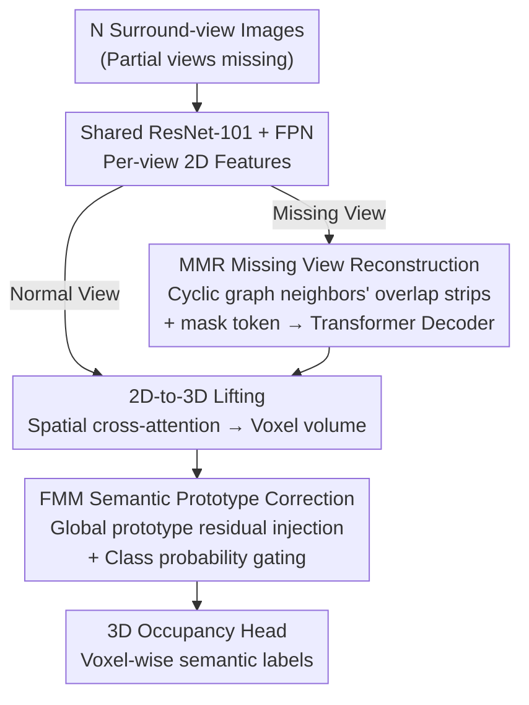

# M²-Occ: Resilient 3D Semantic Occupancy Prediction for Autonomous Driving with Incomplete Camera Inputs

**Conference**: CVPR 2026  
**arXiv**: [2603.09737](https://arxiv.org/abs/2603.09737)  
**Code**: [github.com/qixi7up/M2-Occ](https://github.com/qixi7up/M2-Occ)  
**Area**: Autonomous Driving / 3D Perception  
**Keywords**: Semantic Occupancy Prediction, Sensor Failure, Missing View Reconstruction, Semantic Prototypes, Robust Perception

## TL;DR

M²-Occ addresses real-world scenarios where camera failures lead to missing views. It proposes MMR (reconstructing missing view representations in feature space using adjacent camera FoV overlaps) and FMM (refining blurred voxel features using a learnable semantic prototype memory bank). On the SurroundOcc baseline, M²-Occ improves IoU by +4.93% when the rear camera is missing and maintains 18.36% IoU even with 5 missing cameras (where the baseline collapses to 13.35%), all without compromising performance under complete views.

## Background & Motivation

**Background**: 3D Semantic Occupancy Prediction (SOP) is a critical task for autonomous driving, using voxel-level representations to describe the geometric structure and semantic information around the vehicle. Camera-based solutions (e.g., SurroundOcc, TPVFormer, VoxFormer) have made significant progress, typically assuming all 6 surround-view cameras work normally.

**Limitations of Prior Work**: In reality, cameras frequently fail due to lens occlusion, hardware damage, or communication interruptions. Even a single camera failure causes a **performance cliff drop** for models like SurroundOcc. For instance, losing the rear camera can cause IoU to plummet from 32.38% to 23.94% (-26.7%), which is unacceptable for safety-critical systems.

**Key Challenge**: Most existing robustness research focuses on BEV detection or mapping (e.g., M-BEV, MetaBEV, SafeMap) rather than the more difficult task of dense 3D semantic occupancy prediction.

**Core Idea**: This work mimics the human capability of "inferring unseen regions from context + utilizing memory to complete information": (a) MMR utilizes FoV overlaps of adjacent cameras to reconstruct missing view representations in the feature space; (b) FMM uses global semantic prototypes as prior knowledge to refine voxel features that remain blurred after reconstruction.

## Method

### Overall Architecture

M²-Occ aims to prevent the collapse of 3D SOP when a portion of surround-view cameras fail and their corresponding views are missing. It does not modify the backbone occupancy prediction flow but inserts two remedial modules into the standard camera-only pipeline. The process flows as follows: $N$ surround-view images (some potentially missing) pass through a shared ResNet-101 + FPN to obtain 2D features for each view. For missing views, MMR "recovers" them in the 2D feature space. The completed multi-view features are then lifted into a unified 3D voxel volume via 2D-to-3D spatial cross-attention. FMM then performs "comparison and correction" on the still-blurry voxel features using a set of global semantic prototypes. Finally, the 3D occupancy head outputs voxel-wise semantic labels. In short: MMR handles geometric completion, while FMM handles semantic correction.

### Key Designs

**1. MMR (Multi-view Masked Reconstruction): Reconstructing missing views in feature space via adjacent overlaps**

Why is it unnecessary to guess from zero when a camera fails? The 6 surround-view cameras in nuScenes have significant FoV overlaps—the right edge of the front-left camera and the left edge of the front camera view the same area. MMR exploits this natural redundancy. It constructs a cyclic graph of the 6 cameras where each view identifies its two neighbors: $\mathcal{N}(v_i) = \{v_{(i-1) \bmod N},\ v_{(i+1) \bmod N}\}$. When $v_i$ is missing, it crops overlap boundary strips of width $w_{ov}$ from the neighbors' feature maps and concatenates them with a learnable mask token to form a reference feature:

$$\mathbf{f}_{ref} = \text{Concat}(\mathbf{f}_{left}[:,-w_{ov}:],\ \mathbf{e}_{mask},\ \mathbf{f}_{right}[:,:w_{ov}])$$

This $\mathbf{f}_{ref}$ serves as a coarse structural prior. The refinement is handled by a 6-layer, 8-head Transformer decoder, which, with learnable positional encodings, decodes the reconstructed feature $\hat{\mathbf{f}}_i = \mathcal{D}(\mathbf{f}_{ref} + \mathbf{p}_{pos})$. Reconstructing in the **feature space** instead of pixel space avoids high computational costs and prevents injecting generative noise into downstream tasks. An L2 reconstruction loss $\mathcal{L}_{MMR} = \frac{1}{|\mathcal{M}|}\sum_{i \in \mathcal{M}} \|\hat{\mathbf{f}}_i - \mathbf{f}_i^{gt}\|_2^2$ is applied only to masked views to prevent the model from learning an identity mapping.

**2. FMM (Feature Memory Module): Using global semantic prototypes to support blurred voxel features**

While MMR restores geometric structure, features near the center of a missing view (away from overlap zones) lack semantic clarity. FMM acts as "long-term memory," storing an "ideal appearance" prototype for each semantic class. Two strategies were compared: Single-Proto stores a single global centroid $\mathbf{m}_k$ updated via momentum moving average $\mathbf{m}_k^{(t)} = (1-\lambda)\mathbf{m}_k^{(t-1)} + \lambda \cdot \bar{\mathbf{f}}_k$ ($\lambda=0.1$). Multi-Proto stores $N_p$ sub-prototypes to capture intra-class variation (e.g., "truck" vs. "semi-trailer"), retrieved using cosine similarity and softmax. Although Multi-Proto is more granular, Single-Proto proved more stable in view-missing scenarios where visual evidence is sparse. The prototypes are injected into voxel features via residuals, gated by predicted class probabilities $P(k)$:

$$\mathbf{x}' = \mathbf{x} + \sum_{k=1}^{K} P(k) \sum_{j=1}^{N_p} \alpha_{k,j} \mathbf{m}_{k,j}$$

This ensures the model stabilizes features using prototypes only when it is relatively confident in the class assignment.

### Mechanism: Recovering a voxel during rear camera failure

Suppose the rear camera is entirely missing. First, MMR identifies its neighbors—back-left and back-right—crops their overlap strips, inserts a mask token to form $\mathbf{f}_{ref}$, and decodes it into $\hat{\mathbf{f}}_{back}$. Second, the reconstructed features, along with 5 real features, are lifted to the 3D space. Large-scale structures (road, vehicle bodies) successfully form, but an edge voxel remains semantically ambiguous. Third, FMM calculates the class probability for this voxel, identifies it as likely being "drive surface," and injects the "drive surface" global prototype. Consequently, the IoU for drive surface increases from 27.51% to 35.02%, and the overall IoU for the missing rear camera scenario improves from the 23.94% baseline to 28.87%.

### Loss & Training

Ours utilizes **Random View Masking (RVM)** during training: several camera views are randomly dropped to simulate failures, similar to MAE masking but at the view level. This forces the model to learn reconstruction. Testing uses fixed mask patterns to quantify robustness. The total loss consists of the original occupancy loss plus the MMR reconstruction loss $\mathcal{L}_{MMR}$. FMM prototypes are updated via momentum without an explicit loss term.

## Key Experimental Results

### Main Results — Single View Missing

| Missing View | Metric (IoU) | Ours | SurroundOcc Baseline | Gain |
| :--- | :--- | :--- | :--- | :--- |
| Back | IoU | **28.87** | 23.94 | **+4.93** |
| Front | IoU | **30.40** | 25.03 | **+5.37** |
| Front Left | IoU | **31.25** | 30.74 | +0.51 |
| Front Right | IoU | **31.17** | 30.56 | +0.61 |
| Back Left | IoU | **31.08** | 30.35 | +0.73 |
| Back Right | IoU | **31.19** | 30.62 | +0.57 |
| Standard (None) | IoU | 32.38 | 32.38 | 0 (No compromise) |

- The largest gains occur when front or back cameras are missing (+4.93/+5.37), as these positions have the least overlap and suffer most in the original model.
- Performance does not degrade under full views, indicating MMR+FMM does not introduce negative interference.

### Multi-View Missing Extension

| Missing Cameras | Metric (IoU) | Ours | Baseline | Gain |
| :--- | :--- | :--- | :--- | :--- |
| 1 | IoU | **30.66** | 28.42 | +2.24 |
| 3 | IoU | **26.06** | 20.52 | **+5.54** |
| 5 | IoU | **18.36** | 13.35 | **+5.01** |

- The robustness advantage grows as the number of missing cameras increases.
- In extreme cases (5 missing cameras), the baseline collapses to 13.35%, while M²-Occ maintains 18.36%.

### Ablation Study

| Configuration | IoU | mIoU | Description |
| :--- | :--- | :--- | :--- |
| No Missing (Baseline) | 30.13 | 15.31 | Full input reference |
| Missing + No recovery | 26.76 | 13.21 | Failure causes -3.37 IoU |
| + MMR | 28.19 | 13.79 | Geometric recovery +1.43 |
| + MMR + Single-Proto | **28.38** | **13.55** | Optimal combination |
| + MMR + Multi-Proto | 27.76 | 12.15 | Multi-proto is unstable |

## Key Findings

- **MMR primarily restores large-scale geometric structures**: Large objects like drive surface and vehicles see significant IoU gains, but small objects (pedestrians, cones) may decline because reconstructed features lose high-frequency detail.
- **Single-Proto outperforms Multi-Proto**: Under view-missing conditions, Multi-Proto's similarity routing tends to amplify noise. Simple, stable centroids are more robust.
- **Controlled Overhead**: Memory increases by only ~0.15 GB (2.5%), and inference latency scales linearly with the number of missing views.

## Highlights & Insights

- **Precise Problem Definition**: This is the first systematic study of 3D SOP robustness under camera failure, establishing comprehensive evaluation protocols.
- **Feature-Space Reconstruction**: By reconstructing in the feature space, MMR leverages the natural redundancy of FoV overlaps without the cost of high-resolution image generation.
- **Fallback via Global Prototypes**: FMM provides a practical "memory bank" to fall back on global statistical priors when local reconstruction quality is low, ensuring semantic consistency.

## Limitations & Future Work

- **Performance drop for small objects**: MMR's recovered features lose high-frequency information, which manifests as an IoU drop for pedestrians or traffic cones.
- **Sub-optimal Multi-Proto strategy**: Ablations show Multi-Proto is inferior; a better prototype update or noise suppression mechanism is needed.
- **Lack of temporal information**: Adjacent frames could provide additional context, but M²-Occ is currently a single-frame method.
- **Generalization**: Only validated on the SurroundOcc baseline; testing on TPVFormer or OccFormer is pending.

## Related Work & Insights

- **vs M-BEV**: M-BEV uses masked reconstruction for BEV detection; M²-Occ extends this to dense 3D SOP and adds FMM for semantic regularization.
- **vs MAE**: While MAE does patch-level masking for self-supervision, MMR does view-level masking with supervision from complete-view features.
- **Inspiration**: The semantic prototype memory bank in FMM can be transferred to other perception tasks involving input degradation (e.g., rain, fog, or night) as a general semantic stabilization module.

## Rating

- Novelty: ⭐⭐⭐⭐ First systematic study of SOP robustness under sensor loss; MMR+FMM is a logical combination.
- Experimental Thoroughness: ⭐⭐⭐⭐ Systematic protocols, though limited to one baseline.
- Writing Quality: ⭐⭐⭐⭐ Clear motivation, intuitive diagrams, and sound analysis.
- Value: ⭐⭐⭐⭐ Addresses a real-world safety issue with practical implications for deployment.

<!-- RELATED:START -->

## Related Papers

- [\[CVPR 2026\] OneOcc: Semantic Occupancy Prediction for Legged Robots with a Single Panoramic Camera](oneocc_semantic_occupancy_prediction_for_legged_robots_with_a_single_panoramic_c.md)
- [\[CVPR 2026\] Dr.Occ: Depth- and Region-Guided 3D Occupancy from Surround-View Cameras for Autonomous Driving](drocc_depth_region_guided_3d_occupancy.md)
- [\[CVPR 2026\] An Instance-Centric Panoptic Occupancy Prediction Benchmark for Autonomous Driving](an_instance-centric_panoptic_occupancy_prediction_benchmark_for_autonomous_drivi.md)
- [\[CVPR 2026\] Panoramic Multimodal Semantic Occupancy Prediction for Quadruped Robots](panoramic_multimodal_semantic_occupancy_prediction.md)
- [\[CVPR 2026\] TT-Occ: Test-Time 3D Occupancy Prediction](test-time_3d_occupancy_prediction.md)

<!-- RELATED:END -->
