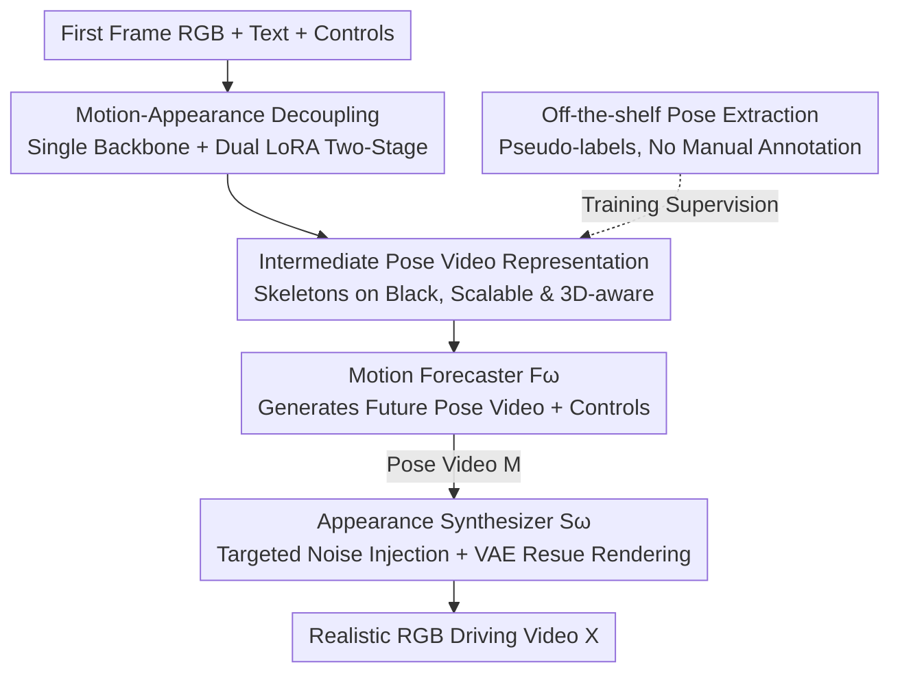

# MAD: Motion Appearance Decoupling for Efficient Driving World Models

**Conference**: CVPR 2026  
**Paper**: [CVF Open Access](https://openaccess.thecvf.com/content/CVPR2026/html/Rahimi_MAD_Motion_Appearance_Decoupling_for_efficient_Driving_World_Models_CVPR_2026_paper.html)  
**Code**: Project Page https://vita-epfl.github.io/MAD-World-Model/  
**Area**: Autonomous Driving  
**Keywords**: Driving World Models, Video Diffusion, Motion-Appearance Decoupling, Efficient LoRA Adaptation, Pose Video

## TL;DR
MAD minimizes the cost of transforming general video diffusion models (VGMs) into driving world models to the extreme: using a single backbone with two lightweight LoRAs, it first generates "pose videos" consisting only of skeletons to predict motion, then "dresses" the skeletons with textures to render RGB. By decoupling motion and appearance, it matches previous SOTA performance using only 6% of the compute required by competitors.

## Background & Motivation

**Background**: Recent video diffusion models (VGMs, such as SVD, LTX) can generate realistic and temporally consistent videos, leading to expectations for their use as world models in autonomous driving—predicting future ego-perspective RGB videos given an initial frame and high-level commands. Adapting general VGMs to the driving domain has proven feasible (VISTA, GEM, ReSim, etc.).

**Limitations of Prior Work**: Such adaptations are prohibitively expensive. VISTA and GEM spent 25,000 and 50,000 GPU hours respectively to fine-tune the SVD backbone; stronger models like Cosmos-Predict are trained from scratch on massive private datasets, creating a compute barrier that excludes most research labs. High adaptation costs prevent the community from quickly benefiting from advancements in general video models.

**Key Challenge**: Driving world models must simultaneously master two deeply coupled difficulties: ① realistic pixel-level **appearance** synthesis, and ② physically/socially plausible multi-agent **dynamics**. While general VGMs excel at visual realism, their physical consistency, multi-object interaction, and causal interaction are often poor (they tend to replicate statistically common motion patterns rather than adapting to perturbed environments). Learning appearance and dynamics together is extremely data- and compute-intensive.

**Goal**: To decouple the joint "appearance + dynamics" problem into two more manageable sub-problems, efficiently adapting any general VGM into a controllable driving world model with minimal supervision.

**Key Insight**: The authors borrow from the professional animator's workflow—animators do not immediately draw realistic final frames. Instead, they first create an *animatic* (a sequence of simple timed sketches) to define rhythm, composition, interaction, and motion, before mechanically rendering lighting and textures. This "dynamics first, appearance later" decoupling is a powerful paradigm.

**Core Idea**: Use a single VGM backbone + two LoRAs to play two steps of the animator's workflow—a Motion Forecaster first generates abstract skeleton pose videos from noise, and an Appearance Synthesizer then renders realistic RGB conditioned on those poses. This is equivalent to a "Chain-of-Thought" approach, generating intermediate reasoning steps (the motion animatic) before the final answer (the rendered video).

## Method

### Overall Architecture
MAD splits the generation process into two sequential stages, sharing the same pre-trained VGM backbone but equipped with separate lightweight LoRAs. The first stage $F_\omega$ (Motion Forecaster) generates future intermediate motion representations $M$ from noise, conditioned on motion-related controls $C_{motion}$ (text, ego-motion, first frame RGB). The second stage $S_\omega$ (Appearance Synthesizer) renders the final realistic video $X$ conditioned on the generated $M$ and appearance controls $C_{appearance}$ (first frame RGB, text).

Two main design principles persist: first, **maximizing the reuse of base model priors**—rather than creating complex condition injection networks, all control signals (intermediate poses, first frame, and a newly proposed ego-motion representation) are projected into the visual latent space the VGM already "understands" using its pre-trained VAE; second, using LoRA for lightweight adaptation instead of full fine-tuning to minimize training overhead.

### Key Designs

**1. Motion-Appearance Decoupling: Single Backbone + Dual LoRA Paradigm**

To address the key challenge where learning appearance and dynamics together explodes data and compute needs, MAD introduces an intermediate motion representation $M$ to split the joint distribution: $N \xrightarrow[C_{motion}]{F_\omega} M$ (generating motion from noise) and $N \xrightarrow[\{M,C_{appearance}\}]{S_\omega} X$ (rendering appearance conditioned on motion). Crucially, these stages **are not trained from scratch**. The authors posit that large-scale general VGMs already implicitly contain knowledge of both dynamics and appearance, so they use LoRA to fine-tune the same pre-trained backbone into two specialists. This "two-step single-model" concept is similar to Chain-of-Thought: the model "reasons" through an intermediate step (the motion animatic) before producing the "answer" (rendered video). Ablations show this is the primary source of quality—MAD-LTX shows overwhelming human preference over a "Fine-tuned LTX" baseline trained end-to-end with equivalent compute (2B: 29 vs 16; 13B: 33 vs 15), proving that decoupling itself, rather than the backbone or data, is the main driver of quality.

**2. Pose Video Intermediate Representation: Scalable, 3D-Aware, and Aligned with VGM Priors**

To find an intermediate representation $M$ that abstracts appearance yet remains understandable to the VGM, the authors define it as "pose video"—a sequence of frames rendering dynamic agents (cars, pedestrians) as skeletons and static elements (lane lines) on a black background, using different colors for categories. Training data uses off-the-shelf pose extractors (OpenPifPaf for cars/lanes, DWPose for humans) as pseudo-labels, requiring no manual annotation. The authors compared three candidates: HDMaps (3D boxes) are too abstract for VGMs to associate with objects, hindering prior transfer and relying on an unscalable perception stack; panoptic segmentation is pixel-accurate but largely 2D, failing to capture 3D orientation and pedestrian details; while pose representation achieves all three—scalability (pseudo-labels from any video), 3D-awareness, and object-centricity, aligning perfectly with VGM priors while simplifying both prediction and synthesis. Replacing it with panoptic segmentation/HDMaps in ablations resulted in a 74%/78% human preference for the full model.

**3. Controllable Motion Conditions + Native VAE Reuse: Speaking the VGM's "Native Language"**

To make the driving world model controllable without adding complex new conditioning networks, the Motion Forecaster is designed as a latent diffusion model conditioned on initial scene states. All control signals are projected into the backbone's native latent space via the pre-trained VAE and concatenated into the DiT. Specifically: ① Pose videos are encoded as latents $z=E_{VAE}(M)$, where the first frame pose $z_0$ remains clean (no noise) and is concatenated; ② Text is injected via cross-attention through T5 encoding; ③ First frame RGB $I_0$, containing critical context like traffic light states, is encoded into $c_{rgb}$ via VAE and concatenated; ④ **Ego-motion control** uses a novel visual representation—rendering an ego-camera view $V_{ego}$ in a synthetic world with a checkerboard-textured static sphere and dust particles. Rotations are inferred from checkerboard visual motion, and translations from dust parallax, then encoded via VAE into $c_{ego}$; ⑤ **Object motion control** extracts 2D boxes and tracks from pose data, randomly selecting up to 5 trajectories to render as a sparse control video $V_{obj}$. This suite uses no new adapter networks, relying entirely on VAE reuse to save data and compute.

**4. Targeted Noise Injection: Bridging the Training-Inference Gap**

A subtle but critical training-inference inconsistency exists: the Appearance Synthesizer $S_\omega$ is trained on clean ground-truth poses $M_{gt}$ from pseudo-labels but must handle predicted poses $M_{pred}$ at inference, which may contain artifacts like blur or warping. During training, the authors actively simulate inference-time imperfections by applying **targeted noise injection** to the pose latents $c_{pose}$: adding Gaussian noise with variance $\omega\sim U(0,0.3)$ in the latent space (as $F_\omega$ is a latent diffusion model, its artifacts are more realistic in latent space than pixel space), specifically to the sparse latent features corresponding to skeletons while keeping the black background latents clean. This forces $S_\omega$ to be robust to structural flaws without damaging the clean background. This strategy showed a 62% human preference in ablations.

### Loss & Training
Both models are initialized from the same base model (SVD or LTX) and fine-tuned via LoRA. Optimizer: AdamW, learning rate $2\times10^{-4}$, batch size 32. Data: OpenDV (1,700 hours of YouTube driving videos), pre-processed to 24fps, $1056\times704$, in 5-second segments (120 frames with 3-second overlap), filtering out the 50% of segments with the fewest objects. 100k training and 5k validation clips were sampled (ensuring no leakage), with text descriptions generated by Qwen2.5-VL-32B based on the first frame. $F_\omega$ was trained for 9,000 steps on 139 hours of data, followed by 5,000 steps for $S_\omega$. Total fine-tuning cost for the LTX version: 128 GPU hours for 2B, 700 GPU hours for 13B (1,500 for SVD), using 32 GH200 GPUs. The authors emphasize a methodological finding: models must be trained in the VGM's "comfort zone" (native resolution and frame rate); downsampling forces the model to learn out-of-distribution motion priors, requiring significantly more data.

## Key Experimental Results

### Main Results
The authors found that FID/FVD correlate poorly with perceptual quality in complex driving scenes; thus, evaluation primarily relied on a large-scale human preference study (100 random scenes, 14 model pairs, A/B choices for "Overall Quality / Motion Realism / Visual Quality"). Core conclusions:

| Comparison | Result | Key Implication |
|------|------|------|
| MAD-SVD vs VISTA | Matches performance with >12× less data (139h vs 1700h) and 16× less compute (1500 vs 25,000 GPU-hr) | Decoupling enables extremely efficient adaptation |
| MAD-SVD vs GEM | Approaches performance with 3% of GEM's compute | As above (GEM used 50,000 GPU-hr) |
| MAD-LTX vs Open-source SOTA (GEM/VISTA/Cosmos-Predict 1) | Significantly preferred at both 2B / 13B scales | Outperforms all previous open-source driving models |
| MAD-LTX vs Fine-tuned LTX (Same compute end-to-end) | 2B: 29 vs 16, 13B: 33 vs 15 preference | Decoupling is the quality driver, not backbone or data |
| MAD-LTX-13B vs Cosmos Predict 2 (14B, Closed-source) | Generation quality nearly on par, with faster inference | Open-source approaches closed-source SOTA |

Open-loop motion planning evaluation (OpenDV, 5s prediction, generating 6 unconditional videos per clip with ego-trajectories extracted via MapAnything; lower minADE6 and higher APD6 are better):

| Model | 2B minADE6 ↓ | 2B APD6 ↑ | 13B minADE6 ↓ | 13B APD6 ↑ |
|------|------|------|------|------|
| Base LTX | 5.42 | 102.96 | 4.14 | 101.46 |
| Fine-tuned LTX | 5.28 | 68.20 | 5.83 | 63.06 |
| **MAD-LTX (Ours)** | **4.88** | 76.21 | **3.64** | 101.45 |

MAD-LTX achieved the lowest minADE6 at both scales and did not collapse in diversity compared to direct fine-tuning.

### Ablation Study
Human preference for MAD-LTX-2B (values = preference rate of full model over variant, higher is better).

| Configuration | Full Model Pref. Rate ↑ | Description |
|------|------|------|
| w/o noise | 62% | Quality drops as training-inference domain gap is not bridged |
| Panoptic Seg. | 74% | 2D representation misses 3D orientation/pedestrian details |
| HDMap | 78% | Too abstract; VGM struggles to associate it; unscalable |

### Key Findings
- **Decoupling is the primary driver of quality**: MAD-LTX overwhelmingly outperforms Fine-tuned LTX under identical compute, providing a convincing apples-to-apples comparison.
- **Direct video fine-tuning triggers memorization/mode collapse**: Fine-tuned LTX 13B had 37.8% lower APD6 than MAD-LTX and 40% worse minADE6. Authors attribute this to diffusion models memorizing in pixel space, whereas MAD predicts in abstract pose space, forcing the model to learn true motion rather than spurious correlations.
- **Pose representation is the optimal choice**: Preference rates (HDMap 78% > Panoptic Seg 74% > No noise 62%) confirm the value of scalable, 3D-aware, object-centric pose representations.
- **Native resolution/frame rate training is essential**: Downsampling raises high data requirements by forcing models to learn out-of-distribution priors.

## Highlights & Insights
- **"Predict Dynamics, then Render Appearance" = Video Chain-of-Thought**: Abstracting the animator's animatic workflow into two-stage generation, with pose video as "reasoning drafts," is an intuitive and transferable paradigm for any "motion+appearance coupled" task.
- **VAE Native Reuse vs. New Conditioning Networks**: Projecting all controls into the backbone's native VAE latent space "speaks its language," saving massive parameter overhead—a key engineering insight for compute efficiency.
- **Checkerboard Spheres + Dust for Ego-motion**: Representing rotation with checkerboard visual motion and translation with dust parallax transforms abstract 3D poses into visual cues understandable by VGMs.
- **Abstract Space Prediction Resists Mode Collapse**: Modeling in pose space stripped of textures forces the learning of underlying motion, avoiding pixel-space memorization and spurious correlations—an unexpected benefit of decoupling.

## Limitations & Future Work
- Evaluation relies heavily on human preference studies, as FID/FVD are unreliable; however, human studies have limited scale and reproducibility.
- The method depends heavily on off-the-shelf pose extractors (OpenPifPaf/DWPose) for pseudo-labels; pose quality is capped by these tools, and skeletons in long-tail or occluded scenes may be unreliable.
- Sequential two-stage inference means running generation twice; motion prediction errors propagate to the appearance synthesizer (though mitigated by targeted noise injection), which may amplify over long horizons.
- Future work: Extending ego/object control to fine-grained interactive editing or exploring joint fine-tuning of both stages to mitigate error propagation.

## Related Work & Insights
- **vs VISTA / GEM**: Both rely on large-scale end-to-end fine-tuning of SVD (25k / 50k GPU-hr) and discard text conditions; MAD-SVD matches them with 6% / 3% of the compute while retaining text control.
- **vs Cosmos-Predict**: Cosmos is trained from scratch on massive private data; open-source MAD-LTX-13B approaches Cosmos Predict 2 quality with a fraction of the compute and faster inference.
- **vs Epona (two-stage driving)**: Epona models ego-motion via a specialized trajectory predictor, but its intermediate representation is limited to the ego-vehicle and misses multi-agent interactions. MAD is (per the authors) the first to fully separate multi-agent motion prediction and appearance synthesis.
- **vs Appearance Editing**: Those methods condition on HD maps/semantic layouts where geometry and motion are "extracted" from real videos rather than "predicted"; MAD's motion is generated.

## Rating
- Novelty: ⭐⭐⭐⭐⭐ Combining the animator's decoupling paradigm + single-backbone dual LoRA + VAE native reuse into an efficient driving world model framework.
- Experimental Thoroughness: ⭐⭐⭐⭐ Solid results across two backbones/scales with human studies and planning, though objective metrics remain a weak point in the field.
- Writing Quality: ⭐⭐⭐⭐⭐ Extremely clear methodology with the animator metaphor and well-documented control signal design.
- Value: ⭐⭐⭐⭐⭐ Reduces driving world model adaptation costs by 1-2 orders of magnitude, providing a significant contribution to the resource-constrained research community while achieving SOTA.

<!-- RELATED:START -->

## Related Papers

- [\[CVPR 2026\] WorldLens: Full-Spectrum Evaluations of Driving World Models in Real World](worldlens_full-spectrum_evaluations_of_driving_world_models_in_real_world.md)
- [\[CVPR 2026\] Deformable Gaussian Occupancy: Decoupling Rigid and Nonrigid Motion with Factorized Distillation](deformable_gaussian_occupancy_decoupling_rigid_and_nonrigid_motion_with_factoriz.md)
- [\[AAAI 2026\] Unlocking Efficient Vehicle Dynamics Modeling via Analytic World Models](../../AAAI2026/autonomous_driving/unlocking_efficient_vehicle_dynamics_modeling_via_analytic_world_models.md)
- [\[CVPR 2026\] DLWM: Dual Latent World Models enable Holistic Gaussian-centric Pre-training in Autonomous Driving](dlwm_dual_latent_world_models_enable_holistic_gaussian-centric_pre-training_in_a.md)
- [\[CVPR 2025\] Spatiotemporal Decoupling for Efficient Vision-Based Occupancy Forecasting](../../CVPR2025/autonomous_driving/spatiotemporal_decoupling_for_efficient_vision-based_occupancy_forecasting.md)

<!-- RELATED:END -->
