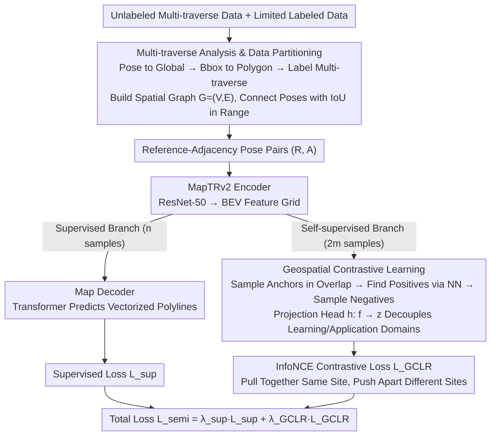

# MapGCLR: Geospatial Contrastive Learning of Representations for Online Vectorized HD Map Construction

**Conference**: CVPR 2026  
**arXiv**: [2603.10688](https://arxiv.org/abs/2603.10688)  
**Code**: None  
**Area**: Autonomous Driving / HD Map Construction  
**Keywords**: Geospatial contrastive learning, Online HD map, Semi-supervised learning, BEV features, Multi-traverse

## TL;DR

Ours proposes MapGCLR, which utilizes contrastive learning by enforcing consistency of BEV features in overlapping geospatial regions. Using a semi-supervised framework with limited labeled data and large-scale unlabeled multi-traverse data, it achieves a relative performance improvement of 13%-42% in online vectorized HD map construction tasks.

## Background & Motivation

**Background**: Online HD map construction has become a scalable alternative to offline HD maps in autonomous driving. Methods such as MapTR, MapTRv2, and MapTracker predict vectorized map elements (lane lines, road boundaries, etc.) in real-time from 360° visual inputs. However, these supervised learning methods still rely on massive amounts of labeled data.

**Limitations of Prior Work**: (1) HD map labeling is extremely expensive, requiring professional sensors and manual annotation; (2) Existing semi-supervised methods (e.g., PseudoMapTrainer, Lilja) rely on pseudo-labels and are primarily designed for semantic segmentation paradigms rather than vectorized prediction; (3) Current approaches do not fully utilize the geospatial consistency information inherent in multi-traverse data.

**Key Challenge**: Labeled data is the primary bottleneck for online HD map construction, while autonomous vehicles generate vast amounts of unlabeled data by passing through the same road segments multiple times during daily operation—how can this free multi-traverse data be utilized?

**Goal**: Leverage geospatial consistency within unlabeled multi-traverse data under limited labeling conditions to improve the quality of BEV feature representations, thereby enhancing online vectorized HD map construction performance.

**Key Insight**: Treat BEV grid cells in geospatial overlapping regions from different traversals as "natural augmentations," enforcing feature consistency of these corresponding cells through contrastive learning.

**Core Idea**: BEV features of the same location across different traversals should be similar—contrastive learning is performed using this constraint.

## Method

### Overall Architecture

The semi-supervised training pipeline consists of two data streams: (1) **Supervised branch**: A small amount of labeled data passes through the full MapTRv2 encoder-decoder pipeline to calculate the supervised loss $\mathcal{L}_{sup}$; (2) **Self-supervised branch**: A large volume of unlabeled multi-traverse data passes only through the encoder to generate BEV feature grids, which are trained using the geospatial contrastive loss $\mathcal{L}_{GCLR}$. A batch contains $n$ supervised samples and $2m$ self-supervised samples ($m$ reference-adjacency pairs).

### Key Designs

**1. Multi-traverse Analysis & Data Partitioning: Automatically mining "different visits to the same location" from raw trajectories**

The prerequisite for contrastive learning is identifying which BEV grids actually observe the same location. First, the dataset is systematically partitioned. All poses are converted to a global reference frame and partitioned by city. For each traversal, the bounding box of each pose is calculated based on vehicle heading and perception range ($\pm x$ lateral, $\pm y$ longitudinal) and merged into polygons. Overlapping polygons from different traversals are labeled as "multi-traverse." A spatial graph $G=(V,E)$ is constructed where vertices are poses and edges connect pose pairs whose perception grid IoU falls within the $[\text{IoU}_{min}, \text{IoU}_{max}]$ interval. This range ensures that the two visits are sufficiently related yet distinct enough to facilitate learning.

**2. Geospatial Contrastive Learning: Treating "multi-traverse visits" as natural data augmentation**

While SimCLR relies on manual image augmentations to create positive pairs, this method replaces artificial augmentation with real-world geospatial correspondence. Given BEV grids $B_{SSL,R}$ and $B_{SSL,A}$ from a reference pose $R$ and an adjacency pose $A$, both are transformed to the global coordinate system. Positive samples are formed by randomly sampling a BEV cell $c_a$ as an anchor in the reference grid overlap and using nearest neighbor search in the adjacency grid to retrieve cell $c_p$ at the same geospatial location. Negative samples are randomly sampled from both grids (excluding the anchor and positive samples). Features $\mathbf{f}$ are mapped to a contrastive space $\mathbf{z} \in \mathcal{Z}$ via a projection head $h$ before contrastive learning to decouple the learning domain from the downstream application domain.

**3. InfoNCE Contrastive Loss: Pulling together same-location embeddings, pushing apart different ones**

Once positive and negative samples are established, the constraint is formulated using the InfoNCE loss: $\mathcal{L}_{GCLR} = -\log \frac{\exp(\text{sim}(\mathbf{z}_i, \mathbf{z}_i^+) / \tau)}{\exp(\text{sim}(\mathbf{z}_i, \mathbf{z}_i^+) / \tau) + \sum_{k=1}^K \exp(\text{sim}(\mathbf{z}_i, \mathbf{z}_k^-) / \tau)}$, where $\text{sim}(\cdot, \cdot)$ is cosine similarity and $\tau$ is the temperature. This encourages BEV cell embeddings of the same geospatial location across traversals to be similar while pushing different locations apart, effectively embedding the prior that "multiple observations of the same location should be consistent" into the representation.

### Loss & Training

The total loss is a weighted combination of the supervised loss and the contrastive loss: $\mathcal{L}_{semi} = \lambda_{sup} \mathcal{L}_{sup} + \lambda_{GCLR} \mathcal{L}_{GCLR}$. Weighting factors perform normalization and control relative influence. The architecture is based on MapTRv2 using a ResNet-50 backbone to extract image features and transform them into BEV representations, with a Transformer decoder predicting map elements as polylines. Training is single-stage, with labeled and unlabeled data mixed within the same batch.

## Key Experimental Results

### Main Results

| Labeled Data Ratio | SSL | AP_dsh | AP_sol | AP_bou | AP_cen | AP_ped | mAP | Absolute Gain | Relative Gain |
|-------------|-----|--------|--------|--------|--------|--------|-----|---------|---------|
| 2.5% | ✗ | 4.3 | 5.0 | 9.6 | 11.9 | 1.5 | 6.5 | — | — |
| 2.5% | ✓ | 5.2 | 6.7 | 12.2 | 17.0 | 1.6 | **8.5** | +2.0 | **+31%** |
| 5% | ✗ | 10.3 | 9.5 | 20.5 | 19.1 | 7.3 | 13.3 | — | — |
| 5% | ✓ | 15.4 | 18.7 | 24.8 | 25.4 | 9.9 | **18.9** | +5.6 | **+42%** |
| 10% | ✗ | 17.6 | 20.9 | 31.9 | 27.1 | 12.4 | 22.0 | — | — |
| 10% | ✓ | 20.8 | 30.5 | 34.5 | 32.4 | 18.2 | **27.3** | +5.3 | **+24%** |
| 20% | ✗ | 27.2 | 32.1 | 38.9 | 34.7 | 22.3 | 31.0 | — | — |
| 20% | ✓ | 31.2 | 38.8 | 39.9 | 37.5 | 26.9 | **34.9** | +3.9 | **+13%** |

> On the Argoverse 2 dataset, SSL consistently brings improvements across all labeled ratios. Gains are more significant with fewer labels: at 5%, the relative gain is 42%, equivalent to nearly doubling the amount of labeled data.

### Ablation Study

| Supervised-only Data Ratio | mAP |
|-------------|-----|
| 2.5% | 6.5 |
| 5% | 13.3 |
| 5% + SSL | **18.9** |
| 10% | 22.0 |
| 10% + SSL | **27.3** |
| 20% | 31.0 |
| 30% | 36.6 |
| 40% | 39.8 |

> 5% + SSL (18.9) is close to 10% purely supervised (22.0), and 10% + SSL (27.3) is close to 20% purely supervised (31.0). The effect of SSL is approximately equal to doubling the volume of labeled training data.

### Key Findings

- Qualitative PCA visualization shows that the BEV feature space of the semi-supervised method exhibits clearer semantic separation, particularly between road boundaries and ego-lanes.
- Purely supervised baselines exhibit abnormal feature clusters at fixed BEV grid positions (unrelated to geospatial locations); geospatial contrastive learning eliminates these artifacts.
- Most traversals in Argoverse 2 have multiple overlaps, making it naturally suitable for this method.
- The lower the labeling ratio, the higher the relative gain (42% at 5% vs. 13% at 20%), proving the method's value in data-scarce scenarios.

## Highlights & Insights

- **Discovery of Natural Augmentation**: The core insight is treating geospatial overlap in multi-traverse data as "natural data augmentation"—real-world repeat driving is the best augmentation, requiring no manual design.
- **Simple and Effective**: The method is a straightforward extension of SimCLR-style contrastive learning, adding no complex modules while achieving significant results.
- **Dataset Analysis Tool**: The multi-traverse analysis and spatial graph construction provide valuable tools applicable to any multi-traverse autonomous driving research.
- **Compatibility with Vectorized Methods**: Unlike existing semi-supervised methods that only apply to the semantic segmentation paradigm, MapGCLR is the first to achieve semi-supervised learning for vectorized map construction.

## Limitations & Future Work

- Validated only on the MapTRv2 single-frame architecture; not yet integrated into stronger baselines with temporal memory like MapTracker or StreamMapNet.
- Did not explore the comparison between multi-stage training (self-supervised pre-training followed by fine-tuning) and the current single-stage training.
- The projection head design is relatively simple (single layer); more complex structures might further improve performance.
- The method requires multi-traverse coverage, which may be lacking in newly developed areas or infrequently traveled segments.
- Did not account for dynamic changes at the same location over time (e.g., construction, seasonal changes) affecting feature consistency.

## Related Work & Insights

- **SimCLR**: Classical contrastive learning framework; MapGCLR extends "augmentation" from image transformations to geospatial overlaps.
- **MapTRv2**: The standard method for vectorized HD map construction; ours adds an SSL branch on this basis.
- **HRMapNet / RTMap**: Utilize multi-traverse data as global map priors, but introduce additional complexity during inference; MapGCLR utilizes multi-traverse data only during training.
- **Insights**: The geospatial contrastive learning concept can be extended to other BEV tasks such as 3D detection and occupancy prediction—features from multiple observations of the same location should remain consistent.

## Rating

- Novelty: ⭐⭐⭐⭐ Geospatial contrastive learning is a concise and effective new idea.
- Technical Depth: ⭐⭐⭐ The method is relatively simple; main contributions lie in problem definition and system design.
- Experimental Thoroughness: ⭐⭐⭐⭐ Systematic experiments across multiple labeling ratios + qualitative PCA analysis.
- Writing Quality: ⭐⭐⭐⭐ Clear logic with accurate tables and figures.
- Value: ⭐⭐⭐⭐⭐ Directly addresses the industrial pain point of high HD map labeling costs.

<!-- RELATED:START -->

## Related Papers

- [\[CVPR 2026\] AMap: Distilling Future Priors for Ahead-Aware Online HD Map Construction](amap_distilling_future_priors_for_ahead-aware_online_hd_map_construction.md)
- [\[CVPR 2026\] OptiMVMap: Offline Vectorized Map Construction via Optimal Multi-vehicle Perspectives](optimvmap_offline_vectorized_map_construction_via_optimal_multi-vehicle_perspect.md)
- [\[CVPR 2026\] EMDUL: Expanding mmWave Datasets for Human Pose Estimation with Unlabeled Data and LiDAR Datasets](expanding_mmwave_datasets_for_human_pose_estimation_with_unlabeled_data_and_lida.md)
- [\[CVPR 2026\] TACO: Task-Aware Contrastive Learning for Joint LiDAR Localization and 3D Object Detection](taco_task-aware_contrastive_learning_for_joint_lidar_localization_and_3d_object_.md)
- [\[CVPR 2026\] Failure Modes for Deep Learning-Based Online Mapping: How to Measure and Address Them](failure_modes_for_deep_learning-based_online_mapping_how_to_measure_and_address_.md)

<!-- RELATED:END -->
