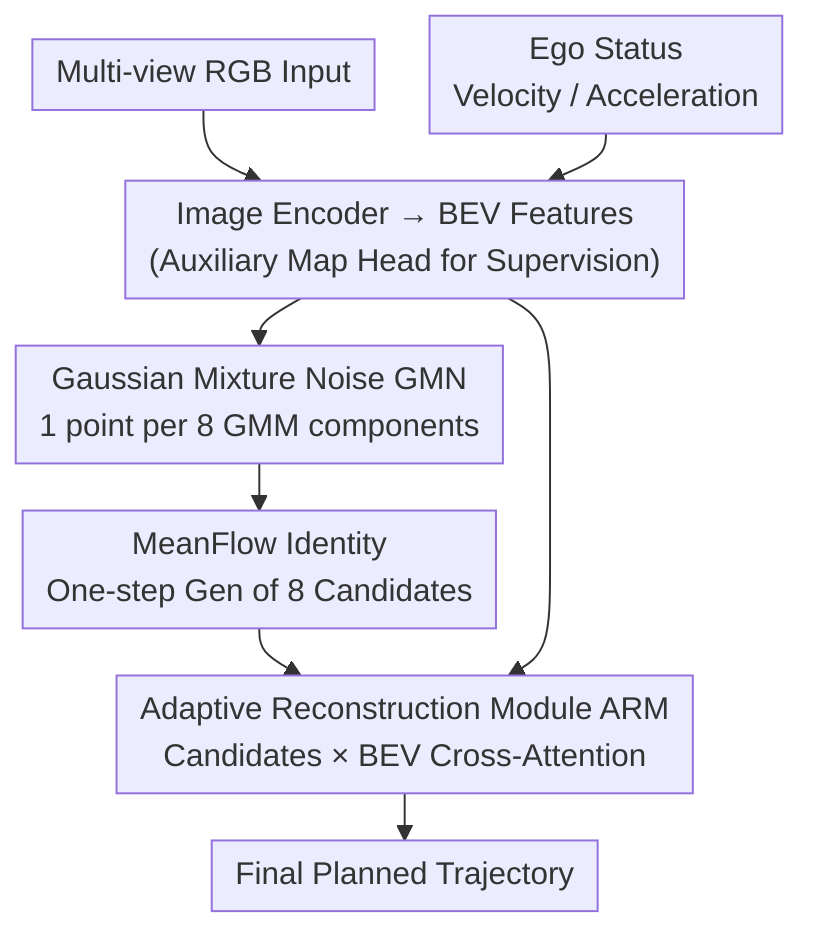

# MeanFuser: Fast One-Step Multi-Modal Trajectory Generation and Adaptive Reconstruction via MeanFlow for End-to-End Autonomous Driving

**Conference**: CVPR 2026  
**arXiv**: [2602.20060](https://arxiv.org/abs/2602.20060)  
**Code**: [https://github.com/wjl2244/MeanFuser](https://github.com/wjl2244/MeanFuser)  
**Area**: Autonomous Driving  
**Keywords**: End-to-End Planning, MeanFlow, Gaussian Mixture Noise, One-Step Sampling, Adaptive Trajectory Reconstruction

## TL;DR
The MeanFuser end-to-end autonomous driving framework is proposed. It uses Gaussian Mixture Noise (GMN) to replace discrete trajectory vocabularies for continuous multi-modal trajectory modeling. By leveraging MeanFlow Identity, it achieves error-free one-step sampling, and an Adaptive Reconstruction Module (ARM) is designed to implicitly decide between selecting existing proposals or reconstructing new trajectories. Using only RGB input and a ResNet-34 backbone, it achieves 89.0 PDMS at 59 FPS on NAVSIM.

## Background & Motivation

**Background**: End-to-end autonomous driving learns planning trajectories directly from sensor inputs. While frameworks like TransFuser, UniAD, and VAD perform well in single-modal scenarios, they struggle to capture the multi-modal nature of driving. Recent works like VADv2 and Hydra-MDP introduce trajectory vocabularies to predict probability distributions, but fixed vocabularies involve trade-offs between efficiency and robustness. DiffusionDrive and GoalFlow introduce generative models to trajectory planning, but the former requires multi-step sampling, and the latter relies on discrete anchors.

**Limitations of Prior Work**: (1) **Inherent constraints of discrete anchor vocabularies**—the vocabulary must be large enough to cover the trajectory distribution at test time, but large vocabularies slow down inference. When test scenarios fall outside the predefined anchor distribution, all proposals deviate from the optimal path; (2) **Computational overhead of multi-step sampling**—flow matching requires multiple ODE solver steps (e.g., 5 steps for GoalFlow) to reach optimal performance, and ODE solvers introduce numerical errors that cause curved sampling paths; (3) **Mode collapse in standard Gaussian noise**—vanilla methods sampling from standard Gaussian lead to insufficient trajectory diversity.

**Key Challenge**: How to effectively model multi-modal driving behavior without relying on fixed discrete vocabularies while maintaining high inference efficiency?

**Goal**: (1) Eliminate dependence on discrete trajectory vocabularies; (2) Achieve high-quality one-step sampling; (3) Handle cases where all sampled proposals are suboptimal.

**Key Insight**: Introduce MeanFlow Identity to end-to-end planning—MeanFlow directly models the average velocity field between the noise distribution and the trajectory distribution rather than the instantaneous velocity field, making one-step sampling precise and error-free. Meanwhile, use a Gaussian Mixture Model (GMM) as the prior distribution, where each Gaussian component captures a specific driving mode.

**Core Idea**: Replace anchors with Gaussian Mixture Noise (GMN), replace multi-step ODEs with MeanFlow, and replace score-based selection with an Adaptive Reconstruction Module (ARM). This three-pronged approach achieves fast and robust multi-modal trajectory planning.

## Method

### Overall Architecture
MeanFuser addresses the question: how to generate multi-modal driving trajectories quickly and stably without discrete vocabularies or multi-step sampling? It decomposes the process into a three-stage pipeline. First, scene encoding—an image encoder compresses multi-view RGB into Bird’s-Eye-View (BEV) features, while a vehicle state encoder extracts ego-velocity/acceleration, with an auxiliary map decoding head providing semantic supervision for convergence. Next, trajectory sampling—instead of standard Gaussian noise, it samples one noise point from each of the 8 components of a Gaussian Mixture Model (GMM) pre-clustered from expert trajectories. These are fed into a lightweight MeanFlow network to generate 8 candidate trajectories in **one step**. Finally, the Adaptive Reconstruction Module (ARM) performs cross-attention between these 8 candidates and the BEV features to output the final planned trajectory. The core novelty lies in the latter two stages: the source of noise (GMN), the one-step transformation (MeanFlow), and the synthesis of candidates (ARM).

### Key Designs

**1. Gaussian Mixture Noise (GMN): Replacing Discrete Vocabularies with Continuous Distributions**

Methods like VADv2 and Hydra-MDP rely on fixed trajectory vocabularies to express multi-modality. Small vocabularies lack coverage, while large ones drag down inference. GMN shifts the "prior" from discrete anchors to continuous distributions without losing the driving mode information encoded in anchors. Specifically, all expert trajectories in the training set are normalized (calculating stepwise differences $\Delta\tau_j$ and scaling by global mean/max), then clustered into $K=8$ groups using K-means. Each group's mean and standard deviation parameterize a Gaussian component, forming the sampling prior:

$$p_0 = \sum_{k=1}^{K} \pi_k\, \mathcal{N}(\mu_k,\, \sigma_k^{2} I).$$

During inference, one point is sampled from each component to generate 8 trajectories in parallel. During training, only the component closest to the ground truth is used for loss calculation. This allows the cluster centers to retain "typical driving mode" priors while the variance allows for continuous exploration, filling the gaps left by discrete anchors. Interestingly, different components naturally correspond to different driving styles (speeds from conservative 3.45 m/s to aggressive 9.11 m/s), providing an interface for personalized driving at zero cost.

**2. MeanFlow Identity for End-to-End Planning: Precise One-Step Sampling**

Flow-based planning is slow because traditional flow matching learns the instantaneous velocity field $v_\theta(z_t, t)$. Even with a linear probability path, the learned velocity field does not guarantee straight sampling trajectories, necessitating multi-step ODE solving (GoalFlow requires 5 steps), which introduces numerical errors. MeanFlow shifts the learning target to the **average velocity field** over a time interval:

$$u(z_t, r, t) = \frac{1}{t-r}\int_r^t v(z_\tau, \tau)\, d\tau.$$

Its training objective is derived from the MeanFlow Identity $u_{\text{tgt}} = v(z_t,t) - (t-r)\big(v(z_t,t)\partial_z u_\theta + \partial_t u_\theta\big)$ (with stop-gradient applied to the right side). Implementation utilizes `torch.autograd.functional.jvp` to calculate this Jacobian-vector product efficiently. Once the average velocity field is learned, inference reduces to a single addition: $x_1 = x_0 + 1\cdot u_\theta(x_0, 0, 1)$, jumping from noise to trajectory in one step without numerical error. This transfers the "multi-step sampling" complexity to training, boosting the planning module from 11 FPS (GoalFlow) to 434 FPS (~39.45× speedup), making flow-based methods competitive with direct MLP regression for the first time.

**3. Adaptive Reconstruction Module (ARM): Reconstructing Instead of Just Selecting**

While the previous steps provide 8 multi-modal candidates, what if all 8 are suboptimal in tricky scenarios? Hydra-MDP and WoTE use scoring to select the best one, but scoring depends on benchmark-specific rules, and picking the "best of a bad bunch" still yields poor results. ARM bypasses scoring: it encodes the candidate set $\{\hat{\tau}_k\}_{k=1}^{K}$, performs cross-attention with BEV scene features $c_{\text{bev}}$, and passes the result through a projector to output the final trajectory $\hat{\tau}$. It is supervised solely by the expert trajectory L1 loss $\mathcal{L}_\tau = \|\tau - \hat{\tau}\|_1$. The attention weights implicitly learn to "select or reconstruct"—concentrating on a single candidate if it is good (equivalence to selection) or spreading across multiple candidates to synthesize a new, superior trajectory. Ablations show that "simple averaging of 8 candidates" causes PDMS to drop by 17.8 points, proving that the 8 candidates capture distinct modes rather than collapsing, and that ARM's selective fusion is essential.

### Loss & Training
$\mathcal{L} = \lambda_1 \mathcal{L}_\tau + \lambda_2 \mathcal{L}_{\text{flow}} + \lambda_3 \mathcal{L}_{\text{map}}$, where both flow loss and ARM reconstruction loss use L1 loss, supported by semantic map decoding supervision to accelerate convergence. The AdamW optimizer is used with weight decay 0.1, a cosine annealing learning rate of $2\times10^{-4}$, and a 3-epoch warmup. The hidden dimension is 128 (only 54.6M parameters), with 8 GMN components sampled individually for a total of 8 trajectories.

## Key Experimental Results

### Main Results

| Method | Input | PDMS↑(v1) | EPDMS↑(v2) | Plan FPS↑ | FPS↑ |
|--------|------|------|----------|------|------|
| TransFuser | C&L | 84.0 | 76.7 | 3934 | 63 |
| GoalFlow | C&L | 85.7 | - | 11 | 10 |
| Hydra-MDP | C&L | 86.5 | 81.4 | 25 | 20 |
| DiffusionDrive | C&L | 88.1 | 88.3 | 75 | 39 |
| WoTE | C&L | 88.3 | - | - | - |
| **MeanFuser** | **C only** | **89.0** | **89.5** | **434** | **59** |

Note: MeanFuser exceeds all multi-modal (C&L) methods using only RGB camera input (no LiDAR). At 54.6M, it has the smallest parameter count among these methods.

### Ablation Study

| Configuration | PDMS↑ | N_proposals | P_{L2>0.5}↓ | N_{DAC=0}↓ |
|------|---------|------|------|------|
| DiffusionDrive | 88.1 | 20 | 20.0% | 84 |
| TransFuser(base) | 84.0 | - | - | - |
| + vanilla MeanFlow(ℳ₀) | 87.3(+3.3) | 16 | 40.6% | 143 |
| + GMN(ℳ₁) | 88.2(+0.9) | 16 | 18.5% | 58 |
| + ARM(ℳ₂=MeanFuser) | **89.0(+0.8)** | 17 | 16.9% | 48 |
| + Simple Average(ℳ₃) | 71.2(-17.8) | 17 | 18.0% | 57 |

### Key Findings
- **MeanFlow accounts for the largest Gain (+3.3 PDMS)**: Replacing the MLP with a conditional MeanFlow decoder yields significant improvements, validating flow-based modeling for trajectory distributions.
- **GMN significantly reduces DAC=0 cases**: ℳ₀ has 143 scenarios where all proposals exit the drivable area; with GMN, this drops to 58 (fewer than DiffusionDrive's 84), showing GMN's coverage far exceeds standard Gaussian or discrete anchors.
- **Simple averaging causes catastrophic failure (-17.8 PDMS)**: This proves that sampled trajectories capture distinct modes rather than collapsing to a single mode. ARM’s "implicit selection/reconstruction" is necessary.
- **ARM further reduces DAC=0 from 58 to 48**: This demonstrates ARM's ability to reconstruct better trajectories when all initial proposals are poor.
- **Vision-only outperforms multi-modal**: MeanFuser without LiDAR beats all Camera+LiDAR methods, suggesting that perception is not the bottleneck, but planning strategy is.
- **Gaussian components correspond to driving styles**: Speeds range from 3.45m/s to 9.11m/s, providing a zero-cost interface for personalized driving control.

## Highlights & Insights
- **The GMN design is highly ingenious**—by clustering training trajectories and fitting GMMs, it retains the "mode prior" advantage of anchor-based methods (each Gaussian center represents a typical mode) while overcoming the "coverage gap" of discrete anchors via the variance. This concept is transferable to any multi-modal action generation task, such as robot manipulation.
- **First application of MeanFlow Identity to planning** eliminates two major flow matching pain points: slow multi-step sampling and numerical error. Boosting Plan FPS from 11 to 434 (39x) allows flow-based methods to compete with direct regression for real-time applications.
- **The "Reconstruct if you can't Select" design of ARM** addresses a long-ignored problem: what to do when all candidates are poor? Traditional selectors only pick the "least bad," while ARM can synthesize a new trajectory by pooling strengths across proposals.

## Limitations & Future Work
- The number of GMN components $K=8$ and mixing coefficients $\pi_k=1$ are predefined. Adaptive Determination of $K$ and scene-context-aware mixture coefficients could yield further gains.
- ARM performs selection/reconstruction implicitly through cross-attention, lacking explainability regarding whether it "selected" or "reconstructed."
- Evaluation is limited to NAVSIM (non-reactive simulation). Performance in reactive simulations (e.g., nuPlan) and real-world vehicles remains to be verified.
- Planning is limited to a 4-second horizon (8 waypoints); applicability to long-term planning needs further exploration.

## Related Work & Insights
- **vs GoalFlow**: GoalFlow uses flow matching with goal guidance but requires 5 steps and discrete goal prediction; MeanFuser uses MeanFlow for one-step sampling with continuous GMN priors, achieving 3.3 higher PDMS and 39.45x faster Plan FPS.
- **vs DiffusionDrive**: DiffusionDrive uses diffusion with clustered trajectory prototypes; MeanFuser uses MeanFlow+GMN for one-step generation, achieving 0.9 higher PDMS and 1.55x speedup.
- **vs Hydra-MDP**: Hydra-MDP uses discrete vocabularies and probability prediction; MeanFuser replaces this with continuous GMN, resulting in better performance (+2.5 PDMS) and faster inference (2.65x).
- **vs WoTE**: WoTE uses world models to evaluate candidates (relying on benchmark sub-metrics); MeanFuser uses ARM to replace evaluation, removing dependence on benchmark rules.

## Rating
- Novelty: ⭐⭐⭐⭐⭐ First to introduce MeanFlow to end-to-end planning with GMN continuous priors and ARM reconstruction.
- Experimental Thoroughness: ⭐⭐⭐⭐ Comprehensive evaluation on NAVSIM v1/v2 with solid ablations, though missing more complex benchmarks like nuPlan.
- Writing Quality: ⭐⭐⭐⭐ Clear technical details and intuitive diagrams.
- Value: ⭐⭐⭐⭐⭐ Solves the efficiency bottleneck of flow-based planning; GMN and ARM designs are highly generalizable.

<!-- RELATED:START -->

## Related Papers

- [\[CVPR 2026\] ResAD: Normalized Residual Trajectory Modeling for End-to-End Autonomous Driving](resad_normalized_residual_trajectory_modeling_for_end-to-end_autonomous_driving.md)
- [\[CVPR 2026\] Scaling-Aware Data Selection for End-to-End Autonomous Driving Systems](scaling-aware_data_selection_for_end-to-end_autonomous_driving_systems.md)
- [\[CVPR 2026\] ActiveAD: Planning-Oriented Active Learning for End-to-End Autonomous Driving](activead_planning-oriented_active_learning_for_end-to-end_autonomous_driving.md)
- [\[CVPR 2026\] GuideFlow: Constraint-Guided Flow Matching for Planning in End-to-End Autonomous Driving](guideflow_constraint-guided_flow_matching_for_planning_in_end-to-end_autonomous_.md)
- [\[CVPR 2026\] DriveMoE: Mixture-of-Experts for Vision-Language-Action Model in End-to-End Autonomous Driving](drivemoe_mixture-of-experts_for_vision-language-action_model_in_end-to-end_auton.md)

<!-- RELATED:END -->
