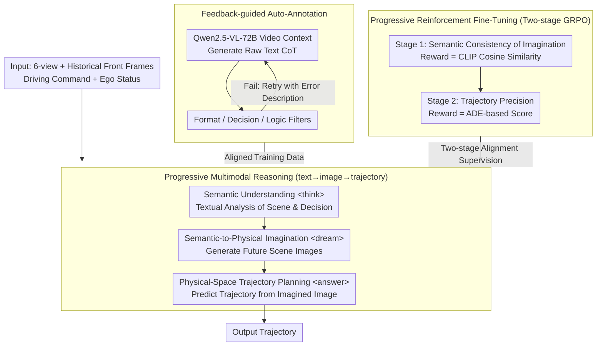

# MindDriver: Introducing Progressive Multimodal Reasoning for Autonomous Driving

**Conference**: CVPR 2026  
**arXiv**: [2602.21952](https://arxiv.org/abs/2602.21952)  
**Code**: [https://github.com/hotdogcheesewhite/MindDriver](https://github.com/hotdogcheesewhite/MindDriver)  
**Area**: Autonomous Driving  
**Keywords**: Multimodal Reasoning, Chain-of-Thought, VLM Autonomous Driving, Progressive Reasoning, Reinforcement Fine-Tuning

## TL;DR
MindDriver introduces a progressive multimodal reasoning framework that mimics the human "Perception → Imagination → Action" mechanism. It executes textual semantic understanding first, followed by imagining future scene images (bridging semantic and physical spaces), and finally predicting trajectories. Combined with a feedback-guided data annotation pipeline and progressive reinforcement fine-tuning, it achieves state-of-the-art performance in both nuScenes open-loop and Bench2Drive closed-loop evaluations.

## Background & Motivation

**Background**: VLMs are increasingly utilized for end-to-end autonomous driving—predicting trajectories directly from raw sensor data. Chain-of-Thought (CoT) reasoning has been introduced to enhance scene reasoning and interpretability.

**Limitations of Prior Work**: (a) Textual CoT reasons in semantic space and then directly predicts physical trajectories, leading to **spatial misalignment** due to the massive gap between semantic concepts and coordinate spaces; (b) Recent efforts using future images as CoTs instead of text (e.g., FSDrive) lack planning-oriented goal guidance, causing the model to lose focus on critical objects and fail to utilize driving knowledge from large-scale LLM pre-training.

**Key Challenge**: A **bridge for alignment** between semantic reasoning (leveraging LLM pre-training) and physical trajectory prediction is required—one that utilizes semantic knowledge while connecting to the physical environment.

**Goal**: Design a progressive and smooth reasoning path from semantics to physics; address the lack of training data and insufficient alignment in multimodal reasoning.

**Key Insight**: The human "Perception-Imagination-Action" mental model—understanding the scene (semantics), imagining future changes (images), and planning actions based on that imagination (trajectory).

**Core Idea**: Use textual reasoning to guide future scene image generation, then use the imagined images to guide trajectory prediction, achieving a progressive alignment of text → image → trajectory.

## Method

### Overall Architecture
MindDriver takes six-view surround camera images, historical front-view frames, driving commands, and ego-vehicle status as inputs. It performs three-stage progressive reasoning through a unified text-reasoning + vision-generation model: (1) Semantic Understanding (textual analysis of scene and decision-making) → (2) Semantic-to-Physical Imagination (generating future scene images based on text) → (3) Physical-Space Trajectory Planning (predicting trajectories based on imagined images). This is supported by a feedback-guided automatic data annotation pipeline and progressive reinforcement fine-tuning (RFT) to generate aligned data and optimize cross-modal alignment segmentally.

### Key Designs

**1. Progressive Multimodal Reasoning: Stitching Semantics and Physics via Images**

Jumping directly from textual reasoning to coordinates creates a massive gap. While LLMs excel at semantic reasoning (e.g., "pedestrian ahead, decelerate"), translating this directly into meter-level coordinates often results in misaligned decisions. MindDriver decomposes this into a text → image → trajectory sequence, using specific tokens within a single autoregressive sequence: `<think>` for text analysis, `<dream>` for imagined future images, and `<answer>` for the final trajectory. Images serve as the ideal intermediate because they carry both semantics (object identity) and physics (spatial position). To enable the model to output both modes, the authors integrate VQ-VAE visual codebooks into the LLM vocabulary. Both modes share the same prediction head and target $\mathcal{L} = -\sum_i \log P_\theta(y_i \mid y_{<i})$, making "imagination" simply the generation of visual tokens.

**2. Feedback-guided Automatic Data Annotation: Self-Correcting Annotation Chains**

There is no off-the-shelf data for text → image → trajectory chains. MindDriver builds an automated pipeline: Qwen2.5-VL-72B generates raw CoTs based on **video context** (multiple frames) to capture motion trends. These are passed through three filters: format (structural integrity), decision (comparison with GT-derived decisions), and logic (using a stronger Qwen3-235B to evaluate reasoning). Critically, failed samples are not discarded but sent back for re-annotation with specific error feedback (e.g., format errors or logical inconsistencies), allowing data quality to converge over multiple rounds.

**3. Progressive Reinforcement Fine-Tuning: Segmented Alignment Optimization**

Standard SFT treats all tokens equally, which often leads to the model prioritizing fluent text at the expense of crucial text → image or image → trajectory alignments. MindDriver uses GRPO for two-stage RFT. Stage 1 (Dream Semantically Consistent Image) optimizes the transition from text to image using a reward based on semantic consistency between the dream and ground truth (GT) images:

$$r_{Img} = \text{CosSim}\big(E_{CLIP}(I_{dream}),\, E_{CLIP}(I_{GT})\big)$$

Stage 2 (Predict Precise Trajectory) then optimizes the link from the imagined image to the trajectory using a reward based on geometric precision (Average Displacement Error, ADE):

$$r_{L2} = (\lambda - ADE) / \alpha$$

By stabilizing semantic alignment before perfecting trajectory precision, the model avoids conflicting optimization objectives.

### Loss & Training
- **SFT Stage**: LR 1e-4, batch 32, 12 epochs (nuScenes) / 6 epochs (Bench2Drive)
- **RFT Stage**: LR 3e-6, batch 16, Stage 1: 700 steps + Stage 2: 500 steps
- **Base Model**: Qwen2.5-VL-3B + MoVQGAN detokenizer
- **Hardware**: 16x Nvidia H20

## Key Experimental Results

### Main Results (nuScenes Open-loop, with ego status)

| Method | L2 Avg↓ (ST-P3) | CR Avg↓ (ST-P3) | L2 Avg↓ (UniAD) | CR Avg↓ (UniAD) |
|------|-----------------|-----------------|-----------------|-----------------|
| VAD (ICCV23) | 0.37 | 0.33 | - | - |
| BEV-Planner (CVPR24) | 0.35 | 0.34 | - | - |
| FSDrive (NeurIPS25) | 0.35 | 0.14 | 0.67 | 0.32 |
| AutoVLA (NeurIPS25) | 0.48 | 0.13 | 0.86 | 0.35 |
| **MindDriver** | **0.33** | **0.12** | **0.65** | **0.20** |

### Main Results (Bench2Drive Closed-loop)

| Method | DS↑ | SR(%)↑ | Effi↑ | Comf↑ |
|------|-----|--------|-------|-------|
| UniAD-Base (CVPR23) | 45.81 | 16.36 | 129.21 | 43.58 |
| ReasonPlan (CoRL25) | 64.01 | 34.55 | 180.64 | 25.63 |
| AutoVLA (NeurIPS25) | 78.84 | 57.73 | 146.93 | 39.33 |
| **MindDriver** | **65.48** | **39.55** | **143.21** | **34.63** |

### Future Frame Generation

| Method | FID↓ |
|------|------|
| Drive-WM (CVPR24) | 15.8 |
| GEM (CVPR25) | 10.5 |
| FSDrive (NeurIPS25) | 10.1 |
| **MindDriver** | **9.4** |

### Key Findings
- **Open-loop Leadership**: MindDriver's collision rate (0.20% UniAD metric) is significantly lower than FSDrive (0.32%) and AutoVLA (0.35%), proving that progressive reasoning improves safety.
- **Competitive Closed-loop**: DS 65.48 vs. AutoVLA 78.84. Note that AutoVLA uses different training conditions.
- **Best Image Quality**: FID of 9.4 vs. FSDrive's 10.1 confirms that textual guidance enhances future scene generation.
- **Robustness Without Ego Status**: In information-constrained settings, MindDriver maintains a stronger lead (L2 0.53 vs. FSDrive 0.55).

## Highlights & Insights
- **"Perception-Imagination-Action" Cognition**: Formalizes the human mental model into a trainable multimodal reasoning chain.
- **Image as a Bridge**: Images naturally merge semantic information (understanding) with physical information (spatial positioning).
- **Progressive RFT**: Two-stage rewards (CLIP-based semantic vs. L2-based geometric) are more effective than end-to-end weighted losses.
- **Video-Context CoT**: Using multiple frames captures temporal dynamics more accurately than static-frame reasoning.

## Limitations & Future Work
- **Closed-loop Gap**: Behind AutoVLA in DS, likely due to higher inference latency from progressive steps.
- **Inference Overhead**: Generating images at each step adds computational cost.
- **Cascading Errors**: Dependency on imagination quality—incorrect "dreams" could mislead trajectories.
- **Scale**: Only tested on a 3B model; the impact of scaling to larger VLMs remains unexplored.
- **Future Directions**: Lightweight image generation (e.g., region-specific masks) and multi-step future forecasting.

## Related Work & Insights
- **vs. FSDrive (NeurIPS25)**: FSDrive uses images sans text; MindDriver adds textual guidance, improving FID from 10.1 to 9.4.
- **vs. AutoVLA (NeurIPS25)**: AutoVLA excels in closed-loop DS, but MindDriver yields much lower collision rates in open-loop.
- **vs. EMMA (Waymo)**: EMMA uses hierarchical text CoT but still faces semantic-physical misalignment; MindDriver resolves this with the visual bridge.

## Rating
- Novelty: ⭐⭐⭐⭐⭐ 
- Experimental Thoroughness: ⭐⭐⭐⭐ 
- Writing Quality: ⭐⭐⭐⭐ 
- Value: ⭐⭐⭐⭐⭐ 

<!-- RELATED:START -->

## Related Papers

- [\[CVPR 2026\] DriveCombo: Benchmarking Compositional Traffic Rule Reasoning in Autonomous Driving](drivecombo_benchmarking_compositional_traffic_rule_reasoning_in_autonomous_drivi.md)
- [\[CVPR 2026\] PanDA: Unsupervised Domain Adaptation for Multimodal 3D Panoptic Segmentation in Autonomous Driving](panda_unsupervised_domain_adaptation_for_multimodal_3d_panoptic_segmentation_in_.md)
- [\[CVPR 2026\] ColaVLA: Leveraging Cognitive Latent Reasoning for Hierarchical Parallel Trajectory Planning in Autonomous Driving](colavla_leveraging_cognitive_latent_reasoning_for_hierarchical_parallel_trajecto.md)
- [\[CVPR 2026\] Perceiving the Near, Reasoning the Distant: Coherent Long-Horizon Trajectory Prediction for Autonomous Driving](perceiving_the_near_reasoning_the_distant_coherent_long-horizon_trajectory_predi.md)
- [\[CVPR 2026\] HybridDriveVLA: Vision-Language-Action Model with Visual CoT reasoning and ToT Evaluation for Autonomous Driving](hybriddrivevla_vision-language-action_model_with_visual_cot_reasoning.md)

<!-- RELATED:END -->
