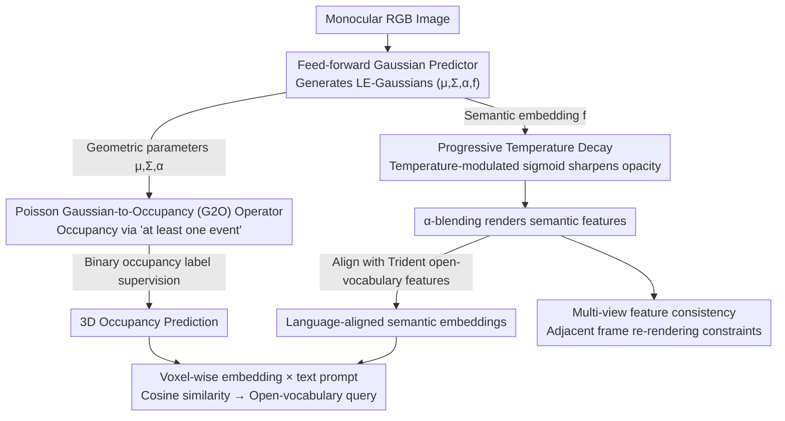

# Monocular Open Vocabulary Occupancy Prediction for Indoor Scenes (LegoOcc)

**Conference**: CVPR 2026  
**arXiv**: [2602.22667](https://arxiv.org/abs/2602.22667)  
**Code**: [https://github.com/JuIvyy/LegoOcc](https://github.com/JuIvyy/LegoOcc)  
**Area**: Autonomous Driving / Indoor Scene Understanding  
**Keywords**: Open-vocabulary occupancy prediction, 3D Gaussian representation, Poisson aggregation, Temperature decay, Indoor scenes

## TL;DR

Ours proposes LegoOcc, which utilizes Language-Embedded Gaussians (LE-Gaussians) as a unified geometric-semantic intermediate representation. Combined with a Poisson-process-based Gaussian-to-Occupancy (G2O) operator and a progressive temperature decay strategy, it achieves monocular open-vocabulary occupancy prediction for indoor scenes using only binary occupancy labels (no semantic annotations), reaching 59.50 IoU / 21.05 mIoU on Occ-ScanNet.

## Background & Motivation

3D semantic occupancy prediction in indoor scenes is crucial for embodied agents but faces three major challenges:

**Indoor vs. Outdoor differences**: Indoor scenes have denser geometry, more complex layouts, and fine-grained, long-tail semantic category distributions. Existing outdoor open-vocabulary occupancy methods (e.g., POP-3D, LOcc) perform poorly when directly transferred to indoor settings (mIoU only 5.96/9.25).

**Closed-set vocabulary limitations**: Existing indoor occupancy methods (ISO, EmbodiedOcc, etc.) rely on fixed-category label training, making them unable to recognize objects outside the training set, which is unsuitable for real-world deployment.

**High cost of semantic annotation**: Indoor scenes contain many categories with a long-tail distribution, making dense semantic annotation extremely expensive. In contrast, binary occupancy labels can be automatically obtained via depth reconstruction at a much lower cost.

Therefore, this paper adopts a **geometry-only supervision** paradigm (binary occupancy labels only, no semantic labels) to explore how to achieve open-vocabulary occupancy prediction under this weakly supervised condition.

## Method

### Overall Architecture

LegoOcc takes a monocular RGB image as input. A feed-forward Gaussian predictor generates a set of Language-Embedded Gaussians (LE-Gaussians), where each Gaussian is parameterized as:

$$\mathcal{G}_i = (\boldsymbol{\mu}_i, \boldsymbol{\Sigma}_i, \alpha_i, \mathbf{f}_i)$$

Here, $\boldsymbol{\mu}_i, \boldsymbol{\Sigma}_i, \alpha_i$ encode geometric information, and $\mathbf{f}_i \in \mathbb{R}^d$ is a language-aligned semantic embedding. The same set of Gaussians is used for:
- **Geometry Learning**: Predicts 3D occupancy through a Poisson-based G2O operator, supervised by binary labels.
- **Semantic Learning**: Renders Gaussian features onto the image plane to align with features from an open-vocabulary segmentation model (Trident).

During inference, semantic queries for arbitrary categories are performed by calculating the cosine similarity between the embedding of each occupied voxel and the text prompts.

### Key Designs

**1. Poisson Gaussian-to-Occupancy (G2O) Operator: Calculating occupancy using "at least one event" to avoid overlap saturation**

Under weak supervision, voxel aggregation is often unstable, and existing G2O operators have inherent flaws: GaussianFormer2 ignores opacity $\alpha_i$ during aggregation and only uses the spatial kernel $p_i(\mathbf{x})$, causing a mismatch between geometric aggregation and rendering. Bernoulli methods use the complementary probability rule $\tilde{\alpha}_i = \alpha_i p_i(\mathbf{x})$, where the union of multiple overlapping Gaussians quickly saturates to 1, forcing opacity to learn extremely small values, which in turn destroys feature rendering. LegoOcc views the local contribution of each Gaussian as the event intensity $h_i(\mathbf{x}) \triangleq \alpha_i p_i(\mathbf{x}),\ z(\mathbf{x}) = \sum_{i=1}^N h_i(\mathbf{x})$ of an inhomogeneous Poisson process. The occupancy probability is defined as the probability of "at least one event occurring": $p(\mathbf{x}) = 1 - \exp\left(-\sum_{i=1}^N \alpha_i p_i(\mathbf{x})\right)$. Compared to the product form of Bernoulli $1 - \prod(1-\alpha_i p_i)$, this exponential sum form does not saturate when multiple Gaussians overlap. This allows opacity to maintain discriminative values, thereby stabilizing both geometric aggregation and semantic rendering. In ablation studies, replacing this with the GaussianFormer2 operator resulted in a collapse to 0 IoU.

**2. Progressive Temperature Decay: Making rendered features converge from "mixtures" to single-voxel representations**

Features rendered via standard $\alpha$-blending are weighted mixtures of multiple Gaussian embeddings along a ray. Consequently, pixel features become a mixture rather than a clean language-aligned representation of a single Gaussian, resulting in blurred semantics. Ours applies a temperature-modulated sigmoid to opacity $\alpha_i = \sigma\left(\frac{\alpha_i^{\text{logit}}}{\tau}\right)$, where the temperature decays according to an exponential schedule $\tau(r) = \max\{T_{\min}, T_{\max} \cdot (T_{\min}/T_{\max})^r\}$ ($r \in [0,1]$ is the training progress, defaults $T_{\max}=1, T_{\min}=10^{-3}$). High temperatures in early stages ensure smooth optimization, while low temperatures in later stages push opacity toward binary $\{0,1\}$ values, suppressing feature mixing. Compared to hard Top-k selection in methods like Dr. Splat, this maintains end-to-end differentiability; compared to linear decay, it allocates more iterations to the low-temperature region. Ablations show exponential decay reaches 21.05 mIoU, far exceeding the 2.30 mIoU of linear decay.

**3. Multi-view Feature Consistency: Leveraging adjacent frame re-rendering for free cross-view constraints**

Semantic alignment in single-frame rendering is prone to drift under viewpoint changes. Ours utilizes re-rendering of adjacent frames (default 5 frames) and applies the same feature alignment loss. This constrains cross-view semantic consistency without any additional 2D annotations, serving as a low-cost stabilization term.

### Loss & Training

$$L_{\text{total}} = \lambda_{\text{focal}} L_{\text{focal}} + \lambda_{\text{lov}} L_{\text{lov}} + \lambda_{\text{scal}} L_{\text{scal}} + \lambda_{\text{feat}} L_{\text{feat}} + \lambda_{\text{depth}} L_{\text{depth}}$$

- $L_{\text{focal}}$: Focal Loss, for binary occupancy supervision.
- $L_{\text{lov}}$: Lovász-Softmax loss, for IoU optimization.
- $L_{\text{scal}}$: Scene-class affinity regularization, to promote spatial consistency.
- $L_{\text{feat}}$: Cosine alignment loss, between rendered features and open-vocabulary segmentation features (Trident).
- $L_{\text{depth}}$: Huber depth loss, to stabilize geometric learning.

Training config: Depth-Anything V2 as depth backbone, AdamW optimizer, lr $2 \times 10^{-4}$ with cosine decay, 4×RTX 4090, 10 epochs.

## Key Experimental Results

### Main Results

| Method | Setting | IoU | mIoU | FPS |
|------|---------|-----|------|-----|
| ISO | Closed-set (Fully labeled) | 42.16 | 28.71 | 3.81 |
| EmbodiedOcc | Closed-set (Fully labeled) | 53.55 | 45.15 | 11.48 |
| RoboOcc | Closed-set (Fully labeled) | 56.48 | 47.76 | - |
| POP-3D† | Open-vocabulary | 35.32 | 5.96 | 10.21 |
| LOcc† | Open-vocabulary | 36.70 | 9.25 | 8.93 |
| **LegoOcc (Ours)** | **Open-vocabulary** | **59.50** | **21.05** | **22.47** |

Under the open-vocabulary setting, LegoOcc outperforms all methods in IoU (including closed-set models), achieves an mIoU more than double (11.80 higher) the previous best open-vocabulary method, and maintains the fastest inference speed.

### Ablation Study

| G2O Operator | Setting | IoU | mIoU | Note |
|----------|---------|-----|------|------|
| GaussianFormer2 | Open-vocabulary | 0.00 | 0.00 | Complete collapse, inconsistent opacity |
| Bernoulli | Open-vocabulary | 46.65 | 17.25 | Functional but opacity is compressed |
| **Poisson** | **Open-vocabulary** | **59.50** | **21.05** | Optimal, stable aggregation |

| Temperature Strategy | $T_{\min}$ | $T_{\max}$ | IoU | mIoU | Note |
|----------|------------|------------|-----|------|------|
| No Schedule ($\tau=1$) | 1.0 | 1.0 | 59.19 | 18.15 | Good geometry, poor semantics |
| Constant Low ($\tau=10^{-3}$) | 1e-3 | 1e-3 | 0.00 | 0.00 | Optimization collapse |
| Linear Decay | 1e-3 | 1.0 | 7.60 | 2.30 | Insufficient low-temp iterations |
| **Exponential Decay** | **1e-3** | **1.0** | **59.50** | **21.05** | Optimal configuration |

### Key Findings

- The choice of G2O operator is critical for open-vocabulary tasks: GaussianFormer2 (without opacity) collapses directly to 0 in open-vocabulary settings.
- Temperature scheduling is the core of semantic learning: without scheduling, mIoU is only 18.15, while exponential decay improves it to 21.05.
- The IoU of open-vocabulary LegoOcc (59.50) even surpasses that of all closed-set fully supervised methods.
- A ~26 mIoU gap persists between current open-vocabulary and closed-set results, primarily due to text ambiguity in fine-grained indoor categories.

## Highlights & Insights

1. **Modeling occupancy via Poisson processes is elegant**: Treating Gaussian contributions as event intensities and voxel occupancy as "at least one event" provides clear physical intuition and simple mathematical form, naturally accommodating opacity.
2. **Temperature scheduling bridges the gap between rendering and aggregation**: Progressively sharpening opacity transforms features from "mixtures" to "single-voxel features," acting as a differentiable version of hard assignment.
3. **Weak supervision surpassing strong supervision in IoU**: The open-vocabulary model exceeds fully supervised closed-set methods in geometric accuracy, demonstrating the strong expressive power of language-embedded Gaussians as an intermediate representation.
4. **Fastest inference speed** (22.47 FPS), which is 6 times faster than ISO (3.81), balancing performance and efficiency.

## Limitations & Future Work

1. **Room for mIoU improvement**: The gap between open-vocabulary mIoU (21.05) and closed-set (47.76) is significant, especially for fine-grained categories like tvs (5.36), furniture (5.88), and objects (6.94).
2. **Dependency on external models**: The pipeline is relatively long, requiring Depth-Anything V2 for depth priors, Trident for open-vocabulary features, and Qwen2.5-VL for object noun extraction.
3. **Validation on a single dataset**: All experiments were conducted on Occ-ScanNet; generalization to other indoor scenes (e.g., Matterport3D, Replica) remains unverified.
4. **Difficulties in fine-grained semantic alignment**: When multiple semantically similar categories overlap in image space (e.g., furniture vs. objects), even temperature decay struggles to completely eliminate confusion.
5. **Monocular constraints**: The benefits of multi-view inputs for open-vocabulary occupancy have not yet been explored.

## Related Work & Insights

- **EmbodiedOcc / EmbodiedOcc++**: Closed-set indoor occupancy SOTA using Gaussian volume prediction; ours extends this to open-vocabulary.
- **GaussianFormer2**: Proposes a G2O operator without opacity; ours analyzes its failure in open-vocabulary tasks and proposes the Poisson improvement.
- **Dr. Splat**: Uses hard Top-k to register CLIP features to Gaussians; ours replaces this with continuous temperature decay to maintain differentiability.
- **POP-3D / LOcc**: Outdoor open-vocabulary occupancy methods; ours demonstrates their poor transferability to indoor scenes.
- **Insights**: Poisson process modeling can be generalized to occupancy estimation in other neural implicit representations; temperature scheduling can be applied to any scenario involving feature rendering via $\alpha$-blending.

## Rating

- Novelty: ⭐⭐⭐⭐ The combination of Poisson G2O and temperature decay offers theoretical depth and thorough analysis.
- Experimental Thoroughness: ⭐⭐⭐ Comprehensive ablations on Occ-ScanNet, but limited to a single dataset.
- Writing Quality: ⭐⭐⭐⭐ Clear problem analysis, progressing logically from GaussianFormer2 to Bernoulli to Poisson.
- Value: ⭐⭐⭐⭐ Achieves practical open-vocabulary occupancy prediction in large-scale indoor scenes for the first time, advancing embodied AI deployment.

<!-- RELATED:START -->

## Related Papers

- [\[CVPR 2026\] O3N: Omnidirectional Open-Vocabulary Occupancy Prediction](o3n_omnidirectional_open-vocabulary_occupancy_prediction.md)
- [\[ECCV 2024\] Monocular Occupancy Prediction for Scalable Indoor Scenes](../../ECCV2024/autonomous_driving/monocular_occupancy_prediction_for_scalable_indoor_scenes.md)
- [\[CVPR 2026\] Open-Vocabulary Domain Generalization in Urban-Scene Segmentation](open-vocabulary_domain_generalization_in_urban-scene_segmentation.md)
- [\[CVPR 2026\] ReScene4D: Temporally Consistent Semantic Instance Segmentation of Evolving Indoor 3D Scenes](rescene4d_temporally_consistent_semantic_instance_segmentation_of_evolving_indoo.md)
- [\[CVPR 2026\] EditSSC: Toward Editable Semantic Occupancy Scenes with Unconditional Diffusion Models](editssc_toward_editable_semantic_occupancy_scenes_with_unconditional_diffusion_m.md)

<!-- RELATED:END -->
