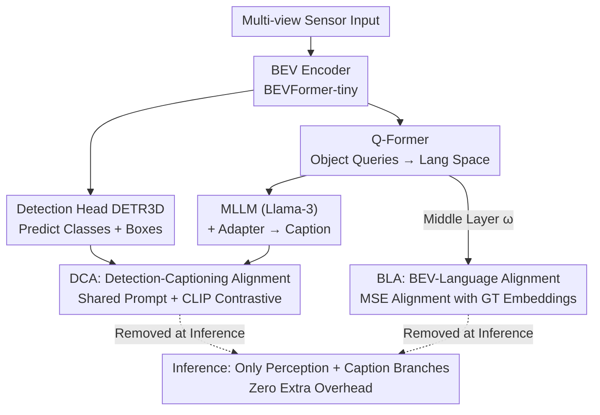

# MTA: Multimodal Task Alignment for BEV Perception and Captioning

**Conference**: CVPR 2026  
**Paper**: [CVF Open Access](https://openaccess.thecvf.com/content/CVPR2026/html/Ma_MTA_Multimodal_Task_Alignment_for_BEV_Perception_and_Captioning_CVPR_2026_paper.html)  
**Code**: None (Not provided by the authors)  
**Area**: Autonomous Driving / Multimodal VLM / BEV Perception  
**Keywords**: BEV Perception, 3D Dense Captioning, Multimodal Alignment, Cross-modal Prompting, Alignment at Training Time  

## TL;DR
MTA builds two alignment bridges for the "BEV 3D detection + 3D dense captioning" task pair, which were previously optimized independently. BLA supervises the BEV object queries of the Q-Former using text representations of GT captions, while DCA maps detection and captioning outputs into a shared space via learnable prompts for contrastive alignment. Both modules are active only during training, incurring zero inference overhead while improving detection mAP by 4.9% and captioning CIDEr by 9.2%.

## Background & Motivation
**Background**: 3D perception in Bird's Eye View (BEV) has become mainstream in autonomous driving, where multi-view camera/LiDAR information is fused into a unified representation for 3D detection. With the rise of Multimodal Large Language Models (MLLM), the BEV 3D dense captioning task has emerged, aiming to extract information from BEV features and detection outputs to generate natural language descriptions of object positions and behaviors (e.g., TOD3Cap).

**Limitations of Prior Work**: Existing works treat perception and captioning as **two independent lines**. One path focuses solely on BEV detection without reporting captioning performance (e.g., BEVFormer); the other focuses on captioning without reporting detection performance (e.g., the original TOD3Cap paper did not provide detection metrics). Even multi-task frameworks like TOD3Cap, which train both tasks simultaneously, optimize the task heads independently with no alignment constraints between detection loss and language modeling loss.

**Key Challenge**: Detection and captioning are **complementary rather than mutually exclusive**. Accurate detection boxes/classes improve captioning (reducing hallucinations), while language-level scene understanding reinforces the discriminative power of BEV representations. However, MLLMs have not seen BEV features during pre-training, creating a larger alignment gap between BEV visual space and MLLM language space than typical vision tokens. Furthermore, the modality difference between detection outputs (category labels + box coordinates) and captioning outputs (language token logits) makes direct alignment counterproductive, often leading to performance degradation in both tasks.

**Goal**: To introduce alignment mechanisms that allow the two tasks to **mutually enhance** each other without changing the architecture or increasing inference overhead. The alignment is decomposed into two sub-problems: "BEV ↔ Language" and "Detection ↔ Captioning."

**Key Insight**: Alignment does not need to happen at the final output layer. BEV ↔ Language alignment is placed in the intermediate layers of the Q-Former using GT caption text representations as supervision. Detection ↔ Captioning alignment utilizes a set of learnable prompts to project heterogeneous outputs into a shared space for contrastive learning.

**Core Idea**: Use two alignment losses active only during training (BLA + DCA) to stitch the parallel perception and captioning branches at the representation and output layers.

## Method

### Overall Architecture
MTA follows the dual-branch architecture of TOD3Cap: a **Perception Branch** (BEV encoder like BEVFormer-tiny → DETR3D detection head for categories and boxes) and a **Captioning Branch** (Q-Former projects BEV features of each object to language space → MLLM like Llama-3 + adapter for caption generation). MTA inserts two alignment modules: **BLA (BEV-Language Alignment)**, which aligns object queries from intermediate Q-Former layers with GT caption text embeddings, and **DCA (Detection-Captioning Alignment)**, which projects detection and captioning outputs into a shared prompt space for cross-modal contrastive alignment. The entire framework is trained end-to-end. Total Loss = Detection Loss + Language Modeling Loss + BLA Loss + DCA Loss. Crucially, **both alignment modules are active only during training and removed during inference**, resulting in zero additional parameters or latency compared to the baseline.

### Key Designs

**1. BLA (BEV-Language Alignment): Representational Supervision for Intermediate Q-Former Layers using GT Captions**

The challenge is that MLLMs are unfamiliar with BEV features, and the gap between BEV visual space and language space is wider than that of standard image tokens. Language modeling loss alone (supervision at the output) is insufficient for the model to "read" BEV. BLA adds supervision at the representation layer. Given a GT caption $o$, a frozen CLIP text encoder $T$ computes the text embedding $T(o)$. The hidden state $q_\omega$ of the $\omega$-th Q-Former layer is mapped via a trainable projection head $\Phi_Q$ (MLP), and aligned via MSE (Eq. 3):

$$\mathcal{L}_{BLA}(\Phi_Q, Q_{1:\omega})=\|\Phi_Q(q_\omega)-T(o)\|_2^2$$

This effectively splits the Q-Former: layers before $\omega$ focus on learning **context-aware object query representations** by attending to BEV features (using text embeddings as guidance), while layers after $\omega$ map queries to the MLLM alignment space. Ablations (Tab. 5, total layers $L=8$) show that placing the alignment at the 1st layer forces embeddings to mimic text before sufficient interaction with BEV, hurting detection. Placing it at the last (8th) layer leaves insufficient layers to map queries to the MLLM space, hurting captioning. The intermediate layer ($\omega=4$) achieves the best balance. Notably, BLA significantly boosts **Detection** (NDS/mAP), suggesting that linguistic representations help refine localization and classification in the BEV space.

**2. DCA (Detection-Captioning Alignment): Aligning Heterogeneous Outputs via Shared Prompt Space and CLIP Contrastive Loss**

Modality differences between detection outputs (class labels $\hat{c}$ + box coordinates $\hat{b}$) and captioning outputs (language token logits $\hat{o}$) make direct alignment difficult. DCA employs **cross-modal prompting**: a set of $N$ learnable prompt tokens $P=\{p_1,\dots,p_N\}\in\mathbb{R}^{N\times D}$ serves as a shared embedding space. Concatenated detection outputs are projected into this space via a projection head and attention pooling (Eq. 4-5):

$$x_{det}=[\Phi_{cls}(\hat{c}), \Phi_{box}(\hat{b})], \quad p_{det}=\sum_{i=1}^N \frac{\exp(x_{det}^\top p_i)}{\sum_j \exp(x_{det}^\top p_j)} p_i$$

Caption logits are mapped to the same space to obtain $p_{cap}$ (Eq. 6). Finally, a **CLIP contrastive loss** aligns the two: $\mathcal{L}_{DCA}=\mathcal{L}_{CLIP}(p_{det}, p_{cap})$ (Eq. 7). DCA uses CLIP contrastive loss rather than MSE because it needs to establish "informational correspondence" (e.g., box location at "7m rear-left" ↔ spatial phrases in the caption). Contrastive learning is naturally suited for this mapping. Ablations (Tab. 7) show CLIP outperforms MSE and cosine similarity for DCA, whereas MSE is optimal for the direct representation alignment in BLA (Tab. 6). DCA contributes significantly to **Captioning** performance and reduces hallucinations, such as describing a "bus" as a "trash can."

### Loss & Training
The total loss is a weighted sum (Eq. 8): $\mathcal{L}_{MTA}=\alpha\mathcal{L}_{DET}+\beta\mathcal{L}_{LM}+\gamma_1\mathcal{L}_{BLA}+\gamma_2\mathcal{L}_{DCA}$, with default $(\alpha, \beta)=(10, 1)$ following TOD3Cap, and $(\gamma_1, \gamma_2)=(1, 10^{-2})$ to balance scales. BEV uses a pre-trained BEVFormer-tiny; the MLLM is Llama-3.2-1B or InternLM2 (frozen, training only the adapter). Training lasts 10 epochs with lr $2\times10^{-4}$. BLA defaults to the middle layer of the Q-Former.

## Key Experimental Results

The dataset is **nuScenes** (700 train/150 val scenes, 1.4M boxes, 10 classes) and **TOD3Cap** (approx. 2.3M language captions added to nuScenes). Detection is measured by standard metrics (mAP, NDS), and captioning by m@IoU=k (CIDEr/BLEU-4/METEOR/ROUGE at IoU threshold $k$).

### Main Results

3D Dense Captioning (TOD3Cap, Llama 3.2 setting):

| Method | C@0.25↑ | C@0.5↑ | B-4@0.5↑ | M@0.5↑ |
|------|---------|--------|----------|--------|
| Vote2Cap-DETR | 110.1 | 98.4 | 46.1 | 41.3 |
| TOD3Cap | 113.1 | 108.7 | 46.7 | 47.8 |
| **Ours (MTA)** | **122.8** | **118.7** | **47.6** | **48.4** |

C@0.5 increased by 10.0 points (+9.2%). Consistent improvements were also observed with InternLM2 (C@0.5 105.1→113.0), indicating gains are independent of the LLM.

3D Detection (nuScenes Val, Llama 3.2 setting):

| Method | NDS↑ | mAP↑ | mAVE↓ | Inference FPS |
|------|------|------|-------|---------|
| BEVFormer (Vision-only) | 37.4 | 26.8 | 0.573 | 4.1 |
| TOD3Cap (Naive Multi-task) | 37.7 | 26.6 | 0.570 | 4.1 |
| **Ours (MTA)** | **38.9** | **27.9** | **0.541** | 4.1 |

Compared to TOD3Cap, mAP increased by 4.9% and NDS by 3.2%, while **inference parameters and FPS remain identical to the baseline** (33.6M, 4.1 FPS).

### Ablation Study

Breakdown of BLA / DCA modules (Baseline: TOD3Cap + Llama 3.2):

| Config | C@0.5↑ | B-4@0.5↑ | NDS↑ | mAP↑ |
|------|--------|----------|------|------|
| TOD3Cap | 108.7 | 46.7 | 37.7 | 26.6 |
| + BLA | 111.9 | 46.4 | 38.9 | 27.7 |
| + DCA | 113.6 | 46.4 | 38.7 | 27.5 |
| + MTA (BLA+DCA) | 118.7 | 47.6 | 38.9 | 27.9 |

BLA alignment layer $\omega$ ($L=8$): NDS 38.4 for layer 1; NDS 38.9 / C 111.9 (Optimal) for layer 4; NDS 37.9 for layer 8.

### Key Findings
- **Complementary Roles**: BLA provides more significant gains for **Detection** (using language to refine BEV localization), while DCA boosts **Captioning** (output-level consistency reduces hallucinations). Their combination achieves SOTA on both tasks.
- **Maximized Gains in Long-tail/Hard Scenarios**: mAP for rare objects (<2% frequency) increased by **10.7%** over TOD3Cap, and by **5.7%** in night scenes, demonstrating that alignment is especially effective for difficult samples.
- **Objective Selection Matters**: BLA benefits from MSE (direct representation alignment), while DCA benefits from CLIP contrastive loss (establishing cross-modal correspondence). Using the wrong objective leads to performance drops.
- **Zero Inference Cost**: BLA and DCA are only active during training. Parameters and speed remain unchanged during deployment, which is critical for latency-sensitive autonomous driving.

## Highlights & Insights
- **"Train-time Alignment, Inference-time Removal" is the most practical selling point**: Unlike methods requiring extra branches at inference, MTA compresses alignment into training. This strategy is transferable to any multi-task scenario where inference must be lightweight.
- **Insight on Intermediate Level Alignment**: Placing representation supervision in the middle of the Q-Former, rather than the ends, balances BEV interaction and projection to the MLLM space. This is a generalizable experience for designing adapter/bridge layers.
- **Aligning Heterogeneous Outputs via Shared Prompts**: Direct MSE between boxes/classes and language logits is problematic. Using a set of prompt tokens as intermediaries allows for contrastive alignment in a shared space, avoiding the performance degradation seen with direct alignment.

## Limitations & Future Work
- **Dependency on GT Captions**: BLA requires GT text embeddings, making it dependent on datasets like TOD3Cap with dense caption annotations. It cannot be directly applied to detection-only datasets.
- **Single BEV Framework Validation**: Experiments were based on BEVFormer-tiny + TOD3Cap. Effectiveness on larger BEV backbones or other captioning frameworks is not yet fully explored. ⚠️ Code is not public; details like prompt token count $N$ and attention pooling follow the paper's description.
- **Hyperparameter Sensitivity**: $(\gamma_1, \gamma_2)$ and the BLA layer $\omega$ require tuning and might vary with different datasets or LLMs.
- **Future Directions**: Exploring pseudo-labeling or self-distillation to drive BLA without GT captions; extending alignment to more downstream tasks like planning.

## Related Work & Insights
- **vs TOD3Cap (Naive Multi-task)**: Identical architecture, but TOD3Cap's independent optimization results in detection performance slightly worse than single-task BEVFormer. MTA's BLA+DCA bridges significantly improve both tasks with zero inference cost.
- **vs BEVFormer (Vision-only Detection)**: BEVFormer only optimizes for detection. MTA adds a captioning branch and uses linguistic representations to feed back into detection, outperforming BEVFormer's mAP by 4.1%.
- **vs CLIP/ALIGN (General VLM Alignment)**: Classic VLMs align general representations on image-text pairs. MTA specializes alignment for "BEV Vision ↔ Language" and "Detection Output ↔ Caption Output," emphasizing training-only alignment.

## Rating
- Novelty: ⭐⭐⭐⭐ First to jointly optimize BEV perception and captioning using a dual alignment mechanism. The intermediate BLA and shared-prompt DCA are clever, though built on existing alignment principles.
- Experimental Thoroughness: ⭐⭐⭐⭐ Comprehensive multi-task/multi-LLM evaluation on nuScenes+TOD3Cap, including long-tail, weather, and layer-wise ablations.
- Writing Quality: ⭐⭐⭐⭐⭐ Motivation is well-structured, the division of labor between modules is clear, and ablations directly address design choices.
- Value: ⭐⭐⭐⭐ Zero-inference-overhead alignment is highly practical for real-world BEV deployment, with notable gains in long-tail scenarios.

<!-- RELATED:START -->

## Related Papers

- [\[CVPR 2026\] CATNet: Collaborative Alignment and Transformation Network for Cooperative Perception](catnet_collaborative_alignment_and_transformation_network_for_cooperative_percep.md)
- [\[ECCV 2024\] H-V2X: A Large Scale Highway Dataset for BEV Perception](../../ECCV2024/autonomous_driving/h-v2x_a_large_scale_highway_dataset_for_bev_perception.md)
- [\[AAAI 2026\] Rethinking the Spatio-Temporal Alignment of End-to-End 3D Perception](../../AAAI2026/autonomous_driving/rethinking_the_spatio-temporal_alignment_of_end-to-end_3d_perception.md)
- [\[CVPR 2026\] Look Before You Fuse: 2D-Guided Cross-Modal Alignment for Robust 3D Detection](look_before_you_fuse_2d-guided_cross-modal_alignment_for_robust_3d_detection.md)
- [\[ICLR 2026\] SiMO: Single-Modality-Operable Multimodal Collaborative Perception](../../ICLR2026/autonomous_driving/simo_single-modality-operable_multimodal_collaborative_perceptio.md)

<!-- RELATED:END -->
