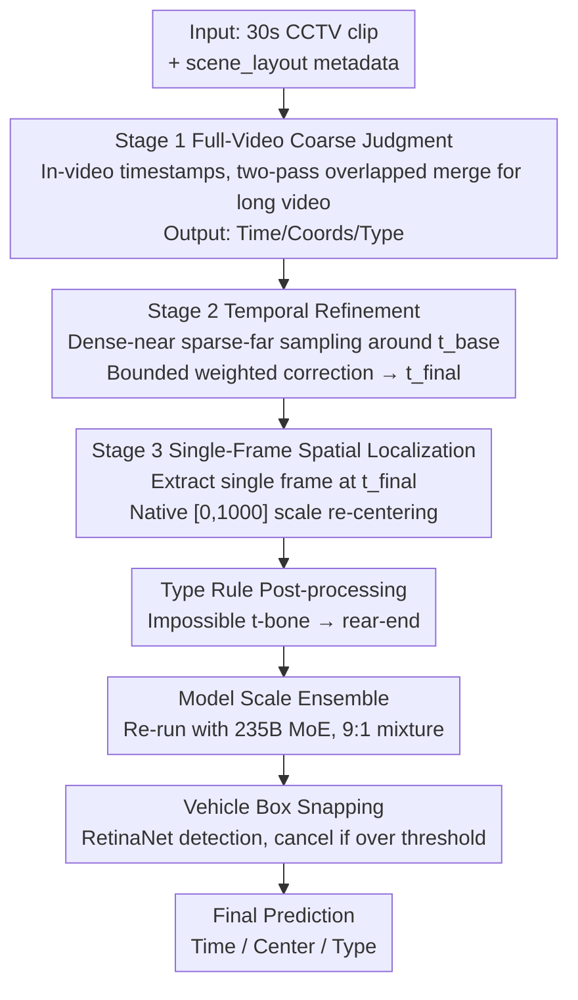

# Multi-Stage VLM Pipeline for Zero-Shot Traffic Accident Understanding

**Conference**: CVPR 2026 (AUTOPILOT Workshop, ACCIDENT Challenge 1st Place)  
**arXiv**: [2605.29325](https://arxiv.org/abs/2605.29325)  
**Code**: https://github.com/fuumin621/cvpr2026-accident-1st-place-solution (Available)  
**Area**: Autonomous Driving / Multimodal VLM  
**Keywords**: Traffic Accident Understanding, Zero-shot, VLM pipeline, CCTV, Task Decomposition

## TL;DR
Using a **completely frozen, training-free** Qwen3-VL-32B, the joint task of "determining accident time / collision center / collision type" is decomposed into three specialized VLM calls (full-video coarse judgment → temporal refinement → single-frame spatial localization). Combined with a 9:1 ensemble of a 235B MoE sibling model and a "snap-to-nearest-vehicle-box" post-processing step, the unified score was improved from the strongest baseline (Molmo-7B) at 0.358 to 0.5708 on the private leaderboard, securing the CVPR 2026 ACCIDENT challenge championship.

## Background & Motivation
**Background**: Automatically understanding traffic accidents from CCTV surveillance video is critical for rapid accident response and traffic safety analysis. The CVPR 2026 AUTOPILOT Workshop ACCIDENT challenge defines this as answering three questions for a 30-second clip simultaneously: **When** did it happen (accident time, in seconds), **where** in the frame (normalized coordinates of the collision center), and **how** did it happen (5 collision categories: head-on / rear-end / t-bone / sideswipe / single-vehicle).

**Limitations of Prior Work**: This is a **zero-shot** protocol—no real labeled videos are provided for training; only CARLA synthetic clips (2,211 synthetic vs. 2,027 real test clips) are available. There is a huge appearance gap between synthetic and real CCTV. The authors found that this **sim-to-real gap is the dominant source of error**: approaches attempting to learn signals from synthetic data and migrate to the test set (training CNN classifiers on CARLA, optical flow + detector hybrids, frame-offset ensembles) gained points on the synthetic validation set but lost points on the real leaderboard. Thus, the "training" path is largely blocked, making off-the-shelf oversized VLMs the only viable option for zero-shot inference.

**Key Challenge**: A naive approach involves a single VLM call to output the time, location, and type at once. However, the evaluation's unified score is a **harmonic mean**:

$$ACC^{S} = \frac{3}{1/T + 1/S + 1/C} \in [0,1]$$

The harmonic mean is heavily dragged down by the **minimum** among $T, S, \text{and } C$. Raising one while sacrificing another rarely improves $ACC^S$. Joint querying forces the model to distribute attention among three competing goals, which **specifically degrades spatial accuracy** (coordinates tend to cluster on a coarse grid).

**Goal**: Without training or relying on synthetic data transfer, decouple the three objectives so each call focuses on a single task, thereby bolstering the weakest term in the harmonic mean.

**Core Idea**: **Decompose joint prediction into three specialized VLM calls**, followed by model-scale ensemble and detection-based snapping—maintaining frozen weights, greedy decoding, and zero training throughout.

## Method

### Overall Architecture
The system is built on a frozen Qwen3-VL-32B-Instruct-FP8 (served via vLLM, no training, greedy decoding). The core consists of **three consecutive calls to the same VLM**, each solving a sub-problem of the joint task. Each subsequent stage replaces the corresponding output from the previous stage while keeping the rest:

- **Stage 1 (Full-Video Coarse Judgment)**: Takes the entire clip + scene metadata to provide an initial joint estimate of time, coordinates, and type—this is a standalone complete prediction.
- **Stage 2 (Temporal Refinement)**: Focuses only on the Stage 1 time, resampling a "dense near, sparse far" set of frames around it to perform a **bounded, weighted** temporal correction.
- **Stage 3 (Spatial Localization)**: Extracts a **single frame** at the refined timestamp to re-localize the collision center, replacing the coarse coordinates from Stage 1.

Following the three VLM stages, three lightweight repairs are applied: **rule-based replacement** for physically impossible types, a **9:1 ensemble** by running the same pipeline on a 235B MoE sibling model, and **snapping** the predicted point to the nearest vehicle detection box.

### Key Designs

**1. Three-Stage Task Decoupling: Focus Each Call on One Sub-goal**

This is the soul of the method and the largest contributor in the ablation study. The pain point is that joint queries force the model to balance time, space, and type simultaneously, and since the harmonic mean is extremely sensitive to the weakest term, spatial coordinates collapse onto a coarse grid. The authors split this into three serial calls: Stage 1 gets a coarse joint estimate from the full video; Stage 2 refines the time using a denser frame window around the Stage 1 time $t_{\text{base}}$; Stage 3 extracts a **single frame** at the refined time and only answers "where did the collision occur in this frame." Crucially, this is a **dependent pipeline**—only when Stage 2 fixes the time can Stage 3 avoid the burden of "selecting the moment." Single-frame localization largely eliminates the quantization clustering of Stage 1 coordinates. The ablation shows that "single-frame pointing grounding" alone brings a +0.09356 gain (the largest single item).

**2. Two Prompt-Side Adjustments in Stage 1: Timestamp Burning + Scene Hints**

Stage 1 decodes at 4 fps, up to 128 frames, with the long side resized to 960 px. Clips longer than 32s are split into two overlapping inference passes and merged via rules (retaining individual outputs outside the overlap, averaging time/coordinates inside, and keeping the first pass's type). Two prompt-side choices are key: first, **burning a small black tag `t=xx.xx s` into every frame**, allowing the VLM to "copy" the timestamp from the image into the answer rather than guessing based on visual context; second, inserting `scene_layout` metadata into the prompt (termed **scene hint**), biasing the model toward collision types **physically possible** given the scene geometry. The scene hint contributed +0.00216 in the ablation.

**3. Stage 2 Bounded and Weighted Temporal Correction: Small-Step Convergence**

Since 4 fps sampling limits the Stage 1 temporal resolution to approx $\pm0.25$ s, refinement is necessary. Stage 2 constructs a **mixed frame set** around $t_{\text{base}}$: a local dense window ($\pm2$ s @ 4 fps, max 12 frames) + peripheral sparse anchors ($-8$ to $+4$ s @ 0.5 fps, max 4 frames), providing both the accident moment and the context of motion. After obtaining a new estimate $t_{\text{refined}}$, it is not used for direct replacement but rather:

$$t_{\text{final}} = t_{\text{base}} + \alpha \cdot \mathrm{clip}\!\left(t_{\text{refined}} - t_{\text{base}},\ -\delta_{\max},\ +\delta_{\max}\right)$$

Where $\alpha=0.35$ is the weighted correction and $\delta_{\max}=1.5$ s is the cap. This design stems from the evaluation metric: $ACC^S$ is a harmonic mean that heavily penalizes large errors. Instead of risking a potentially erratic Stage 2 correction, the **weighted + clamped** approach limits the damage of rare outliers. The authors verified on the public leaderboard that this combination outperforms direct replacement ($\alpha=1$, no clamp).

**4. Type Rule Post-processing + Model Ensemble + Bbox Snapping: Conservative Repairs**

Following the three VLM stages are three minor repairs, all sharing the philosophy: "**only move when benefit is certain**." ① **Type Post-processing** keeps one physical rule: if the prediction is `t-bone` but the `scene_layout` is a highway, tunnel, or overpass (where T-bone collisions are nearly impossible), it is corrected to `rear-end`. More aggressive rules did not yield gains. ② **Model Scale Ensemble**: The same three-stage pipeline is run on Qwen3-VL-235B-A22B (MoE, 22B active per token). Temporal and spatial outputs are mixed via $x_{\text{ens}} = \lambda x_{\text{32B}} + (1-\lambda) x_{\text{235B}}$ with $\lambda=0.9$. **Type is taken only from the 32B model** (the 235B performed worse on types under the same prompt). While 235B solo was lower than 32B, the 9:1 mix provided a small, steady gain in spatio-temporal metrics. ③ **Vehicle Box Snapping**: VLM points often land near the accident area but not exactly on the vehicles. RetinaNet detects vehicle classes (COCO car/motorcycle/bus/truck) within $\pm10$ frames. The point is snapped to the center of the nearest detection box unless the displacement exceeds a threshold $\delta_{\text{snap}}=0.2$ (normalized coordinates), in which case snapping is **canceled** to avoid distractions from irrelevant vehicles.

### Loss & Training
**No training**. All backbones use frozen pre-trained weights, served via vLLM with greedy decoding. Key hyperparameters: Stage 1 uses 4 fps / ≤128 frames / 960 px; Stage 2 uses $\alpha=0.35$, $\delta_{\max}=1.5$ s; ensemble $\lambda=0.9$; snapping $\delta_{\text{snap}}=0.2$ and a $\pm10$ frame window. Computation-wise, the 32B branch processes all 2,027 test clips in ~13 hours on a single RTX PRO 6000; the 235B branch takes ~10 hours on 8× RTX PRO 6000.

## Key Experimental Results

### Main Results
The unified score $ACC^S$ is the harmonic average, where C = top-1 classification accuracy, T = Gaussian temporal similarity (averaged over three tolerances $\sigma_t\in\{0.5,1,2\}$ s), and S = anisotropic Gaussian spatial similarity ($\sigma_x, \sigma_y$ derived from mean bbox width/height).

| System | $ACC^S$ | C | T | S | Private LB |
|--------|---------|---|---|---|------------|
| Molmo-7B baseline (Strongest) | 0.3580 | 0.2930 | 0.3430 | 0.4880 | - |
| Ours 32B (Three-stage) | 0.5637 | 0.5994 | 0.5603 | 0.5350 | 0.56740 |
| Ours 235B (Three-stage) | 0.5504 | 0.5703 | 0.5388 | 0.5430 | 0.55670 |
| Ours 9:1 Ensemble (Type=32B) | 0.5657 | 0.5994 | 0.5600 | 0.5410 | 0.56948 |
| **Ours + bbox snap (Final)** | **0.5669** | 0.5994 | 0.5600 | 0.5441 | **0.57080** |

The 32B three-stage pipeline alone significantly outperforms the strongest baseline (0.5637 vs. 0.358). The 235B ensemble adds ~+0.002, and bbox snap adds another +0.00054 (Public) / +0.00132 (Private). The final private leaderboard score of 0.57080 is approximately **+0.21** higher than the strongest baseline.

### Ablation Study
Cumulative scores on the public leaderboard (each row builds on the previous):

| Configuration | Public LB | Δ | Description |
|---------------|-----------|---|-------------|
| Single-call VLM (768px, 2fps) | 0.42238 | — | Baseline joint query |
| + Stage-3 single-frame grounding | 0.51594 | **+0.09356** | Largest single gain |
| + Stage-1 scene hint | 0.51810 | +0.00216 | Scene metadata in prompt |
| + t-bone type post-processing | 0.52276 | +0.00466 | Impossible t-bone → rear-end |
| + Stage-2 temporal refinement | 0.53246 | +0.00970 | Bounded weighted correction |
| + 4fps/128f/960px | 0.55215 | +0.01969 | Upgrade Stage-1 sampling |
| + 9:1 ensemble 235B | 0.55415 | +0.00200 | Model scale ensemble |
| + bbox snap (Final) | 0.55469 | +0.00054 | Snap to vehicle boxes |

Backbone scale scan (single-call baseline @ 512px, no refined stages): Qwen3-VL 4B=0.285, 8B=0.365, 32B=0.387—**model scale brings gains independent of pipeline structure.**

### Key Findings
- **Stage 3 single-frame spatial localization is the most significant step** (+0.09356), far exceeding the sum of other components. Reason: Stage 1 coordinates cluster on a coarse grid under joint query; once Stage 2 fixes the time, Stage 3 only needs to answer "where it hit" in one frame, resolving most quantization issues.
- **Denser frame rates actually hurt**: Increasing 4→10 fps decreased the score by -0.009. Three-frame grounding (averaged) or rendering grounding frames to 1024/1280 px also reduced spatial scores, suggesting oversampling/over-resolution hurts stage-level accuracy.
- **CoT (thinking mode) fails catastrophically**: Classification accuracy collapsed, and temporal scores dropped from 0.42 to 0.06. Self-consistency and flip TTA were essentially noise.
- **Sim-to-real transfer failed completely**: Training CNNs or optical flow models on CARLA improved synthetic validation but failed on the real leaderboard, confirming synthetic transfer is unreliable for zero-shot tasks.
- **Non-VL specialized models struggle with types**: Cosmos-Reason2 missed the t-bone class entirely; InternVL3.5-8B / Gemma 3-27B mapped most predictions to rear-end. Pure-text MoE (Qwen3.5-35B-A3B) had decent temporal scores but failed on type and space.

## Highlights & Insights
- **Using "Task Decoupling + Stage Dependency" to combat harmonic mean bottlenecking**: The method introduces no new modules but splits the joint query into three specialized calls. This specifically patches the spatial term (typically the weakest), providing an exemplar of designing an inference pipeline based on metric characteristics.
- **Bounded and weighted temporal correction is a simple but high-ROI trick**: $t_{\text{final}}=t_{\text{base}}+\alpha\cdot\mathrm{clip}(\cdot)$ balances temporal refinement with outlier protection via two scalars. It is more robust than "direct replacement."
- **Honest reporting of negative results**: The authors systematically report failures like CoT collapse, dense frame penalties, and synthetic transfer failures. In zero-shot competitions, "avoiding mistakes" is often more important than "doing more right things."
- **"Training-free + Single-card 13h victory"**: In an environment dominated by sim-to-real gaps, opting for off-the-shelf large VLMs with an engineered pipeline proved to be the superior solution.

## Limitations & Future Work
- **Engineering-centric solution, not a new model**: Core gains come from task splitting and prompt engineering; many hyperparameters ($\alpha,\delta_{\max},\lambda,\delta_{\text{snap}}$) are tuned to the public leaderboard, risking over-fitting to the benchmark.
- **Strong dependence on a specific backbone**: The solution is tied to Qwen3-VL (utilizing its native $[0,1000]$ coordinate scale and timestamp readability). The authors found other VLMs performed significantly worse.
- **Cost of multiple calls**: Three stages + dual-model ensemble requires significant compute (235B needs 8 cards for ~10h), which is heavy for real-time accident response.
- **Simple type rules**: More complex physical constraints did not improve scores, suggesting type classification improvement remains limited by VLM semantic understanding rather than post-processing.

## Related Work & Insights
- **vs. Single-call VLM (0.42238 baseline)**: Jointly answering time/location/type leads to coordinate collapse. Task decoupling + "stage dependency" fixes this, gaining +0.13.
- **vs. Molmo-7B Baseline (0.358)**: End-to-end Molmo-7B suffers across all three terms. This method raises all terms to the 0.54-0.60 range without training.
- **vs. Synthetic-to-Real (CARLA training)**: While training on CARLA is standard, the authors found it misleading for real-world CCTV leaderboards, choosing instead to double down on zero-shot VLM capabilities.
- **vs. TTA/CoT/Sampling**: Typical "tricks" like CoT proved disastrous for this specific multi-objective constrained task, highlighting that general-purpose LLM tricks do not always translate to robust VLM performance.

## Rating
- Novelty: ⭐⭐⭐ No new model, but task decoupling to fight the harmonic mean effect is clever.
- Experimental Thoroughness: ⭐⭐⭐⭐⭐ Comprehensive incremental ablation, backbone scanning, and extensive negative results.
- Writing Quality: ⭐⭐⭐⭐ Clear logic, motivation closely linked to metrics, particularly valuable negative results section.
- Value: ⭐⭐⭐⭐ Strong practical baseline for zero-shot accident understanding; engineering lessons provided are highly transferable.

<!-- RELATED:START -->

## Related Papers

- [\[CVPR 2025\] Zero-Shot 4D Lidar Panoptic Segmentation](../../CVPR2025/autonomous_driving/zero-shot_4d_lidar_panoptic_segmentation.md)
- [\[CVPR 2026\] SpaceDrive: Infusing Spatial Awareness into VLM-based Autonomous Driving](spacedrive_infusing_spatial_awareness_into_vlm-based_autonomous_driving.md)
- [\[CVPR 2026\] GaussianDWM: 3D Gaussian Driving World Model for Unified Scene Understanding and Multi-Modal Generation](gaussiandwm_3d_gaussian_driving_world_model_for_unified_scene_understanding_and_.md)
- [\[CVPR 2026\] RLFTSim: Realistic and Controllable Multi-Agent Traffic Simulation via Reinforcement Learning Fine-Tuning](rlftsim_realistic_and_controllable_multi-agent_traffic_simulation_via_reinforcem.md)
- [\[CVPR 2026\] Unifying Language-Action Understanding and Generation for Autonomous Driving](unifying_language-action_understanding_and_generation_for_autonomous_driving.md)

<!-- RELATED:END -->
