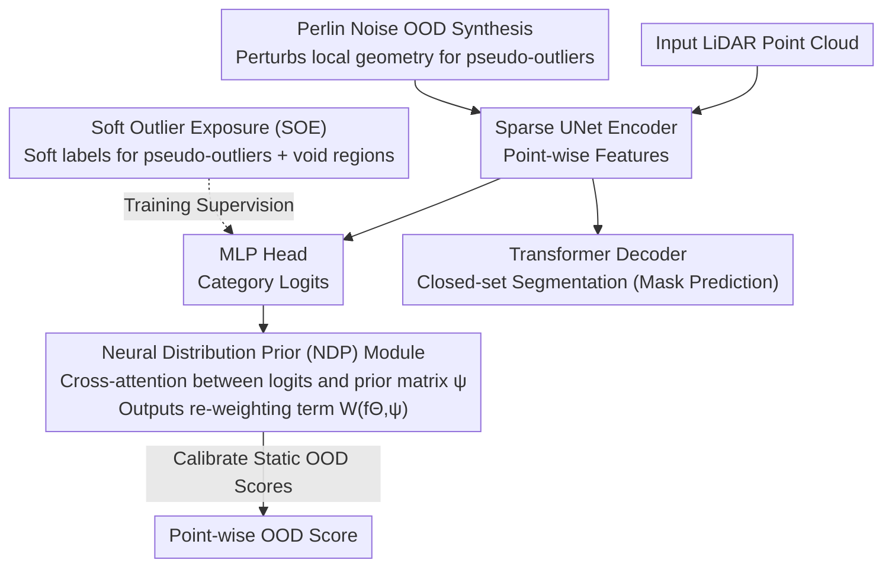

# Neural Distribution Prior for LiDAR Out-of-Distribution Detection

**Conference**: CVPR 2026  
**arXiv**: [2604.09232](https://arxiv.org/abs/2604.09232)  
**Code**: [https://cs-lzz.github.io/ndp-demo](https://cs-lzz.github.io/ndp-demo)  
**Area**: Autonomous Driving/Safety Perception  
**Keywords**: OOD Detection, LiDAR Perception, Class Imbalance, Perlin Noise, Distribution Prior

## TL;DR

NDP proposes a learnable neural distribution prior module to model the distribution structure of network predictions. Combined with pseudo-OOD samples generated via Perlin noise and a soft outlier exposure strategy, it achieves 61.31% AP on the STU benchmark, exceeding previous state-of-the-art results by over 10x.

## Background & Motivation

**Background**: LiDAR perception is critical in autonomous driving, but current models operate under a closed-set assumption and fail to recognize unexpected OOD objects (e.g., tree branches, construction machinery, road debris), potentially leading to severe safety consequences.

**Limitations of Prior Work**: LiDAR data suffers from extreme class imbalance—roads and buildings constitute the majority of point clouds, while traffic participants like bicycles are highly sparse. Existing OOD scoring functions assume a uniform class distribution and fail on imbalanced data.

**Key Challenge**: Static OOD scoring overfits frequent classes while failing on tail classes; dataset-level class priors are insufficient to correct the bias introduced by class imbalance in LiDAR data.

**Goal**: Design a learnable OOD scoring mechanism adaptive to class imbalance and generate diverse auxiliary OOD samples for robust training.

**Key Insight**: Instead of using static scoring, learn the distribution patterns of network predictions while utilizing Perlin noise to generate OOD samples directly from training data.

**Core Idea**: NDP dynamically captures the logit distribution patterns of training data via an attention mechanism and corrects class-dependent confidence biases.

## Method

### Overall Architecture

The paper addresses the issue where closed-set LiDAR segmentation models fail to trigger alarms when encountering unseen objects. The core difficulty lies in the extreme class imbalance of LiDAR point clouds—roads and buildings occupy most points, while participants like bicycles are sparse, causing traditional OOD scores to bias naturally toward common classes. The NDP pipeline is integrated into Mask4Former-3D: a sparse UNet first encodes each point into features; one MLP head outputs logits for anomaly judgment, and a Transformer decoder performs closed-set segmentation. The key modification is replacing the fixed formula for converting logits to OOD scores with an NDP module, where logits interact with learnable priors to output calibrated scores. During training, pseudo-anomalies synthesized via Perlin noise and "void" regions with soft labels provide negative supervision.

### Key Designs

**1. Neural Distribution Prior (NDP) Module: Adapting OOD scores to prediction distributions instead of fixed formulas**

Traditional OOD scores (e.g., max-logit, energy) assume classes are roughly uniform. In LiDAR, logits for common classes are generally high while those for tail classes are low; thus, a fixed threshold misclassifies sparse normal points as outliers and ignores true outliers near common classes. NDP projects logits into a latent embedding space and performs cross-attention with a learnable prior matrix $\psi$ to capture typical inter-class distribution relationships in training data, generating a re-weighting term $W(f_\Theta, \psi)$ to adjust the static OOD score. $\psi$ acts as a reference distribution for how the network "usually looks" on clean data: when a point's logit pattern deviates from this learned norm, the term amplifies the anomaly score. Since calibration signals come from learned data distributions rather than human assumptions, NDP adaptively compensates for imbalance bias and can be applied to various scoring functions.

**2. Perlin Noise OOD Synthesis: Generating geometrically consistent pseudo-outliers without external datasets**

Training models to identify anomalies requires anomaly samples, but external datasets introduce domain shifts, and the void points (unlabeled regions) in scenes have limited diversity. NDP utilizes Perlin noise—a smooth, spatially coherent noise function—to perturb the local surface geometry of in-distribution point clouds, creating realistic changes in shape and contour while maintaining global semantic layout. These synthesized "anomalies" are geometrically continuous and self-consistent, resembling real unseen objects more closely than random points. Perlin noise has proven effective in industrial anomaly detection; migrating it to 3D point clouds avoids domain adaptation issues while producing diverse, geometrically reasonable negative samples.

**3. Soft Outlier Exposure (SOE) Strategy: Using soft labels for ambiguous void regions to prevent overfitting**

Void points in a scene are ambiguous—they could be unlabeled normal objects or true anomalies. If treated as deterministic OOD hard labels, the model may overfit to the appearance of these specific regions, misinterpreting "unlabeled" as "anomaly." SOE assigns soft OOD labels reflecting uncertainty, allowing the model to learn weak "potential anomaly" signals in ambiguous areas. This leverages free supervision without being misled by it.

### Loss & Training

Joint training for closed-set segmentation and OOD detection: Perlin-synthesized pseudo-outliers and soft-labeled void regions provide negative supervision, while the segmentation branch learns known categories as usual. During inference, the NDP module's re-weighting term calibrates the final OOD scores. ⚠️ Specific loss weights and training hyperparameters are as per the original text.

## Key Experimental Results

### Main Results

| Dataset | Metric | Ours | Prev. SOTA | Gain |
|--------|------|------|----------|------|
| STU Test Set | Point-level AP | 61.31% | ~6% | >10× |
| SemanticKITTI | OOD AP | SOTA | - | Significant |

### Ablation Study

| Configuration | Key Metrics | Description |
|------|---------|------|
| Without NDP Module | Significant AP drop | Static scores cannot handle imbalance |
| Without Perlin Synthesis | AP drop | Insufficient auxiliary OOD samples |
| Without SOE (Hard labels) | AP drop | Overfitting to void points |
| Full NDP Framework | 61.31% AP | Synergistic effect of all three components |

### Key Findings

- The NDP module is compatible with different OOD scoring functions, indicating the universal calibration capability of the distribution prior.
- Perlin noise synthesis generates more effective OOD samples than void points or external datasets.
- The massive jump from ~6% AP to 61.31% AP indicates that class imbalance is the core bottleneck in LiDAR OOD detection.

## Highlights & Insights

- **10x Performance Leap**: The improvement from ~6% AP to 61.31% AP shows that previous methods barely functioned on LiDAR OOD, and the key problem was class imbalance.
- **Creative Application of Perlin Noise**: Borrowing noise functions from computer graphics is highly effective for generating geometrically consistent 3D anomaly samples.
- **NDP as a Universal Calibration Module**: It can be combined with various existing OOD scoring functions, offering strong extensibility.

## Limitations & Future Work

- Verified primarily on SemanticKITTI and STU; not yet tested on larger datasets like nuScenes.
- Perlin noise synthesis relies on geometric perturbation; synthesized OOD samples may lack semantic diversity.
- The cross-attention mechanism in NDP introduces additional computational overhead; real-time performance requires further evaluation.

## Related Work & Insights

- **vs LiON**: LiON synthesizes anomaly shapes from ShapeNet requiring external data; NDP generates samples directly from training data.
- **vs REAL**: REAL generates pseudo-OOD representations by scaling point clouds, which offers limited diversity.

## Rating

- Novelty: ⭐⭐⭐⭐ Learnable distribution priors and Perlin noise synthesis are both novel designs.
- Experimental Thoroughness: ⭐⭐⭐⭐ 10× improvement is compelling.
- Writing Quality: ⭐⭐⭐⭐ Thorough problem analysis.
- Value: ⭐⭐⭐⭐⭐ Establishes a new performance benchmark for LiDAR OOD detection.

<!-- RELATED:START -->

## Related Papers

- [\[CVPR 2026\] Learning to Identify Out-of-Distribution Objects for 3D LiDAR Anomaly Segmentation](learning_to_identify_out-of-distribution_objects_for_3d_lidar_anomaly_segmentati.md)
- [\[CVPR 2026\] ProOOD: Prototype-Guided Out-of-Distribution 3D Occupancy Prediction](proood_prototype-guided_out-of-distribution_3d_occupancy_prediction.md)
- [\[NeurIPS 2025\] Extremely Simple Multimodal Outlier Synthesis for Out-of-Distribution Detection and Segmentation](../../NeurIPS2025/autonomous_driving/extremely_simple_multimodal_outlier_synthesis_for_out-of-distribution_detection_.md)
- [\[CVPR 2026\] Query2Uncertainty: Robust Uncertainty Quantification and Calibration for 3D Object Detection under Distribution Shift](query2uncertainty_robust_uncertainty_quantification_and_calibration_for_3d_objec.md)
- [\[AAAI 2026\] Out-of-Distribution Generalization with a SPARC: Racing 100 Unseen Vehicles with a Single Policy](../../AAAI2026/autonomous_driving/out-of-distribution_generalization_with_a_sparc_racing_100_u.md)

<!-- RELATED:END -->
