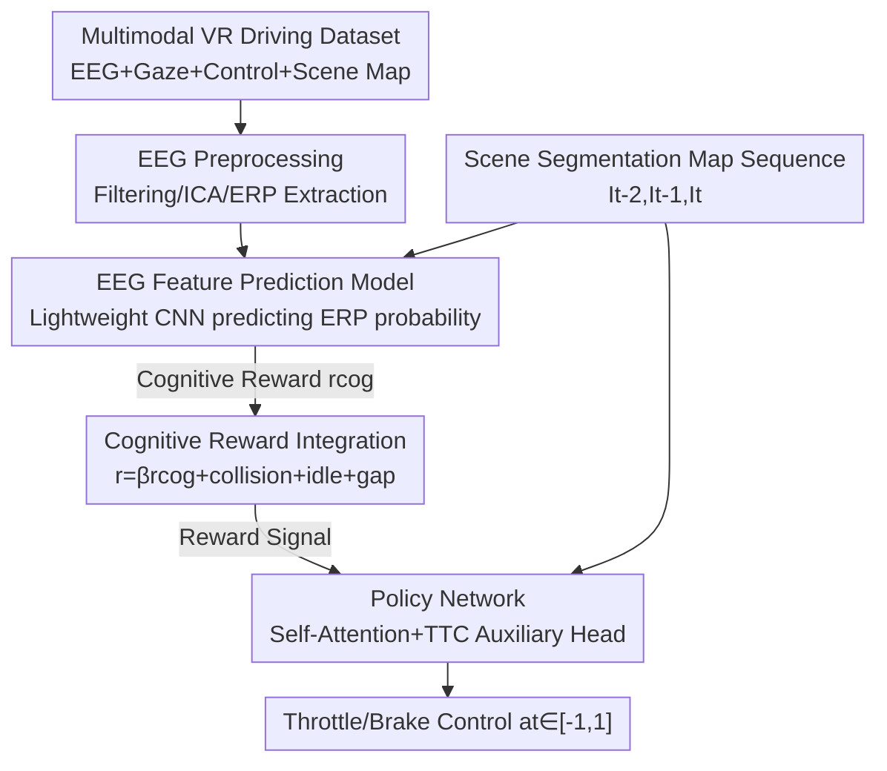

# Neuro-Cognitive Reward Modeling for Human-Centered Autonomous Vehicle Control

**Conference**: CVPR 2026  
**Paper**: [CVF Open Access](https://openaccess.thecvf.com/content/CVPR2026/html/Zhuang_Neuro-Cognitive_Reward_Modeling_for_Human-Centered_Autonomous_Vehicle_Control_CVPR_2026_paper.html)  
**Code**: Project page https://alex95gogo.github.io/Cognitive-Reward/  
**Area**: Autonomous Driving / Reinforcement Learning / Human Feedback Alignment  
**Keywords**: EEG, Event-Related Potential (ERP), Cognitive Reward, RLHF, Collision Avoidance

## TL;DR
This paper uses event-related potentials (ERPs) in electroencephalogram (EEG) signals as "human cognitive feedback." By training a lightweight CNN that directly predicts ERP intensity from scene images and using its output as a reward term in Reinforcement Learning (TD3), the autonomous driving agent learns safer and more human-like collision avoidance behaviors in two highly challenging scenarios (emergency braking and left turns). Crucially, EEG data acquisition is completely unnecessary during inference.

## Background & Motivation
**Background**: End-to-end autonomous driving (E2E-AD) leverages deep networks to directly map camera images to control signals, showing performance close to rule-based expert systems on the CARLA leaderboard. However, the dominant training paradigm for this approach is Imitation Learning (IL), which learns by reproducing expert trajectories.

**Limitations of Prior Work**: IL suffers from a notorious issue—distribution shift. The model only learns the specific distribution of expert demonstrations and lacks exposure to sufficient failure cases, making it prone to failure in out-of-distribution scenarios (e.g., sudden braking, interactive driving). Studies show that top-performing E2E-AD models on leaderboards perform poorly in interactive scenarios like emergency braking. This is fundamentally due to the lack of explicit guidance on "decision-making" and "interaction dynamics," resulting in mimicking trajectories mechanically rather than reasoning like a human.

**Key Challenge**: While Reinforcement Learning (RL) can mitigate distribution shift through trial and error, neither RL nor IL guarantees alignment with human expectations. RL blindly optimizes hand-designed reward functions, which often fail to capture the complexity of human values. Reinforcement Learning from Human Feedback (RLHF) is the mainstream solution for alignment, but traditional RLHF requires annotators to rank or perform pairwise comparisons on generated clips, which is both time-consuming and "indirect": such explicit scoring might not reflect a human's actual cognitive responses during driving. For instance, the RLHF baseline in this paper required approximately 10 hours of manual labor from three annotators to label 2,000 preference pairs.

**Goal**: To find a feedback signal that reflects human cognition, does not interrupt driving behavior, can be scaled up, and use it to train RL.

**Key Insight**: The authors target ERP—especially the positive peak P3 occurring 300–500ms after stimulus onset. Neuroscience has established P3 as a reliable biomarker of the brain's response to "unexpected, rare, or abrupt stimuli." Its amplitude increases with cognitive load (task difficulty), possesses millisecond-level temporal resolution, and can capture "covert attention" that eye-tracking cannot measure. Key observation: The authors found a significant positive correlation between the ERP peak latency and the driver's reaction time across 20 real driving subjects (Pearson $p=0.0438$), indicating that ERP indeed encoding "how critical the current moment is and how tense the driver feels."

**Core Idea**: Instead of collecting EEG in real-time during inference (which is unscalable, since ErrP only occurs after errors and introduces latency), it is better to train a network to **directly predict the occurrence of ERP from scene images** and feed this predicted probability as a "cognitive reward" into the RL reward function. By using images as a proxy, the EEG collection can be completely discarded during inference.

## Method

### Overall Architecture
The system addresses the question of "how to transform the human brain's instinctive reaction to danger into a reward usable by RL." It consists of three sequential phases: **first, collect EEG offline and extract ERP (only used when training the cognitive reward model) $\rightarrow$ train a lightweight CNN to predict the probability of ERP occurrence from scene segmentation maps to obtain the cognitive reward $r_\text{cog}$ $\rightarrow$ combine $r_\text{cog}$ and environmental rewards with weights to form a total reward, which guides TD3 training for a policy network with self-attention and a Time-to-Collision (TTC) auxiliary head**. During inference, only images, the policy network, and throttle/braking control remain, completely bypassing the EEG pipeline.

### Key Designs

**1. Multimodal VR Driving Dataset: Providing Ground-Truth EEG for "Critical Moments" to Cognitive Rewards**

To predict ERPs from images, paired image-ERP data is required. However, existing driving datasets either only contain eye-tracking or use flat screens; none collect active control, EEG, eye-tracking, and scene maps simultaneously. The authors utilized an HTC Vive Pro Eye VR headset, CARLA, and a Logitech G923 steering wheel and pedals to immerse subjects in real driving. A 64-channel Synamps2 system recorded EEG at 1000Hz. Ultimately, 20 out of 32 subjects were retained (12 were excluded due to VR motion sickness or insufficient engagement), yielding **720K frames** in total. This makes it the largest dataset in terms of frame count in Table 1, and the only one featuring active control, EEG, eye-tracking, and multimodal cameras (RGB/depth/semantic) simultaneously. Two scenarios were specifically designed to "induce failures": emergency braking (the lead vehicle travels at up to 8 m/s and suddenly brakes randomly 4–7 seconds after the previous event, with a tail vehicle adding pressure to create urgency) and left turns (turning left at an intersection while yielding to an oncoming vehicle driving at 3–5 m/s that refuses to yield). ERP analysis used "lead vehicle brake onset" as the event marker, and eye-tracking was used to filter out trials where the subject was not looking at the vehicle.

**2. EEG Feature Prediction Model: Mapping Brain Responses to Image-Inferred Cognitive Rewards**

This is the core component that eliminates the need for EEG during inference. The authors first binarize the ERP trials: using a sliding average filter with a window size of 20, they segment the trials into high-ERP and low-ERP categories using a **peak-to-peak threshold of 1.7 µV** (this threshold balances the training set to 50/50 and corresponds to the minimum ERP peak amplitude reported in the literature). They then design a **lightweight CNN with three convolutional layers and average pooling**, which takes a sequence of semantic segmentation maps as input and outputs a binary probability $\hat{y}_i$ representing whether the trial induces an ERP. This is trained using binary cross-entropy loss:

$$L_\text{BCE} = -\frac{1}{N}\sum_{i=1}^{N}\big[y_i\log(\hat{y}_i) + (1-y_i)\log(1-\hat{y}_i)\big]$$

where $y_i$ is the ground-truth label (1 for high ERP). The significance of the lightweight design is not just parameter reduction to prevent overfitting, but also **real-time execution**—it runs at 204 FPS, far exceeding backbones like ResNet-18, allowing it to be embedded as a pre-trained model directly into the RLHF loop without slowing down RL training. This $\hat{y}_i$ serves as the source for the cognitive reward $r_\text{cog}$ in the next step.

**3. Cognitive Reward Integration: Translating "High Cognitive Load" into Penalties via Negative Weights**

After predicting the ERP probability, how is it used? The authors model the task as a goal-oriented collision avoidance MDP $\{S,A,P,R\}$, where the state consists of three consecutive single-channel semantic segmentation maps $s_t=\{I_{t-2},I_{t-1},I_t\}$, and the action is a longitudinal control scalar $a_t\in[-1,1]$ ($-1$ for full braking, $1$ for full throttle). The key lies in the reward function, which integrates cognitive and environment signals:

$$r_t = \beta\, r_\text{cog}(s_t) + r_\text{collide}\cdot(s_t\in C_\text{collide}) + \omega\, r_\text{idle}\cdot(s_t\in C_\text{idle}) + \delta\, r_\text{gap}(s_t)$$

Here, $r_\text{cog}(s_t)$ is the ERP probability $\hat{y}_i$ predicted in the previous step. The weight $\beta=-1$ is **negative**—since a high ERP indicates that the brain perceives a high cognitive load or danger, the agent should be penalized for entering such states, guiding it away from situations that induce tension in human brains. The remaining terms are conventional environmental rewards: a heavy collision penalty $r_\text{collide}=-100$, a light idling penalty $r_\text{idle}=-1$ for speeds under 0.2 m/s, and a gap reward $r_\text{gap}$ to encourage maintaining an ideal car-following distance. The brilliance of this design is that human intuitive danger perception (ERP) is translated into a dense, differentiable reward shaping term, alleviating the sparse reward issue in RL.

**4. Policy Network with Self-Attention and TTC Auxiliary Head: Expanding Receptive Field and Regularizing with Time-to-Collision**

The policy network (Figure 3) takes three semantic segmentation maps $s_t\in\mathbb{R}^{h\times w\times 3}$ as input, encodes them into a feature map $F\in\mathbb{R}^{h/16\times w/16\times f}$ using a shallow CNN, flattens it to $N\in\mathbb{R}^{n\times f}$ ($n=\frac{h}{16}\times\frac{w}{16}$), and passes it through a self-attention layer to expand the receptive field: using fully connected layers $f_Q,f_K,f_V$ to obtain $Q,K,V$, it computes $\text{SelfAttention}=\text{softmax}(QK^\top/\sqrt{d})V$. Self-attention is added because collision avoidance requires "globally seeing where the lead vehicle is," for which the local receptive field of convolutions is insufficient. The network has **two MLP heads**: one outputs actions $a_t\in[-1,1]$, and the other outputs the Time-to-Collision (TTC) as an auxiliary regularization:

$$\text{TTC} = \text{clip}\big(\text{Dis}/(V_\text{ego}-V_\text{front}),\, 0,\, 5\big)$$

where Dis is the distance to the nearest vehicle, and TTC is clipped to $[0,5]$ seconds to focus the model on critical situations. The TTC head is aligned with the ground truth via MSE, and the total loss is $L_\text{total}=L_\pi + \alpha L_\text{mse}$ ($\alpha=0.1$, where $L_\pi$ is the RL policy loss). The role of the TTC auxiliary task is to inject a physical prior of "how many seconds until collision" into the policy, acting as a training regularizer. The RL algorithm itself uses TD3 (off-policy, which is more stable and sample-efficient for continuous control).

### Loss & Training
The cognitive reward model is trained using BCE (Eq. 1) with 5-fold cross-validation. The policy network is trained using $L_\text{total}=L_\pi+0.1\,L_\text{mse}$, where $L_\pi$ is the TD3 policy loss and $L_\text{mse}$ is the TTC auxiliary regression loss. RL is trained for 1M steps. To evaluate generalization, training and testing are conducted in different towns (emergency braking is trained in Town 7 and tested in Town 4; left turn is trained in Town 1 and tested in Town 5; ⚠️ note that another part of the dataset section mentions left turn training in Town01 testing in Town05, so the original text shall prevail), and five models are trained with five random seeds to obtain statistical metrics.

## Key Experimental Results

### Main Results
EEG feature prediction model 5-fold cross-validation accuracy (%) and inference speed comparison: Ours achieves the highest average accuracy and its FPS far exceeds other backbones, saving about 2.1 hours compared to ResNet-18 during 1M training steps.

| Method | F1 | F2 | F3 | F4 | F5 | Mean | FPS |
|------|----|----|----|----|----|------|-----|
| ResNet-18 | 82 | 89 | 79 | 79 | 76 | 81 | 73 |
| Swin-ViT | 80 | 85 | 75 | 80 | 77 | 79 | 62 |
| ConvNeXt | 82 | 89 | 75 | 81 | 76 | 80 | 74 |
| **Ours** | 80 | 85 | 77 | 86 | 81 | **82** | **204** |

Driving performance (emergency braking / left turn scenarios, three CARLA metrics, higher is better): Ours consistently leads in route completion rate, driving score, and infraction penalty score across both scenarios, especially in the emergency braking scenario.

| Method | EB Comp. ↑ | EB Score ↑ | EB Penalty ↑ | LT Comp. ↑ | LT Score ↑ | LT Penalty ↑ |
|------|------|------|------|------|------|------|
| Vanilla | 23 ± 27 | 16 ± 19 | 0.66 | 60 ± 16 | 45 ± 19 | 0.68 |
| BC | 65 ± 31 | 55 ± 29 | 0.72 | 48 ± 5 | 29 ± 3 | 0.62 |
| PHIL | 59 ± 23 | 44 ± 29 | 0.67 | 38 ± 32 | 31 ± 30 | 0.68 |
| RLHF | 73 ± 32 | 66 ± 39 | 0.80 | 63 ± 21 | 49 ± 28 | 0.71 |
| TD3-lag | 44 ± 33 | 35 ± 34 | 0.72 | 40 ± 28 | 32 ± 22 | 0.68 |
| **Ours** | **85 ± 43** | **79 ± 31** | **0.84** | **67 ± 8** | **57 ± 10** | **0.77** |

### Ablation Study
The paper does not provide a traditional component-removal ablation table. Instead, it utilizes control groups and visualization to justify the value of the cognitive reward. The table below summarizes several key comparative analyses:

| Analysis | Results | Description |
|------|------|------|
| ERP peak latency vs. reaction time | Pearson $p=0.0438$ | Significantly positively correlated, proving ERP encodes driving criticality |
| Active response vs. no-response ERP waveforms | Significant difference in the 300–500ms window | 10,000 permutation tests show higher P3 amplitude during active collision avoidance |
| Machine attention visualization | Consistently focused on the lead vehicle | Our policy network's attention focuses on the lead vehicle, whereas the baseline is more scattered |
| Is EEG required during inference? | No | ERP is predicted from images, omitting inference-time acquisition, making it more scalable |

### Key Findings
- **Cognitive reward terms contribute to safety improvements**: Compared to Vanilla RL, our method increases the driving score from 16 to 79 and the route completion rate from 23 to 85 in the emergency braking scenario, representing the largest improvement. This collision avoidance capability is guided precisely by $\beta=-1$, which treats "high cognitive load states" as penalties.
- **Predicting ERP from images is both fast and accurate**: The 82% average accuracy is comparable to or slightly higher than ResNet-18/Swin/ConvNeXt, but its 204 FPS allows it to be integrated into the RL loop, saving 2.1 hours over 1M steps of training. Maintaining accuracy while vastly increasing speed is key to making RLHF feasible.
- **Massively reduced human labor compared to traditional RLHF**: The RLHF baseline required approximately 10 hours of manual effort from three annotators to label 2,000 preference pairs, whereas our method leverages natural neural responses instead of explicit rankings, with zero EEG required at inference.
- **Self-attention allows the policy to "stare" at threats**: Machine attention maps show that the model consistently focuses on the lead vehicle across three timestamps, whereas the baseline has scattered attention, indicating that the cognitive reward improves the policy's internal representation.

## Highlights & Insights
- **Using "brain signals" instead of "mouse clicks" for preference feedback**: Traditional RLHF relies on manual sorting for preferences; this paper replaces it with the human brain's instinctive ERP response to danger. This is more direct, does not interrupt driving, and naturally contains continuous intensity information of "urgency," representing an elegant engineering of neuroscience's P3 knowledge into RL.
- **The "EEG for training, no EEG for inference" proxy paradigm**: By training an image $\rightarrow$ ERP predictor, the expensive and unscalable EEG acquisition is restricted to the training phase, while only images are needed during inference. This idea of "using an easily available modality to predict a difficult-to-obtain modality and using it as a reward" can be transferred to any human-in-the-loop task with physiological signals but limited deployment conditions (e.g., robotic teleoperation, assisted driving/medical devices).
- **Clever intuition behind negative weight rewards**: Setting $\beta=-1$ directly defines "situations that tense the human brain" as "to be penalized." This acts as a dense reward shaping term derived from human danger intuition, naturally mitigating the sparse reward problem in RL.
- **TTC auxiliary head is a low-cost regularizer**: Using collision time, which can be easily calculated from physical quantities, as auxiliary supervision injects temporal-danger priors into the policy at virtually zero additional annotation cost, acting as an effective training regularizer.

## Limitations & Future Work
- **Authors' acknowledged limitations**: The study only covers two scenarios and 20 subjects (sample size was constrained partly due to VR motion sickness). The EEG feature prediction model is **scene-specific**, presenting limited generalization. The authors propose using foveated rendering in the future to mitigate motion sickness to scale up data collection and train more general models with larger and more diverse datasets.
- **Self-identified limitations**: 
  1. Lacks a standard component-removal ablation table. The marginal contribution of the cognitive reward term can only be indirectly inferred from the overall comparison (Vanilla vs. Ours), making it impossible to precisely isolate the individual contributions of self-attention, the TTC auxiliary head, and the cognitive reward.
  2. Large error bars in the horizontal comparison across methods (e.g., Ours emergency braking completion rate of $85\pm43$). The high variance indicates that stability remains a challenge, with notable performance fluctuations across different seeds.
  3. Key hyperparameters, such as the ERP binarization threshold of 1.7 µV and $\beta=-1$, are heuristically set and lack sensitivity analysis.
  4. All experiments were conducted in CARLA simulation; real-world vehicle transfer has not been verified.

## Related Work & Insights
- **vs. Traditional RLHF (Manual Preference Ranking)**: Traditional RLHF requires annotators to compare clips pairwise and treats them with Bradley-Terry loss to train a preference model (as in the RLHF baseline here, taking 10 hours for 2,000 labels). Our method leverages natural ERP neural responses instead of explicit ranking, offering more immediate feedback without interrupting behaviors, and requires no human in the loop during inference.
- **vs. RL with ErrP/EEG Feedback**: Prior work using error-related potentials (ErrP) for RL feedback (e.g., grid-world navigation) typically **requires real-time EEG collection during inference**, and ErrP only occurs *after* errors occur, introducing correction delays. Our method predicts EEG features from images, avoiding continuous collection and enabling preemption based on visual cues before incidents happen.
- **vs. Predicting Brain Responses from Images (EEG/MEG/fMRI Encoding Models)**: Existing works mapping visual stimuli to brain activity are mostly used for neuroscience modeling. This paper is the first to use "image $\rightarrow$ ERP prediction" for **reward modeling** to serve downstream autonomous driving control.
- **vs. IL-based E2E-AD**: IL replicates expert trajectories and suffers from distribution shift, lacking decision reasoning. Our method utilizes RL with cognitive rewards, aligning with human danger intuition via trial and error to tackle out-of-distribution interactive scenarios like emergency braking and left turns.

## Rating
- Novelty: ⭐⭐⭐⭐⭐ First to introduce EEG/ERP to autonomous driving reward modeling; the "EEG for training, image for inference" proxy paradigm is highly novel.
- Experimental Thoroughness: ⭐⭐⭐⭐ Two scenarios, five baselines, 5-fold cross-validation, and attention visualization are relatively solid. But it lacks component-level ablations, has high variance, and is simulation-only.
- Writing Quality: ⭐⭐⭐⭐ The motivational chain is clear, the neuroscience background is well-articulated, and the formulation and reward design are described clearly.
- Value: ⭐⭐⭐⭐ Charts a scalable path for "human physiological signal-driven alignment," which has transfer value for human-in-the-loop RL.

<!-- RELATED:START -->

## Related Papers

- [\[CVPR 2026\] Bezier Degradation Modeling for LiDAR-based Human Motion Capture](bezier_degradation_modeling_for_lidar-based_human_motion_capture.md)
- [\[CVPR 2026\] CogDriver: Integrating Cognitive Inertia for Temporally Coherent Planning in Autonomous Driving](cogdriver_integrating_cognitive_inertia_for_temporally_coherent_planning_in_auto.md)
- [\[CVPR 2026\] ColaVLA: Leveraging Cognitive Latent Reasoning for Hierarchical Parallel Trajectory Planning in Autonomous Driving](colavla_leveraging_cognitive_latent_reasoning_for_hierarchical_parallel_trajecto.md)
- [\[AAAI 2026\] Unlocking Efficient Vehicle Dynamics Modeling via Analytic World Models](../../AAAI2026/autonomous_driving/unlocking_efficient_vehicle_dynamics_modeling_via_analytic_world_models.md)
- [\[CVPR 2026\] ResAD: Normalized Residual Trajectory Modeling for End-to-End Autonomous Driving](resad_normalized_residual_trajectory_modeling_for_end-to-end_autonomous_driving.md)

<!-- RELATED:END -->
