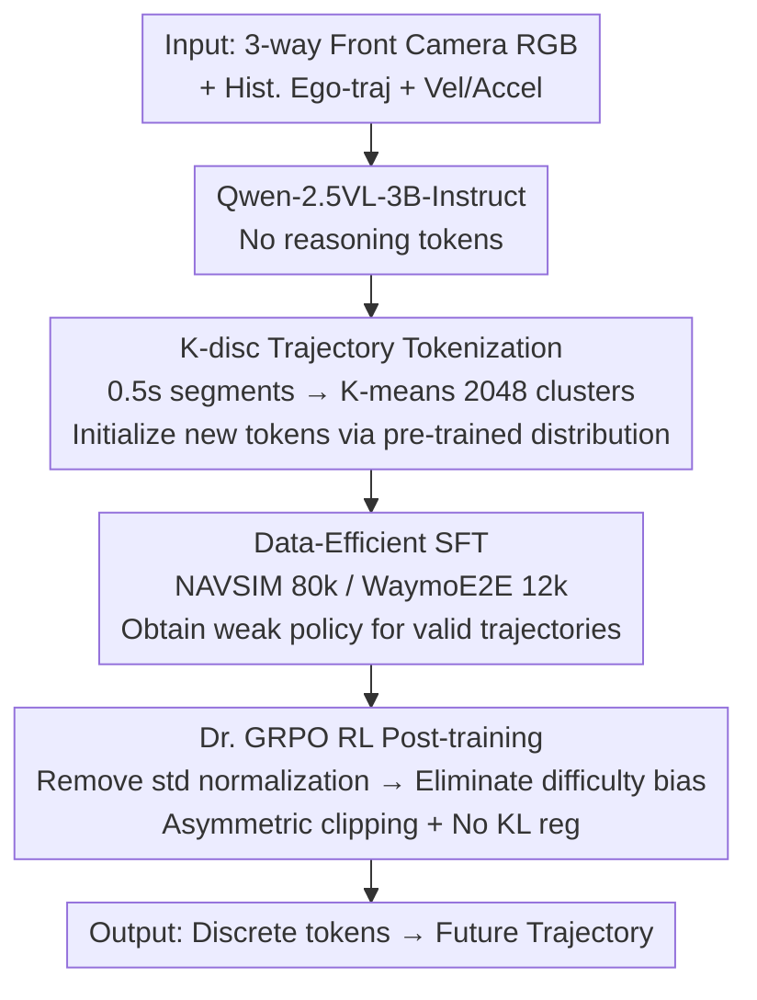

# NoRD: A Data-Efficient Vision-Language-Action Model that Drives without Reasoning

**Conference**: CVPR 2026  
**arXiv**: [2602.21172](https://arxiv.org/abs/2602.21172)  
**Code**: None  
**Area**: Autonomous Driving  
**Keywords**: VLA Model, Reasoning-free driving, Data-efficient, Dr.GRPO, RL Post-training

## TL;DR

NoRD demonstrates that autonomous driving VLAs do not require large-scale reasoning annotations or massive datasets. By identifying that the root cause of GRPO's failure on weak SFT policies is **difficulty bias** (where learning signals from high-variance rollout groups are suppressed), the authors adopt Dr. GRPO instead of standard GRPO for RL post-training. With <60% of data, no reasoning annotations, and 3× fewer tokens, it achieves performance competitive with reasoning-based VLAs on NAVSIM (85.6 PDMS) and WaymoE2E (7.709 RFS).

## Background & Motivation

**Triple Cost of the Mainstream VLA Paradigm**: The current standard training pipeline for autonomous driving VLA is "Large-scale SFT + CoT reasoning annotation + GRPO post-training." While models like AutoVLA are powerful, they require 212k+ samples, dense reasoning annotations (annotation cost), and generate reasoning tokens during inference, which increases latency. This triple cost (data, annotation, computation) is not scalable.

**Is Reasoning Necessary?**: Existing theoretical and empirical work questions the necessity of reasoning: (a) The "Reasoning-Planning Decoupling Hypothesis" suggests that text priors can match the performance of full multimodal reasoning; (b) RL does not create new reasoning capabilities but rather optimizes the existing distribution of the SFT model.

**Failure of Initial Attempts**: Training NoRD-base (Qwen-2.5VL-3B) with 80k samples (without reasoning annotations) followed by standard GRPO post-training yielded only a +0.67% improvement (76.66→77.18), whereas AutoVLA's GRPO provided a +9% boost. This initially seemed to prove that "reasoning data is indispensable."

**Key Insight — Difficulty Bias**: The failure of GRPO is not due to the weak SFT policy itself, but a systematic flaw in GRPO's advantage normalization mechanism. When the intra-group standard deviation $\text{std}$ is used as the denominator, the advantage of low-variance groups (simple or extremely difficult scenarios) is amplified, while the advantage of high-variance groups (medium difficulty, which constitute the majority) is suppressed. Weak SFT models happen to produce a large number of high-variance rollouts, preventing GRPO from learning from the primary samples.

## Method

### Overall Architecture

NoRD aims to verify a counterintuitive idea: whether an autonomous driving VLA can reach the performance level of reasoning-based models without large-scale data or CoT annotations. Its approach is to push the "driving capability" entirely into the reinforcement learning stage rather than relying on massive SFT data.

The pipeline is concise. RGB images from three forward-facing cameras (Front, Front-Left, Front-Right), historical ego-trajectories, and current velocity/acceleration are fed into Qwen-2.5VL-3B-Instruct. The model generates no reasoning tokens and directly outputs discrete tokens representing the future trajectory. Training begins with a small batch of data for SFT (80k samples for NAVSIM, 12k for WaymoE2E) to obtain a "weak policy," followed by RL post-training using Dr. GRPO. The key lies not in the architecture but in why standard GRPO fails while Dr. GRPO succeeds.

### Key Designs

**1. K-disc Trajectory Tokenization: Fitting continuous trajectories into VLM autoregressive vocabularies**

Trajectories are continuous values, while VLMs are designed for next-token prediction. NoRD interpolates all trajectories in the training set to 10Hz, cuts them into 0.5s segments, and uses K-means to cluster them into 2048 clusters. Each cluster center acts as a discrete "trajectory word." Predicting a future trajectory is thus reduced to "autoregressively selecting the next token from 2048," aligning with the model's inherent language modeling paradigm. A codebook size of 2048 balances trajectory precision and generalization.

New trajectory tokens cannot be inserted arbitrarily into the vocabulary. To align their embeddings with the pre-trained distribution, NoRD estimates a multivariate normal distribution (mean + covariance) from the existing Qwen tokens and samples from this distribution to initialize the new tokens.

**2. Difficulty Bias Analysis & Dr. GRPO: Preventing learning signals from being erased by variance**

This is the core contribution. After training NoRD-base with 80k non-reasoning samples, standard GRPO post-training resulted in only a +0.67% gain (76.66→77.18). The authors traced the issue to standard GRPO's advantage normalization:

$$\hat{A}_{i,t}^{\text{GRPO}} = \frac{r(o_i|x) - \frac{1}{G}\sum_{j=1}^G r(o_j|x)}{\text{std}_{j=1,\dots,G}(r(o_j|x))}$$

The problem lies in the intra-group standard deviation $\text{std}$. Reward distributions for weak SFT models are polarized: simple scenarios almost always get high scores (mean ≥0.8), and extremely difficult ones almost always fail (≤0.15), both resulting in low intra-group variance. However, medium-difficulty scenarios (0.2–0.65 reward), which are the majority, have high variance. Using $\text{std}$ as the denominator amplifies the gradients of simple/extreme groups while squashing signals from medium-difficulty groups. NoRD effectively only polishes "what it already knows," ignoring the critical samples. 

Dr. GRPO corrects this by removing the standard deviation normalization:

$$\hat{A}_{i,t}^{\text{DrGRPO}} = r(o_i|x) - \frac{1}{G}\sum_{j=1}^G r(o_j|x)$$

Without this amplifier, "difficult" samples in high-variance groups contribute gradients based on their true advantage, allowing the model to learn complex maneuvers like sharp turns and lane changes. Empirically, this modification increased the post-training gain from +0.67% to +11.68% (76.66→85.62). Stability is maintained using DAPO-style asymmetric clipping and by removing the KL divergence regularization to allow the weak policy sufficient exploration space.

**3. Data-Efficient SFT: Shifting the learning burden from SFT to RL**

Since Dr. GRPO can effectively optimize a weak policy, there is no need to pile up data in the SFT stage. NoRD uses only 80k samples on NAVSIM (vs. 212k+ for AutoVLA) and just 12k samples on WaymoE2E for SFT, plus 450 samples for RL post-training. This is intentional: SFT only brings the model to a starting point where it can output "legal" trajectories, while RL handles "driving well." This design successfully matches the performance of paradigms using large-scale data and reasoning annotations.

### Loss & Training

- **SFT Stage**: Standard next-token prediction cross-entropy loss.
- **RL Stage**: Dr. GRPO objective function. Rewards are derived from PDM score (NAVSIM) or RFS (WaymoE2E), plus auxiliary rewards for trajectory length and output format (weight 0.25), normalized to $[0,1]$.
- **Training Details**: SFT uses 16×A100, lr=5e-5, batch=128; RLFT uses 30/32 GPUs, lr=5e-6/1e-6, group size=8, sampling temperature 1.0.
- **Inference**: Deterministic sampling at temperature 0.01, with zero reasoning token overhead.

## Key Experimental Results

### Main Results

| Method | Reasoning? | Data Count | NAVSIM PDMS↑ | WaymoE2E RFS↑ | WaymoE2E ADE↓ |
|------|-------|--------|-------------|---------------|---------------|
| UniAD | N/A | - | 83.4 | - | - |
| DiffusionDrive | N/A | - | 88.1 | - | - |
| AutoVLA | Yes | 212K+ | 89.1 | 7.556 | 1.3507 |
| RecogDrive | Yes | 2.7M+ | 89.6 | - | - |
| Poutine | Yes | 212K+ | - | **7.986** | 1.2055 |
| **NoRD** | **No** | **<90K** | **85.6** | **7.709** | **1.2504** |

- On NAVSIM, NoRD-BoN (Best-of-N, N=6) reaches 92.4, surpassing AutoVLA-BoN (92.1).
- On WaymoE2E, NoRD ranks 3rd in RFS but is the only top model without reasoning tokens or ensembling.
- NoRD outperforms all competitors (including Poutine) in the ADE metric, proving high trajectory precision.

### Ablation Study

| Configuration | NAVSIM PDMS↑ | Note |
|------|-------------|------|
| NoRD-base (SFT only) | 76.66 | Weak SFT policy baseline |
| NoRD-base + GRPO | 77.18 (+0.67%) | GRPO is almost ineffective |
| NoRD-base + Dr. GRPO | **85.62 (+11.68%)** | Dr. GRPO successfully optimizes weak policy |

### Key Findings

- **GRPO failure on weak policies is caused by difficulty bias**: During training, GRPO only optimizes a few low-variance samples (known simple behaviors).
- **Dr. GRPO unlocks learning for medium-difficulty samples**: The group-mean distribution in the [0.2, 0.65] range shifts significantly, indicating the model learns complex maneuvers.
- **NoRD is the most token-efficient VLA**: No reasoning tokens means 3× token reduction and significantly lower inference latency.
- **High data efficiency**: On WaymoE2E, using only 12k samples (vs. 200k+ for Poutine), the RFS difference is only 0.277, with superior ADE.

## Highlights & Insights

- **First to introduce difficulty bias to AD VLAs**: Adapting Dr. GRPO from the LLM reasoning domain to autonomous driving is highly effective.
- **Challenges the "Reasoning Necessity" hypothesis**: Empirical results refute the popular view that VLAs must have CoT reasoning for high performance.
- **Diagnosis methodology for training failure**: Analyzing distribution characteristics (mean-variance relationship) of rollout rewards provides a generalizable way to diagnose RL optimization.
- **Pareto Frontier Analysis**: NoRD occupies a unique position of high efficiency and high performance on the efficiency-performance trade-off plot.

## Limitations & Future Work

- **Absolute performance gap**: There remains a -3.5 point gap between NoRD (85.6) and AutoVLA (89.1) on NAVSIM. Reasoning data may still help in certain edge cases.
- **Dr. GRPO is not perfect**: The paper admits it only mitigates rather than eliminates difficulty bias.
- **Fixed Model Size**: Performance of larger/smaller models and scaling analysis were not explored.
- **Limited Sensor Suite**: Only uses 3 front cameras; ignoring rear and side views may limit performance in complex traffic.
- **Future Directions**: (a) Better reward shaping to mitigate polarized distributions; (b) Hybrid training with small amounts of reasoning data; (c) Expansion to closed-loop evaluation.

## Related Work & Insights

- **vs. AutoVLA**: NoRD achieves competitive performance with <40% of the data and no reasoning tokens, proving reasoning is not a necessity.
- **vs. EMMA/SimLingo**: Previous reasoning-free VLAs were only validated on simple benchmarks (nuScenes); NoRD is the first to prove feasibility on complex benchmarks like NAVSIM and WaymoE2E.
- **vs. LLM Reasoning Domain**: Dr. GRPO was originally designed for difficulty bias in math reasoning; this is the first verification of its effectiveness in AD dense reward settings.
- **Insight**: The potential of RL post-training is severely underestimated based on SFT scale assumptions; correct optimization algorithms can substitute for massive data.

## Rating

- Novelty: ⭐⭐⭐⭐⭐ 
- Experimental Thoroughness: ⭐⭐⭐⭐ 
- Writing Quality: ⭐⭐⭐⭐⭐ 
- Value: ⭐⭐⭐⭐⭐ 

<!-- RELATED:START -->

## Related Papers

- [\[CVPR 2026\] HybridDriveVLA: Vision-Language-Action Model with Visual CoT reasoning and ToT Evaluation for Autonomous Driving](hybriddrivevla_vision-language-action_model_with_visual_cot_reasoning.md)
- [\[CVPR 2026\] Drive My Way: Preference Alignment of Vision-Language-Action Model for Personalized Driving](drive_my_way_preference_alignment_of_vision-language-action_model_for_personaliz.md)
- [\[CVPR 2026\] Learning Vision-Language-Action World Models for Autonomous Driving](vla_world_learning_vision_language_action_world_models_for_autonomous_driving.md)
- [\[CVPR 2026\] DriveMoE: Mixture-of-Experts for Vision-Language-Action Model in End-to-End Autonomous Driving](drivemoe_mixture-of-experts_for_vision-language-action_model_in_end-to-end_auton.md)
- [\[CVPR 2026\] Unifying Language-Action Understanding and Generation for Autonomous Driving](unifying_language-action_understanding_and_generation_for_autonomous_driving.md)

<!-- RELATED:END -->
