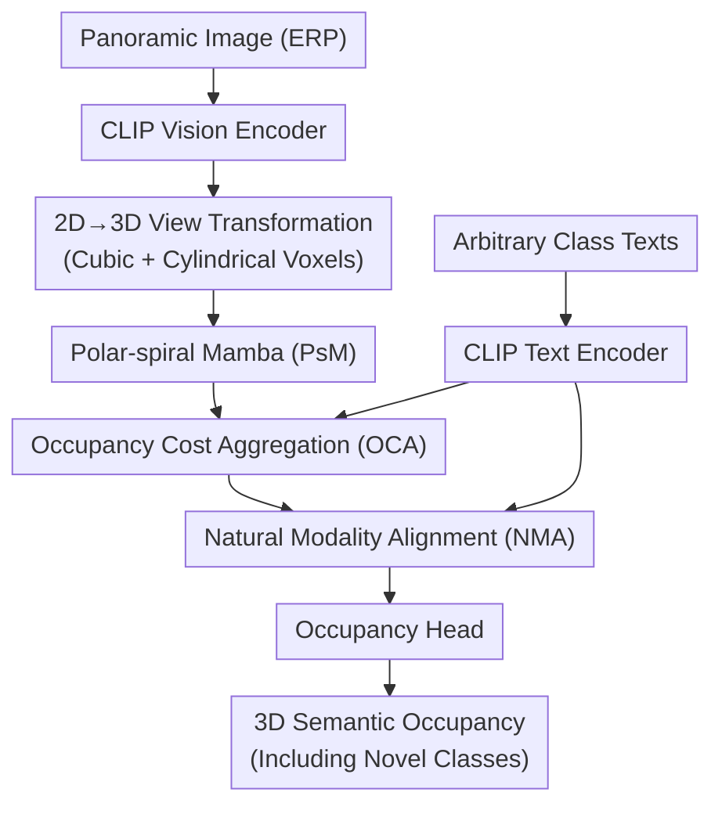

# O3N: Omnidirectional Open-Vocabulary Occupancy Prediction

**Conference**: CVPR 2026  
**arXiv**: [2603.12144](https://arxiv.org/abs/2603.12144)  
**Code**: [GitHub](https://github.com/) (Coming soon)  
**Area**: Autonomous Driving  
**Keywords**: Omnidirectional Perception, Open-Vocabulary, Occupancy Prediction, Panoramic Image, Mamba

## TL;DR

O3N proposes the first omnidirectional open-vocabulary occupancy prediction task and designs a vision-only end-to-end framework: Polar-spiral Mamba (PsM) models panoramic geometric continuity via spiral scanning in polar coordinates; Occupancy Cost Aggregation (OCA) constructs a voxel-text matching cost volume to prevent overfitting caused by direct feature alignment; Natural Modality Alignment (NMA) aligns pixel-voxel-text embeddings through gradient-free random walks. O3N achieves 16.54 mIoU and 21.16 Novel mIoU (SOTA) on QuadOcc, significantly outperforming the OVO baseline.

## Background & Motivation

**Background**: Omnidirectional images (360° panoramas) are indispensable in autonomous driving and embodied AI, providing complete spatial coverage and semantic continuity. 3D semantic occupancy prediction elevates 2D vision to 3D space, serving as the foundation for precise spatial reasoning.

**Limitations of Prior Work**:
   - **Perspective Constraints**: Most existing occupancy prediction methods rely on multi-view surround cameras (e.g., nuScenes), which are unsuitable for robots and embodied agents using a single panoramic camera.
   - **Closed Vocabulary**: Current methods can only recognize predefined semantic categories from training, failing to generalize to unknown objects in the open world (e.g., misclassifying boxes as roads or dogs as bicycles).

**Key Challenge**: Equirectangular Projection (ERP) introduces severe geometric distortions—regions farther from the viewpoint occupy smaller image areas (latitude distortion + extension distortion). This leads to: (a) uneven pixel-voxel mapping; (b) simple tri-modal feature alignment strategies easily overfitting to seen semantics and misaligning novel class semantics.

**Goal**: O3N defines the **omnidirectional open-vocabulary occupancy prediction** task—taking a single panoramic RGB image and arbitrary class name texts as input to output 3D semantic occupancy (including unseen categories)—and proposes the first vision-only end-to-end framework.

## Method

### Overall Architecture

O3N aims to achieve open-vocabulary 3D occupancy prediction using a single panoramic camera: it must accurately reconstruct spatial geometry under 360° views while identifying categories unseen during training. The pipeline utilizes a CLIP vision encoder to extract image features from the ERP panorama and a CLIP text encoder to encode arbitrary class names. Subsequently, 2D-to-3D view transformation generates both Cartesian cubic voxels and polar cylindrical voxels, which are fed into a 3D decoder integrated with PsM. Finally, OCA and NMA modules align voxel features with text embeddings, followed by an occupancy head outputting semantic labels for each voxel.

The three core modules manage specific tasks: PsM ensures geometric continuity under panoramic distortion, OCA prevents open-vocabulary semantics from overfitting to seen classes, and NMA bridges the modality gap between CLIP text and vision.

### Key Designs

**1. Polar-spiral Mamba (PsM): Continuous panoramic geometry in polar coordinates**

Panoramic imaging suffers from inherent discontinuities at the angular boundaries of cylindrical voxels in polar coordinates, especially near poles. Standard 3D convolutions cannot adapt to this topology, and Transformers are computationally expensive. PsM employs a dual-branch architecture: the polar branch compresses cylindrical voxels $\mathbf{V}_p \in \mathbb{R}^{C \times R \times P \times Z}$ into BEV features $\mathbf{B}_p \in \mathbb{R}^{C \times R \times P}$, then uses P-SMamba for spiral scanning—the scan path starts from the pole with increasing radii, serializing voxels along the spiral line. The Cartesian branch retains cubic voxels $\mathbf{V}_c \in \mathbb{R}^{C \times H \times W \times D}$. These representations are fused via resampling based on precomputed polar-Cartesian projections:

$$\mathbf{V}_f^i = \mathbf{V}_c^i + \Phi_{\rho(c)}(\mathbf{V}_p^i)$$

Spiral scanning works because its density distribution matches panoramic imaging—dense sampling near the viewpoint and sparse far away. This preserves spatial continuity in polar regions while maintaining linear complexity (only +0.03GB VRAM).

**2. Occupancy Cost Aggregation (OCA): Cost volumes to prevent seen-class overfitting**

Direct hard alignment of voxel and text features often leads to overfitting seen semantics. OCA constructs a voxel-text matching cost volume. For each voxel embedding $V_i$ and text embedding $T_l$, the cosine similarity defines the occupancy cost $C(i,l) = \frac{V_i \cdot T_l}{\|V_i\| \|T_l\|}$. This cost volume passes through 3D convolutions for initial encoding, ASPP for multi-scale aggregation, and a Linear Transformer for inter-class aggregation. The model learns relative matching relationships rather than fixed mappings.

A Scene Affinity Loss $\mathcal{L}_{oca}$ supervises this process by measuring precision, recall, and specificity to ensure voxels of the same class aggregate while different classes separate, incorporating scene structural information.

**3. Natural Modality Alignment (NMA): Gradient-free alignment of text and semantic prototypes**

A modality gap exists between CLIP image and text embeddings, exacerbated by panoramic projection errors. NMA utilizes a gradient-free Random Walk iteration for alignment. It maintains base class semantic prototypes using EMA: $\mathbf{P}_t^b = \alpha \cdot \mathbf{P}_{t-1}^b + (1-\alpha) \cdot \bar{\mathbf{f}}_{seg}$, calculates the affinity $\mathcal{S} = \lambda \frac{\mathbf{T}_t^0 \cdot \mathbf{P}_t^0}{\|\mathbf{T}_t^0\| \|\mathbf{P}_t^0\|}$, and allows prototypes and text embeddings to alternate until convergence. The steady state has a closed-form solution via Neumann series:

$$\mathbf{T}_t^\infty = (1-\beta)(\mathbf{I} - \beta^2 \mathcal{A})^{-1}(\beta \mathcal{S} \mathbf{P}_t^0 + \mathbf{T}_t^0)$$

Since the iteration involves no gradients, it bridges the gap without being biased by the training distribution.

### Loss & Training

- **Total Loss**: $\mathcal{L} = \mathcal{L}_{occ} + \mathcal{L}_{vox-pix} + \mathcal{L}_{oca}$
    - $\mathcal{L}_{occ}$: Cross-entropy + geometric/semantic scene-class affinity loss + focal point loss.
    - $\mathcal{L}_{vox-pix}$: Voxel-pixel feature alignment loss (from OVO).
    - $\mathcal{L}_{oca}$: Scene affinity loss (base class voxels only).
- **Mechanism**: Base classes are predicted directly by the occupancy head; novel classes are determined by a combination of OCA probabilities and the similarity between distilled voxel embeddings $\mathbf{V}$ and novel text embeddings.
- **Training Config**: MonoScene backbone, 25 epochs, 4×RTX3090, batch size 4.

## Key Experimental Results

### Main Results (QuadOcc Validation Set)

| Method | Type | mIoU | Novel mIoU | Base mIoU |
|------|------|------|-----------|-----------|
| MonoScene (Fully Supervised) | Camera | 19.19 | 25.56 | 12.82 |
| OneOcc (Fully Supervised) | Camera | 20.56 | 27.53 | 13.59 |
| OVO (Open-Vocabulary) | Camera | 14.33 | 18.15 | 10.52 |
| **O3N (Ours)** | Camera | **16.54** | **21.16** | **11.92** |

- O3N outperforms OVO by +2.21 mIoU and +3.01 Novel mIoU.
- The Novel mIoU (21.16) surpasses several fully supervised methods like SSCNet (20.13) and OccFormer (20.04).

### Ablation Study

| Configuration | Novel mIoU | Base mIoU | mIoU | FPS | Memory (GB) |
|------|-----------|-----------|------|-----|---------|
| Baseline | 18.06 | 10.90 | 14.48 | 10.67 | 4.28 |
| + PsM | 18.59 (+0.53) | 11.05 | 14.82 | 9.98 | 4.31 |
| + PsM + OCA | 19.78 (+1.72) | 11.02 | 15.40 | 9.71 | 4.86 |
| + PsM + OCA + NMA | **21.16 (+3.10)** | **11.92** | **16.54** | 9.41 | 4.97 |

### Key Findings

- **PsM**: Spiral scanning in polar coordinates brings +0.53 Novel mIoU with negligible overhead (+0.03GB).
- **OCA**: The main performance driver, contributing +1.72 Novel mIoU by reducing overfitting.
- **Efficiency**: The full O3N maintains 9.41 FPS, supporting quasi-real-time inference.
- **Generalization**: Results on the H3O dataset show consistent improvements (mIoU 23.39 $\to$ 24.25).

## Highlights & Insights

- **Pioneering Task Definition**: First to propose omnidirectional open-vocabulary occupancy prediction for embodied intelligence.
- **Geometric Insight**: PsM's spiral path design matches the information density of ERP—dense near視点 and sparse far away—elegantly solving ERP distortion.
- **Gradient-Free Alignment**: NMA uses Random Walk and Neumann series to bridge the modality gap without the risk of overfitting the training distribution.
- **Versatility**: O3N acts as a modular framework compatible with different occupancy backbones (e.g., MonoScene, SGN).

## Limitations & Future Work

- **Scene Scale**: Limited to a small number of semantic classes (6-10); challenges with hundreds of classes remain untested.
- **Novel Class Proportion**: In QuadOcc, novel classes already represent a significant portion of the scene, making generalization requirements relatively controlled.
- **Single Frame**: Temporal information is not utilized; multi-frame input could enhance performance.
- **Future Directions**: (a) Scaling to larger vocabularies; (b) Temporal modeling; (c) Integrating with LLMs for interactive scene understanding.

## Related Work & Insights

- **vs. OVO**: While OVO uses frozen 2D segmenters and CLIP distillation, O3N adds OCA and NMA to specifically handle overfitting and modality gaps.
- **vs. OneOcc**: OneOcc handles panoramic occupancy but is limited to a closed vocabulary; O3N extends this to open-world scenarios.
- **vs. CAT-Seg**: OCA borrows the cost aggregation concept from 2D open-vocabulary segmentation and adapts it to 3D voxel space.

## Rating

- Novelty: ⭐⭐⭐⭐⭐ 
- Experimental Thoroughness: ⭐⭐⭐⭐ 
- Writing Quality: ⭐⭐⭐⭐ 
- Value: ⭐⭐⭐⭐ 

<!-- RELATED:START -->

## Related Papers

- [\[CVPR 2026\] Monocular Open Vocabulary Occupancy Prediction for Indoor Scenes (LegoOcc)](monocular_open_vocabulary_occupancy_prediction_for_indoor_scenes.md)
- [\[CVPR 2026\] Open-Vocabulary Domain Generalization in Urban-Scene Segmentation](open-vocabulary_domain_generalization_in_urban-scene_segmentation.md)
- [\[CVPR 2026\] Panoramic Multimodal Semantic Occupancy Prediction for Quadruped Robots](panoramic_multimodal_semantic_occupancy_prediction.md)
- [\[CVPR 2026\] An Instance-Centric Panoptic Occupancy Prediction Benchmark for Autonomous Driving](an_instance-centric_panoptic_occupancy_prediction_benchmark_for_autonomous_drivi.md)
- [\[CVPR 2026\] Generalizing Visual Geometry Priors to Sparse Gaussian Occupancy Prediction](generalizing_visual_geometry_priors_to_sparse_gaussian_occupancy_prediction.md)

<!-- RELATED:END -->
