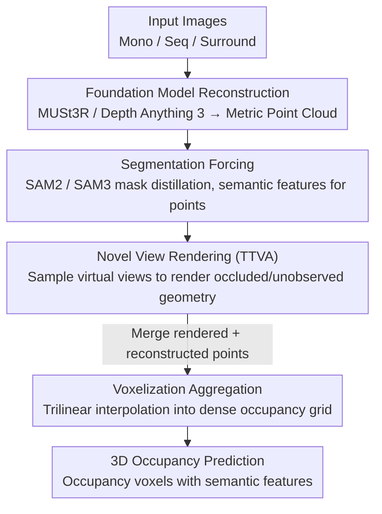

# OccAny: Generalized Unconstrained Urban 3D Occupancy

**Conference**: CVPR 2026  
**arXiv**: [2603.23502](https://arxiv.org/abs/2603.23502)  
**Code**: [https://github.com/valeoai/OccAny](https://github.com/valeoai/OccAny)  
**Area**: Autonomous Driving  
**Keywords**: 3D Occupancy Prediction, Generalization, Unconstrained Scenes, Visual-Geometric Foundation Models, Semantic Segmentation

## TL;DR

OccAny proposes the first generalized unconstrained urban 3D occupancy prediction framework, capable of predicting metric-scale occupancy voxels from monocular, sequential, or multi-view images in uncalibrated, out-of-distribution scenes. Through two key designs—Segmentation Forcing and Novel View Rendering—it outperforms all visual-geometric baselines on KITTI and nuScenes.

## Background & Motivation

**Background**: 3D occupancy prediction is a core perception task in autonomous driving, aiming to jointly estimate the occupancy states and semantic labels of dense voxels. Existing methods like SurroundOcc and OccFormer have achieved strong results on nuScenes-Occ and SemanticKITTI.

**Limitations of Prior Work**: (1) Existing methods rely heavily on in-distribution labeled data and precise sensor calibration (intrinsic and extrinsic parameters), failing to generalize to new scenes; (2) Visual-geometric foundation models (e.g., DUSt3R, Depth Anything) possess strong generalization but lack geometric completion capabilities for urban scenes (occluded areas) and metric-level prediction accuracy; (3) No unified framework exists to simultaneously support sequential, monocular, and multi-view surround-view input modes.

**Key Challenge**: High-precision occupancy prediction requires proprietary data and calibration, yet these priors are often unavailable in practical applications. A gap exists between the universality of visual foundation models and the specialization required for urban occupancy prediction.

**Goal**: To build the first "unconstrained" 3D occupancy prediction framework capable of generating metric occupancy predictions and semantic features from arbitrary camera configurations in completely uncalibrated out-of-distribution scenes.

**Key Insight**: The authors observe that the strong generalized reconstruction capabilities of visual-geometric foundation models (MUSt3R/Depth Anything 3) can be combined with the semantic power of large-scale segmentation models (SAM2/SAM3), bridging the gap in urban scenes through specialized training strategies.

**Core Idea**: Propose Segmentation Forcing to compel the model to learn occupancy representations consistent with segmentation, and Novel View Rendering to achieve geometric completion via virtual view synthesis, thereby constructing a unified framework that maintains generalization while adapting to urban scenarios.

## Method

### Overall Architecture

OccAny addresses a practical contradiction: occupancy prediction requires metric-level completion in urban scenes, but traditional methods rely on in-distribution 3D labels and precise calibration, failing when cities or camera setups change. Conversely, visual-geometric foundation models (MUSt3R, Depth Anything 3) generalize well but lack geometric completion for urban scenes and do not output semantics. OccAny's approach "stitches" these models together—using foundation models for reconstruction and segmentation models for semantics—bridging the urban scene gap with specific training and inference strategies.

The pipeline follows two steps. First, **Reconstruction**: A visual-geometric foundation model recovers a metric 3D point cloud from input images (monocular, sequential, or multi-view), while a large-scale segmentation model (SAM2/SAM3) assigns semantic features to each point. Second, **Completion & Voxelization**: Novel View Rendering infers geometry for occluded and unobserved regions by rendering from a set of virtual camera views. These "imagined" points are merged with the original reconstructed points, and finally, trilinear interpolation is used to aggregate the point clouds into an occupancy grid. The framework has two variants—OccAny (MUSt3R + SAM2) and the upgraded OccAny+ (Depth Anything 3 + SAM3)—allowing for holistic upgrades by swapping backbones.

### Key Designs

**1. Segmentation Forcing: Enabling Geometric Reconstruction to Learn Urban Semantics**

Using raw reconstructed point clouds from foundation models is problematic as they lack fine-grained semantic differentiation; occupancy voxels cannot distinguish between road surfaces and vehicles. During training, Segmentation Forcing uses masks from SAM2/SAM3 as supervision: for each mask, the features of all 3D points within the covered area are distilled into a consistent semantic vector, forcing alignment between reconstruction outputs and segmentation masks in the feature space. Thus, geometry and semantics are learned jointly. Each reconstructed point possesses both coordinates and a SAM-aligned semantic feature, allowing occupancy voxels to have both shape and mask-level instance differentiation.

**2. Novel View Rendering: "Imagining" Occluded Geometry at Inference**

Scenes captured from a few real perspectives naturally contain blind spots from occlusions, limiting occupancy recall. Novel View Rendering is a test-time augmentation (TTA): using the trained geometric model and starting from the existing reconstruction, a set of virtual camera views is sampled via random rotation and translation. Depth maps and point clouds are rendered from these new views, then merged with the original reconstruction. This requires no additional training, effectively allowing the model to "peek" behind objects during inference. In ablations, this contributed the most to Geometric IoU gains (approx. 3-4 absolute points). The trade-off is inference speed, as the number of virtual views can be high (150-180 in some settings).

**3. Voxelization Aggregation: Merging Multi-view Point Clouds via Trilinear Interpolation**

The reconstruction and Novel View Rendering stages produce two sets of point clouds (each with coordinates and semantic features) that must be mapped to a dense voxel grid. OccAny merges these point maps into a single cloud and uses trilinear interpolation for aggregation. Semantic features of each point are weighted and assigned based on their distance to surrounding voxel centers, rather than a hard projection to the nearest grid. This ensures smoother, more reliable occupancy values in dense regions and continuous occupancy estimation in sparse areas via interpolation.

### A Complete Example: Converting a KITTI Sequence to an Occupancy Grid

Consider a 5-frame KITTI sequence: The model first uses MUSt3R (or Depth Anything 3 in OccAny+) to reconstruct the frames into a metric 3D point cloud, while SAM2/SAM3 assigns segmentation features. At this stage, the cloud only covers surfaces directly visible to the camera—vehicle rears and occluded roads are empty. Next, Novel View Rendering samples dozens to hundreds of virtual views around the cloud to render and infer missing depth and points. The point cloud grows from "front-only" to a more complete structure. Finally, all points (original + rendered) are fed into the voxel grid using trilinear interpolation to determine occupancy and semantics. Through this process, IoU rises from 24.03 (single frame) to 25.91 (5 frames), with Novel View Rendering providing the largest boost (dropping to ~22 without it).

### Loss & Training

The training consists of two stages: (1) The reconstruction stage uses a regression loss on metric depth for geometric prediction, combined with a feature distillation loss from Segmentation Forcing for semantic alignment; (2) The rendering stage trains the model's depth prediction capability from virtual viewpoints. Both stages utilize joint training on multiple driving datasets (Waymo, VKITTI, DDAD, PandaSet, ONCE) to enhance generalization. OccAny is trained using 16 x A100 (40G).

## Key Experimental Results

### Main Results

| Dataset/Setting | Metric | OccAny | OccAny+ | Prev. Best Baseline | Description |
|------------|------|--------|---------|-------------|------|
| KITTI 5-frame Geo | IoU | 25.91 | 27.33 | <25 | Outperforms all geometric baselines |
| nuScenes Surround Geo | IoU | 34.15 | 33.49 | <33 | No in-distribution labels needed |
| KITTI 5-frame Sem (distill) | mIoU / mIoU^SC | 7.30/13.54 | 6.49/13.31 | - | Segmentation Forcing |
| nuScenes Surround Sem (distill) | mIoU / mIoU^SC | 6.65/10.31 | 7.20/11.51 | - | OccAny+ is superior |
| KITTI 5-frame Sem (pretrained) | mIoU / mIoU^SC | 7.62/13.75 | 8.03/13.17 | - | Using pretrained segmentation |
| nuScenes Surround Sem (pretrained) | mIoU / mIoU^SC | 7.42/10.78 | 9.45/12.22 | - | OccAny+ significantly leads |

### Ablation Study

| Configuration | KITTI IoU | Description |
|------|----------|------|
| OccAny Full (5-frame) | 25.91 | Complete model |
| w/o Novel View Rendering | ~22 | Significant drop without virtual rendering |
| w/o Segmentation Forcing | ~24 | Notable decrease in semantic quality |
| OccAny+ Full (DA3+SAM3) | 27.33 | Further gains from stronger foundation models |
| 1-frame vs 5-frame | 24.03 vs 25.91 | Sequential input provides additional cues |

### Key Findings

- Novel View Rendering is the largest contributor to Geometric IoU, providing ~3-4 points of absolute gain.
- OccAny+ using Depth Anything 3 (1.1B) + SAM3 provides the best results, though OccAny (MUSt3R + SAM2) remains competitive.
- The framework demonstrates extreme generalization, achieving performance close to in-distribution self-supervised methods even in completely out-of-distribution settings (unseen KITTI/nuScenes).
- Regarding depth estimation, OccAny+ recon 1.1B achieves an AbsRel of only 9.58% on KITTI, far surpassing the original DA3's 33.28%.
- Ego-trajectory evaluation (ADE): OccAny+ recon 1.1B reaches 0.90, surpassing DA3 1.1B's 1.12.

## Highlights & Insights

- **First Truly Generalized 3D Occupancy Prediction Framework**: Working directly without target-domain labels, calibration, or fine-tuning is highly valuable for real-world deployment.
- **Novel View Rendering as Test-Time Augmentation (TTA)**: An elegant design that adds no training complexity, instead "imagining" unseen perspectives during inference to complete geometry. This concept is transferable to other 3D reconstruction tasks.
- **Modular Design**: Geometric reconstruction and semantic segmentation are handled by specialized foundation models, bridged by Segmentation Forcing. Upgrading foundation models naturally upgrades the entire system.

## Limitations & Future Work

- Slow inference speed: Some settings require rendering 150-180 virtual views, leading to high latency on a single GPU.
- Absolute semantic mIoU remains low (7-9%), with a significant gap compared to supervised methods, primarily due to the alignment quality between SAM features and specific semantic classes.
- Completion via virtual rendering may be limited in dense urban scenes with heavy occlusions (e.g., narrow alleys).
- Currently only supports static scenes; temporal consistency for dynamic objects (pedestrians, vehicles) is not modeled.

## Related Work & Insights

- **vs SurroundOcc / OccFormer**: These require in-distribution 3D labels and precise calibration. OccAny achieves zero-shot generalization; while absolute precision is slightly lower, its versatility is far superior.
- **vs DUSt3R / MASt3R**: Foundation models provide strong generalized reconstruction but lack occupancy completion and semantics. OccAny adds segmentation fusion and Novel View Rendering on top.
- **vs Depth Anything 3**: DA3 provides strong monocular depth; OccAny+ uses it as a geometric backbone, proving the framework's flexibility.
- The Segmentation Forcing approach is similar to knowledge distillation but applied to geometric-semantic alignment, which could benefit other 3D perception tasks.

## Rating

- Novelty: ⭐⭐⭐⭐⭐ First generalized unconstrained 3D occupancy framework with two innovative core designs.
- Experimental Thoroughness: ⭐⭐⭐⭐⭐ Covers KITTI and nuScenes, three input modes, and includes reconstruction and trajectory evaluations.
- Writing Quality: ⭐⭐⭐⭐ Clear logic, though method details are somewhat complex.
- Value: ⭐⭐⭐⭐⭐ High real-world deployment value, addressing the core generalization bottleneck of 3D occupancy prediction.

<!-- RELATED:START -->

## Related Papers

- [\[CVPR 2026\] CCF: Complementary Collaborative Fusion for Domain Generalized Multi-Modal 3D Object Detection](ccf_complementary_collaborative_fusion_for_domain_generalized_multi-modal_3d_obj.md)
- [\[CVPR 2026\] ProOOD: Prototype-Guided Out-of-Distribution 3D Occupancy Prediction](proood_prototype-guided_out-of-distribution_3d_occupancy_prediction.md)
- [\[CVPR 2026\] Gau-Occ: Geometry-Completed Gaussians for Multi-Modal 3D Occupancy Prediction](gau-occ_geometry-completed_gaussians_for_multi-modal_3d_occupancy_prediction.md)
- [\[CVPR 2026\] QueryOcc: Query-based Self-Supervision for 3D Semantic Occupancy](queryocc_query-based_self-supervision_for_3d_semantic_occupancy.md)
- [\[CVPR 2026\] TT-Occ: Test-Time 3D Occupancy Prediction](test-time_3d_occupancy_prediction.md)

<!-- RELATED:END -->
