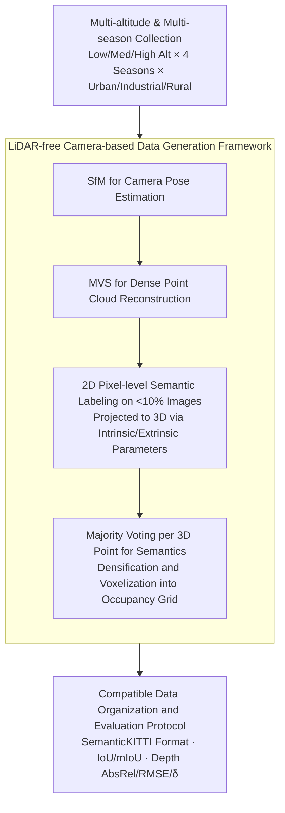

# OccuFly: A 3D Vision Benchmark for Semantic Scene Completion from the Aerial Perspective

**Conference**: CVPR 2026 (Oral)  
**arXiv**: [2512.20770](https://arxiv.org/abs/2512.20770)  
**Code**: [https://github.com/markus-42/occufly](https://github.com/markus-42/occufly) (Available, code release pending)  
**Area**: Autonomous Driving / 3D Vision  
**Keywords**: Semantic Scene Completion, Aerial Perspective, UAV, Benchmark Dataset, Depth Estimation

## TL;DR

OccuFly introduces the first real-world camera-based Semantic Scene Completion (SSC) benchmark from an aerial perspective. It contains over 20,000 samples and 21 semantic categories, covering urban, industrial, and rural scenes across various seasons and altitudes, while revealing the fundamental limitations of current vision foundation models in aerial environments.

## Background & Motivation

**Background**: Semantic Scene Completion (SSC) is a critical task for 3D perception, aiming to jointly estimate dense voxel occupancy and semantic categories from partial observations. SSC has been extensively studied in ground-based autonomous driving, driven by benchmarks like SemanticKITTI and nuScenes-Occ.

**Limitations of Prior Work**: (1) SSC research is almost exclusively focused on ground vehicle perspectives, leaving aerial (UAV) scenarios largely unexplored. This limits the development of downstream UAV tasks like obstacle avoidance, path planning, and 3D mapping; (2) Acquiring aerial SSC data faces unique challenges: most UAVs cannot carry LiDAR due to flight regulations and payload limits, and high-altitude LiDAR point clouds are extremely sparse; (3) Existing SSC dataset generation relies heavily on LiDAR sensors, making it difficult to transfer directly to camera-only aerial scenarios.

**Key Challenge**: Aerial UAVs require 3D scene understanding for autonomous flight, yet they lack adapted SSC benchmarks and methods. SSC data and models from ground perspectives cannot be directly transferred due to massive perspective differences (top-down vs. eye-level).

**Goal**: (1) Design a LiDAR-free, camera-based data generation framework for automated aerial SSC data construction; (2) Release OccuFly as the first aerial SSC benchmark based on this framework; (3) Benchmark existing SSC and depth estimation methods on OccuFly to reveal unique challenges in aerial scenarios.

**Key Insight**: The authors propose using classical 3D reconstruction (SfM + MVS) to obtain dense point clouds from aerial image sequences, then "lifting" semantic labels from a small subset of annotated images (<10%) into the 3D point cloud by projection. This bypasses the reliance on LiDAR.

**Core Idea**: Replace LiDAR with camera-based 3D reconstruction for SSC annotation data generation, combined with a sparse annotation propagation strategy to build the first aerial SSC benchmark and systematically evaluate current performance.

## Method

### Overall Architecture

The construction process of OccuFly is divided into three steps: (1) Data Collection—using UAVs to capture image sequences at different altitudes (low/medium/high) and across different seasons (Spring, Summer, Autumn, Winter) in urban, industrial, and rural environments; (2) 3D Reconstruction and Annotation—utilizing SfM and MVS to reconstruct dense point clouds from image sequences, performing pixel-level semantic annotation on less than 10% of the images, and projecting these 2D annotations into 3D space. The resulting 3D cloud is then densified and voxelized into semantic occupancy grids; (3) Benchmarking—evaluating various SSC and monocular depth estimation methods on OccuFly.

### Key Designs

**1. Multi-altitude and Multi-season Collection: Encoding "Aerial-Specific Difficulty" into the data distribution**

The fundamental difference between aerial and ground perspectives is that observation distance and coverage area change drastically with flight altitude. The same object occupies different pixel counts and geometric details at low versus high altitudes. OccuFly collects data at low, medium, and high altitudes to create a gradient of FOV and ground resolution. It also spans four seasons to include drastic appearance changes such as vegetation, lighting, and snow cover across three typical environment types. The resulting dataset of 20k+ samples and 21 categories is designed to measure robustness through diversity.

**2. LiDAR-free Camera-based Data Generation: Replacing expensive LiDAR labels with 3D reconstruction and annotation propagation**

The primary hurdle for aerial SSC is the inability to acquire dense point clouds via LiDAR as ground vehicles do—UAVs are often restricted by weight and regulations, and high-altitude LiDAR provides extremely sparse data. OccuFly bypasses LiDAR entirely: it uses Structure-from-Motion (SfM) for pose estimation and Multi-View Stereo (MVS) for dense reconstruction, deriving geometry solely from cameras. To reduce costs, only <10% of images are pixel-labeled. By using known camera parameters, these 2D labels are back-projected to the 3D point cloud. Each 3D point determines its semantic category via majority voting of all hitting projections. This strategy builds a full 3D semantic set with minimal manual labeling.

**3. Compatible Data Organization and Evaluation Protocol: Ensuring plug-and-play usability**

To lower the barrier for adoption, OccuFly adopts a data format compatible with SemanticKITTI, providing standardized image-voxel-depth triplets and fixed train/val/test splits. Metric alignment with the community includes geometric IoU and semantic mIoU for SSC, and AbsRel, RMSE, and $\delta$ thresholds for depth estimation. This allows researchers to migrate existing models to aerial scenarios with minimal code changes.

### Loss & Training

OccuFly serves as a benchmark dataset and does not propose a new training method. In benchmark experiments, SSC models were trained using cross-voxel Cross-Entropy (CE) loss, while depth estimation models used standard Scale-Invariant Log Loss.

## Key Experimental Results

### Main Results (SSC Benchmarking)

| Method | Type | Geometric IoU | Semantic mIoU | Notes |
|------|------|---------|----------|------|
| MonoScene | Monocular SSC | ~15 | ~5 | Ground method performance drops significantly |
| VoxFormer | Monocular SSC | ~18 | ~6 | Slightly better than MonoScene |
| TPVFormer | Multi-view SSC | ~20 | ~7 | Multi-view helps slightly |
| OccFormer | Multi-view SSC | ~22 | ~8 | Current SOTA on aerial scenes |

### Depth Estimation Benchmarking

| Method | AbsRel ↓ | RMSE ↓ | $\delta < 1.25$ ↑ | Notes |
|------|---------|------|---------|------|
| Depth Anything v2 | ~0.25 | ~8.5 | ~65% | Significant degradation of VFM on aerial images |
| Metric3D v2 | ~0.22 | ~7.8 | ~70% | Metric depth models perform slightly better |
| ZoeDepth | ~0.28 | ~9.2 | ~60% | Poor transfer from indoor pre-training |
| Ground-truth Upper Bound | 0 | 0 | 100% | Reference |

### Key Findings

- All SSC methods excelling on ground data show a substantial performance drop in aerial scenarios, with mIoU generally below 10%.
- Current vision foundation models (e.g., Depth Anything v2) underperform in aerial depth estimation compared to ground scenes, with AbsRel increasing by approximately 2-3x.
- High-altitude data is more challenging than low-altitude data due to smaller ground targets and larger depth ranges.
- Seasonal variations, particularly winter snow, significantly impact both SSC and depth estimation methods.
- OccuFly reveals a critical gap: existing methods are severely insufficient at modeling top-down geometry.

## Highlights & Insights

- **Filling the data gap in aerial 3D perception**: OccuFly is the first aerial SSC benchmark, crucial for UAV autonomous flight and urban mapping. The construction method itself—LiDAR-free camera-only generation—is a major contribution.
- **Sparse annotation propagation is practical**: Achieving full 3D annotation by labeling only <10% of images is a scalable approach for building 3D datasets in new domains.
- Systemic benchmarking identifies fundamental limitations in current methods, providing a roadmap for aerial 3D perception research. The CVPR 2026 Oral recognition highlights its value in pioneering a new domain.

## Limitations & Future Work

- Code and data are not yet fully public, limiting community verification.
- SfM+MVS-based annotation relies on high-quality reconstruction; noise may occur in textureless or repetitive regions like farmlands or water.
- 21 semantic categories may lack granularity (e.g., no subdivision of building or vehicle types).
- Limited geographic coverage; generalization across different climates and urban morphologies requires further validation.
- Annotation of dynamic targets (pedestrians, cars) may be affected by motion blur and reconstruction failures.

## Related Work & Insights

- **vs. SemanticKITTI**: SemanticKITTI is the gold standard for ground SSC but is LiDAR-driven and limited to ground viewpoints. OccuFly extends SSC to aerial views without LiDAR.
- **vs. nuScenes-Occ**: Also ground-based with surround cameras. OccuFly uses UAV-mounted cameras with entirely different perspectives and scenes.
- **vs. ScanNet / Matterport3D**: Indoor 3D benchmarks using RGB-D. OccuFly’s pure RGB reconstruction faces higher challenges in large-scale outdoor scenes.
- The LiDAR-free generation framework serves as a reference for satellite remote sensing and robotic exploration.

## Rating

- Novelty: ⭐⭐⭐⭐⭐ First aerial SSC benchmark, pioneering research direction (Oral).
- Experimental Thoroughness: ⭐⭐⭐⭐ Benchmarked across both SSC and depth estimation tasks with multiple methods.
- Writing Quality: ⭐⭐⭐⭐ Clear construction pipeline and insightful challenge analysis.
- Value: ⭐⭐⭐⭐⭐ Establishes a baseline for aerial 3D perception, highly valuable for the UAV community.

<!-- RELATED:START -->

## Related Papers

- [\[CVPR 2026\] Sparsity-Aware Voxel Attention and Foreground Modulation for 3D Semantic Scene Completion](sparsity-aware_voxel_attention_and_foreground_modulation_for_3d_semantic_scene_c.md)
- [\[AAAI 2026\] Towards 3D Object-Centric Feature Learning for Semantic Scene Completion](../../AAAI2026/autonomous_driving/towards_3d_object-centric_feature_learning_for_semantic_scene_completion.md)
- [\[AAAI 2026\] Unleashing Semantic and Geometric Priors for 3D Scene Completion](../../AAAI2026/autonomous_driving/unleashing_semantic_and_geometric_priors_for_3d_scene_completion.md)
- [\[ECCV 2024\] Hierarchical Temporal Context Learning for Camera-based Semantic Scene Completion](../../ECCV2024/autonomous_driving/hierarchical_temporal_context_learning_for_camera-based_semantic_scene_completio.md)
- [\[ECCV 2024\] GaussianFormer: Scene as Gaussians for Vision-Based 3D Semantic Occupancy Prediction](../../ECCV2024/autonomous_driving/gaussianformer_scene_as_gaussians_for_vision-based_3d_semantic_occupancy_predict.md)

<!-- RELATED:END -->
