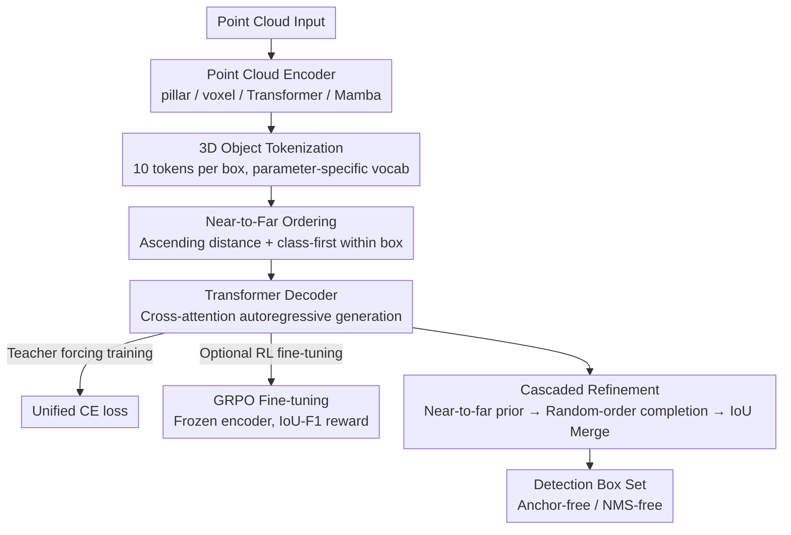

# On the Feasibility and Opportunity of Autoregressive 3D Object Detection

**Conference**: CVPR 2026 Findings  
**arXiv**: [2603.07985](https://arxiv.org/abs/2603.07985)  
**Code**: To be confirmed  
**Area**: Autonomous Driving / 3D Object Detection  
**Keywords**: Autoregressive detection, LiDAR 3D detection, sequence generation, tokenization, GRPO reinforcement learning, NMS-free

## TL;DR

AutoReg3D is proposed as the first framework to model LiDAR 3D object detection as autoregressive sequence generation. By utilizing near-to-far ordering and parameter-specific vocabularies to discretize bounding boxes into token sequences, it achieves performance competitive with mainstream methods without requiring anchors or NMS, while unlocking new capabilities such as RL fine-tuning and cascaded refinement.

## Background & Motivation

1.  **Complexity of Traditional Detection Pipelines**: Existing LiDAR 3D detectors follow a "propose-then-classify" paradigm, relying on manual components like anchor assignment, proposal matching, confidence thresholds, and NMS, which complicates training and leads to information loss.
2.  **Redundancy from Independent Predictions**: Spatial positions predict boxes independently, resulting in numerous overlapping boxes that necessitate NMS for deduplication, an process that inherently discards valid detections.
3.  **Difficulty in Composing with LLMs**: Rigid detection pipelines hinder composability with downstream modules like Large Language Models (LLMs), limiting the scalability of 3D perception.
4.  **Progress in 2D Autoregressive Detection**: Works like Pix2Seq have verified the feasibility of the sequence generation paradigm in 2D detection, but 3D scenes remain more challenging due to high dimensionality, continuous geometric discretization, and large spatial scales.
5.  **LiDAR's Natural Near-to-Far Causal Structure**: Proximal objects occlude distal ones, providing a natural deterministic ordering axis for autoregressive modeling that is superior to the random ordering used in 2D.
6.  **Direct Transfer of Sequence Modeling Ecosystem**: If detection is modeled as sequence generation, language model techniques such as RL fine-tuning (GRPO), beam search, and test-time scaling can be directly applied to 3D perception.

## Method

### Overall Architecture

AutoReg3D aims to validate the feasibility of treating LiDAR 3D detection entirely as "autoregressive sequence generation," thereby discarding the manual pipeline of anchors, proposal matching, and NMS. It employs an encoder-decoder architecture: an arbitrary point cloud encoder (Pillar/Voxel/Transformer/Mamba) extracts scene features, while a 6-layer Transformer decoder autoregressively generates tokens via cross-attention. The sequence starts with `[start]` and ends with `[end]`, naturally outputting a variable-length set of detection boxes. This transforms detection into a language model-like generation problem. The pipeline discretizes boxes into tokens (Design 1), organizes them into a near-to-far sequence (Design 2), generates them via the decoder, and uses dual-order complementarity for refinement (Design 3):

### Key Designs

**1. 3D Object Tokenization: Discretizing continuous boxes with parameter-specific vocabularies**

To treat detection as sequence generation, continuous 3D boxes must be discretized into tokens. Each object is encoded as 10 tokens $\{class, tx, ty, tz, tl, tw, th, tψ, tvx, tvy\}$. Quantization granularity is set to 0.05m for center/size, 0.05rad for yaw, and 0.1m/s for velocity. Crucially, each parameter uses an independent vocabulary rather than a shared one like Pix2Seq. Given the distinct value ranges and semantics of centers, sizes, orientations, and velocities, separate modeling better fits each distribution. The total vocabulary size is 6,819 tokens (including class/start/end/pad).

**2. Near-to-Far Ordering: Leveraging LiDAR's causal occlusion for deterministic generation**

Autoregressive generation Requires a sequential order. While 2D methods (e.g., Pix2Seq) often rely on random ordering, LiDAR possess a natural causal structure where near objects occlude far ones. Thus, objects are ordered by ascending distance from the sensor. This allows proximal objects to provide context for distal ones. Within each object, a "class-first" order is used, where the category provides a condition for subsequent geometric attributes. This strategy is a core insight: ablation shows near-to-far ordering (F1=65.8) significantly outperforms point-count ordering (61.8) and random ordering (56.3).

**3. Cascaded Refinement: Complementarity for mitigating missed detections**

The near-to-far model provides high precision but may struggle to recover distant or sparse objects if the sequence terminates prematurely. Conversely, random-order models offer better coverage but lower precision. Cascaded refinement uses the near-to-far model to generate initial detections, then employs the random-order model to fill gaps. Finally, IoU clustering merges the two. This "Prior $\rightarrow$ Completion" strategy achieves an F1 of 66.2, exceeding the Prior-only (65.8) and Completion-only (56.3) baselines.

### Loss & Training

Training uses teacher forcing: ground truth sequences are ordered near-to-far and used as input. A single cross-entropy loss is shared across all token types, eliminating the need for separate loss designs and weights for center, size, orientation, and velocity.

Furthermore, GRPO reinforcement learning fine-tuning is applied: the encoder is frozen, and only the autoregressive detection head is optimized. For each scene, $G=8$ detection sequences are sampled. The reward is designed as an IoU-based F1 score—calculating the maximum IoU between GT and predicted boxes per category, followed by the harmonic mean of Precision and Recall. The GRPO objective ($\beta=0$, no KL penalty) directly optimizes the set-level detection quality, primarily improving Recall (+1.5) and F1 (+0.9).

## Key Experimental Results

### Main Results: nuScenes Validation Set F1 (Table 1)

| Encoder | Method | Precision | Recall | F1 |
|--------|------|-----------|--------|----|
| Pillar Conv. | CenterPoint | 67.9 | 53.3 | 59.5 |
| Pillar Conv. | **AutoReg3D** | **69.6** | 52.4 | 59.2 |
| Voxel Conv. | CenterPoint | 72.8 | 60.3 | 65.8 |
| Voxel Conv. | **AutoReg3D** | **74.9** | 59.4 | **65.8** |
| Transformer | DSVT | 79.1 | 66.3 | **71.6** |
| Transformer | **AutoReg3D** | 77.0 | 64.1 | 69.5 |
| Mamba | LION | 78.6 | 68.3 | **72.5** |
| Mamba | **AutoReg3D** | 77.5 | 65.2 | 70.4 |

- AutoReg3D matches CenterPoint's F1 with a Voxel encoder and achieves higher precision with a Pillar encoder.
- While a ~2 F1 gap exists on Transformer/Mamba encoders, the Precision-Recall points remain on or outside the baseline PR curves.

### Ablation Study: RL Fine-tuning (Table 2)

| Stage | Precision | Recall | F1 |
|------|-----------|--------|----|
| Teacher Forcing | 74.9 | 59.4 | 65.8 |
| + GRPO | 74.5 | **60.9** | **66.7** |

GRPO primarily boosts Recall (+1.5), leading to a 0.9 improvement in F1.

### Key Findings

- **Ordering Strategy**: Near-to-far (F1=65.8) >> point-count (61.8) >> random (56.3).
- **Intra-token Ordering**: class-first (65.8) > class-middle (65.2) > class-last (64.9).
- **Decoding Method**: Beam Search (66.1) $\ge$ Greedy (65.8) >> Nucleus (61.9).
- **Cascaded Refinement**: Prior $\rightarrow$ Completion (66.2) > Prior only (65.8) > Completion only (56.3).
- **Occlusion Robustness**: Under high occlusion (0-40% visibility), F1 improves by +4.1%, while remaining stable under low occlusion.

## Highlights & Insights

- **First fully autoregressive LiDAR 3D detector**, proving the feasibility of the sequence generation paradigm in 3D detection.
- **Near-to-far ordering** is a core insight, leveraging the causal structure of LiDAR geometry, which is fundamentally more advantageous than random ordering in 2D.
- **Complete removal of NMS/anchors/confidence thresholds** greatly simplifies the detection pipeline.
- **Unified CE loss** replaces multi-head regression losses, resulting in cleaner training.
- **Direct adaptation of GRPO** for task-aligned RL fine-tuning further enhances F1.
- Superior performance in high-occlusion scenes demonstrates the advantage of conditional generation for modeling inter-object dependencies.

## Limitations & Future Work

- **Slow Inference Speed**: Even with bf16 and KV cache, the system reaches only 1-2 Hz for a single scene (voxel backbone), falling short of real-time requirements.
- **Performance Gap on Advanced Encoders**: A ~2 F1 gap persists compared to DSVT/LION, suggesting the autoregressive head has yet to fully match non-autoregressive Transformer heads.
- **Systematically Lower Recall**: The sequence termination mechanism may stop too early, missing distant or sparse objects.
- **Unexplored Model Scaling**: Due to compute constraints, only a 6-layer Transformer decoder was used, leaving scaling laws unverified.
- **Limited Evaluation**: Testing has only been conducted on nuScenes, without validation on larger datasets like Waymo or Argoverse.
- **Metric Constraints**: The absence of confidence scores prevents reporting standard mAP/NDS, restricting evaluation to F1/Precision/Recall.

## Related Work & Insights

| Method | Dimension | Autoregressive Range | NMS | Multi-encoder Compatible |
|------|------|-----------|-----|------------|
| Pix2Seq (2021) | 2D | Fully Autoregressive | ✗ | ✗ |
| Point2Seq (2022) | 3D | Attribute-only | ✓ | ✗ |
| CenterPoint (2021) | 3D | Non-Autoregressive | ✓ | ✓ |
| DETR3D-style | 3D | Non-Autoregressive Query | ✗ | ✗ |
| **AutoReg3D** | **3D** | **Fully Autoregressive** | **✗** | **✓** |

- Key difference from Point2Seq: Point2Seq is only autoregressive in the attribute dimension while remaining parallel across BEV positions; AutoReg3D is autoregressive across the object dimension.
- Key difference from Pix2Seq: 3D scenes allow for natural near-to-far ordering (vs. random in Pix2Seq) and require handling a higher-dimensional parameter space.

## Rating

- **Novelty**: ⭐⭐⭐⭐ — First full autoregressive sequence generation in LiDAR 3D detection; near-to-far ordering insight is elegant and powerful.
- **Experimental Thoroughness**: ⭐⭐⭐⭐ — Four encoders, comprehensive ablations, RL fine-tuning, and occlusion analysis, though limited to nuScenes.
- **Writing Quality**: ⭐⭐⭐⭐ — Clear structure, intuitive pseudocode and PR curves, and well-reasoned motivation.
- **Value**: ⭐⭐⭐⭐ — Bridges 3D detection and the sequence modeling ecosystem; inference speed remains the primary hurdle for practical use.

<!-- RELATED:START -->

## Related Papers

- [\[CVPR 2026\] A Prediction-as-Perception Framework for 3D Object Detection](a_prediction-as-perception_framework_for_3d_object_detection.md)
- [\[CVPR 2026\] CoIn3D: Revisiting Configuration-Invariant Multi-Camera 3D Object Detection](coin3d_revisiting_configuration-invariant_multi-camera_3d_object_detection.md)
- [\[CVPR 2026\] RaGS: Unleashing 3D Gaussian Splatting from 4D Radar and Monocular Cue for 3D Object Detection](rags_unleashing_3d_gaussian_splatting_from_4d_radar_and_monocular_cue_for_3d_obj.md)
- [\[CVPR 2026\] R4Det: 4D Radar-Camera Fusion for High-Performance 3D Object Detection](r4det_4d_radar-camera_fusion_for_high-performance_3d_object_detection.md)
- [\[CVPR 2026\] TACO: Task-Aware Contrastive Learning for Joint LiDAR Localization and 3D Object Detection](taco_task-aware_contrastive_learning_for_joint_lidar_localization_and_3d_object_.md)

<!-- RELATED:END -->
