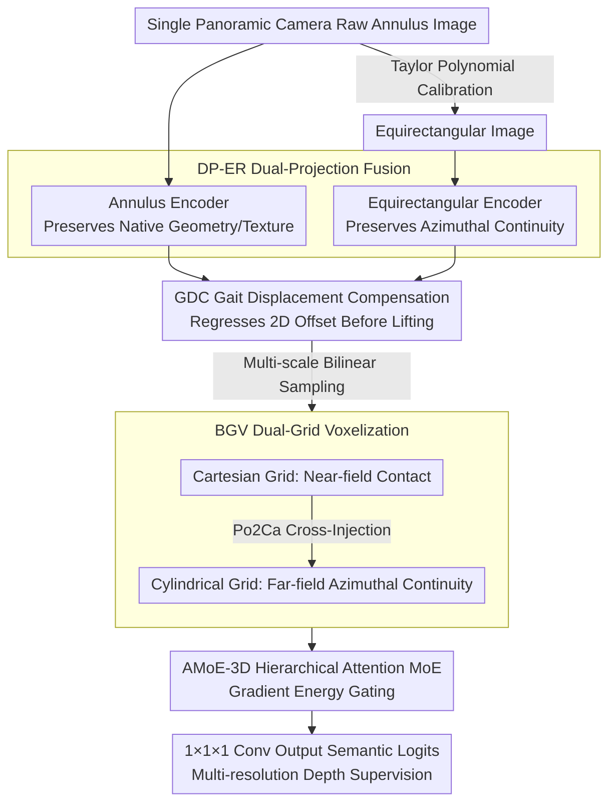

# OneOcc: Semantic Occupancy Prediction for Legged Robots with a Single Panoramic Camera

**Conference**: CVPR 2026  
**arXiv**: [2511.03571](https://arxiv.org/abs/2511.03571)  
**Code**: Available  
**Area**: Autonomous Driving  
**Keywords**: Semantic Scene Completion, Panoramic Camera, Legged Robots, Voxel Occupancy Prediction, Gait Compensation  

## TL;DR

OneOcc is a vision-only panoramic semantic occupancy prediction framework designed for legged/humanoid robots. By integrating dual-projection fusion, dual-grid voxelization, gait displacement compensation, and a hierarchical mixture-of-experts decoder, it achieves 360° semantic scene completion using only a single panoramic camera, outperforming LiDAR baselines on real-world quadruped and simulated humanoid datasets.

## Background & Motivation

### 1. Background

Semantic Scene Completion (SSC) aims to predict complete 3D voxel semantics from partial observations and has become a core task in autonomous driving. From LiDAR-based methods (SSCNet → LMSCNet → SCPNet) to vision-based approaches (MonoScene → VoxFormer → OccFormer), SSC has made significant progress on **wheeled platforms**. However, most mainstream SSC methods assume forward-facing pinhole/fisheye sensors and stable wheeled chassis motion, which are difficult to transfer to legged robot scenarios.

### 2. Limitations of Prior Work

Legged/humanoid robots face three major challenges: **(1)** Gait jitter—impactful foot contacts and micro roll/pitch movements caused by agile gaits disrupt feature-to-voxel mapping and temporal consistency; **(2)** 360° omnidirectional perception requirements—navigating rugged and complex terrain requires all-around situational awareness rather than just a forward field of view; **(3)** Payload/power constraints—the budget for sensors and computational resources on legged platforms is much lower than that of autonomous vehicles.

### 3. Key Challenge

Existing SSC systems are designed for wheeled platforms, relying on forward-facing pinhole sensors and stable motion assumptions. Legged platforms require a **single-sensor panoramic** solution and must address **annular distortion and seam artifacts** inherent to panoramic images, as well as **feature-voxel mapping phase errors** caused by gait motion.

### 4. Goal

Design a lightweight, vision-only, gait-jitter-resistant 360° semantic occupancy prediction framework for legged/humanoid robots, while establishing an evaluation benchmark for this scenario.

### 5. Key Insight

Leverage the **dual-projection characteristics** of panoramic cameras (raw annulus vs. equirectangular) and **dual-coordinate voxelization** (Cartesian vs. cylindrical). Utilize their complementarity to resolve panoramic distortion and near-far field imbalances, and eliminate gait errors through learnable displacement compensation before feature lifting.

### 6. Core Idea

Four plug-and-play modules work in synergy: DP-ER (Dual-Projection Encoder Fusion) preserves annular continuity and grid alignment; BGV (Dual-Grid Voxelization) balances near-field precision and far-field azimuthal continuity; GDC (Gait Displacement Compensation) corrects phase errors before feature lifting; and AMoE-3D (Hierarchical Attention Mixture-of-Experts) achieves scale-adaptive anisotropic 3D fusion.

## Method

### Overall Architecture

OneOcc enables a legged/humanoid robot with a single panoramic camera to complete the 360° world into semantic 3D voxels despite severe gait jitter. The pipeline operates in a single forward pass: First, the raw annulus image captured by the camera is unfolded into an equirectangular image using a Taylor polynomial calibration model, maintaining both "original geometry" and "azimuthal expansion" representations. Next, the DP-ER (Dual-Projection Encoder) uses two 2D backbones to process these images, outputting features at three scales {1/4, 1/8, 1/16}. Before lifting 2D features to 3D, GDC regresses a 2D displacement to suppress gait phase errors. Then, BGV performs bilinear sampling and cross-injection across Cartesian and cylindrical voxel grids to obtain 3D voxel features that balance near and far fields. Finally, a three-layer depthwise-separable AMoE-3D UNet aggregates multi-scale evidence using attention-MoE, and a 1×1×1 convolution outputs per-voxel semantic logits with multi-resolution depth supervision. The four modules (DP-ER / GDC / BGV / AMoE-3D) are plug-and-play, specifically targeting "distortion, jitter, near-far imbalance, and anisotropy" in legged panoramic scenarios.

### Key Designs

**1. DP-ER Dual-Projection Fusion: Resolving the panoramic dilemma of "geometry loss vs. convolution difficulty"**

Panoramic images contain conflicting signals: high resolution at the equator but severe distortion at the poles. Using only equirectangular images preserves azimuthal continuity but distorts native geometry. Using only raw annulus images preserves texture but makes standard convolutions difficult to align. DP-ER processes both—one 2D encoder handles the raw annulus for local texture, while the other handles the equirectangular image for azimuthal continuity, balancing resolution and receptive field trade-offs across scales.

**2. GDC Gait Displacement Compensation: Suppressing phase errors before voxel quantization**

The impact of legged gaits and micro tilts causes phase errors in feature-to-voxel mapping. Correcting this after voxelization is difficult as errors are already "fixed" by quantization. GDC regresses a 2D displacement $\Delta_s = (dx, dy)$ using a zero-initialized linear layer on each projection path, directly adjusting 2D sampling coordinates before lifting. This avoids quantization loss and reduces computational overhead. Zero-initialization (inspired by ControlNet) ensures $\Delta_s \approx 0$ at the start of training, maintaining baseline performance in the absence of jitter.

**3. BGV Dual-Grid Voxelization: Cartesian for foot placement, Cylindrical for surroundings**

Legged robot decisions are split between near-field contact geometry (foot placement) and far-field scene layout (navigation). Cartesian grids $(x, y, z)$ are precise for near-field contacts but suffer from angular resolution decay in the far-field. Cylindrical grids $(r, \varphi, z)$ naturally align their azimuthal angle $\varphi$ with the horizontal axis of panoramic images, preserving far-field continuity. BGV samples features into both grids and uses pre-computed indices to re-sample cylindrical context into the Cartesian grid (Po2Ca cross-mapping), fusing near-field precision with far-field continuity.

**4. AMoE-3D Hierarchical Attention Mixture-of-Experts: Scale-adaptive anisotropic 3D fusion**

Panoramic scenes are highly anisotropic, with rapid azimuthal changes and sparse vertical structures. AMoE-3D employs dual-path volumetric saliency (channel gate $A_c$ and spatial gate $A_s$) followed by GradEnergy3D, which calculates 3D gradient energy to gate $K$ experts (1×1×1 Conv-GELU-Conv). High-gradient areas (object boundaries) activate "fine experts," while low-gradient areas (flat ground) use "simple experts," sharpening boundaries and stabilizing foot placement regions.

### Loss & Training

The total loss follows the MonoScene framework: $\mathcal{L}_{total} = \mathcal{L}_{CE} + \mathcal{L}_{SCAL}^{sem} + \mathcal{L}_{SCAL}^{geo} + \mathcal{L}_{FP}$

- **Cross-Entropy $\mathcal{L}_{CE}$**: Calculated on valid voxels with class re-weighting.
- **Scene-Class Affinity Loss (SCAL)**: Semantic and geometric versions for scene-level statistics.
- **Frustum Proportion Loss $\mathcal{L}_{FP}$**: Constrains class proportions within different frustums.
- **No Relation Loss**: Relation losses are intentionally omitted as co-occurrence priors in legged panoramic settings tend to over-smooth azimuthal boundaries and suppress small near-field classes.
- **Multi-resolution Depth Supervision**: Applied at strides {1, 2, 4}.

## Key Experimental Results

### Main Results

**Table 1: Semantic Scene Completion on QuadOcc Validation Set** (Real-world quadruped, 6 classes, 64×64×8 grid)

| Method | Input | vehicle | pedestrian | road | building | vegetation | terrain | mIoU |
|------|------|---------|-----------|------|----------|-----------|---------|------|
| SSCNet | LiDAR | 0.00 | 0.04 | 44.34 | 16.06 | 22.41 | 4.77 | 14.60 |
| LMSCNet | LiDAR | 0.88 | 0.20 | 57.02 | 16.45 | 24.39 | 11.70 | **18.44** |
| OccFormer | Vision | 0.29 | 0.37 | 49.46 | 10.36 | 15.00 | 2.64 | 13.02 |
| MonoScene | Vision | 8.15 | 1.59 | 55.66 | 12.88 | 26.10 | 10.78 | 19.19 |
| SGN† | Vision+LiDAR | 11.62 | 2.47 | 53.06 | 15.60 | 25.67 | 9.91 | 19.72 |
| **Ours** | **Vision** | **12.16** | **2.86** | **54.41** | **16.03** | **24.91** | **13.01** | **20.56** |

**Table 2: Semantic Scene Completion on Human360Occ (H3O)** (CARLA simulated humanoid, 10 classes)

| Method | Input | In-domain mIoU | Cross-domain mIoU |
|------|------|-----------|-----------|
| VoxFormer-S | Vision+Depth Pred | 11.09 | 10.63 |
| SGN-T | Vision+Depth Pred | 28.64 | 20.02 |
| OccFormer | Vision | 24.88 | 20.87 |
| MonoScene | Vision | 33.46 | 24.15 |
| **Ours** | **Vision** | **37.29 (+3.83)** | **32.23 (+8.08)** |

### Ablation Study

**Table 3: Module Ablation on QuadOcc**

| Variant | GDC | DP-ER | BGV | AMoE-3D | mIoU | Gain |
|------|-----|-------|-----|---------|------|------|
| Q0 baseline | ✗ | ✗ | ✗ | ✗ | 19.19 | — |
| Q1 +GDC | ✓ | ✗ | ✗ | ✗ | 19.58 | +0.39 |
| Q2 +DP-ER | ✓ | ✓ | ✗ | ✗ | 19.89 | +0.31 |
| Q3 +BGV | ✓ | ✓ | ✓ | ✗ | 20.30 | +0.41 |
| Q4 (Full) | ✓ | ✓ | ✓ | ✓ | **20.56** | +0.26 |

### Key Findings

1. **Vision Outperforms LiDAR**: Ours effectively bridges the modality gap, outperforming the best LiDAR method LMSCNet by +11.5% using only a single panoramic camera.
2. **Strong Generalization**: In H3O cross-city settings, Ours (32.23) leads MonoScene (24.15) by +8.08 mIoU, indicating that DP-ER and AMoE-3D alleviate distribution shifts.
3. **improvement in Rare Classes**: Significant gains in `vehicle` and `pedestrian` classes reflect the effectiveness of BGV and AMoE-3D in sharpening boundary details.
4. **Deployable Efficiency**: 14.3 FPS (FP32) and 18.9 FPS (mixed precision) on RTX4090 with a peak memory of 1.49GB.

## Highlights & Insights

1. **Precise Problem Definition**: Systematically defines "panoramic semantic occupancy for legged robots," addressing the mismatch in motion patterns and field of view.
2. **Zero-initialized GDC**: Ensures the module is a harmless identity mapping at the start of training, stabilizing the learning process.
3. **Gradient Energy Gating**: Provides an intuitive physical signal for MoE routing—using fine experts at boundaries and simpler paths for flat areas.
4. **Grid Complementarity**: The insight that cylindrical grids align with panoramic axes allows BGV to exploit the inherent structure of the sensor.
5. **Comprehensive Benchmarks**: Releases both real (QuadOcc) and simulated (H3O) datasets to support in-domain and cross-domain evaluation.

## Limitations & Future Work

1. **Calibration Dependency**: Assumes precise calibration; long-term drift might accumulate errors. Online extrinsic self-calibration is suggested.
2. **Nighttime Performance**: Performance drops significantly in low-light environments (mIoU 13.50) due to sensor dynamic range limits.
3. **GDC Simplicity**: Only regresses global 2D translation; does not yet model rotation or spatially varying distortions.
4. **Temporal Information**: Currently a single-frame method; periodic legged gait patterns could be utilized for temporal consistency.

## Related Work & Insights

- **MonoScene** serves as the direct baseline (Q0).
- **Cylinder3D** inspired the cylindrical discretization in BGV, extended here for dual-grid fusion.
- **ControlNet**'s zero-initialization strategy ensures stable integration of the GDC module.
- **MoE in 3D Perception** (e.g., Point-MoE) inspired AMoE-3D, replacing learned routers with gradient energy.

## Rating

⭐⭐⭐⭐ A systematic work that defines a new problem and provides a complete method with dual-dataset contributions. The design of the four modules is clear, though individual gains are relatively small (0.26-0.41).

<!-- RELATED:START -->

## Related Papers

- [\[CVPR 2025\] Panoramic Multimodal Semantic Occupancy Prediction for Quadruped Robots](../../CVPR2025/autonomous_driving/panoramic_multimodal_semantic_occupancy_prediction_for_quadruped_robots.md)
- [\[CVPR 2026\] Sparsity-Aware Voxel Attention and Foreground Modulation for 3D Semantic Scene Completion](sparsity-aware_voxel_attention_and_foreground_modulation_for_3d_semantic_scene_c.md)
- [\[CVPR 2026\] QueryOcc: Query-based Self-Supervision for 3D Semantic Occupancy](queryocc_query-based_self-supervision_for_3d_semantic_occupancy.md)
- [\[CVPR 2026\] Monocular Open Vocabulary Occupancy Prediction for Indoor Scenes (LegoOcc)](monocular_open_vocabulary_occupancy_prediction_for_indoor_scenes.md)
- [\[CVPR 2026\] An Instance-Centric Panoptic Occupancy Prediction Benchmark for Autonomous Driving](an_instance-centric_panoptic_occupancy_prediction_benchmark_for_autonomous_drivi.md)

<!-- RELATED:END -->
