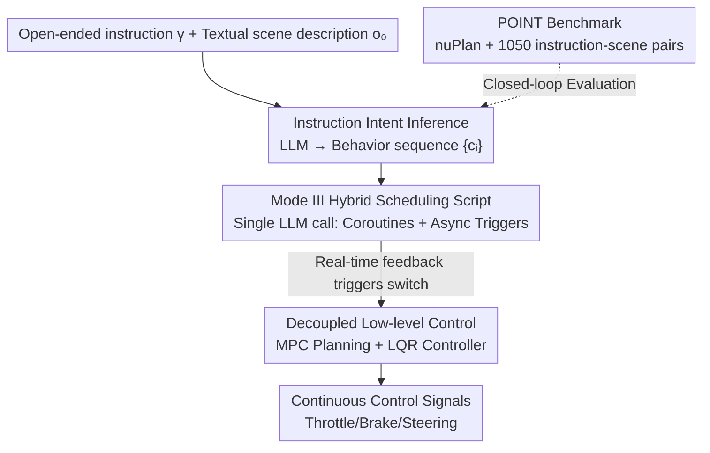

# Open-Ended Instruction Realization with LLM-Enabled Multi-Planner Scheduling in Autonomous Vehicles

**Conference**: CVPR 2026  
**Paper**: [CVF Open Access](https://openaccess.thecvf.com/content/CVPR2026/html/Liu_Open-Ended_Instruction_Realization_with_LLM_Enabled_Multi-Planner_Scheduling_in_Autonomous_Vehicles_CVPR_2026_paper.html)  
**Code**: To be confirmed  
**Area**: Autonomous Driving / LLM Agent  
**Keywords**: Open-ended instructions, motion planning scheduling, LLM driving, human-machine interaction (HMI), closed-loop evaluation.

## TL;DR
Addressing the neglected requirement for "passengers issuing maneuver-level instructions in natural language" in L4-L5 autonomous driving (AD), this paper proposes a "scheduling-centric" framework. It utilizes an LLM to parse open-ended instructions into a sequence of driving behaviors and generate a scheduling script in a single pass. Multiple MPC motion planners then execute these behaviors sequentially under real-time feedback. While maintaining full-link traceability from language to control, this approach improves the instruction realization success rate by 64%–200% over baselines with only one LLM query.

## Background & Motivation
**Background**: Existing Human-Machine Interaction (HMI) systems primarily target SAE L0-L3, assuming "the driver can take over at any time." They rely on signals such as lane departure warnings, steering wheel vibrations, and takeover prompts oriented toward the driver. However, in L4-L5 scenarios like Robotaxis, the vehicle carries back-seat passengers rather than drivers. These driver-oriented cues become invalid, requiring HMI to be redesigned for "intuitive interaction for non-driving users." The maturity of LLMs makes natural language a primary candidate for this interface.

**Limitations of Prior Work**: Converting open-ended passenger language into control signals faces three hurdles. First, current in-vehicle HMI focuses on infotainment, cabin control, and navigation, while **rarely allowing maneuver-level operations like lane changes, overtaking, or pulling over**. Furthermore, real passenger instructions vary significantly in phrasing ("I feel unsafe" vs. "There's a convenience store ahead, I want to buy something") and do not follow standard templates. Second, executing a single instruction often requires scheduling a **sequence** of behaviors (e.g., "I feel unsafe" $\rightarrow$ [left lane change, acceleration, lane keeping]). A single planner cannot manage this, and behavior switching must occur concurrently with real-time traffic feedback without blocking other modules. Third, most LLM-based driving research performs **open-loop** evaluations on public datasets or game-like simulators, lacking high-fidelity closed-loop testing platforms based on real traffic data.

**Key Challenge**: Language models excel at high-level semantic reasoning but produce probabilistic and unreliable outputs. Forcing them to generate numerical, safety-critical control signals directly is both unsafe and untraceable. Conversely, traditional modular AD stacks are safe and controllable but cannot comprehend open-ended language. The capability domains and time scales of the two are fundamentally different.

**Goal**: To leverage LLMs only for "high-level, low-frequency semantic reasoning" while returning "low-level, high-frequency, safety-critical continuous control" to verifiable controllers. A human-readable and auditable decision chain is established between them, alongside a missing closed-loop evaluation benchmark.

**Key Insight**: Borrowing ideas from control theory regarding hierarchical decoupling, time-scale separation, and event-triggered scheduling—the LLM outputs a "scheduling script" once. This script uses asynchronous triggers to switch between multiple dedicated motion planners based on real-time conditions.

**Core Idea**: Treat the LLM as a "scheduler" rather than a "controller"—using a single LLM call to generate a scheduling script that coordinates multiple explicit MPC planners to realize open-ended maneuver-level instructions while maintaining a transparent link from language to control.

## Method

### Overall Architecture
The framework decomposes the process of "one open-ended instruction $\rightarrow$ continuous control signals" into three stages with decreasing time scales. **Stage 1 (What to do)**: The LLM acts as an interpreter $f_\phi$. Given an instruction $\gamma$ and a textual traffic scene description $o_0$, it outputs an ordered sequence of atomic driving behaviors $\{c_i\}_{i=1}^{m(\gamma)}$, where each $c_i$ is selected from five predefined atomic behaviors (lane keeping, left/right lane change, acceleration, deceleration). **Stage 2 (How to do)**: In a **single call**, the LLM generates an executable scheduling script. This script sequentially schedules multiple motion planners to implement the behavior sequence and sets asynchronous triggers to continuously monitor the scene graph, triggering planner switches when real-time conditions are met (e.g., "switch from deceleration to right lane change when the gap exceeds 20 meters"). **Stage 3 (Closed-loop execution)**: The scheduled behavior-specific MPC planners optimize trajectories within a receding horizon using 3D detection and HD maps, which are then converted into throttle, brake, and steering by an LQR controller. The safety-critical "scheduling-planning-control" fast loop runs directly on raw perception inputs, while the LLM performs semantic decisions in the slow loop, ensuring the low-level control is not directly contaminated by LLM hallucinations.

The problem is formalized as an instruction-guided POMDP $\langle S, A, O, T, \mathcal{O}, \Gamma, R\rangle$. It uses a staged sparse reward $R(\bar{s}_t, a_t, \bar{s}_{t+1})$ which yields $r_{k_t+1}$ upon completing the $(k_t+1)$-th behavior (i.e., $s_{t+1}\in\mathcal{C}_{k_t+1}$). The goal is to maximize cumulative rewards under the risk constraint $\mathbb{P}[\forall t: s_t\in S_{\text{safe}}]\geq 1-\varepsilon$.

### Key Designs

**1. Instruction Intent Inference: Anchoring open-ended instructions to atomic behavior sequences using textual scene descriptions**

The first hurdle is "understanding" diverse passenger phrasing. The LLM acts as an interpreter $f_\phi(\gamma, o_0)=\{c_i\}_{i=1}^{m(\gamma)}$, mapping instructions to an ordered sequence of five predefined atomic behaviors. Crucially, the LLM is provided with a **textual** scene description $o_0$ rather than visual features. Textual scenes provide environmental constraints (e.g., no right lane change in the rightmost lane) and contextual cues (e.g., stopping at the curb if necessary) to resolve ambiguity. Furthermore, the authors found that even large commercial VLMs suffer from significant hallucinations in open-ended instruction understanding. Using textual descriptions and **constraining** the output to structured, predefined behavior sequences significantly reduces hallucinations and enhances reliability. This textualization is used only for high-level intent inference—safety-critical trajectory planning still consumes raw perception data (3D detection, HD maps) to avoid losing fine-grained details like road geometry.

**2. Mode III Hybrid Scheduling Script: Balancing low overhead with real-time adaptation in a single LLM call**

Executing a behavior sequence requires coordinating discrete decisions, such as "when to switch from acceleration to lane change," with continuous control. The paper categorizes existing LLM driving methods into three modes: Mode I configures parameters once at startup (static), Mode II involves the LLM in every decision step (flexible but high frequency/latency/cost), and **Mode III (Ours)**, which uses a single LLM call to generate an executable script. This script (i) sequentially schedules multiple motion planners to implement $\{c_i\}$ and (ii) utilizes coroutine mechanisms and asynchronous triggers to monitor the scene graph, activating planner switches when real-time conditions are met. This achieves the low overhead of Mode I with the contextual responsiveness of Mode II—the script is a pre-generated "execution plan with conditional branches" that requires no further LLM queries during runtime.

**3. Decoupled MPC+LQR Low-level Control: Keeping numerical safety control in verifiable modules for latency robustness**

Once high-level decisions are made, cascaded motion planners and controllers translate them into continuous signals. Behavior-specific MPCs optimize trajectories within a receding horizon using explicit vehicle models (interpretable), followed by LQR for continuous control. This decoupling offers three benefits: (i) **Domain Alignment**—LLMs handle high-level discrete decisions, while numerical, safety-critical control is assigned to verifiable controllers, preventing probabilistic LLMs from directly generating control variables. (ii) **Traceability**—human-readable scripts serve as an interface, making the mapping from LLM reasoning to actual actions transparent and easy for developers or external auditors to debug. (iii) **Safety Robustness to Latency**—safety is guaranteed by the high-frequency "scheduling-planning-control" fast loop, while the LLM acts in the slow loop. Consequently, even with several seconds of LLM inference delay, safety metrics (collisions, TTC) remain largely unaffected, with only a gradual decline in instruction realization rates.

**4. POINT Benchmark: A high-fidelity closed-loop testbed for open-ended instruction realization**

To address the lack of closed-loop testbeds, this paper constructs the POINT benchmark: a hybrid nuPlan simulator reconstructing urban traffic from real driving data, paired with 1,050 instruction-scene initialization pairs. Instructions were first collected as real samples, then expanded at scale using commercial LLMs (ChatGPT, Gemini) and rigorously filtered by humans. Generation enforced conversational phrasing and suppressed explicit intent statements; approximately 70% of instructions involve high-risk lateral maneuvers like lane changes, overtaking, and pulling over. The benchmark categorizes existing LLM driving methods from a "task scheduling perspective" and introduces competitive baselines (e.g., the Mode-II extensions DiLu+ and DiLu++ proposed in this work). Evaluation covers three categories: Task (Intent Recognition, Realization Rate), Safety (Collision-free Rate, Min TTC), and Compliance (Drivable Area, Speed Limit, Direction Consistency).

### An Example: Realizing "I Feel Unsafe"
A passenger says, "I feel unsafe because of that truck behind me." In Stage 1, the LLM combines this with the textual scene to infer the intent "right lane change" and expands it into the behavior sequence [deceleration, right lane change, lane keeping]. In Stage 2, the LLM generates a scheduling script in one go: it first calls the deceleration controller and defines Trigger 1 (right lane change conditions, like sufficient gap). The script uses a `wait_until` coroutine to suspend until the condition is met, then calls the right lane change controller and defines Trigger 2 to switch to lane keeping. In Stage 3, the MPC planners for each behavior generate trajectories segmentally, and LQR converts them into control variables. The entire process progresses via feedback—the LLM was only queried at the very beginning.

## Key Experimental Results

Experiments used commercial LLMs for instruction generation and an open-source LLM family (Qwen, DeepSeek) for evaluation to reduce model bias, using Xeon Gold 5220 + A40 hardware. All LLM baselines shared the DeepSeek-V3 backbone and used the same behavior sequences for identical intent-scene pairs to ensure fairness.

### Main Results
In the table below, **Realization** refers to the percentage of successfully executed instructions, and **Progress** (Expert Progress) refers to the distance covered relative to a human expert. All metrics are normalized to $[0, 1]$. Specialized AD methods follow expert global paths and have no Realization score; instruction realization methods prioritize passenger instructions and often deviate from global paths.

| Method | Category | Realization ↑ | Collision ↑ | TTC ↑ | Drivable ↑ | Speed ↑ | Direction ↑ | Progress ↑ |
|------|------|------|------|------|------|------|------|------|
| PDM-Closed | Specialized·MPC | — | 0.97 | 0.86 | 0.98 | 1.00 | 1.00 | 0.92 |
| Diffusion-ES | Instruction·LLM+Data-driven | 0.28 | 0.82 | 0.80 | 0.80 | 0.99 | 1.00 | 0.77 |
| DiLu++ | Instruction·LLM+MPC (Mode II) | 0.51 | 0.92 | 0.73 | 0.96 | 0.97 | 1.00 | 0.87 |
| **Ours** | Instruction·LLM+MPC (Mode III) | **0.84** | **0.99** | **0.88** | 0.97 | 1.00 | 1.00 | 0.82 |

Ours achieves the highest Realization of 0.84 among instruction-based methods, an approximately 64% improvement over the best baseline DiLu++ (0.51) and a 200% improvement over Diffusion-ES (0.28). Simultaneously, collision, TTC, and compliance metrics are comparable to or better than specialized AD methods. Progress is slightly lower because executing passenger instructions occasionally leads to deviations from the global expert path (an expected trade-off). For intent recognition, only large models like Qwen-2.5-72B, DeepSeek-V3, and DeepSeek-R1 exceed 85%, confirming that open-ended instruction understanding is non-trivial.

### Ablation Study

| Configuration | REC/REA ↑ | Collision ↑ | TTC ↑ | Description |
|------|------|------|------|------|
| Ours w/o Context | 0.78 | — | — | Without traffic context, intent recognition drops by ~10% |
| Ours (Full Intent Recognition) | 0.86 | — | — | With context, intent recognition is more accurate |
| Single·Lane Keep Planner | 0.17 | 0.97 | 0.86 | Using only one planner, realization rate collapses |
| Single·Acceleration Planner | 0.13 | 0.57 | 0.38 | Single planner also compromises safety |
| PL Scheduling (Ours) | **0.84** | 0.99 | 0.88 | LLM scheduling of multi-planner cooperation |

### Key Findings
- **Traffic context contributes ~+10% to intent recognition**: Textual scene descriptions provide environmental constraints, making DeepSeek-V3 parsing more accurate.
- **Multi-planner scheduling is the key to success**: The realization rate for any single planner is only 0.12–0.18, whereas LLM-coordinated scheduling brings it to 0.84 without sacrificing safety—proving that "relaying multiple experts" far outperforms "one generalist."
- **Highly robust to LLM latency**: Injecting 0 to 4 seconds of delay causes REA to decline gradually from 0.84 to 0.39, but collision (0.98 $\rightarrow$ 0.99) and TTC (~0.87 $\rightarrow$ 0.88) remain stable. This validates the fast-slow loop decoupling—safety does not depend on LLM real-time performance.

## Highlights & Insights
- **"LLM as a scheduler, not a controller" is the core insight**: Restricting probabilistic language models to high-level discrete decisions and using a single call to produce scripts with asynchronous triggers avoids hallucination contamination while achieving low overhead with zero additional runtime LLM queries. This clean capability division is effective.
- **The Mode I/II/III classification from a scheduling perspective** is highly transferable: It provides a unified coordinate system for "when and at what frequency LLMs should intervene in driving decisions," useful for positioning and comparing various LLM driving methods.
- **Latency robustness stems from architecture rather than engineering optimization**: The time-scale separation of the fast and slow loops means the safety-critical circuit is naturally isolated from LLM latency. This has implications for all "LLM-in-the-loop" systems.
- **POINT benchmark fills the closed-loop gap**: By enforcing conversational phrasing and suppressing explicit intent in instruction generation, the benchmark truly tests "open-ended understanding" rather than template matching.

## Limitations & Future Work
- **Limited set of atomic behaviors**: Currently using only five predefined behaviors. More complex or combined maneuvers (e.g., multi-step navigation through complex intersections) rely on composition. The upper bound of expressiveness needs further verification. ⚠️ Atomic behavior completeness is subject to the original POINT design.
- **Dependency on textual scene descriptions**: Encoding traffic scenes into text inevitably loses fine-grained geometric information. Although low-level control consumes raw perception to mitigate this, intent inference is still bounded by text quality.
- **Strong dependency on large models**: Only 70B+ models exceed 85% recognition accuracy. Distilling or compressing these for compute-constrained vehicle deployment remains a practical challenge.
- **Evaluation remains within a simulator**: While nuPlan is based on real data, closed-loop simulation does not fully capture the complexity of real-world vehicle-road-passenger interactions.

## Related Work & Insights
- **vs. Traditional Two-stage Instruction Processing (Intent classification + parameter extraction, e.g., AIME)**: Traditional rule-based methods face combinatorial explosion and sparse coverage with open language. Data-driven classification is limited by fixed labels and training phrasing. Ours uses pre-trained world knowledge for analogy and compositional generalization without training or manual rules.
- **vs. End-to-end VLA methods (LMDrive, AutoVLA, AdaThinkDrive)**: VLA unifies perception, language, and control but favors standardized navigation commands. End-to-end designs weaken the consistency and traceability between textual reasoning and actual actions. Ours uses human-readable scripts as an interface to maintain transparency, aligning better with safety standards like ISO 26262.
- **vs. Mode-II continuous decision-making (DiLu++)**: DiLu++ queries the LLM at every step, incurring high costs and occasional incoherent decisions (e.g., redundant lane changes). Our Mode III uses a single call and asynchronous triggers, ensuring both coherence and query efficiency.

## Rating
- Novelty: ⭐⭐⭐⭐ The scheduling-centric approach and Mode III perspective are clear and practical, though individual components (LLM parsing, MPC, coroutine triggers) are not new. The strength lies in their combination and positioning.
- Experimental Thoroughness: ⭐⭐⭐⭐ Main results, ablations, latency sensitivity, and intent recognition scaling are comprehensive, though limited to nuPlan simulation without real-vehicle validation.
- Writing Quality: ⭐⭐⭐⭐ The three-stage narrative is clear, the Mode classification is helpful, and formulas map clearly to challenges.
- Value: ⭐⭐⭐⭐ The POINT benchmark and traceable framework hold direct value for the real-world requirement of Robotaxi passenger interaction.

<!-- RELATED:START -->

## Related Papers

- [\[CVPR 2026\] Diffusion Forcing Planner: History-Annealed Planning with Time-Dependent Guidance for Autonomous Driving](diffusion_forcing_planner_history-annealed_planning_with_time-dependent_guidance.md)
- [\[CVPR 2026\] O3N: Omnidirectional Open-Vocabulary Occupancy Prediction](o3n_omnidirectional_open-vocabulary_occupancy_prediction.md)
- [\[CVPR 2026\] Unposed-to-3D: Learning Simulation-Ready Vehicles from Real-World Images](unposed-to-3d_learning_simulation-ready_vehicles_from_real-world_images.md)
- [\[CVPR 2026\] Open-Vocabulary Domain Generalization in Urban-Scene Segmentation](open-vocabulary_domain_generalization_in_urban-scene_segmentation.md)
- [\[ICCV 2025\] CoLMDriver: LLM-based Negotiation Benefits Cooperative Autonomous Driving](../../ICCV2025/autonomous_driving/colmdriver_llm-based_negotiation_benefits_cooperative_autonomous_driving.md)

<!-- RELATED:END -->
