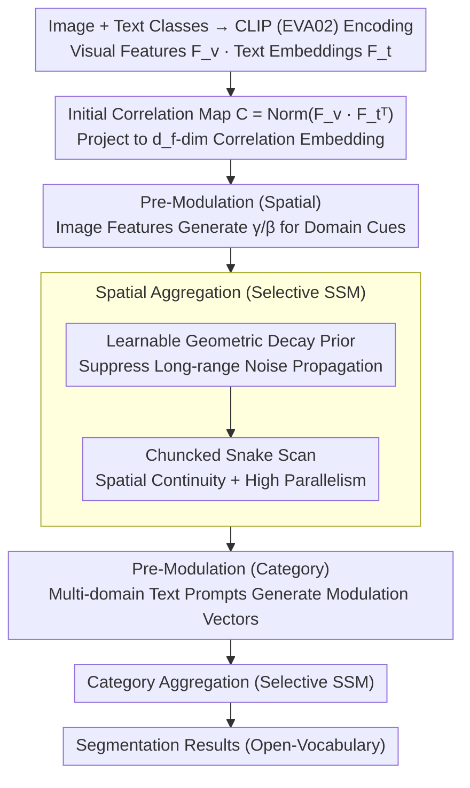

# Open-Vocabulary Domain Generalization in Urban-Scene Segmentation

**Conference**: CVPR 2026  
**arXiv**: [2602.18853](https://arxiv.org/abs/2602.18853)  
**Code**: [DZhaoXd/s2_corr](https://github.com/DZhaoXd/s2_corr)  
**Area**: Autonomous Driving  
**Keywords**: Open-vocabulary segmentation, Domain generalization, State space models, Text-image correlation, Urban scene segmentation

## TL;DR

A new OVDG-SS setting is proposed to unify the handling of unseen domains and unseen classes in semantic segmentation. A S2-Corr module based on State Space Models (SSM) is designed to repair the degradation of text-image correlation caused by domain shifts, achieving efficient and robust cross-domain open-vocabulary segmentation in autonomous driving scenarios.

## Background & Motivation

**DG-SS Limited to Closed Sets**: Traditional Domain Generalization Semantic Segmentation (DG-SS) methods improve cross-domain robustness but can only recognize a fixed set of classes present in the training set, failing to handle new semantics in the open world (e.g., road blocks or traffic cones appearing at night).

**OV-SS Sensitive to Domain Shifts**: Existing Open-Vocabulary Semantic Segmentation (OV-SS) models (e.g., CAT-Seg, MaskAdapter) can recognize broad concepts after training on COCO-Stuff, but their performance drops sharply when transferred to driving scenarios. Even with overlapping classes, mIoU decreases significantly after domain changes (as shown in Table 1, CAT-Seg trained on COCO achieves only 31.6% on Dv-19, while training on Cityscapes improves it to 49.3%).

**Two Capabilities Not Unified**: DG-SS handles domain shifts but lacks new class recognition; OV-SS recognizes new classes but lacks resistance to domain shifts. Autonomous driving requires both—models must adapt to unseen domains like bad weather or different regions while identifying objects not seen during training.

**Lack of Evaluation Benchmarks**: Previously, no driving scene segmentation benchmark covered both unseen domains and unseen classes simultaneously, preventing systematic evaluation of OVDG-SS capabilities.

**Domain Shifts Destroy VLM Correlation**: Experimental analysis reveals that domain shifts make the text-image correlation maps of pretrained VLMs noisy and misaligned (as shown in Fig. 3, the correlation for the "sky" class spreads to irrelevant regions as domain shift increases). This is the fundamental reason why OV-SS fails in OVDG.

**Cross-Attention Propagates Noise**: CAT-Seg uses cross-attention for correlation aggregation. Under domain shifts, corrupted correlations enter the attention calculation as noisy keys/values, and errors are amplified across spatial and category dimensions.

## Method

### Overall Architecture

S2-Corr is built upon the correlation aggregation pipeline of CAT-Seg. Given an image-text pair, CLIP (EVA02) is used to extract visual features $\mathbf{F}_v \in \mathbb{R}^{HW \times d}$ and text class embeddings $\mathbf{F}_t \in \mathbb{R}^{N_C \times d}$. The initial correlation map is computed as $\mathbf{C} = \text{Norm}(\mathbf{F}_v \mathbf{F}_t^\top)$. Subsequently, a learnable projection lifts the correlation into a $d_f$-dimensional embedding space, followed by sequential **spatial aggregation** and **category aggregation** stages for repair. The core innovation lies in replacing the original cross-attention aggregation with a Selective State Space Model (SSM) and introducing three enhancement designs: pre-modulation, SSM state transition, and scanning mechanisms.

### Key Designs

**1. Pre-Modulation: Injecting domain cues before aggregation to inform the model of conditions like "night" or "rainy"**

Domain shifts contaminate VLM text-image correlation maps. Aggregating these directly amplifies noise. S2-Corr adds a modulation step before each of the two aggregation stages. In spatial aggregation, image features $\mathbf{F}_{\pi(t)}$ generate modulation factors $(\gamma, \beta)$ via linear projection to perform an affine transformation $\hat{\mathbf{E}} = \mathbf{E} \odot (1 + \gamma) + \beta$ on correlation embeddings, injecting domain-specific visual cues. In category aggregation, multi-domain text prompt templates (e.g., "a photo of {class} at night", "in the rain") encode domain-aware text features $\mathbf{t}^{(d)}$ to generate modulation vectors for domain-adaptive adjustments of category embeddings. This provides the model with domain priors before the aggregation process begins.

**2. Learnable Geometric Decay Prior: Implementing a gate in SSM state transitions to suppress long-range noise**

The dynamic gating $\mathbf{A}_t$ in SSM might still propagate long-distance noise under domain shifts. A geometric decay prior $\boldsymbol{\gamma} \in (0,1)^K$ is introduced, defining the effective decay coefficient as a learnable mixture of dynamic gating and a fixed prior: $\mathbf{A}_t^{\text{eff}} = \sigma(\mathbf{w}) \cdot \sigma(\mathbf{W}_a \mathbf{x}_t + \mathbf{b}_a) + (1 - \sigma(\mathbf{w})) \cdot \boldsymbol{\gamma}$. This maintains the geometric decay pattern $\|\partial \mathbf{h}_t / \partial \mathbf{h}_{t-d}\| \propto (\mathbf{A}_t^{\text{eff}})^d$—where the influence of distant states decays exponentially to suppress remote noise while keeping the decay rate learnable to avoid losing useful long-range context.

**3. Chunked Snake Scanning: Recovering parallelism while maintaining spatial continuity**

Flattening 2D correlation maps into 1D sequences for SSM often leads to spatial discontinuity at row boundaries and low parallelism from full-sequence scanning. S2-Corr divides the flattened sequence into equal-length chunks (16 chunks) along rows, updating sequentially within each block and passing the final hidden state $\mathbf{h}_{k+1}^{\text{init}} \leftarrow \mathbf{h}_k^{\text{end}}$ between blocks to maintain continuity. A snake-like traversal (forward for odd rows, backward for even rows) is used to link adjacent rows naturally at boundaries. This chunking preserves high parallelism and significantly reduces computational costs without sacrificing spatial continuity, which is why FPS remains far superior to CAT-Seg under large vocabularies.

### Loss & Training

- Implemented based on Detectron2 using the AdamW optimizer. Learning rate for the aggregation module: $2 \times 10^{-4}$; for the EVA-CLIP encoder: $2 \times 10^{-6}$.
- Correlation embedding dimension: 128; 2 spatial blocks + 2 upsampling stages; 16 chunks; decay prior $\gamma = 0.8$.
- Visual encoder updates only selected attention projection layers; text encoder trains only projection weights within residual blocks.
- ViT-B/16 updates 26M parameters, and ViT-L/14 updates 76.8M parameters.
- Batch size=4; 20k iterations; Training time: 2 hours (ViT-B) / 4 hours (ViT-L) on a single RTX 3090.

## Key Experimental Results

### Main Results

**Real-to-Real OVDG-SS (Trained on CS-7, Table 2):**

| Method | Backbone | Dv-19 Ave. | Dv-58 Ave. |
|------|----------|-----------|-----------|
| CAT-Seg | ViT-B/16 | 43.5 | 43.5 |
| MaskAdapter | ViT-B/16 | 45.5 | 43.8 |
| CLIPSelf | ViT-B/16 | 45.7 | 45.0 |
| **Ours** | **ViT-B/16** | **50.3** | **47.9** |
| CAT-Seg | ViT-L/14 | 49.3 | 50.0 |
| CLIPSelf | ViT-L/14 | 53.3 | 51.5 |
| **Ours** | **ViT-L/14** | **55.8** | **53.2** |

**Synthetic-to-Real OVDG-SS (Trained on GTA-7, Table 3):**

| Method | Backbone | Dv-19 Ave. | Dv-58 Ave. |
|------|----------|-----------|-----------|
| CAT-Seg | ViT-B/16 | 43.9 | 45.6 |
| CLIPSelf | ViT-B/16 | 46.2 | 44.4 |
| **Ours** | **ViT-B/16** | **48.2** | **46.7** |
| CAT-Seg | ViT-L/14 | 47.5 | 48.2 |
| **Ours** | **ViT-L/14** | **49.9** | **49.4** |

### Ablation Study

**Incremental Component Ablation (CS-7 → Dv-19 / Dv-58, Table 4):**

| Design | ViT-B Dv-19 | ViT-B Dv-58 | ViT-L Dv-19 | ViT-L Dv-58 | Average |
|------|------------|------------|------------|------------|------|
| Base (Cross-Attn) | 43.5 | 43.5 | 49.3 | 50.0 | 46.6 |
| +Selective SSM | 45.6 | 44.1 | 50.7 | 50.5 | 47.7 |
| +Modulation | 47.6 | 45.3 | 52.1 | 50.9 | 49.0 |
| +Geometric Decay | 48.3 | 46.4 | 53.2 | 51.8 | 49.9 |
| +Chunk | 49.6 | 47.3 | 55.3 | 52.7 | 51.2 |
| +Snake Scanning | **50.3** | **47.9** | **55.8** | **53.2** | **51.8** |

**Efficiency Comparison (ViT-B/16, Table 5):**

| Method | FPS@19 Classes | FPS@58 Classes | FPS@150 Classes | GPU Memory | Training Time |
|------|---------|---------|----------|---------|---------|
| CAT-Seg | 15.4 | 10.6 | 5.7 | 13.8 GB | 180 min |
| ESC-Net | 15.0 | 9.9 | 5.1 | 15.7 GB | 220 min |
| **Ours** | **26.1** | **22.2** | **18.3** | **9.2 GB** | **140 min** |

### Key Findings

- Replacing cross-attention with SSM yields an average mIoU Gain of +1.1, validating that sequential aggregation outperforms window attention.
- Noise suppression components (geometric decay + chunking) provide the largest gains, especially in the large-vocabulary Dv-58 setting.
- When the vocabulary expands from 19 to 150 classes, CAT-Seg's FPS drops from 15.4 to 5.7 (-63%), while S2-Corr only drops from 26.1 to 18.3 (-30%), demonstrating linear complexity scalability.
- S2-Corr consistently outperforms all baselines across all 7 unseen target domains in both synthetic-to-real and real-to-real settings.

## Highlights & Insights

- **New Problem Definition**: First to unify DG-SS and OV-SS into OVDG-SS, providing a research setting closer to real-world autonomous driving requirements.
- **Systematic Benchmark**: Developed the first OVDG-SS driving benchmark covering 7 target domains (bad weather, different regions, construction sites) and 58 extended categories, including both synthetic-to-real and real-to-real evaluation paradigms.
- **Root Cause Analysis Driven Design**: Analyzed the root cause of OV-SS failure under domain shifts (correlation map noise + attention amplification) before designing targeted solutions, ensuring a clear logical flow.
- **Prominent Efficiency Advantages**: S2-Corr is 3.2x faster than CAT-Seg in FPS for large vocabularies, requires only 9.2 GB VRAM, and trains in just 2 hours, making it highly practical.
- **New SSM Application**: Using State Space Models for text-image correlation repair is a novel application; decay gating is naturally suited for suppressing noise propagation.

## Limitations

- Training data uses only 7-class Cityscapes/GTA subsets; whether the effectiveness holds with larger training vocabularies is unknown.
- Extended classes in ACDC-41 and BDD-41 were generated via Stable Diffusion 2.1 inpainting, which may differ from the distribution of unseen objects in real scenes.
- Snake scanning is fixed to the row direction; the complementarity of column-wise or multi-directional scanning has not been explored.
- The 10 domain-aware text prompts are manually designed; learnable prompt tuning has not been investigated.
- Validated only on EVA02-CLIP; other VLM backbones (e.g., SigLIP, InternVL) were not included.

## Related Work & Insights

- **DG-SS**: Methods based on data augmentation (AdvStyle, DGInStyle) and PEFT (adapter tuning, parameter selection) are limited to closed sets.
- **OV-SS Training-free**: Methods like ClearCLIP, ProxyCLIP, and CLIP-DINOiser require no training but are not resistant to domain shifts.
- **OV-SS Training-based**: CAT-Seg (correlation + cross-attention), MaskAdapter, and ESC-Net are trained on COCO but degrade when transferred to driving domains.
- **OV-SS + DG Combination**: Simple combinations like CAT-Seg+AdvStyle or CAT-Seg+DGInStyle are significantly outperformed by S2-Corr.
- **State Space Models**: Mamba/VMamba are used for visual tasks; this paper is the first to apply SSM for text-image correlation aggregation and repair.

## Rating

- Novelty: ⭐⭐⭐⭐ (OVDG-SS is a meaningful new setting; S2-Corr has clear motivation and a novel approach)
- Experimental Thoroughness: ⭐⭐⭐⭐⭐ (7 target domains, 2 training settings, 2 backbones, full ablation, efficiency analysis, visualization)
- Writing Quality: ⭐⭐⭐⭐ (Clear narrative structure from problem analysis to baseline establishment to incremental enhancement)
- Value: ⭐⭐⭐⭐ (The benchmark and method offer practical value for open-world perception in autonomous driving)

<!-- RELATED:START -->

## Related Papers

- [\[NeurIPS 2025\] Leveraging Depth and Language for Open-Vocabulary Domain-Generalized Semantic Segmentation](../../NeurIPS2025/autonomous_driving/leveraging_depth_and_language_for_open-vocabulary_domain-generalized_semantic_se.md)
- [\[CVPR 2026\] O3N: Omnidirectional Open-Vocabulary Occupancy Prediction](o3n_omnidirectional_open-vocabulary_occupancy_prediction.md)
- [\[CVPR 2026\] Monocular Open Vocabulary Occupancy Prediction for Indoor Scenes (LegoOcc)](monocular_open_vocabulary_occupancy_prediction_for_indoor_scenes.md)
- [\[CVPR 2026\] FedBPrompt: Federated Domain Generalization Person Re-Identification via Body Distribution Aware Visual Prompts](fedbprompt_federated_domain_generalization_person_re-identification_via_body_dis.md)
- [\[CVPR 2026\] PanDA: Unsupervised Domain Adaptation for Multimodal 3D Panoptic Segmentation in Autonomous Driving](panda_unsupervised_domain_adaptation_for_multimodal_3d_panoptic_segmentation_in_.md)

<!-- RELATED:END -->
