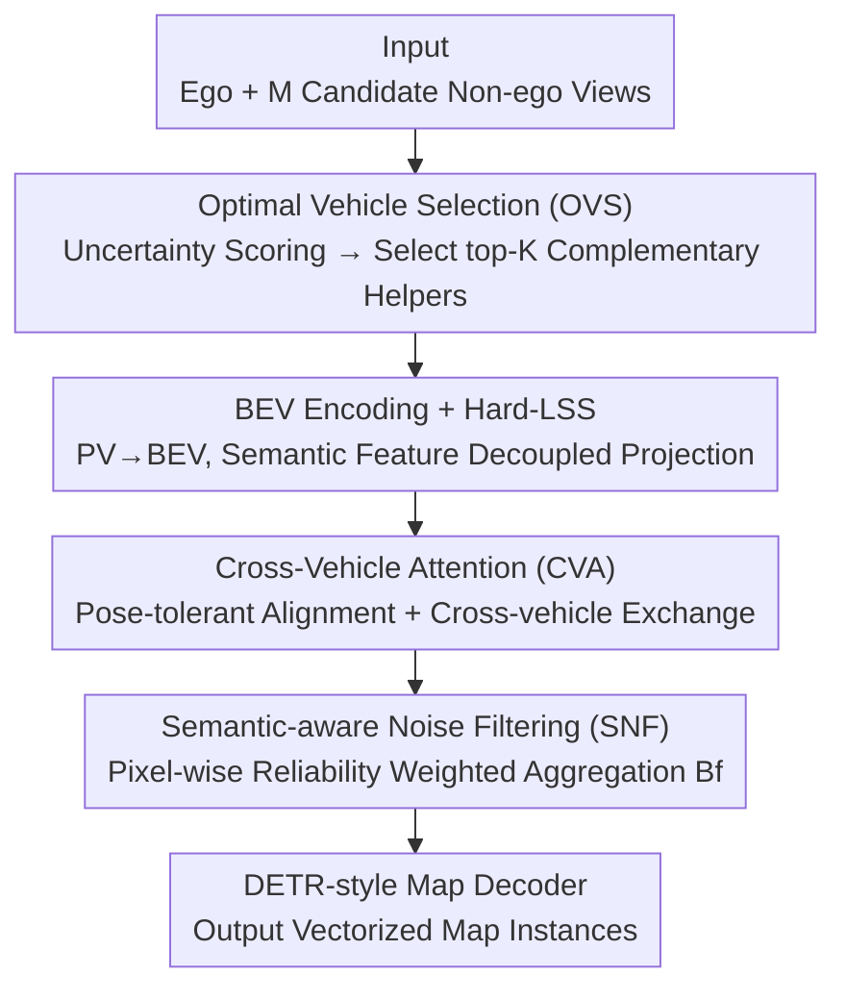

# OptiMVMap: Offline Vectorized Map Construction via Optimal Multi-vehicle Perspectives

**Conference**: CVPR 2026  
**Paper**: [CVF Open Access](https://openaccess.thecvf.com/content/CVPR2026/html/Dan_OptiMVMap_Offline_Vectorized_Map_Construction_via_Optimal_Multi_vehicle_Perspectives_CVPR_2026_paper.html)  
**Code**: https://github.com/DanZeDong/OptiMVMap  
**Area**: Autonomous Driving / Vectorized Map Construction  
**Keywords**: Offline vectorized map, multi-vehicle perspectives, vehicle selection, BEV fusion, uncertainty guidance

## TL;DR
OptiMVMap extends offline vectorized HD map construction from "single-vehicle trajectories" to "multi-vehicle collaboration." It proposes a plug-and-play "select-then-fuse" framework: an uncertainty-guided OVS module selects the 2–5 most complementary helper vehicles, which are then fused at the BEV level after pose-tolerant alignment (CVA) and semantic noise filtering (SNF). It improves MapTRv2 by +10.5 and +9.3 mAP on nuScenes and Argoverse2, respectively.

## Background & Motivation
**Background**: Offline vectorized map construction (restoring lane lines, boundaries, crosswalks into ordered point sequences) is fundamental infrastructure for high-precision driving and map services. Current mainstream methods are predominantly based on **single-vehicle trajectories**, treating mapping as object detection and using DETR-style architectures to decode vectorized elements from ego BEV features. To mitigate ego-view limitations, recent works introduce "memory enhancement" by either aggregating adjacent frames (temporal memory, e.g., StreamMapNet, MVMap) or writing historical predictions into a coarse raster map (map-level history, e.g., HRMapNet).

**Limitations of Prior Work**: These memory enhancements are essentially **still single-vehicle**. Extra observations come from near-collinear perspectives with minimal parallax, providing little supplementary information for occluded or distant areas. Furthermore, they lack quality control, allowing early errors to persist and contaminate subsequent predictions. In other words, temporal memory only "extends observation time" without resolving the fundamental bottleneck of **viewpoint insufficiency**.

**Key Challenge**: Effectively restoring occluded or distant structures requires **spatial diversity**, which only complementary perspectives from other vehicles can provide. Statistics show this is feasible: 84.6% of nuScenes and 70.2% of AV2 scenarios have other trajectories within 60m. However, naively fusing all nearby vehicles introduces three problems: ① Large and heterogeneous candidate pools lead to excessive computational overhead; ② Spatial proximity does not equal informational complementarity (nearby vehicles may provide redundant near-collinear views); ③ Indiscriminate fusion **amplifies** noise from pose errors and occlusion artifacts.

**Core Idea**: Reformulate multi-vehicle mapping as a **select-then-fuse** problem. Use uncertainty as a signal to pick a small set of "helper vehicles" that maximize the reduction of ego-view uncertainty while remaining geometrically complementary. By "selecting the right few" instead of "fusing all," the framework simultaneously addresses computation, redundancy, and noise at the source.

## Method

### Overall Architecture
OptiMVMap is a **plug-and-play, decoder-agnostic** two-stage offline pipeline situated at the BEV feature layer as a pre-decoder module; downstream DETR-style map decoders (e.g., MapTRv2) require no modifications. The input consists of ego surround-view images $I_e$ and $M$ candidate non-ego surround-view images $\{I_{v_j}\}_{j=1}^M$ (cross-trajectory, potentially asynchronous, but alignable to a common BEV coordinate system). The output is a set of vectorized map elements $\{(c, P)\}$, where $c$ is the semantic class and $P=\{(x_i,y_i)\}_{i=1}^L$ is an ordered point sequence.

The pipeline follows two steps: **(1) Optimal Vehicle Selection (OVS)**—calculates BEV uncertainty maps for each vehicle and scores candidates based on spatial correlation, visibility, and baseline complementarity to select the top-K helpers (typically $K=1 \sim 3$); **(2) Lightweight Fusion**—selected perspectives enter a dual-path BEV feature process: Cross-Vehicle Attention (CVA) performs pose-tolerant alignment and information exchange, while Semantic-aware Noise Filtering (SNF) suppresses occlusion/dynamic artifacts using learned semantic weights to aggregate features into a unified BEV representation $B_f$ for the decoder.

### Key Designs

**1. OVS (Optimal Vehicle Selection): Turning "which vehicles to select" into a learnable decision problem via uncertainty**

This step addresses challenges ① and ②. OVS consists of two stages: **single-vehicle uncertainty estimation** and **multi-vehicle selection**. First, each vehicle view is processed independently to obtain classification uncertainty $U_P$ for each polyline point $P$, which is then averaged in a neighborhood to form a pixel-wise BEV uncertainty map: $U_{i,j}=\frac{1}{|\Omega_{i,j}|}\sum_{P\in\Omega_{i,j}}U_P$, where $\Omega_{i,j}$ is the set of points within distance $d$. This map highlights regions that "cannot be resolved without external help." Second, candidate selection partitions the ego BEV space into $N_h \times N_w$ grids, picking the nearest vehicle in each as a candidate. A small CNN $G_\theta$ encodes uncertainty maps into features $U_e, U_v$. A CVA layer aligns candidate features with ego space $\hat{U}_v=F(U_e,U_v)$. Finally, a suitability score $s_v=\mathrm{MLP}(\mathrm{CA}(E_v,\hat{U}_v))$ is generated using vehicle position embeddings $E_v$ as queries. The selection targets "how much uncertainty in difficulty areas is reduced," ensuring **geometrically complementary** helpers.

**2. CVA (Cross-Vehicle Attention): Aligning neighbor BEV to ego coordinates via learnable sampling**

Even with the right vehicles, pose errors and temporal drift cause BEV misalignment. Standard BEV warping cannot correct rotational and translational residuals. CVA uses **feature-conditioned learnable sampling** for alignment. A CVA layer $F(Q_{in},V)$, adapted from deformable attention, is defined as: $Q_{out}=Q_{in}+\sum_{i=1}^{N_{off}}W_i\cdot \mathrm{DA}(Q_{in},R+O_i,W_vV)$. Sampling offsets $O_i$ and weights $W_i$ are projected from $[Q_{in},V]$, allowing the network to learn where to sample and how much to trust the sampled info. Each selected feature $B_v$ is fused with ego $B_e$ and then refined. CVA yields a +2.6 mAP gain, serving as a prerequisite for reliable fusion.

**3. SNF (Semantic-aware Noise Filtering): Treating fusion as a "quality gate" to filter noise**

Residual artifacts from dynamic objects or occlusions remain after alignment. SNF leverages semantic and uncertainty priors to compute pixel-wise reliability weights, normalizing contributions from the ego and selected vehicles: $S_e,S_{v_1},\dots,S_{v_K}=\mathrm{Softmax}(\mathrm{NS}(B_e^{enhanced},B_e^{sem}),\dots,\mathrm{NS}(B_{v_K}^{fused},B_{v_K}^{sem}))$, where $\mathrm{NS}$ is a noise-scoring network. The final representation is $B_f=S_e\odot B_e^{enhanced}+\sum_{j=1}^K S_{v_j}\odot B_{v_j}^{fused}$. This semantic gating suppresses conflicting evidence and stabilizes fusion (+2.0 mAP). Additionally, **Hard-LSS** is used during encoding: unlike standard LSS which softly sums weighted features, Hard-LSS uses max pooling to assign PV semantic features to the grid with the highest depth probability, preventing semantic blurring (+0.9 mAP).

### Loss & Training
A two-stage strategy is employed: **(i) Fusion Backbone Pre-training**: Randomly sampling non-ego vehicles (OVS off) to train CVA, SNF, and the decoder; **(ii) OVS Training**: Freezing the fusion backbone and training the OVS module independently. Inference only fuses the top-K views selected by OVS. Mapping losses include classification, point-to-point, and edge direction losses, plus one-to-many $L_{one2many}$ and dense prediction losses $L_{dense}$ (depth + BEV semantic/instance segmentation) on $B_e^{enhanced}$, $\{B_{v_j}\}$, and $B_f$. OVS supervision uses mAP-based ground truth (the combination yielding highest mAP) and a sigmoid BCE loss: $L_{OVS}=-\frac{1}{|V|}\sum_{v\in V}[y_v\log\sigma(s_v)+(1-y_v)\log(1-\sigma(s_v))]$.

## Key Experimental Results

### Main Results
Datasets: nuScenes-MV and AV2-MV (ego frames associated with helper views from other trajectories within 60m and $\ge$30min interval). Baseline: MapTRv2. Default $K=2$.

| Dataset | Configuration | Ours mAP | Baseline | Gain |
|--------|------|---------|----------|------|
| nuScenes | MapTRv2 + OptiMVMap + QI | 72.0 | MapTRv2 (61.5) | +10.5 |
| nuScenes | VectorMapNet + OptiMVMap | 55.1 | +MVMap (48.9) | +6.2 |
| nuScenes | MapTRv2 + OptiMVMap | 71.0 | +HRMapNet (67.2) | +3.8 |
| AV2 | MapTRv2 + OptiMVMap | 73.6 | MapTRv2 (64.3) | +9.3 |

**Novelty**: Integrating OptiMVMap into the autoregressive VectorMapNet adds +14.2 mAP (40.9 to 55.1), proving the framework generalizes across decoding paradigms.

### Ablation Study
Incremental components (nuScenes 1/4 subset):

| Configuration | mAP | Note |
|------|-----|------|
| MapTRv2 baseline | 37.7 | Single-vehicle baseline |
| + Naive Fusion | 39.5 | Concat + MLP fusion |
| + CVA | 42.1 | Pose-tolerant alignment (+2.6) |
| + SNF | 44.1 | Semantic denoising (+2.0) |
| + OVS | 49.8 | Selection of complementary helpers (+4.8, **largest gain**) |

### Key Findings
- **OVS (Selection) is the dominant factor**: Adding OVS on top of alignment and denoising provides a +4.8 mAP boost, exceeding the combined gains of CVA+SNF, confirming that selecting complementary helpers is more critical than simply fusing more vehicles.
- **Diminishing returns for $K$**: Increasing $K$ from 1 to 2 yields +4.8 mAP, but improvements saturate after $K=5$, suggesting that 2–5 complementary perspectives provide most of the available benefit.
- **"Proximity $\neq$ Complementarity"**: Selecting the "Closest" vehicles (simulating temporal stacking) is significantly inferior to OVS, proving that parallax and viewpoint variety drive gains, not just proximity.

## Highlights & Insights
- **Formulating selection as uncertainty reduction**: OVS avoids distance heuristics and uses the task uncertainty itself to score suitability. This "sampling for uncertainty" logic is transferrable to collaborative perception and active learning.
- **Smart cost structure**: By filtering candidates from $M$ down to $K$ first, expensive operations like CVA/SNF only run on a few helpers, keeping fusion costs nearly linear.
- **Hard-LSS as a reusable trick**: Identifying that soft summation in LSS blurs semantic features and using max pooling instead provides a simple 1 mAP gain for BEV semantic tasks.

## Limitations & Future Work
- **Reliance on co-occurrence**: Requires other trajectories within 60m (met in ~70-85% of scenarios); performance reverts to single-vehicle baseline in sparse traffic.
- **Offline setting**: Uses asynchronous cross-trajectory data ($\ge$30min), meaning it is not for real-time online mapping.
- **OVS Supervision cost**: Generating ground-truth optimal subsets requires exhaustive mAP evaluation of vehicle combinations, which may not scale to extremely large candidate pools ⚠️.

## Related Work & Insights
- **vs. Temporal Memory (MVMap)**: Temporal methods aggregate collinear frames with small parallax; OptiMVMap uses cross-trajectory views for maximum spatial diversity, outperforming MVMap by +6.2 mAP.
- **vs. Map History (HRMapNet)**: While HRMapNet accumulates coarse outputs in a raster map, OptiMVMap fuses in the **BEV feature layer**, preserving richer information for cleaner topology.
- **vs. Collaborative Perception**: Shares the multi-vehicle spirit but focuses on offline, asynchronous, and uncertainty-guided selection for vectorized mapping.

## Rating
- **Novelty**: ⭐⭐⭐⭐⭐ First systematic study of multi-vehicle perspectives for offline vectorized mapping using a select-then-fuse paradigm.
- **Experimental Thoroughness**: ⭐⭐⭐⭐ Strong results across datasets and backbones, though some robustness analyses are relegated to supplementary materials.
- **Writing Quality**: ⭐⭐⭐⭐⭐ Clear logical progression from motivation to design.
- **Value**: ⭐⭐⭐⭐⭐ Significant practical value for HD map production pipelines.

<!-- RELATED:START -->

## Related Papers

- [\[ECCV 2024\] Stream Query Denoising for Vectorized HD-Map Construction](../../ECCV2024/autonomous_driving/stream_query_denoising_for_vectorized_hd-map_construction.md)
- [\[CVPR 2026\] AMap: Distilling Future Priors for Ahead-Aware Online HD Map Construction](amap_distilling_future_priors_for_ahead-aware_online_hd_map_construction.md)
- [\[CVPR 2025\] MapGCLR: Geospatial Contrastive Learning of Representations for Online Vectorized HD Map Construction](../../CVPR2025/autonomous_driving/mapgclr_geospatial_contrastive_learning_of_representations_for_online_vectorized.md)
- [\[CVPR 2026\] Neuro-Cognitive Reward Modeling for Human-Centered Autonomous Vehicle Control](neuro-cognitive_reward_modeling_for_human-centered_autonomous_vehicle_control.md)
- [\[CVPR 2026\] V2U4Real: A Real-world Large-scale Dataset for Vehicle-to-UAV Cooperative Perception](v2u4real_a_real-world_large-scale_dataset_for_vehicle-to-uav_cooperative_percept.md)

<!-- RELATED:END -->
