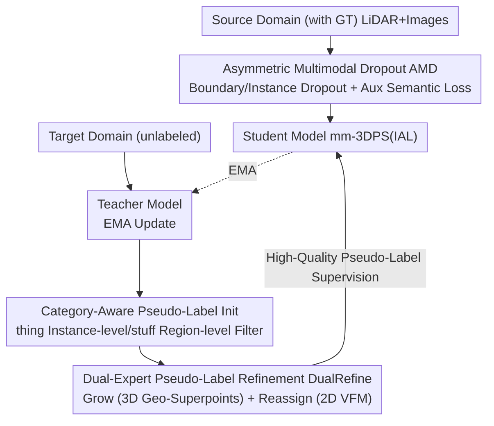

# PanDA: Unsupervised Domain Adaptation for Multimodal 3D Panoptic Segmentation in Autonomous Driving

**Conference**: CVPR 2026  
**Paper**: [CVF Open Access](https://openaccess.thecvf.com/content/CVPR2026/html/Pan_PanDA_Unsupervised_Domain_Adaptation_for_Multimodal_3D_Panoptic_Segmentation_in_CVPR_2026_paper.html)  
**Code**: TBD  
**Area**: Autonomous Driving / 3D Vision  
**Keywords**: Unsupervised Domain Adaptation (UDA), Multimodal, 3D Panoptic Segmentation, Pseudo-label Refinement, Teacher-Student

## TL;DR
This paper presents the first study on "Unsupervised Domain Adaptation for Multimodal 3D Panoptic Segmentation (mm-3DPS)." It proposes PanDA: an asymmetric multimodal dropout (AMD) strategy within a mean-teacher framework to simulate single-modal degradation on the source domain for learning domain-invariant features, and a dual-expert pseudo-label refinement (DualRefine) mechanism utilizing 3D geometric superpoints and 2D vision foundation models (VFMs) to repair incomplete or misclassified target domain pseudo-labels. PanDA significantly outperforms 3D semantic segmentation UDA baselines across domain shifts in time, weather, location, and sensors.

## Background & Motivation
**Background**: 3D Panoptic Segmentation (PS), which identifies countable "thing" instances and amorphous "stuff" regions, is a fundamental perception capability for autonomous driving. Recent mainstream approaches leverage multimodal fusion of LiDAR and cameras (e.g., IAL, LCPS) to improve accuracy. However, models suffer significant performance drops when deployed in new environments with varying locations, weather, or lighting. Since annotating new data is expensive, Unsupervised Domain Adaptation (UDA) without target domain labels is highly attractive.

**Limitations of Prior Work**: While UDA is well-studied for 2D PS, 3D detection, and multimodal 3D **semantic** segmentation, it remains a **blank in mm-3DPS**. Simply applying common "pseudo-labeling" strategies to mm-3DPS yields poor results (verified in Table 1, Row 4) for two reasons: ① Existing mm-3DPS models **assume LiDAR and RGB are strongly complementary and both reliable**. In reality, rain makes LiDAR sparse and night degrades image quality; once a modality degrades, cross-modal fusion fails, deteriorating scene understanding. ② Pseudo-labels are critical without target labels, but traditional **confidence thresholds** only retain high-confidence regions, leading to fragmented instance masks and blurred boundaries—fatal for PS which requires instance integrity and clear thing/stuff boundaries.

**Key Challenge**: The advantage of multimodal fusion (complementarity) is precisely its weakness under domain shift (dependency on both modalities being reliable); meanwhile, conservative high-confidence pseudo-labels sacrifice "integrity" for "cleanliness."

**Goal**: ① Make the model robust to single-sensor degradation, allowing one modality to compensate for the other. ② Ensure pseudo-labels are both complete and reliable, recovering truncated stuff regions and correcting misclassified thing instances.

**Key Insight**: **Actively create** modal imbalance on the source domain to force the model to learn cross-modal completion; introduce two types of **domain-invariant** priors (3D geometry and 2D VFMs) to refine pseudo-labels instead of simple thresholding.

**Core Idea**: Use "Asymmetric Dropout for degradation + Dual-expert Priors for refinement" within a mean-teacher UDA framework to simultaneously address "modality imbalance" and "pseudo-label fragmentation."

## Method

### Overall Architecture
PanDA is built on the mean-teacher paradigm: the Student and Teacher share the same mm-3DPS architecture (using the transformer-based IAL as the backbone). The Teacher is updated via Exponential Moving Average (EMA, momentum 0.99) of Student weights. In each iteration, source samples $x_S$ and target samples $x_T$ are fed to the Student. **Source Domain** (with GT): Inputs undergo AMD to create single-modal degradation, supervised by GT and an auxiliary semantic loss. **Target Domain** (unlabeled): The Teacher predicts initial pseudo-labels, which are denoised via "category-aware filtering" and then refined by DualRefine to produce high-quality pseudo-labels to supervise the Student. The total loss is $\mathcal{L}=\mathcal{L}^{\mathcal{S}}_{\text{seg}}+\mathcal{L}^{\mathcal{S}}_{\text{aux}}+\mathcal{L}^{\mathcal{T}}_{\text{seg}}+\mathcal{L}^{\mathcal{T}}_{\text{con}}$, where the consistency loss $\mathcal{L}^{\mathcal{T}}_{\text{con}}=\sum_{\ell}\|f_\ell^{(Stu)}-f_\ell^{(Tea)}\|_2^2$ aligns query features at each decoder layer.

### Key Designs

**1. Asymmetric Multimodal Dropout (AMD): Actively inducing single-modal degradation in the source domain**

To address the vulnerability where models fail when one modality degrades, AMD explicitly drops key regions of **one** modality in the source domain to force the model to learn completion using the other modality. Unlike random masking, AMD performs **structured dropout** specifically for PS: **Boundary Dropout**—image patches are dropped at rate $r^{2D}_{bd}$ based on Canny edge detection, while LiDAR voxel features are dropped at $r^{3D}_{bd}$ where labels are inconsistent (preserving coordinates to maintain spatial structure); **Instance Dropout**—randomly masks patch/point features within thing instances at rates $r^{2D}_{ins} / r^{3D}_{ins}$ to force recovery from partial info. One modality is randomly chosen ($p=0.5$) for dropout per frame. These parameters ($r^{2D}_{bd}=r^{3D}_{ins}=r^{2D}_{ins}=0.5$, $r^{3D}_{bd}=0.7$, patch $32\times32$) are universal across all domain shifts. Auxiliary semantic heads are added to encoders, supervised by 3D GT via $\mathcal{L}^{\mathcal{S}}_{\text{aux}}$.

**2. Category-Aware Pseudo-Label Initialization: Differential filtering for thing vs. stuff**

Traditional UDA destroys instance integrity by keeping only high-confidence points. PanDA multiplies semantic and instance confidence to get joint confidence $\mathbf{S}$. For **thing** (countable objects), **instance-level** filtering is used: an instance is removed entirely if its mean confidence $\bar{\mathbf{S}}(k) < \tau_{th}$ (0.63). For **stuff** (uncountable regions), **point-level** filtering uses an adaptive threshold $\tau_{st}$. Points not covered by any mask have their loss weights set to zero. This reduces noise but leaves holes in stuff and potential misclassifications in things—addressed by DualRefine.

**3. Dual-Expert Pseudo-Label Refinement (DualRefine): Completion with 3D geometry and correction with 2D vision**

DualRefine introduces two **domain-invariant** priors: **Geometric Superpoints** $\mathcal{G}$ extracted from LiDAR (RANSAC for ground, HDBSCAN for others) and **Visual Superpoints** $\mathcal{Q}$ lifted from 2D VFMs (Grounding DINO + SAM). They are used in two steps: **Grow (Stuff Completion)**—truncated stuff masks $\mathbf{M}_k$ are merged with geometric superpoints $g^\star$ if $\text{IoU}(g^\star,\mathbf{M}_k')\geq 0.5$ to restore continuity. **Reassign (Thing Correction)**—thing instances are matched with visual superpoints $q^\star$. If instance confidence is low ($\bar{\mathbf{S}}(k)<\min(\mathbf{S}_{\mathcal{Q}}(q^\star), t_{\text{cls}})$, $t_{\text{cls}}=0.2$), the VFM's semantic label $\mathbf{C}_{\mathcal{Q}}(q^\star)$ overwrites the prediction.

### Mechanism: Correcting a misclassified "Bus"
In a nighttime target domain, the Teacher misclassifies part of a bus as a "truck" and produces a road mask with holes. Category-aware filtering removes low-confidence noise. DualRefine's **Grow** uses geometric superpoints (stable at night) to fill the holes in the road mask based on IoU matching. **Reassign** matches the bus instance with a visual superpoint from Grounding DINO+SAM; since the instance confidence is low, it correctly relabels the instance from "truck" to "bus."

### Loss & Training
Total loss follows the framework formula. Backbone: IAL, LiDAR voxels $480\times360\times32$, images $640\times360$. AdamW (WD 0.01), LR 0.0004 with decay. EMA momentum 0.99, batch size 2 on 4 A40/H100 GPUs. Total iterations $D \times \text{epoch\_len}$ ($D=30$ for Day→Night, $D=15$ for others).

## Key Experimental Results

The main metric is Panoptic Quality (PQ), divided into $\text{PQ}^{th}$ (thing) and $\text{PQ}^{st}$ (stuff). Domain shifts include nuScenes (Location: USA↔SG, Weather: Sunny↔Rainy, Time: Day↔Night) and the cross-dataset SemanticKITTI→nuScenes.

### Main Results (PQ, combined results from Table 1)

| Method | USA/SG | Sunny/Rainy | Day/Night | Sem.KITTI/nuSc. |
|------|------|------|------|------|
| Baseline (Source-only) | 64.1 | 63.5 | 64.7 | 1.2 |
| Pano-xMUDA (Adapted) | 67.2 | 62.2 | 69.7 | 49.1 |
| Pano-UniDSeg (Adapted) | 72.9 | 65.5 | 70.5 | 54.0 |
| Ours-base (Mean-Teacher) | 73.7 | 70.3 | 68.6 | 51.6 |
| **Ours-Final** | **77.3** | **72.4** | **73.1** | **66.4** |

Relative to Baseline, PanDA improves PQ by **+13.2 / +8.9 / +8.4 / +53.3** across the four settings. On Day→Night, it even **exceeds the Oracle-Target bound** (53.5%, likely due to the small 602-frame target set), proving that AMD + DualRefine effectively closes the supervision gap under severe degradation.

### Ablation Study (PQ)

| Configuration | USA/SG | Sunny/Rainy | Day/Night | Note |
|------|------|------|------|------|
| Ours-base | 73.7 | 70.3 | 68.6 | Mean-Teacher only |
| + DualRefine | 75.6 | 71.6 | 71.2 | PL Refinement alone |
| + AMD | 76.8 | 71.8 | 70.9 | Dropout alone |
| Ours-Final | 77.3 | 72.4 | 73.1 | Synergy of both |

Internal ablations show that combining **Instance Dropout + Boundary Dropout + Aux Loss** is essential for nighttime PQ. Without dropout, auxiliary losses can actually hurt "thing" performance under challenging conditions.

### Key Findings
- **Harder domain shifts yield larger gains**: Improvements are most significant in scenarios with severe modal degradation like Night and Rain.
- **Mutual Complementarity**: AMD enhances domain-invariant feature learning, while DualRefine restores reliable instance structures.
- **Auxiliary loss needs dropout**: Adding auxiliary loss alone can drop $\text{PQ}^{th}$ by up to 6.8% under challenge; it must be paired with structural dropout.

## Highlights & Insights
- **"Active Degradation" is counter-intuitive yet effective**: Instead of fighting noise, PanDA deliberately creates imbalance in the source domain to make "cross-modal completion" a training objective.
- **Asymmetry is crucial**: Dropping only one modality per frame and targeting boundaries/instances aligns with the structural needs of panoptic segmentation.
- **Clear division of labor**: 3D geometric superpoints handle "spatial continuity" while 2D VFMs handle "semantic reliability," combining the best of both worlds.
- **Universal Hyperparameters**: The same AMD settings and thresholds work across four distinct domain shifts, indicating high robustness.

## Limitations & Future Work
- **Reliance on External VFMs**: Reassign depends on Grounding DINO + SAM. Errors in the VFM may propagate, and inference adds overhead.
- **Geometric Assumptions**: RANSAC+HDBSCAN quality depends on point cloud density; geometric superpoints may be less reliable in extremely sparse LiDAR (e.g., heavy rain).
- **Baselines**: Since this is the first mm-3DPS UDA work, strong direct baselines are missing, necessitating the adaptation of semantic UDA methods.
- **Oracle Anomalies**: The low Oracle-Target in Day→Night suggests the upper bound itself might be unstable for small target domains.

## Related Work & Insights
- **vs. xMUDA**: While xMUDA uses cross-modal distillation for semantic alignment, PanDA focuses on instance-level structural modeling.
- **vs. Traditional Pseudo-labeling**: Unlike methods that fragment objects via thresholds, PanDA uses category-aware filtering and dual-expert completion for "integrity."
- **vs. VFM-based Refinement**: Unlike works using only 2D (SEEM/SAM), PanDA jointly leverages 2D vision and 3D geometry.

## Rating
- Novelty: ⭐⭐⭐⭐ First mm-3DPS UDA study; AMD and DualRefine are innovative.
- Experimental Thoroughness: ⭐⭐⭐⭐ Covers various shifts with fine-grained ablations.
- Writing Quality: ⭐⭐⭐⭐ Clear problem-to-solution mapping.
- Value: ⭐⭐⭐⭐ Provides a practical UDA framework for multimodal panoptic perception.

<!-- RELATED:START -->

## Related Papers

- [\[CVPR 2026\] An Instance-Centric Panoptic Occupancy Prediction Benchmark for Autonomous Driving](an_instance-centric_panoptic_occupancy_prediction_benchmark_for_autonomous_drivi.md)
- [\[CVPR 2026\] Open-Vocabulary Domain Generalization in Urban-Scene Segmentation](open-vocabulary_domain_generalization_in_urban-scene_segmentation.md)
- [\[ECCV 2024\] Train Till You Drop: Towards Stable and Robust Source-free Unsupervised 3D Domain Adaptation](../../ECCV2024/autonomous_driving/train_till_you_drop_towards_stable_and_robust_source-free_unsupervised_3d_domain.md)
- [\[CVPR 2026\] MindDriver: Introducing Progressive Multimodal Reasoning for Autonomous Driving](minddriver_introducing_progressive_multimodal_reasoning_for_autonomous_driving.md)
- [\[CVPR 2026\] The Blind Spot of Adaptation: Quantifying and Mitigating Forgetting in Fine-tuned Driving Models](blind_spot_of_adaptation_quantifying_and_mitigating_forgetting_in_fine_tuned_driving_models.md)

<!-- RELATED:END -->
