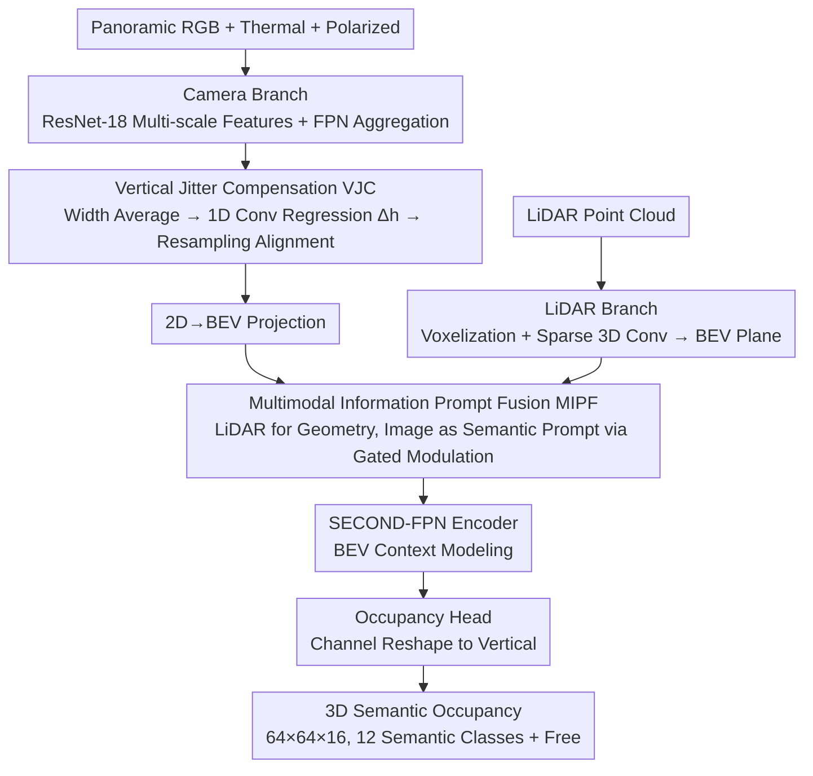

# Panoramic Multimodal Semantic Occupancy Prediction for Quadruped Robots

**Conference**: CVPR 2026  
**arXiv**: [2603.13108](https://arxiv.org/abs/2603.13108)  
**Code**: [https://github.com/SXDR/PanoMMOcc](https://github.com/SXDR/PanoMMOcc)  
**Area**: Autonomous Driving  
**Keywords**: Panoramic occupancy prediction, quadruped robots, multimodal fusion, vertical jitter compensation, BEV perception  

## TL;DR
This work constructs PanoMMOcc, the first panoramic multimodal (RGB + Thermal + Polarized + LiDAR) semantic occupancy dataset for quadruped robots. It proposes the VoxelHound framework, which achieves robust 3D occupancy prediction through Vertical Jitter Compensation (VJC) and Multimodal Information Prompt Fusion (MIPF) modules, reaching 23.34% mIoU (+4.16%).

## Background & Motivation

**Background**: 3D semantic occupancy prediction serves as a critical intermediate representation connecting perception and motion planning by unifying the modeling of free, occupied, and unknown spaces. Panoramic cameras offer 360° visual coverage without blind spots, making them ideal for mobile robots. However, existing occupancy prediction methods and datasets are almost exclusively designed for wheeled autonomous driving scenarios using multi-view pinhole cameras and vehicle-mounted LiDAR. Quadruped robots face three unique challenges: (1) low sensor viewpoints and severe self-occlusion; (2) intense vertical jitter caused by gait motion, leading to image blur and feature misalignment; (3) unreliability of RGB-only solutions under varying lighting, low-texture areas, and long-range scenes. Consequently, a joint panoramic imaging and multimodal perception solution is required, but such datasets and methods did not previously exist.

**Goal**: How to achieve accurate 3D semantic occupancy prediction on a quadruped robot platform by utilizing panoramic cameras and multiple complementary sensors (Thermal, Polarized, LiDAR) to overcome gait jitter and single-modality limitations? This involves addressing three sub-problems: (1) the lack of a panoramic multimodal occupancy dataset for quadrupeds; (2) the disruption of spatial consistency in BEV transformations caused by gait-induced vertical jitter; and (3) effective fusion strategies for heterogeneous modalities.

## Method

### Overall Architecture

VoxelHound aims to address 3D semantic occupancy prediction under the triple constraints of low viewpoints, gait jitter, and single-modality instability. It simultaneously receives panoramic RGB (from a PAL camera, 360°×70° FoV), thermal, and polarized images, along with LiDAR point clouds. The camera branch extracts multi-scale features for the three image types using ResNet-18 and aggregates them via FPN. After clearing gait offsets through the Vertical Jitter Compensation (VJC) module, it performs 2D-to-BEV projection. The LiDAR branch voxelizes the point cloud and compresses it into the same BEV plane using sparse 3D convolutions. The four-way BEV features are then aggregated via Multimodal Information Prompt Fusion (MIPF) and processed by a SECOND-FPN encoder for contextual modeling. Finally, the occupancy head reshapes the BEV channel dimension into the vertical dimension to output a 64×64×16 3D occupancy grid (12 semantic classes + free class). VJC and MIPF are the core modules.

### Key Designs

**1. Vertical Jitter Compensation (VJC): Subtracting Gait Jitter from Features**

As quadruped robots oscillate vertically along the axis during steps, captured images contain systematic vertical offsets, which cause feature misalignment during BEV transformation. VJC is inserted between the image encoder and BEV transformation to specifically estimate and counteract this offset. It averages the feature map along the width dimension to obtain a feature $\mathbf{F}_v \in \mathbb{R}^{C \times H}$ that retains only vertical structures. After encoding this with two levels of 1D convolution and ReLU, a global vertical offset $\Delta h$ is regressed via adaptive average pooling and a linear layer. Finally, a sampling grid with $\Delta h$ is used for bilinear interpolation to realign the features. 

This module introduces negligible parameters and memory overhead (+0.04M at 64 hidden channels) but cleans physical noise before it enters the BEV space, effectively providing "stabilized" features for all subsequent modules.

**2. Multimodal Information Prompt Fusion (MIPF): LiDAR as Geometric Lead, Image as Semantic Supplement**

Concatenation-based or addition-based fusion treats all modalities equally. However, LiDAR provides a stable 3D geometric skeleton, while image modalities contribute primarily semantic information. Equal treatment can allow noisier images to contaminate the geometry. MIPF adopts an asymmetric "Geometry Lead + Semantic Supplement" approach: each modality is projected into a shared embedding space using 1×1 convolutions. For each image modality, BEV features are compressed into a compact semantic prompt vector $\mathbf{p}_m$ via global average pooling and an MLP. Attention interaction then uses LiDAR BEV features as the query, and semantic prompts as the key/value. The results are residually modulated via sigmoid gating, meaning the prompts adaptively re-weight the LiDAR features rather than overriding the geometric structure.

Since the prompts consist of only 3 tokens, this is significantly more efficient than dense spatial cross-attention across the whole BEV. Furthermore, the residual modulation ensures that even if image branches are unreliable (e.g., at night or in low-texture areas), the geometric backbone remains stable.

### Loss & Training

A comprehensive loss is employed: cross-entropy $\mathcal{L}_{ce}$ + Lovász-Softmax $\mathcal{L}_{ls}$ (to handle class imbalance) + geometric affinity loss $\mathcal{L}_{scal}^{geo}$ + semantic affinity loss $\mathcal{L}_{scal}^{sem}$ (to encourage consistency between adjacent voxels). The AdamW optimizer is used with a learning rate of 4e-4 and weight decay of 0.01, trained for 48 epochs on 4×RTX 3090.

## Key Experimental Results

| Method | Modality | mIoU |
|------|------|------|
| MonoScene | C | 8.94 |
| EFFOcc-C | C | 4.47 |
| EFFOcc-L | L | 18.77 |
| EFFOcc-T (C+L) | C+L | 19.18 |
| **VoxelHound** | **C+L+T+P** | **23.34** |

| Lighting | Modality | mIoU |
|----------|------|------|
| Day | C+L | 22.56 |
| Day | C+L+T+P | 23.34 |
| Night | C+L | 19.17 |
| Night | C+L+T+P | 18.68 |

### Ablation Study
- Baseline (without VJC or MIPF): 22.74 mIoU
- +VJC: 22.92 (+0.18), verifying jitter compensation effectiveness.
- +MIPF: 23.14 (+0.40), showing higher contribution from the fusion module.
- Both: 23.34 (+0.60), showing modules are complementary.
- VJC Hidden Channel: 64 is optimal (23.34) with minimal parameter increase (0.04M).
- MIPF: Optimal with prompt channel 8 and attention heads 8 (23.34).

## Highlights & Insights
- **Novelty**: The first panoramic multimodal occupancy dataset for quadruped robots, filling a major gap.
- **Efficient VJC Design**: Uses 1D convolution to estimate global vertical offset for jitter compensation; simple logic with near-zero computational overhead.
- **Asymmetric Fusion Philosophy via MIPF**: Compressing image modalities into compact prompts rather than dense cross-attention preserves LiDAR geometry while introducing semantic enhancement. This "Geometry Lead, Semantic Supplement" approach is transferable to other multimodal fusion scenarios.
- **Four Sensing Modalities**: Inclusion of non-standard modalities such as thermal (robustness in low light) and polarization (revealing material and subtle target clues) is noteworthy.
- **Open-source Tools**: Provides LiDAR-camera calibration tools alongside the dataset.

## Limitations & Future Work
- Limited dataset scale (21.6k frames), significantly smaller than large-scale driving datasets (nuScenes 40k, SemanticKITTI 43k), making large-scale model training difficult.
- Voxel resolution (0.4m) is relatively coarse, unsuitable for task-specific manipulation like grasping that requires fine geometry.
- Nighttime performance with full modalities (18.68 mIoU) is unexpectedly lower than daytime C+L configuration (22.56), suggesting that the contribution of thermal and polarized data at night requires better fusion strategies.
- Covers only outdoor scenes; lacks indoor environments.
- VJC only compensates for global vertical offset and does not model rotation or local deformations.
- Primarily validated on a custom dataset; lacks generalization testing on other occupancy benchmarks.

## Related Work & Insights
- **vs EFFOcc**: The closest existing baseline. VoxelHound outperforms EFFOcc-T by 4.16 mIoU in the C+L configuration, with a wider gap when thermal and polarized modalities are added. Key differences lie in the asymmetric fusion of MIPF and jitter compensation in VJC.
- **vs MonoScene**: As a monocular occupancy method, MonoScene achieves only 8.94 mIoU in panoramic scenes, indicating that pure vision is insufficient for quadruped platforms (low viewpoints, jitter, lighting changes).
- **vs QuadOcc**: Also aimed at quadrupeds but uses only panoramic RGB with fewer classes (6). PanoMMOcc has significant advantages in modality diversity and annotation completeness.
- **Prompt-based Fusion**: The design of "prompt-style fusion" in MIPF can be extended to other multimodal tasks, replacing dense feature interactions with lightweight prompts.

## Rating
- Novelty: ⭐⭐⭐⭐ First panoramic multimodal occupancy dataset and framework for quadrupeds.
- Experimental Thoroughness: ⭐⭐⭐ Validated only on a custom dataset, lacking cross-dataset experiments.
- Writing Quality: ⭐⭐⭐⭐ Clear structure with sufficient dataset details and appendices.
- Value: ⭐⭐⭐⭐ Open-sourced dataset and calibration tools are highly valuable to the community.

<!-- RELATED:START -->

## Related Papers

- [\[CVPR 2026\] OneOcc: Semantic Occupancy Prediction for Legged Robots with a Single Panoramic Camera](oneocc_semantic_occupancy_prediction_for_legged_robots_with_a_single_panoramic_c.md)
- [\[CVPR 2026\] An Instance-Centric Panoptic Occupancy Prediction Benchmark for Autonomous Driving](an_instance-centric_panoptic_occupancy_prediction_benchmark_for_autonomous_drivi.md)
- [\[CVPR 2026\] Learning Geometric and Photometric Features from Panoramic LiDAR Scans for Outdoor Place Categorization](learning_geometric_and_photometric_features_from_p.md)
- [\[CVPR 2026\] M²-Occ: Resilient 3D Semantic Occupancy Prediction for Autonomous Driving with Incomplete Camera Inputs](m2-occ_resilient_3d_semantic_occupancy_prediction_for_autonomous_driving_with_in.md)
- [\[CVPR 2026\] O3N: Omnidirectional Open-Vocabulary Occupancy Prediction](o3n_omnidirectional_open-vocabulary_occupancy_prediction.md)

<!-- RELATED:END -->
