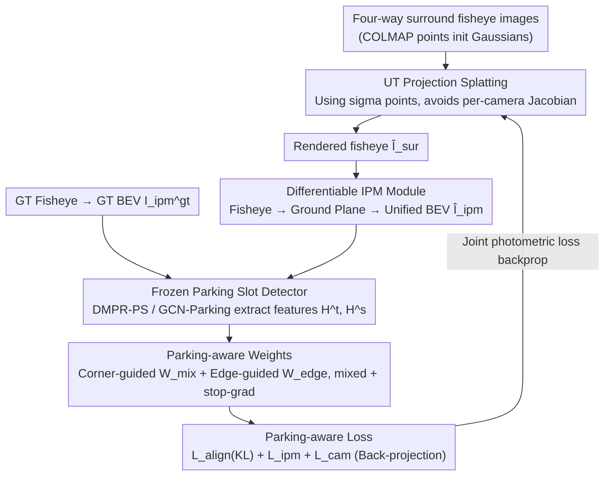

# ParkGaussian: Surround-view 3D Gaussian Splatting for Autonomous Parking

**Conference**: CVPR 2026  
**Paper**: [CVF Open Access](https://openaccess.thecvf.com/content/CVPR2026/html/Wei_ParkGaussian_Surround-view_3D_Gaussian_Splatting_for_Autonomous_Parking_CVPR_2026_paper.html)  
**Code**: https://github.com/wm-research/ParkGaussian  
**Area**: Autonomous Driving  
**Keywords**: Automated valet parking, 3D Gaussian Splatting, surround-view fisheye, parking slot detection, differentiable IPM

## TL;DR
Targeting "crowded, GPS-denied, and low-light" underground garage scenarios, this work first establishes ParkRecon3D, the first 3D reconstruction benchmark for parking (four-way surround-view fisheye + 60,000 parking slot annotations). It then proposes ParkGaussian, which adapts 3DGS to fisheye cameras via UT projection, converts rendering results to Birds-Eye-View (BEV) using differentiable IPM, and employs a frozen parking slot detector for teacher-student guidance to perform "parking-aware reconstruction." This ensures the reconstruction is not only visually high-fidelity but also maintains perceptual consistency for downstream parking slot detection.

## Background & Motivation

**Background**: Automated Valet Parking (AVP) is a critical component of autonomous driving systems. However, it differs significantly from structured, GPS-enabled road driving, as it often occurs in narrow underground spaces with crowded slots and low-light conditions. Existing parking research mostly stays in 2D: using Inverse Perspective Mapping (IPM) to convert multi-way fisheye images to BEV for parking slot detection, or performing SLAM on this basis, or learning end-to-end perception-planning-control in CARLA simulations. While 4D reconstruction for driving scenarios using NeRF/3DGS (such as OmniRe and various street-view Gaussian methods) has matured, most focus exclusively on open roads.

**Limitations of Prior Work**: (1) 3D reconstruction for parking scenarios is nearly a blank field without specialized benchmarks. (2) Existing driving reconstruction methods heavily rely on dense LiDAR and well-calibrated GPS/IMU. Underground garages suffer from poor lighting, repetitive textures, and GPS denial, making extrinsic calibration difficult and rendering these methods inapplicable. (3) More fundamentally, previous reconstructions pursued visual fidelity (PSNR/SSIM) but ignored the true purpose of simulation: generating "perceptually aligned" synthetic data to faithfully evaluate downstream models. For AVP, the system input is the **parking slot detection module**; hence, merely rendering the scene clearly is not directly useful—visual fidelity in parking-related regions must align with downstream perception models.

**Key Challenge**: The optimization objective of the reconstruction model (photometric fidelity) is inconsistent with that of the perception model (parking slot structure). Their feature distributions differ significantly, leading to a situation where "clearly rendered" geometry might not be the geometry required by the detector. Simultaneously, the strong distortion of fisheye cameras causes the first-order Jacobian approximation in vanilla 3DGS to fail.

**Goal**: (1) Construct a parking reconstruction benchmark for real underground garages; (2) Enable stable 3DGS training directly on surround-view fisheye cameras; (3) Backpropagate supervision signals from downstream parking slot detection to reconstruction optimization to ensure structural fidelity in critical parking areas.

**Key Insight**: Since the entry point for parking is BEV parking slot detection, the reconstruction pipeline is made fully differentiable: "Rendering fisheye → Differentiable IPM to BEV → Passing through detector." The structural feature difference between "Ground Truth BEV" and "Rendered BEV" from a frozen detector is used as teacher-student guidance to propagate gradients back to the Gaussians.

**Core Idea**: Connect "3DGS reconstruction" with a "parking slot detector" via differentiable IPM. A frozen detector acts as a teacher to inject parking structure priors into Gaussian optimization, making the reconstruction both visually pleasing and "detector-friendly."

## Method

### Overall Architecture
The input to ParkGaussian is four-way surround-view fisheye images (Front/Rear/Left/Right), and the output is a 3DGS representation of the underground garage. The pipeline consists of four stages: ① Gaussians use **UT projection** to stably splat four-way fisheye renderings (bypassing Jacobian approximations that fail under fisheye distortion); ② Rendered images pass through a **differentiable IPM** module to fuse into a unified BEV map; ③ The same IPM converts Ground Truth (GT) fisheye images to GT BEV maps; both are fed into a **frozen parking slot detector** (DMPR-PS or GCN-Parking) to extract teacher-student structural features; ④ **Parking-aware weights** are constructed from teacher-student features to supervise the reconstruction simultaneously in the IPM space and the back-projected camera space via weighting. Training occurs in two stages: 20,000 steps with vanilla 3DGS photometric loss, followed by 10,000 steps with alignment and parking-aware losses.

### Key Designs

**1. ParkRecon3D Benchmark: The first surround-view fisheye dataset for parking reconstruction**

To fill the gap in parking reconstruction, the authors expanded the AVM-SLAM open-source data to create ParkRecon3D. Data was collected in an underground garage (~220m x 110m, 430+ slots) using four fisheye cameras (10 Hz, 1280x960, synthesized into 1354x1632 IPM images). It includes 4 representative scenes, 40,000+ synchronized multi-fisheye frames, and 60,000+ manually verified parking slot labels. Technical detail: Due to noisy IMU/odometry in underground settings, COLMAP was used to calibrate multi-camera extrinsics as geometric references. Slot annotations follow the DMPR-PS protocol, marking corners in the BEV domain. This benchmark ties "reconstruction" and "perception" labels to the same real underground data for the first time.

**2. UT Projection for Fisheye: Replacing invalid first-order Jacobian with Unscented Transform**

The EWA splatting in vanilla 3DGS uses a first-order Jacobian to linearize camera projection $v=g(x)$. This is inaccurate for strong fisheye distortion and requires manual Jacobian derivation for every fisheye model. The authors adopt **Unscented Transform (UT) projection** from 3DGUT as a plug-and-play replacement: instead of linearizing the nonlinear projection, a small set of sigma points $x_i=\mu$ or $\mu\pm\sqrt{(n+\lambda)\Sigma}_{[i]}$ are passed through $g(\cdot)$ accurately. The 2D Gaussian footprint is then calculated via $\mu_v=\sum_i w_i^\mu g(x_i)$ and $\Sigma_v=\sum_i w_i^\Sigma(g(x_i)-\mu_v)(g(x_i)-\mu_v)^\top$. This avoids per-model Jacobian derivation and provides stable footprints under strong distortion, significantly improving geometric stability in underground scenes.

**3. Differentiable Surround IPM: A bridge between "Fisheye Rendering" and "BEV Detector"**

Most parking slot detectors operate in BEV, making direct input of fisheye renderings impossible. The authors implemented the fisheye-to-BEV inverse perspective mapping as a closed-form, fully differentiable module: each fisheye pixel $u$ is back-projected into a camera-system ray using the inverse fisheye model $\pi_c^{-1}$, then intersected with the vehicle-system ground plane $z=0$ to obtain ground points $[x_v,y_v]^\top$. Ground points from four cameras are re-projected to unified BEV pixels using IPM intrinsics $K_{ipm}$ to get $\hat{I}_{ipm} = \Phi_{IPM}(\hat{I}_{sur})$. Since the entire process is differentiable, gradients from the downstream detector can propagate back to the 3D Gaussians.

**4. Parking-aware Reconstruction: Injecting structural priors via teacher-student guidance**

This is the core of "perceptual alignment." A detector fine-tuned on ParkRecon3D is frozen to extract features $H^t$ (teacher) for GT BEV and $H^s$ (student) for rendered BEV. Using DMPR-PS as an example, the corner confidence channel is passed through a shaping function $W=\sigma((H_{conf}-\tau)/T)^\gamma$ ($T=0.5, \tau=0.25, \gamma=1$) to obtain soft masks $W^t, W^s$. These are mixed as $W_{mix}=\alpha W^t+(1-\alpha)\,\mathrm{sg}(W^s)$ ($\alpha=0.8$, with stop-grad to prevent student weights from collapsing). GCN-Parking further predicts edges, which are rasterized into an edge map $W_{edge}$ using Gaussian tubes ($\sigma=1.5$). The final weight $W'_{mix}=W_{mix}+\lambda_{edge}W_{edge}$ emphasizes both corners and boundaries. The loss function includes: $\mathcal{L}_{align}=\mathrm{KL}(\pi^s\|\pi^t)$ for distribution alignment in teacher top-K regions; $\mathcal{L}_{ipm}$ and $\mathcal{L}_{cam}$ perform weighted L1 supervision in IPM and camera spaces. Total loss: $\mathcal{L}=\mathcal{L}_{rgb}+\lambda_{align}\mathcal{L}_{align}+\lambda_{ipm}\mathcal{L}_{ipm}+\lambda_{cam}\mathcal{L}_{cam}$.

### Loss & Training
Two stages: The first 20,000 steps use only photometric loss $\mathcal{L}_{rgb}=(1-\lambda)\|\hat{I}_{sur}-I_{sur}\|_1+\lambda\mathcal{L}_{D\text{-}SSIM}$ ($\lambda=0.2$). The subsequent 10,000 steps add alignment and parking-aware losses. Gaussians are initialized with COLMAP sparse points from ParkRecon3D and optimized using the MCMC strategy in GSplat for convergence stability on an RTX 4090 using Adam for 30,000 steps.

## Key Experimental Results

Experiments use four scenes from ParkRecon3D (100 surround-view frames per scene, evaluated every 10 frames). Reconstruction baselines include Self-Cali-GS, 3DGUT, and OmniRe. Perception baselines include DMPR-PS and GCN-Parking.

### Main Results: New View Synthesis Quality (Selected Scenes)

| Scene | Method | PSNR↑ | SSIM↑ | LPIPS↓ |
|-------|--------|-------|-------|--------|
| Scene1 | Self-Cali-GS | 23.78 | 0.82 | 0.31 |
| Scene1 | 3DGUT | 28.70 | 0.92 | 0.21 |
| Scene1 | OmniRe | 25.12 | 0.84 | 0.37 |
| Scene1 | **Ours (w/ GCN-Parking)** | **30.09** | **0.93** | **0.20** |
| Scene3 | 3DGUT | 27.80 | 0.92 | 0.20 |
| Scene3 | OmniRe | 21.58 | 0.78 | 0.50 |
| Scene3 | **Ours (w/ GCN-Parking)** | **30.27** | **0.93** | **0.20** |

> Interpretation: Ours achieves the best reconstruction quality across scenes. Street-view methods like OmniRe suffer from severe blurring in underground garages due to the lack of dense LiDAR/GPS. While 3DGUT/Self-Cali-GS establish global topology, they lack robustness in details. Ours improves quality via parking-aware strategies in critical areas.

### Main Results: Downstream Case-Consistency (Precision / Recall)

| Detector | Config | Scene1 Prec↑ | Scene1 Rec↑ | Scene3 Prec↑ | Scene3 Rec↑ |
|----------|--------|--------------|-------------|--------------|-------------|
| DMPR-PS | GT Real | 0.86 | 0.22 | 0.49 | 0.21 |
| DMPR-PS | Ours w/o Aware | 0.71 | 0.08 | 0.48 | 0.18 |
| DMPR-PS | Ours w/ Aware | 0.74 | 0.10 | 0.47 | 0.19 |
| GCN | GT Real | 0.99 | 0.49 | 0.98 | 0.50 |
| GCN | Ours w/o Aware | 0.95 | 0.40 | 0.94 | 0.48 |
| GCN | Ours w/ Aware | 0.97 | 0.43 | 0.95 | 0.48 |

> Interpretation: Running the detector on rendered images shows consistent Precision/Recall gains with parking-aware reconstruction. Results on GCN are close to real-image levels (e.g., Scene1 GCN 0.95/0.40 → 0.97/0.43 vs. GT 0.99/0.49), proving the reconstruction fits downstream perception requirements.

### Ablation Study: Parking-aware Strategy Components (Scene1)

| Variant | PSNR↑ | Prec↑ | Rec↑ | Note |
|---------|-------|-------|------|------|
| Direct IPM L1 | 24.94 | 0.62 | 0.06 | Projection conflicts at boundaries; IPM noise injection |
| Feature-only | 27.43 | 0.64 | 0.05 | Visual gain but unreliable geometry; misaligned objectives |
| Teacher Only | 29.56 | 0.90 | 0.41 | Stable but non-adaptive |
| Student Only | 28.62 | 0.81 | 0.40 | Adaptive but prone to noise |
| **Full (Ours)** | **30.09** | **0.97** | **0.43** | Best visual and downstream Prec/Rec |

### Key Findings
- **Naive IPM L1 is nearly unusable**: Recall is only 0.06 due to projection conflicts at FOV boundaries. Feature-level supervision alone cannot recover parking geometry, confirming the core challenge of misaligned perception and reconstruction objectives.
- **Teacher-Student Complementarity**: Teacher weights provide stability, while student weights offer adaptivity to the current rendering. Combining both with distribution alignment yields the best image quality and downstream performance.

## Highlights & Insights
- **Shifting Simulation Goals**: The core insight is that for parking, simulation should be "useful for perception" rather than just "visually similar." Redefining reconstruction to align with the detector is a significant conceptual contribution.
- **Differentiable IPM as a Vital Bridge**: Creating a differentiable link from "fisheye rendering → BEV → detector" allows downstream perception gradients to reach the Gaussians, serving as the technical pivot for task-driven reconstruction.
- **Stop-grad for Stability**: Using $\mathrm{sg}(W^s)$ to prevent the student weight from being directly updated avoids the trivial solution of "global low confidence."
- **UT Projection for Fisheye**: This provides a clean engineering solution for surround-view 3DGS that is Jacobian-free and stable under high distortion.

## Limitations & Future Work
- **Inherent Underground Challenges**: Specular reflections, repetitive textures, and motion blur from long exposures in low light remain difficult to model accurately.
- **Detection Precision**: Recall on DMPR-PS is generally low (even on real images), and the gain from perception-aware reconstruction is limited, suggesting detection on rendered images still has a gap for production use.
- **IPM Assumptions**: The $z=0$ ground plane assumption may cause distortion on uneven surfaces or ramps.
- **Future Directions**: Explicitly modeling reflections and exposure variations or using multi-detector ensembles might further improve downstream Recall.

## Related Work & Insights
- **vs OmniRe / Street-view Gaussians**: These rely on dense LiDAR/GPS; in underground garages, they cause blurring and structural loss. Ours handles GPS-denial and low light via COLMAP extrinsic calibration + UT fisheye projection + parking awareness.
- **vs 3DGUT / Self-Cali-GS**: These fisheye baselines establish coarse topology but fail on parking slot details. This work treats UT projection as a component and overlays differentiable IPM with parking-aware supervision.
- **vs Traditional Parking Perception**: Previous works focused on 2D BEV detection. This work reverses the relationship, using detectors as teachers to constrain 3D reconstruction, thereby creating a realistic simulator capable of evaluating downstream models.

## Rating
- Novelty: ⭐⭐⭐⭐ First parking reconstruction benchmark + teacher-student guidance for 3DGS. Problem redefinition is highly valuable.
- Experimental Thoroughness: ⭐⭐⭐ Good variety of NVS, downstream, and ablation tests, but limited scenes and low absolute recall.
- Writing Quality: ⭐⭐⭐⭐ Clear motivation and technical derivations; missing some hyperparameter sensitivity analysis.
- Value: ⭐⭐⭐⭐ Fills a gap in parking 3D reconstruction and provides a paradigm for perception-aligned simulation.

<!-- RELATED:START -->

## Related Papers

- [\[CVPR 2026\] Dr.Occ: Depth- and Region-Guided 3D Occupancy from Surround-View Cameras for Autonomous Driving](drocc_depth_region_guided_3d_occupancy.md)
- [\[AAAI 2026\] Exploring Surround-View Fisheye Camera 3D Object Detection](../../AAAI2026/autonomous_driving/exploring_surround-view_fisheye_camera_3d_object_detection.md)
- [\[ICLR 2026\] Beyond Visual Reconstruction Quality: Object Perception-aware 3D Gaussian Splatting for Autonomous Driving](../../ICLR2026/autonomous_driving/beyond_visual_reconstruction_quality_object_perception-aware_3d_gaussian_splatti.md)
- [\[ICCV 2025\] 3D Gaussian Splatting Driven Multi-View Robust Physical Adversarial Camouflage Generation](../../ICCV2025/autonomous_driving/3d_gaussian_splatting_driven_multiview_robust_physical_adver.md)
- [\[CVPR 2025\] EVolSplat: Efficient Volume-based Gaussian Splatting for Urban View Synthesis](../../CVPR2025/autonomous_driving/evolsplat_efficient_volume-based_gaussian_splatting_for_urban_view_synthesis.md)

<!-- RELATED:END -->
