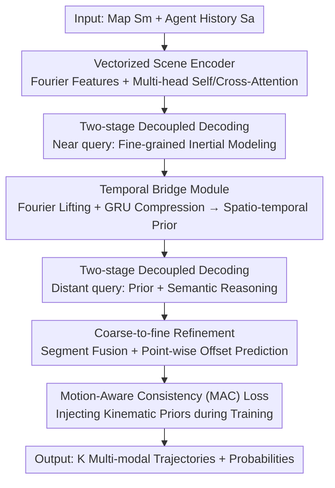

# Perceiving the Near, Reasoning the Distant: Coherent Long-Horizon Trajectory Prediction for Autonomous Driving

**Conference**: CVPR 2026  
**Paper**: [CVF Open Access](https://openaccess.thecvf.com/content/CVPR2026/html/Hu_Perceiving_the_Near_Reasoning_the_Distant_Coherent_Long_Horizon_Trajectory_Prediction_CVPR_2026_paper.html)  
**Code**: https://github.com/HuaHu-yizhou/NDPNet.git  
**Area**: Autonomous Driving / Trajectory Prediction  
**Keywords**: Long-horizon Trajectory Prediction, Two-stage Decoding, Kinematic Consistency, Multi-modal Prediction, Waymo/Argoverse

## TL;DR
NDPNet decouples long-horizon trajectory prediction into two specialized decoding paths: "inertia-based near" and "semantic-based distant." These paths are smoothly connected via a temporal bridge module, further enhanced by a Motion-Aware Consistency (MAC) loss that incorporates kinematic priors into training targets. It achieves SOTA on Argoverse 2 and WOMD, marking the first time minFDE6 has been reduced below 1.75 for 8-second predictions.

## Background & Motivation

**Background**: Most current motion prediction methods for autonomous driving utilize "vectorized scene representation + multi-agent attention" with a shared one-shot decoder to output the entire future trajectory. Leading methods on benchmarks like Argoverse 2 and Waymo are predominantly non-autoregressive one-shot predictors.

**Limitations of Prior Work**: The authors identify two overlooked structural flaws. First, **the near future (0–3s) and far future (3–8s) follow distinct dynamics**. The near future is dominated by motion inertia and can be accurately extrapolated from history, whereas the far future is stochastic and shaped by high-level semantics like lane topology and multi-agent interactions. One-shot decoders apply homogeneous attention across all timesteps, causing "inertia signals" and "semantic signals" to compete for limited representation capacity, which blurs temporal reasoning and degrades long-term accuracy. Second, many methods treat trajectories as **point-wise regression**, supervising only positions. Heading is often derived post-hoc via interpolation, leading to abrupt orientation changes or kinematically infeasible paths. Methods that use independent heads for heading often suffer from pose inconsistency, while post-hoc kinematic filtering is non-differentiable and may discard valid candidates.

**Key Challenge**: While autoregressive (patch-by-patch) predictors adapt their modeling focus over time, they suffer from error accumulation in the long term. Conversely, one-shot predictors avoid error accumulation but cannot dynamically specialize modeling capacity for different time horizons. The field lacks a framework that balances temporal specialization without sacrificing long-term stability or kinematic consistency during training.

**Goal**: (1) Establish specialized modeling paths for the near and far future with smooth transitions; (2) Transform kinematic constraints into differentiable training objectives rather than post-hoc filters.

**Key Insight**: Building on the observation of "perceiving the near, reasoning the distant"—since the near future is easier to predict and primarily determined by history, it should be accurately modeled first. These spatio-temporal cues then act as a prior to guide semantic reasoning for the distant future.

**Core Idea**: Utilize a **two-stage near-distant decoupled decoding + temporal bridge + Motion-Aware Consistency (MAC) loss** to achieve both specialized modeling and kinematic feasibility.

## Method

### Overall Architecture
NDPNet follows the encoder-decoder paradigm. A vectorized encoder encodes map elements $S_m$ and agent histories $S_a$ into $[E_m, E_a]$ using Fourier features and MLP for temporal features, followed by multi-head self/cross-attention for interactions. The core innovation lies in the decoder, which explicitly splits each future trajectory $\hat{X}^k_i$ into a near segment $\hat{X}^k_{t_n}$ (first $t_n$ frames) and a distant segment $\hat{X}^k_{t_d}$ (remaining frames) via independent DETR-style query paths. The near-segment query performs fine-grained modeling from history and map encodings. A temporal bridge module lifts the predicted near trajectory to a high-dimensional space and compresses it via a GRU to serve as a spatio-temporal prior for the distant query. The distant query then integrates this prior with scene interactions for semantic-driven long-term reasoning. Both segments are fused and refined via a standard coarse-to-fine module. During training, a MAC loss is added to the regression/classification objectives to enforce kinematic priors.

### Key Designs

**1. Two-stage Near-Distant Decoupled Decoding: Separating Inertia and Semantic Paths**

To address signal competition in one-shot decoders, NDPNet explicitly splits trajectories into $[\hat{X}^k_{t_n}, \hat{X}^k_{t_d}]$, using two sets of DETR-like queries $Q_n, Q_d \in \mathbb{R}^{N_a\times K\times D}$. The near-segment decoding uses cross-attention with agent histories, then maps, followed by self-attention for spatial dependencies, and MHSA across $K$ queries for diversity, outputting $\hat{X}^k_{t_n}=\mathrm{MLP}(\mathrm{MHSA}(Q'_n))$. The distant-segment follows a similar path but first performs cross-attention with near-future latent features. This allows the near path to focus on inertia and the distant path on high-level semantics. Ablations on AV2 show that changing the one-shot variant to two-stage reduces minFDE6 from 1.264 to 1.165, while a three-stage variant (1.193) performs worse, suggesting "near/far binary" matches the data dynamics best.

**2. Temporal Bridge Module: Condensing Near Cues into Distant Priors**

Simply splitting horizons is insufficient; the distant segment requires near-future information for temporal coherence. Since the near-segment query is a spatio-temporal tensor $[N_a, K, t_n, D]$, dense cross-attention is computationally expensive. The bridge module uses a **spatio-temporal decomposition** strategy: it lifts the near trajectory $\hat{X}^k_{t_n}$ via Fourier embedding and uses a GRU to compress the temporal dimension into a single vector $[N_a, K, 1, D]$. The distant query then attends to this compressed prior ($Q'_d=\mathrm{MHCA}(\mathrm{GRU}(\mathrm{Fourier}(\hat{X}^k_{t_n})), Q_d)$), injecting near-future cues efficiently. Adding this bridge improved minFDE6 from 1.203 to 1.173 in ablations.

**3. Motion-Aware Consistency (MAC) Loss: Differentiable Kinematic Constraints**

To resolve heading discontinuities, the MAC loss assumes agents follow kinematic constraints $[\dot{x},\dot{y}]=[\cos\theta,\sin\theta]\cdot V$. Using ground truth velocity $V^{gt}$ and angular velocity $\dot{\theta}^{gt}$, it generates "kinematic virtual targets" via forward Euler integration. The position term is $\ell_{pos}=\mathcal{M}\cdot\|\hat{X}^k_{1\to T_s}-\overline{X}^k_{1\to T_s}\|^2$, where $\overline{X}^k=\hat{X}^k_{0\to T_s-1}+V^{gt}\cdot\mathcal{R}\cdot\Delta T$ ($\mathcal{R}$ is the rotation matrix). The orientation term is $\ell_{dir}=\mathcal{M}\cdot\|\hat{\theta}^k_{1\to T_s}-\overline{\theta}^k_{1\to T_s}\|^2$. Crucially, an **agent type mask** $\mathcal{M}$ applies constraints only to non-holonomic targets (e.g., vehicles), exempting pedestrians/cyclists. Total loss: $\ell=\ell_{reg}+\ell_{cls}+\alpha_1\ell_{pos}+\alpha_2\ell_{dir}$. This loss is plug-and-play and reduces both FDE and heading errors across various baselines (HiVT, SceneTransformer, QCNet).

## Key Experimental Results

### Main Results
On the Argoverse 2 (6s prediction) single-agent test set, NDPNet outperforms all non-ensemble methods and further leads after ensembling:

| Dataset | Configuration | minFDE6↓ | minADE6↓ | b-minFDE6↓ | Comparison |
|---------|---------------|----------|----------|------------|------------|
| AV2 test | QCNet (Prev. SOTA, no ensemble) | 1.29 | 0.65 | 1.91 | Baseline |
| AV2 test | **NDPNet (Ours, no ensemble)** | **1.17** | **0.61** | **1.83** | Superior |
| AV2 test | DeMo (Ensemble) | 1.11 | 0.60 | 1.73 | Strong Ensemble |
| AV2 test | **NDPNet (Ours, ensemble)** | **1.09** | **0.58** | **1.71** | SOTA |

On WOMD (8s prediction), NDPNet achieves sub-1.75 minFDE6 for the first time on 8-second horizons:

| Dataset/Horizon | Method | All minADE6↓ | All minFDE6↓ | Note |
|-----------------|--------|--------------|--------------|------|
| WOMD 8s | MTR_v3 (Ensemble) | 0.8959 | 1.8500 | Strong Ensemble |
| WOMD 8s | **NDPNet (Ours, no ensemble)** | **0.8394** | **1.7481** | First sub-1.75 |
| WOMD Avg (3/5/8s) | Wayformer (Dense+NMS) | 0.5454 | 1.1280 | Requires NMS |
| WOMD Avg (3/5/8s) | **NDPNet (Ours, no NMS/Ens)** | **0.5160** | **1.0319** | #1 minFDE/ADE, mAP6=0.4335 |

Note: NDPNet outputs exactly 6 modes without requiring dense candidates, NMS post-processing, or model ensembles (on WOMD).

### Ablation Study

| Configuration | minFDE6↓ | minADE6↓ | minAHE6↓ | Note |
|---------------|----------|----------|----------|------|
| Baseline (one-shot variant) | 1.264 | 0.724 | 0.083 | Shared Decoder |
| + Two-stage Decoupling | 1.203 | 0.702 | 0.085 | Large Pos. Improvement |
| + Temporal Bridge | 1.173 | 0.693 | 0.079 | Consistent gains |
| + MAC Loss (Full) | 1.165 | 0.687 | **0.047** | Heading error plunge |

Plug-and-play MAC loss across baselines (minFHE6 = Final Heading Error):

| Method | minFDE6↓ | minAHE6↓ | minFHE6↓ |
|--------|----------|----------|----------|
| SceneT | 2.49 | 0.15 | 0.21 |
| SceneT w/ MAC | 2.39 | 0.11 | 0.17 |
| HiVT | 1.98 | 0.14 | 0.18 |
| HiVT w/ MAC | 1.94 | 0.07 | 0.12 |
| QCNet | 1.43 | 0.10 | 0.07 |
| QCNet w/ MAC | 1.40 | 0.04 | 0.06 |

### Key Findings
- **MAC loss contributes most to heading**: Adding MAC caused minAHE6 to drop from 0.079 to 0.047, a much larger relative gain than in position. This proves kinematic constraints primarily correct heading consistency.
- **2s is the optimal near-future window**: For both AV2 (6s) and WOMD (8s), $t_n=2s$ was optimal. This duration captures inertia-dominated motion, whereas longer horizons require semantic-focused modeling.
- **Efficiency balance**: The full model runs at 13.1 FPS, outperforming the one-shot variant's FDE with manageable parameters (8.0M units, 10.3 GFLOPs).

## Highlights & Insights
- **Dividing capacity by time horizons**: Instead of stacking generic modules, the architecture specializes based on the physical principle that near/far futures follow different dynamics.
- **Zero-cost inference gain**: The MAC loss is only active during training. It provides "free" improvements in both position and heading accuracy without adding inference latency.
- **Selective physical constraints**: The use of an agent type mask ensures kinematic constraints are only applied to appropriate targets (vehicles), avoiding misalignment for flexible agents like pedestrians.
- **No NMS/Ensemble needed**: The two-stage decoupling provides sufficient multi-modal quality to achieve SOTA without heavy engineering overhead like dense candidate selection or NMS.

## Limitations & Future Work
- The 2s split point is a fixed hyperparameter determined empirically; an adaptive mechanism for different sensor rates or horizons could be explored.
- MAC loss relies on ground truth velocity and angular velocity, making it sensitive to annotation quality.
- Validation is limited to vehicle-centric urban data; generalization to dense crowds or unstructured traffic remains to be seen.
- As horizons extend beyond 8s, a two-stage split might be insufficient, potentially requiring continuous temporal modeling.

## Related Work & Insights
- **vs. One-shot Predictors (QCNet, DeMo)**: One-shot methods suffer from signal competition. NDPNet separates these horizons, avoiding competition and improving long-term accuracy.
- **vs. Autoregressive Predictors**: These avoid signal overlap but suffer from error accumulation. NDPNet's two-stage approach provides specialization without cumulative errors.
- **vs. Post-hoc Filtering**: Filtering is non-differentiable. MAC loss allows the model to learn motion-aware representations end-to-end.
- **vs. Independent Heading Heads**: Independent heads decouple position and orientation. MAC loss couples them via ground-truth dynamics, ensuring pose consistency.

## Rating
- Novelty: ⭐⭐⭐⭐ The "inertia-near, semantic-far" perspective is physically grounded, and the MAC loss is effective, though components are based on existing attention mechanisms.
- Experimental Thoroughness: ⭐⭐⭐⭐⭐ SOTA on AV2 and WOMD. Extensive ablations on components, horizons, and baseline generalization.
- Writing Quality: ⭐⭐⭐⭐ Concepts and diagrams are clear, though some notation inconsistencies (MAC mask naming) exist.
- Value: ⭐⭐⭐⭐ Significant achievements in long-horizon prediction (sub-1.75 FDE on WOMD) and the plug-and-play nature of the MAC loss.

<!-- RELATED:START -->

## Related Papers

- [\[ICML 2026\] DeepSight: Long-Horizon World Modeling via Latent States Prediction for End-to-End Autonomous Driving](../../ICML2026/autonomous_driving/deepsight_long-horizon_world_modeling_via_latent_states_prediction_for_end-to-en.md)
- [\[CVPR 2026\] ColaVLA: Leveraging Cognitive Latent Reasoning for Hierarchical Parallel Trajectory Planning in Autonomous Driving](colavla_leveraging_cognitive_latent_reasoning_for_hierarchical_parallel_trajecto.md)
- [\[CVPR 2026\] CogDriver: Integrating Cognitive Inertia for Temporally Coherent Planning in Autonomous Driving](cogdriver_integrating_cognitive_inertia_for_temporally_coherent_planning_in_auto.md)
- [\[CVPR 2026\] TruckDrive: Long-Range Autonomous Highway Driving Dataset](truckdrive_long-range_autonomous_highway_driving_dataset.md)
- [\[CVPR 2026\] MindDriver: Introducing Progressive Multimodal Reasoning for Autonomous Driving](minddriver_introducing_progressive_multimodal_reasoning_for_autonomous_driving.md)

<!-- RELATED:END -->
