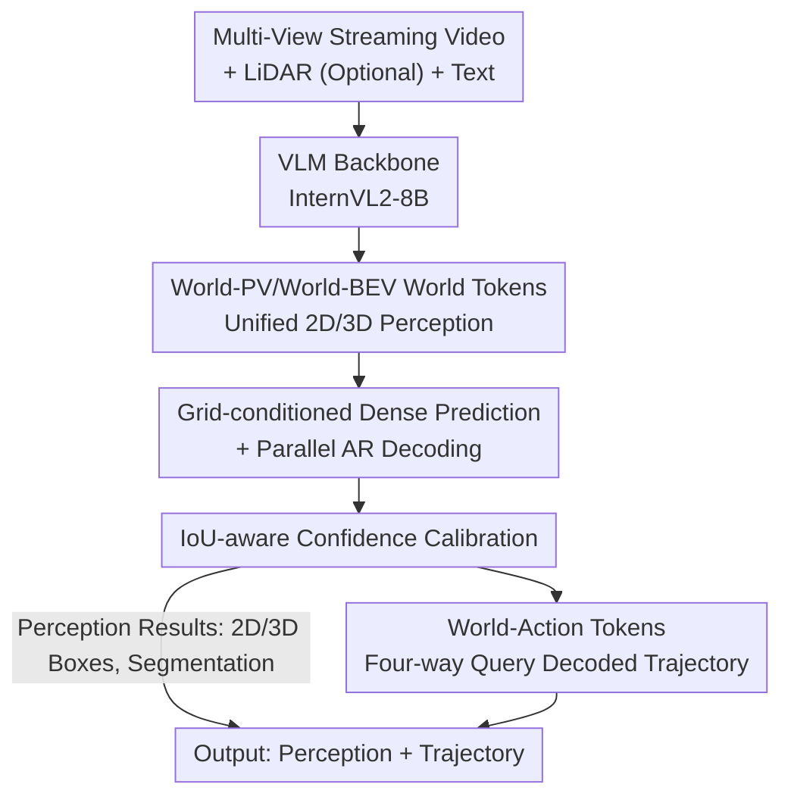

# Percept-WAM: Perception-Enhanced World-Awareness-Action Model for Robust End-to-End Autonomous Driving

**Conference**: CVPR 2026  
**Paper**: [CVF Open Access](https://openaccess.thecvf.com/content/CVPR2026/html/Han_Percept-WAM_Perception-Enhanced_World-Awareness-Action_Model_for_Robust_End-to-End_Autonomous_Driving_CVPR_2026_paper.html)  
**Code**: None  
**Area**: Autonomous Driving / End-to-End Driving / Vision-Language-Action Models  
**Keywords**: End-to-End Autonomous Driving, VLA, BEV Perception, Confidence Calibration, Trajectory Planning  

## TL;DR
Percept-WAM unifies 2D/3D perception tasks by encoding them into two classes of "world tokens" (World-PV and World-BEV) within a single VLM (InternVL2-8B), which are then paired with a set of World-Action tokens to directly output trajectories. This approach executes "perception-reasoning-planning" end-to-end inside a single backbone, achieving 51.7 mAP on COCO 2D detection, 58.9 mAP on nuScenes BEV 3D detection, and a closed-loop PDMS of 90.2 on NAVSIM, outperforming DiffusionDrive by 2.1 points.

## Background & Motivation
**Background**: Current Vision-Language-Action (VLA) systems that integrate VLMs/LLMs into autonomous driving primarily follow two paths. The first is "QA-style supervision" (e.g., EMMA), which frames spatial understanding as question-answering—"What is the distance to the moving object ahead?"—relying on textual responses for indirect localization. The second is the "encoder-diffusion decoder" pipeline (e.g., Diffusion Planner, DiffusionDrive), which generates trajectories directly from extracted features.

**Limitations of Prior Work**: QA-style supervision provides only *indirect* localization signals, making it difficult to generate persistent, reusable, and localizable world states. In crowded scenarios, it often generates duplicate detections with highly inaccurate confidence scores. Although diffusion-based pipelines possess strong generation capabilities, they *discard the reasoning capabilities of LLMs* and suffer from degraded end-to-end performance due to the absence of explicit spatial task learning. Both approaches force a compromise between "precise geometric perception" and "high-level semantic reasoning."

**Key Challenge**: The formidable capability of general VLMs in "general vision-language alignment" *does not equal* geometric reasoning capacity. Evaluations consistently show that general VLMs fall short in core spatial abilities, including 3D localization drift, temporal consistency, and confidence reliability. In autonomous driving, minor geometric errors (detection offsets, yaw drift, BEV/occupancy errors) can cascade and amplify in long-tail scenarios (nighttime, rainy conditions, small targets, rare objects) into fragile decisions.

**Goal**: To embed explicit, persistent world states within a *single VLM* and jointly optimize perception and trajectory generation, allowing the model to perform both reasoning and precise localization.

**Key Insight**: The issue is not "whether VLMs can perceive," but rather "how to represent perception achievements in a form that VLMs can natively read, write, and reuse for downstream tasks." Hence, this work *implicitly* represents all 2D/3D perception tasks as two sets of tokens with metric coordinates and calibrated confidence scores. This allows the backbone to reason over these "spatially anchored evidences" and then feed the tokens to the planning module.

**Core Idea**: Using three types of tokens ("World-PV + World-BEV + World-Action") to unify perception, 3D scene understanding, and trajectory generation into a single VLM backbone, while stabilizing dense perception through grid-conditioned decoding and IoU confidence calibration.

## Method

### Overall Architecture
Percept-WAM utilizes a pre-trained VLM (InternVL2-8B) as the backbone to preserve general reasoning capabilities. It takes multi-view streaming videos, optional LiDAR point clouds, and text queries as input to sequentially output three types of tokens, which map to perception results and trajectories. Images are encoded by the backbone into **World-PV tokens** (perspective-view/image-plane) to handle 2D detection, instance/semantic segmentation, and monocular 3D detection. A set of learnable **World-BEV tokens** "lifts" PV evidence to bird's-eye-view space via cross-attention to undertake BEV 3D detection and map segmentation. Finally, **World-Action tokens** align multi-modal information using four-way point-level queries to decode future trajectories through a lightweight MLP. In this pipeline, dense perception relies on grid-conditioned parallel AR decoding to maintain throughput, and confidence is calibrated via IoU-aware tokens, with a streaming KV cache applied during deployment. Ultimately, this single backbone can output both perception (2D/3D bounding boxes) and trajectories simultaneously, or trajectories alone.

### Key Designs

**1. World-PV / World-BEV World Tokens: Unifying 2D/3D Perception within a Single VLM**

Addressing the pain point that "QA-style supervision yields only indirect localization and cannot produce persistent world states," the authors do not require the model to answer spatial questions in natural language. Instead, they directly represent perception results as two sets of tokens. **World-PV tokens** are features encoded from images, patchified into a grid of size $H\times W$, with each grid position encoding local image coordinates. **World-BEV tokens** are a set of learnable query tokens arranged on an $H\times W$ bird's-eye-view grid centered on the ego-vehicle, where each grid outputs a high-dimensional embedding encoding local object/map elements. Both sets of tokens *explicitly encode metric coordinates + calibrated confidence*, thus serving as localizable, reusable "world states" directly accessible by downstream reasoning and planning.

The key "lifting" mechanism occurs on the BEV side: World-BEV tokens query the features of World-PV tokens through cross-attention, lifting 2D evidence to 3D BEV representations in a purely data-driven manner, independent of explicit depth estimation or geometric projection. When LiDAR is available, point cloud features are extracted via PointPillars, downsampled using PixelUnshuffle + MLP, and then used to *initialize* the word embeddings of World-BEV tokens to inject metrically anchored 3D priors into the BEV representation; with camera-only setups, these embeddings are randomly initialized and trained. This allows the same set of BEV tokens to support both camera-only and multi-modal fusion.

**2. Grid-conditioned Dense Prediction + Parallel AR Decoding: Structuring Multi-Object Dense Reasoning**

The primary engineering challenge of utilizing VLMs for detection is "how to stably and efficiently output dozens of targets from a single image at once." The authors treat each grid token as a *local single-target query*: World-PV tokens interpolate grid tokens using coordinates, with each grid token solely responsible for predicting the bounding box/mask aligned with its coordinates. Detection outputs are serialized into language-like token sequences: 2D boxes are formulated as `cls,<box>x,y,w,h</box>,<conf>s</conf>`, and the `<box>` fields of 3D boxes are extended to $x,y,z,w,h,\ell,\theta,v_x,v_y$ (center, size, yaw, velocity). Continuous values are normalized and then discretized into integer bins ($[0, 1024)$), supervised via cross-entropy (following the Pix2Seq paradigm). Segmentation leverages the UFO concept by treating it as feature retrieval—predicting $K=16$ `<MASK>` tokens and obtaining all class masks in a single forward pass via dot-product similarity between World-PV tokens and mask tokens, without introducing extra parameters.

The key to efficiency is *parallelism*: different grid tokens operate independently by controlling attention masks, decoding in a parallel AR fashion rather than generating sequentially, which significantly boosts throughput without losing accuracy. Furthermore, because categories are specified textually, the detector naturally supports open-vocabulary queries, facilitating robust performance against long-tail road objects.

**3. IoU-aware Confidence Calibration: Suppressing Overconfidence with Self-Model Prediction Distribution Data**

MLLMs applied to perception suffer from an inherent issue—training/inference mismatches that generate duplicate boxes. In addition, directly taking the softmax of category logits as box confidence (like in UFO) leads to *systemic overconfidence*: even with ambiguous detections, the softmax saturates to a high value, causing a surge of high-scoring false positives in crowded scenarios. The authors introduce an additional **IoU confidence token** for each predicted box, aligning confidence to the localization quality of the box rather than the class probability.

Critically, the data generation process is cleverly designed. The authors do not use "random perturbations of GT boxes" to generate confidence training samples (which yields a nearly uniform, unrealistic IoU distribution). Instead, they use the *partially trained model midway through training* to run inference on training images. Predicted boxes that match the GT are paired with their actual IoUs (discretized into 20 bins) to act as training samples. This "model prediction distribution" aligns more closely with the confidence profiles during real inference, thus suppressing spurious detections. During training, GT data (IoU fixed to 1, only learning classes and boxes without supervising IoU to prevent collapse) and confidence data (with loss only calculated on the confidence tokens) are mixed and differentiated using a loss mask. During inference, the final score is the product of **class confidence × predicted IoU score**, providing a more unified, interpretable, and localization-sensitive metric. Ablations show that this "actual model prediction distribution" scheme brings a gain of +1.5 AP / +2.3 AP75, whereas both the "random perturbation" and "uniform model prediction" variants underperform the baseline.

**4. World-Action Tokens and Four-way Queries: Aligning Perception Evidence with Trajectories**

Equipped with World-PV (rich semantics) and World-BEV (precise dynamic/static context), the authors introduce World-Action tokens for query-based trajectory decoding (trained via imitation learning). A persistent challenge is "which modality to trust for trajectories"—relying solely on images loses 3D geometry, while relying solely on BEV ignores semantics. The authors decouple this using four sets of point-level queries: $Q_{pv}$, $Q_{bev}$, and $Q_{ego}$ interact *only* with their corresponding modality features (World-PV / World-BEV / ego-status) via attention masks, while $Q_{full}$ has access to all features. The four sets of queries $Q\in\mathbb{R}^{N\times C}$ ($N$ being the number of trajectory points) are randomly initialized, encoded by Percept-WAM, and decoded into trajectories via separate MLPs. During training, all four groups are decoded in *parallel* and supervised via Smooth-L1 loss, while during inference, only the trajectory decoded by $Q_{full}$ is used as the final output. This ensures that actions are fully aligned with each modality without over-relying on a single one.

On the deployment side, **streaming inference** is integrated: a streaming KV cache combined with "long-sequence training + double-recomputation KV cache" mitigates distribution shifts caused by training/inference mismatch, compressing the frame latency to 707 ms.

### Loss & Training
- **PV Perception**: Detection is supervised via token-level cross-entropy (Pix2Seq style) using discretized labels; instance/semantic segmentation is trained via a combination of cross-entropy + sigmoid focal loss + Dice loss.
- **BEV Perception**: BEV detection utilizes cross-entropy. BEV map segmentation also uses CE + focal + Dice. Since map classes can overlap (e.g., crosswalks are a subset of drivable areas), map segmentation is split into **independent binary segmentations for each class**.
- **Trajectory**: Four groups of queries are decoded in parallel and supervised via Smooth-L1 loss.
- **Optimization**: Initiated from InternVL2-8B, using AdamW (base LR 2e-4, weight decay 0.01) with cosine decay and 1000-step linear warmup. Mixed-precision training and gradient checkpointing are utilized to save VRAM. World-PV uses a $10\times10$ grid; World-BEV uses a $40\times40$ grid for detection and $10\times10$ grid for segmentation. A **two-stage curriculum** is adopted: first, spatial anchoring of PV/BEV is established, followed by end-to-end VLA fine-tuning to align with the planner.

## Key Experimental Results

### Main Results
On PV perception, Percept-WAM matches or outperforms dedicated detection/segmentation models; it is also highly competitive in BEV and planning.

| Task / Dataset | Metric | Ours | Baseline |
|--------------|------|------|----------|
| 2D Det nuImages | mAP | 49.9 | Mask R-CNN 47.8 |
| 2D Det COCO | mAP | 51.7 | LMM-Det 47.5 |
| Mono 3D Det nuScenes | mAP / NDS | 33.0 / 38.6 | FCOS3D 32.1 / 39.5 |
| 2D Inst Seg nuImages | mAP | 41.7 | Mask R-CNN 38.6 |
| BEV 3D Det nuScenes | mAP / NDS | 0.589 / 0.645 | PointPillars 0.523 / 0.613 |
| BEV Map Seg (Crosswalk IoU) | IoU | 70.9 | BEVFusion 60.5 |

Planning (nuScenes open-loop L2 + NAVSIM closed-loop PDMS):

| Method | nuScenes L2 Avg.↓ | NAVSIM PDMS↑ |
|------|-------------------|--------------|
| UniAD | 0.46 | 83.4 |
| DiffusionDrive | 0.57 | 88.1 |
| Percept-WAM | 0.38 | 88.6 |
| Percept-WAM* (two-stage) | 0.36 | 90.2 |

Two-stage trained Percept-WAM* achieves a PDMS score of 90.2 on NAVSIM, outperforming DiffusionDrive by 2.1, validating that "stronger perception $\rightarrow$ better downstream end-to-end planning."

### Ablation Study

IoU confidence data generation method (nuImages 2D detection):

| Configuration | AP | AP50 | AP75 | Description |
|------|----|----|----|------|
| Baseline (Class Score) | 48.1 | 70.9 | 51.4 | Softmax class confidence only |
| + IoU Conf. (Random Perturb) | 46.9 | 70.0 | 50.7 | Drop in performance |
| + IoU Conf. (Uniform Model Pred) | 46.2 | 69.1 | 49.3 | Drop in performance |
| + IoU Conf. (Actual Model Pred) | **49.6** | 70.4 | **53.7** | +1.5 AP / +2.3 AP75 |

BEV 3D detection by component (nuScenes val):

| Configuration | mAP | NDS | Description |
|------|-----|-----|------|
| Baseline (Camera-only) | 25.0 | 25.7 | — |
| + LiDAR Encoder Init | 33.2 | 32.2 | +8.2% |
| + Data Augmentation | 41.3 | 39.2 | +8.1% |
| + Increase Sample Grid (20→40) | 50.4 | 46.6 | +9.1% |
| + MLP Parallelism (16× speedup) | 50.4 | 43.7 | Maintained accuracy with speedup |

Decoding mechanism and streaming inference (nuScenes val trajectory):

| Decoding Mode | L2 Avg.↓ | Latency (ms)↓ |
|----------|----------|-----------|
| AR | 0.3970 | 2700 |
| Query-based | 0.3822 | 1174 |
| Query-based + Streaming | 0.3839 | **707** |

### Key Findings
- **Data generation method for confidence is more critical than the presence of the IoU token itself**: Random perturbation and uniform sampling variants perform worse than the baseline, whereas "using actual model predictions" yields substantial gains, highlighting that alignment of training and inference distributions is key to calibration.
- **Synergy exists between 2D and 3D PV detection**: 2D detection improves by 3.2 mAP after unified modeling, displaying consistent benefits across benchmarks from joint training of all PV tasks.
- **BEV improvements are driven mainly by LiDAR priors + grid resolution**: Going from camera-only (25.0 mAP) to 50.4 mAP, each of the three factors contributes ~8-9%; MLP parallelism yields a 16× speedup while maintaining accuracy.
- **Query-based decoding + streaming inference** reduces latency from 2700 ms to 707 ms (approx. 3.8×) with virtually unchanged L2 metrics.
- The authors explicitly state that BEV perception does not seek peak SOTA metrics for individual sub-tasks; the objective is to **enhance the backbone's 3D spatial understanding** to serve planning.

## Highlights & Insights
- **"Representing perception as tokens rather than QA" represents a paradigm shift**: The three classes of tokens (World-PV/BEV/Action) enable perception results to serve as natively readable, writable, and task-reusable intermediate representations, bypassing the inherent limitation of QA-style supervision providing only indirect localization.
- **Insights into IoU confidence data generation are highly transferable**: Constructing calibration data through "the model's actual predictions midway through training" instead of "randomly perturbed GTs" fundamentally aligns training and inference distributions. This paradigm could be easily transferred to any sequential detection or MLLM perception task affected by training/inference mismatch.
- **Four-way query decouples modality dependence**: Restricting interactions of $Q_{pv}/Q_{bev}/Q_{ego}$ through attention masks to their respective modality features while letting $Q_{full}$ integrate all features is an elegant constraint to enforce multi-modal alignment and prevent lazy reliance on single modalities.
- **Parallel AR + grid-conditioned** makes dense detection computationally feasible in VLMs: Isolating grid tokens via attention masks and converting serial generation into parallel processing serves as a key trick to realize real-time perception deployment with VLMs.

## Limitations & Future Work
- **Dependency on 8B-scale VLM backbone**: Even with latency compressed to 707 ms via streaming inference, the model is still heavy for true vehicle-validated real-time deployment (which requires multi-frame, multi-task concurrency). The paper also only reports single-frame latency.
- **BEV sub-tasks do not achieve all-round SOTA** (BEV 3D detection mAP of 0.589 still lags behind BEVFusion at 0.685). While the authors contend that BEV tasks exist to strengthen 3D reasoning rather than to chase benchmarks, it implies that the model might not be the optimal choice for pure perception tasks.
- **Closed-loop evaluation is restricted to NAVSIM's data-driven pseudo-simulation**, lacking safety verification in active closed-loop interactive environments such as Bench2Drive or CARLA. The correlation between nuScenes open-loop L2 and real-world planning quality is also known to be limited.
- Several crucial details (e.g., dual-recomputation in streaming KV cache, specific attention mask layouts) are relegated to the Appendix, making full replication from the main text challenging.
- **Future Directions**: Distilling the model into smaller backbones to fit automotive-grade compute budgets; hooking up world tokens to true closed-loop planning for end-to-end RL fine-tuning; and exploring World-Action tokens for longer temporal spans and multi-agent interaction modeling.

## Related Work & Insights
- **vs EMMA / DriveVLM (QA-style VLA)**: While they treat spatial understanding as QA and rely on language for indirect localization, this work directly encodes perception into world tokens with coordinates and confidence. The difference lies in producing persistent, reusable world states rather than one-off text responses, enabling more precise localization and calibratable confidence.
- **vs DiffusionDrive / Diffusion Planner (Diffusion Decoding)**: These models discard LLM reasoning to directly generate trajectories, whereas this work retains reasoning capabilities in a single VLM while explicitly learning spatial tasks, as demonstrated by the NAVSIM PDMS (90.2 vs 88.1) gain of "no reasoning lost + explicit perception".
- **vs UniAD (Planning-oriented Full-stack Learning)**: Aligned conceptually, both perform joint optimization of perception and planning to reduce error accumulation. However, this work *instantiates* this pipeline inside a VLM backbone, acquiring open-vocabulary and general reasoning capabilities as an extra benefit.
- **vs UFO (Unified Perception with VLM)**: This work borrows grid token interpolation and the 16-mask-token representation for segmentation. However, while UFO suffers from overconfidence by treating softmax category logits as confidence, this work implements independent IoU tokens and model-predicted distribution data calibration to resolve duplicate boxes and false positives.

## Rating
- Novelty: ⭐⭐⭐⭐⭐ First framework to implicitly unify 2D/3D perception in a single VLM and decode trajectories end-to-end, with tokenized perception representation showing paradigm-level innovation.
- Experimental Thoroughness: ⭐⭐⭐⭐ Coverage of PV/BEV perception + nuScenes/NAVSIM planning + multiple ablation groups, but lacks active closed-loop (CARLA/Bench2Drive) validation.
- Writing Quality: ⭐⭐⭐⭐ Clear motivation and rich diagrams, but moving key engineering details (streaming cache, attention masks) to the Appendix slightly impedes easy replication.
- Value: ⭐⭐⭐⭐⭐ Delivers a viable tokenization scheme for "VLM-based precise geometric perception", where the IoU confidence data generation and four-way query decoupling are highly transferable.

<!-- RELATED:START -->

## Related Papers

- [\[CVPR 2026\] E3AD: An Emotion-Aware Vision-Language-Action Model for Human-Centric End-to-End Autonomous Driving](e3ad_an_emotion-aware_vision-language-action_model_for_human-centric_end-to-end_.md)
- [\[CVPR 2026\] DriveMoE: Mixture-of-Experts for Vision-Language-Action Model in End-to-End Autonomous Driving](drivemoe_mixture-of-experts_for_vision-language-action_model_in_end-to-end_auton.md)
- [\[CVPR 2026\] EE-RL: Vision Language Guided Reinforcement Learning with Explorer and Expert model for End-to-End Autonomous Driving](ee-rl_vision_language_guided_reinforcement_learning_with_explorer_and_expert_mod.md)
- [\[ICLR 2026\] ResWorld: Temporal Residual World Model for End-to-End Autonomous Driving](../../ICLR2026/autonomous_driving/resworld_temporal_residual_world_model_for_end-to-end_autonomous_driving.md)
- [\[CVPR 2026\] ActiveAD: Planning-Oriented Active Learning for End-to-End Autonomous Driving](activead_planning-oriented_active_learning_for_end-to-end_autonomous_driving.md)

<!-- RELATED:END -->
