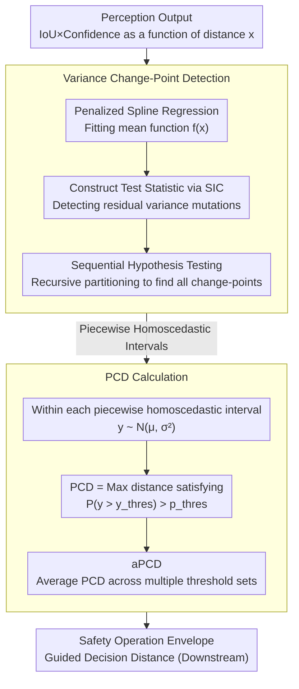

# Perception Characteristics Distance: Measuring Stability and Robustness of Perception System in Dynamic Conditions under a Certain Decision Rule

**Conference**: CVPR2026  
**arXiv**: [2506.09217](https://arxiv.org/abs/2506.09217)  
**Code**: [datadrivenwheels/PCD_Python](https://github.com/datadrivenwheels/PCD_Python)  
**Area**: Autonomous Driving / Perception Evaluation  
**Keywords**: Perception evaluation metrics, distance reliability, uncertainty modeling, variance change-point detection, autonomous driving safety

## TL;DR

Ours proposes Perception Characteristics Distance (PCD), a new metric to quantify the reliable detection capability of perception systems at different distances. By statistically modeling the changes in mean and variance of detection confidence relative to distance, PCD defines the maximum reliable detection distance of a perception system, addressing the limitations of traditional static metrics like AP/IoU that fail to reflect distance dependency and stochasticity.

## Background & Motivation

1.  **Limitations of Prior Work**: Classical evaluation metrics such as AP, IoU, and F1 are based on static frame-by-frame evaluation, ignoring temporal and spatial continuity in real driving scenarios and failing to reflect stability differences across various distances.
2.  **Instability in Long-Range Detection**: Detectors like YOLOX maintain stable confidence $\ge 0.90$ at short ranges ($<30$m), but confidence fluctuates drastically (as low as $0.24$) at long ranges ($\ge 70$m), where fixed-threshold discrimination poses a severe risk of misjudgment.
3.  **Vulnerability of Thresholding Decisions**: Control logic in ADAS/ADS typically relies on confidence thresholds for binary decisions (detected/not detected). This approach fails to capture the stochasticity and distance-related variability of perception outputs.
4.  **Goal**: Accurate estimation of the maximum reliable detection distance is critical for autonomous driving safety; decision systems need to know the range within which perception results can be trusted.
5.  **Lack of Controlled Benchmarks**: Existing driving datasets (nuScenes, KITTI, BDD100K) are collected in natural environments, lacking data in controlled settings for systematic evaluation of perception robustness.
6.  **Key Challenge**: Traditional metrics like AP are insensitive to condition changes (weather/lighting) and cannot effectively reveal the degradation characteristics of perception systems under adverse conditions.

## Method

### Overall Architecture

PCD aims to answer a question traditional metrics cannot: within what distance is this perception system still trustworthy? It treats the perception output (IoU $\times$ confidence) as a function of distance $x$. First, it statistically estimates how its mean and variance change with distance. Then, given a detection quality threshold $y^{thres}$ and a probability threshold $p^{thres}$, it derives the maximum distance that still satisfies reliability requirements. IoU $\times$ confidence is used instead of confidence alone because confidence only reflects model certainty, while IoU reflects localization accuracy; multiplying them compresses "detectability" and "accuracy" into a single measure. The calculation follows two steps: variance change-point detection to segment the heteroscedastic curve into piecewise homoscedastic intervals, followed by distribution modeling in each interval to derive the maximum reliable distance.

### Key Designs

**1. Variance Change-Point Detection: Identifying the Reliability "Gaps"**

Perception quality does not decay uniformly with distance; variance often spikes at specific distances (e.g., confidence dropping from $\ge 0.90$ to $0.24$ far away). Fixed thresholds fail because of these mutations. Rather than assuming constant variance, this method explicitly identifies these breakpoints. First, a Penalized B-spline regression ($K=10$, 3nd order) fits the mean function $f(x)$ of IoU $\times$ confidence. Then, a test statistic based on the Schwarz Information Criterion (SIC) is constructed to detect significant changes in residual variance. Sequential hypothesis testing is used—finding the first change-point $x_{\tau_1}$ in the full set, then recursively finding subsequent points in the resulting sub-segments.

These change-points partition the distance range into intervals where variance is approximately constant, simplifying heteroscedastic curves into "piecewise homoscedastic" segments for valid probabilistic calculation.

**2. Mechanism: Translating Reliability into a Readable Maximum Distance**

Given the piecewise homoscedastic structure, IoU $\times$ confidence within each interval can be modeled as a normal distribution $y_i \sim \mathcal{N}(\mu_i, \sigma_i^2)$. PCD is defined as the maximum distance $x_i$ where $P_Y(y_i > y^{thres}) > p^{thres}$—meaning "within which distance the probability of detection quality exceeding $y^{thres}$ remains higher than $p^{thres}$." While a single threshold pair provides one slice, the comprehensive metric aPCD averages across multiple sets of $(p^{thres}, y^{thres})$, summarizing overall perception capability much like AUC summarizes a PR curve.

### Loss & Training

Ours is an evaluation metric paper and does not involve training losses. The only optimization used is the regularization term for the penalized spline regression: $\sum_{i=1}^n [y_i - \sum_j \beta_j B_j(x_i)]^2 + \lambda \sum_{j=3}^K (\Delta^2 \beta_j)^2$ ($\lambda=0.6$). Change-point hypothesis testing is based on log-likelihood ratios and the SIC criterion.

## Key Experimental Results

### SensorRainFall Dataset

- Collected at Virginia Smart Road facilities with controlled rainfall intensity of $64$ mm/h.
- 4 environmental conditions: Clear Day, Rainy Day, Rainy Night, Rainy Night with Streetlights.
- 1,231 images at $1920\times1080$ resolution, covering distances from $4$m to $250$m.
- Two target types: red sedan and human pedestrian, providing GT bounding boxes, segmentation masks, and precise distances.

### Main Results (Representative values from 16 sets of experiments)

**Instance Segmentation - Vehicle - Clear Day**:

| Model | aPCD (m) | AP50:95 | AP50 | AR | F1_50 |
|------|----------|---------|------|------|-------|
| Mask2Former | **107.1** | **0.423** | **0.633** | **0.427** | **0.778** |
| Mask R-CNN | 89.8 | 0.376 | 0.579 | 0.381 | 0.736 |
| ConvNeXt-V2 | 89.5 | 0.395 | 0.553 | 0.399 | 0.715 |
| RTMDet | 43.5 | 0.349 | 0.593 | 0.353 | 0.747 |
| SOLOv2 | 36.6 | 0.233 | 0.276 | 0.237 | 0.438 |

**Object Detection - Vehicle - Rainy Night** (A typical case where aPCD rankings differ from traditional metrics):

| Model | aPCD (m) | AP50:95 | AP50 | AR | F1_50 |
|------|----------|---------|------|------|-------|
| GLIP | **37.3** | 0.133 | 0.288 | 0.136 | 0.451 |
| Grounding DINO | 29.6 | 0.125 | 0.297 | 0.128 | 0.461 |
| YOLOX | 23.8 | 0.106 | 0.212 | 0.109 | 0.353 |
| DyHead | 21.5 | **0.144** | **0.362** | **0.146** | **0.534** |
| Deformable DETR | 3.8 | 0.056 | 0.133 | 0.058 | 0.239 |

### Ablation Study

- **Impact of Sample Size**: Performance is stable when the number of change-points $<4$; larger sample sizes lead to more precise variance change-point detection.
- **Impact of Effect Size**: In a 50-50 sample split, a variance change of approximately $3\times$ can be significantly detected.
- **Threshold Sensitivity**: PCD changes smoothly with thresholds in Clear/Rainy Day conditions, but fluctuates sharply in Rainy Night conditions, indicating the system is more sensitive to thresholds in bad weather.

## Highlights & Insights

1.  **Novelty**: Ours is the first to propose a distance-aware probabilistic perception evaluation metric, directly linking detection reliability to physical distance.
2.  **Revealing Blind Spots of Traditional Metrics**: In the Rainy Night scenario, GLIP exhibits the highest aPCD even though its AP is not the highest, indicating AP rankings cannot reflect stability in the distance dimension (DyHead has higher fluctuations at long range).
3.  **Safety Envelope Definition**: PCD can be directly used to define the safety operation envelope of ADS, guiding decision distances under different environmental conditions.
4.  **Experimental Thoroughness**: SensorRainFall is a unique publicly available dataset collected in highly controlled environments to eliminate confounding variables.
5.  **Statistical Rigor**: Heteroscedasticity is modeled using penalized splines and sequential variance change-point detection, providing a solid theoretical foundation.

## Limitations & Future Work

1.  **Limited Dataset Scale**: SensorRainFall contains only 1,231 images and 2 target classes, lacking scene diversity.
2.  **Evaluation Scope**: The PCD generalization has not yet been validated on mainstream datasets like nuScenes or KITTI.
3.  **Narrow Task Coverage**: Restricted to object detection and instance segmentation; not yet extended to 3D detection, depth estimation, or semantic segmentation.
4.  **Normality Assumption**: The assumption that IoU $\times$ Confidence follows a normal distribution within intervals may not hold under extreme conditions.
5.  **Static Target Evaluation**: Target objects were stationary; evaluation of moving targets (varying speed/pose) is missing.
6.  **Single Sensor**: Experiments were based solely on camera images, excluding PCD evaluation for LiDAR, Radar, or multi-sensor fusion.

## Related Work & Insights

| Method | Features | Limitations |
|------|------|------|
| AP / mAP | Summary of Precision-Recall based on IoU thresholds | Ignores distance dimension and detection stability |
| PDQ (Hall et al.) | Joint spatial and semantic uncertainty | Does not consider distance dependency |
| LRP (Oksuz et al.) | Considers localization, FP, and FN simultaneously | Remains a static frame-level metric |
| AD (Mao et al.) | Introduces temporal latency evaluation | Does not model distance-reliability relationships |
| GIoU (Rezatofighi et al.) | Addresses IoU issues for non-overlapping boxes | Unrelated to distance and stability |
| **PCD (Ours)** | **Distance-dependent + Uncertainty-aware + Dual thresholds** | **Limited dataset and task scope** |

## Rating

- Novelty: ⭐⭐⭐⭐ — Defines perception evaluation from a unique distance-uncertainty perspective.
- Experimental Thoroughness: ⭐⭐⭐ — Systematic evaluation across multiple models and conditions, but limited to a proprietary dataset.
- Writing Quality: ⭐⭐⭐⭐ — Clear mathematical formulation, intuitive examples, and well-designed visuals.
- Value: ⭐⭐⭐⭐ — Significant for ADS safety evaluation and complements existing systems, though requires broader empirical validation.

<!-- RELATED:START -->

## Related Papers

- [\[CVPR 2026\] Hybrid Robust Collaborative Perception with LiDAR-4D Radar Fusion under Adverse Weather Conditions](hybrid_robust_collaborative_perception_with_lidar-4d_radar_fusion_under_adverse_.md)
- [\[CVPR 2026\] LiDAS: Lighting-driven Dynamic Active Sensing for Nighttime Perception](lidas_lighting-driven_dynamic_active_sensing_for_nighttime_perception.md)
- [\[CVPR 2026\] Mind the Hitch: Dynamic Calibration and Articulated Perception for Autonomous Trucks](mind_the_hitch_dynamic_calibration_and_articulated_perception_for_autonomous_tru.md)
- [\[AAAI 2026\] RoadSceneVQA: Benchmarking Visual Question Answering in Roadside Perception Systems for Intelligent Transportation System](../../AAAI2026/autonomous_driving/roadscenevqa_benchmarking_visual_question_answering_in_roadside_perception_syste.md)
- [\[CVPR 2026\] AdaRadar: Rate Adaptive Spectral Compression for Radar-based Perception](adaradar_rate_adaptive_spectral_compression_for_radar-based_perception.md)

<!-- RELATED:END -->
