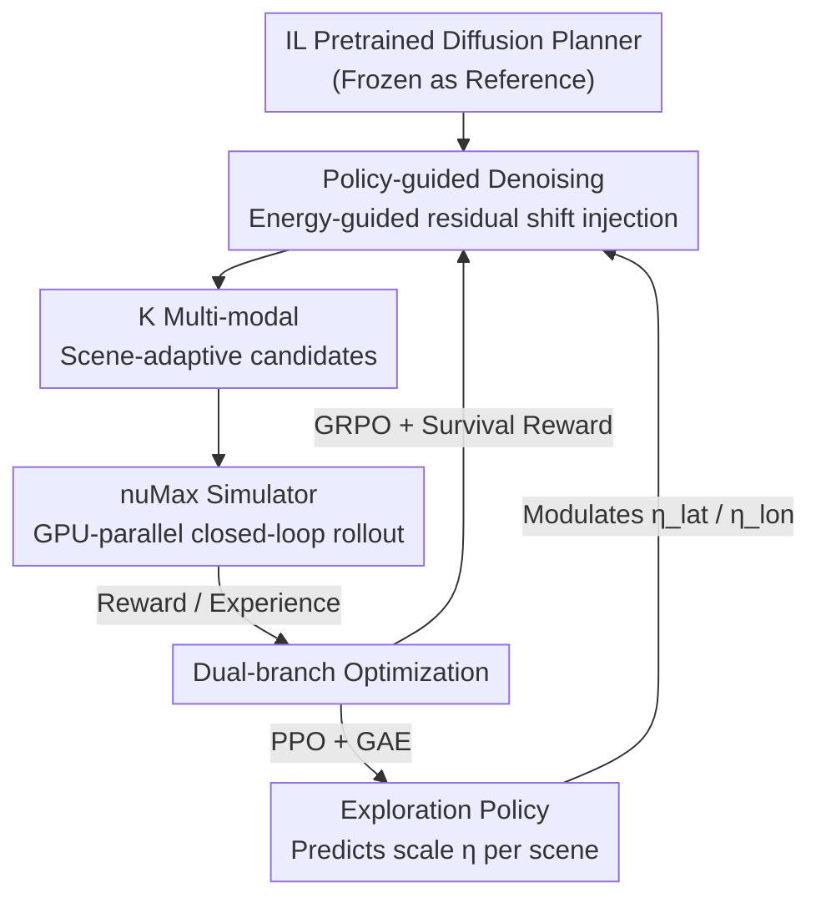

# PlannerRFT: Reinforcing Diffusion Planners through Closed-Loop and Sample-Efficient Fine-Tuning

**Conference**: CVPR 2026  
**Paper**: [CVF Open Access](https://openaccess.thecvf.com/content/CVPR2026/html/Li_PlannerRFT_Reinforcing_Diffusion_Planners_through_Closed-Loop_and_Sample-Efficient_Fine-Tuning_CVPR_2026_paper.html)  
**Code**: None  
**Area**: Autonomous Driving / Diffusion Models / Reinforcement Learning  
**Keywords**: Diffusion Planner, Reinforcement Fine-Tuning, Closed-Loop Simulation, Exploration Strategy, GRPO

## TL;DR
Addressing the pain points of "mode collapse and ineffective exploration" in diffusion planners during reinforcement fine-tuning, PlannerRFT modulates classifier guidance scales using a learnable exploration strategy. This makes the denoising process both multi-modal and scene-adaptive. Combined with the GPU-parallel simulator nuMax, it achieves SOTA on nuPlan closed-loop benchmarks, significantly improving safety especially in complex interactive scenarios.

## Background & Motivation
**Background**: Planners based on diffusion models (Diffusion Planner, DiffusionDrive, etc.) can learn human-like and probabilistic trajectory distributions from large-scale driving demonstrations, serving as a popular paradigm for trajectory generation. Most are trained via Imitation Learning (IL).

**Limitations of Prior Work**: IL-trained planners suffer from distribution shift and objective mismatch—they only replicate demonstration data and fail in OOD scenarios. Consequently, "generate-and-evaluate" reinforcement fine-tuning (RFT) has been introduced: the planner acts as an actor to generate candidate trajectories, which are scored in simulation and iteratively optimized using group-wise RL (e.g., GRPO). The performance ceiling of this paradigm depends entirely on the **exploration capability** of the candidate trajectories.

**Key Challenge**: Diffusion planners struggle to explore in this context. Vanilla diffusion planners suffer from **mode collapse**—starting from different Gaussian noise samples during denoising, they almost all converge to the same trajectory (Fig. 1a), resulting in identical candidates that provide no effective gradients for RL. Subsequent anchor-based methods (Fig. 1b) use fixed anchors to initialize Gaussian distributions for diversity, but these anchors are **scene-agnostic**: some generate reasonable maneuvers while others produce trajectories conflicting with the scene, injecting noisy gradients and destabilizing RL training.

**Goal**: Enable diffusion planners to generate candidate trajectories that are both **multi-modal** (multiple motion hypotheses for the same scene) and **adaptive** (exploration distribution self-adjusts with scene context) during the RFT stage for efficient reward signal utilization.

**Key Insight**: Instead of modifying the inference structure of the diffusion planner, a learnable "exploration strategy" is inserted into the denoising process to dynamically modulate the intensity of classifier guidance. Diversity stems from energy guidance, while adaptivity comes from the strategy.

**Core Idea**: Replace fixed anchors with policy-guided denoising. A learnable exploration strategy predicts guidance scales based on the scene, incorporating both multi-modality and scene-adaptivity into the denoising process. The entire guidance module can be removed at deployment without altering the original inference pipeline.

## Method

### Overall Architecture
PlannerRFT receives an IL-pretrained diffusion planner (shared scene encoder + Diffusion Transformer decoder) and performs closed-loop reinforcement fine-tuning using GRPO under the generate-and-evaluate paradigm. The pretrained planner is copied and frozen as a global reference to provide a stable IL prior. The core modification is the insertion of an **Exploration Policy**: it reads the scene context and reference trajectory to predict guidance scales, modulating the residual shifts injected by classifier guidance to ensure the generated candidates are diverse yet scene-consistent. These candidates undergo closed-loop rollout and scoring in the nuMax simulator. Finally, a **Dual-branch Optimization** framework simultaneously optimizes the trajectory distribution (GRPO fine-tuning the DiT denoiser) and the exploration strategy (PPO optimizing guidance scales). At deployment, the exploration policy and reference branches are removed, returning the planner to its original diffusion structure.

### Key Designs

**1. Policy-guided Denoising: Diverse via energy guidance, adaptive via learnable policy**

This is the core of the paper, directly addressing "mode collapse" and "scene-agnostic anchors." Diversity is achieved through **energy-based classifier guidance**: at each denoising step, guidance is split into lateral and longitudinal orthogonal components, injecting residual shifts to spread trajectories around the reference. The lateral energy function is defined as $\Psi_{\text{lat}} = \frac{1}{T}\sum_{\tau=1}^{T}\big(n_\perp^\tau(x_\tau - x_\tau^{\text{ref}}) - \lambda_{\text{lat}}\eta_{\text{lat}}\big)^2$, where $n_\perp$ is the unit normal vector, $\lambda_{\text{lat}}$ is the maximum lateral offset (meters), and $\eta_{\text{lat}}\in[-1,1]$ is the lateral guidance scale. Longitudinal energy $\Psi_{\text{lon}}$ similarly modulates the planning velocity $v$ relative to the reference. These provide decoupled orthogonal gradients; different $(\eta_{\text{lat}}, \eta_{\text{lon}})$ combinations generate multi-modal trajectories. The denoising gradient is approximated as $\nabla_x \log p(\eta|x) \approx -\nabla_x\big(\Psi_{\text{lat}}(x;\eta_{\text{lat}}) + \Psi_{\text{lon}}(x;\eta_{\text{lon}})\big)$. **Explicit collision constraints are intentionally omitted**, allowing infeasible samples to serve as negative feedback for RL.

Adaptivity is achieved through a **learnable exploration strategy** $\eta \sim \pi_\phi(\cdot \mid s, x^{\text{ref}})$. Instead of fixed anchors, it predicts guidance scales based on the driving context $s$ and reference trajectory. Reference trajectories are encoded into compact tokens via MLP-Mixer and fused with scene embeddings through cross-attention to capture interactions. The Guidance Head predicts parameters for two Beta distributions (controlling lateral and longitudinal scales), while the Value Head estimates state values. During RFT, $K$ guidance scales are sampled from these Beta distributions to determine driving modes and modulate trajectories $\hat{x}^{(k)}$, resulting in a diverse set $X = \{\hat{x}^{(k)}, (\eta_{\text{lat}}^{(k)}, \eta_{\text{lon}}^{(k)})\}_{k=1}^{K}$. Unlike anchor-based methods, this policy is dynamic and scene-dependent, ensuring clean RL gradients.

**2. Closed-loop Rollout + Survival Reward: On-policy experience and stable gradients for hard cases**

Unlike IL, RL requires real-time simulation, making throughput critical. At each simulation step, the planner generates $K$ candidates, and one trajectory $x'$ with its scale $(\eta'_{\text{lat}}, \eta'_{\text{lon}})$ is randomly selected. **Only the first action is executed** to transition the environment from $s_t$ to $s_{t+1}$ and collect rewards. The tuple $(s_t, \eta'_{\text{lat}}, \eta'_{\text{lon}}, r_{t+1}, V(s_t))$ is stored in the replay buffer.

Trajectory optimization uses open-loop PDMS (Predictive Driver Model Score) evaluation within a horizon $T_r$. However, in hard scenarios, terminal rewards (collision, out-of-road) cause **optimization stagnation**: once a failure occurs, rewards for all candidates in a group drop to zero, leaving GRPO with no intra-group gradients. To solve this, **survival reward** is introduced, accumulating only valid, non-terminal segments: $R_{\text{surv}} = \frac{1}{L}\sum_{\tau=1}^{T} R_{\text{term}}^\tau \cdot \mathbb{I}[R_{\text{term}}^\tau = 0]$. It encourages the planner to postpone failure and improve long-horizon feasibility. In ablations, survival reward improved the Test14-hard-R score from 71.59 to 72.21 compared to terminal rewards.

**3. Dual-branch Optimization: GRPO for trajectory distribution, PPO for exploration policy**

PlannerRFT splits optimization into two branches. The **trajectory optimization branch** uses GRPO to fine-tune DiT denoising: following DPPO/ReCogDrive, the denoising process is modeled as an MDP where each step is a Gaussian transition. RFT updates Gaussian parameters to align with reward objectives. The **exploration strategy branch** uses PPO to optimize $\pi_\phi$: future rewards are backpropagated via GAE, allowing the policy to correct exploration decisions based on observed long-horizon performance. Other best practices include: 5-step DDIM denoising (stochasticity aids exploration, fewer steps than DDPM), zero-initializing the exploration strategy (ensures unbiased exploration around the reference initially), and incorporating a modest amount of hard cases for fine-tuning.

**4. nuMax Simulator: GPU parallelism for large-scale closed-loop RL**

The bottleneck of closed-loop RL is simulation throughput. nuMax, built on Waymax and V-Max, is a GPU-parallel simulator calibrated with nuPlan for kinematics and rewards, achieving approximately **10x** the rollout speed of the original nuPlan simulator. It includes scene caching, LQR trackers, and a distributed training pipeline bridging PyTorch DDP workers with JAX simulators. Without it, training at a scale of 144k scenarios and 40M environment steps would be computationally infeasible.

## Key Experimental Results

### Main Results
In nuPlan closed-loop simulation, evaluated across Non-Reactive (NR) and Reactive (R) agents on Val14 and Test14-hard benchmarks (scores 0–100, higher is better):

| Setting | Metric | Diffusion Planner | Flow Planner | PlannerRFT | Gain (vs Diffusion) |
|------|------|-------------------|--------------|------------|--------------------|
| Val14-NR | Closed-loop Score | 89.87 | 90.43 | 89.96 | +0.09 |
| Val14-R | Closed-loop Score | 82.80 | 83.31 | **84.46** | +1.66 |
| Test14-hard-NR | Closed-loop Score | 75.99 | 76.47 | **77.16** | +1.17 |
| Test14-hard-R | Closed-loop Score | 69.22 | 70.42 | **72.21** | +2.99 |

The method achieved SOTA in three out of four benchmarks. Gains are most significant in reactive and hard interactive scenarios (Test14-hard-R +2.99), indicating that closed-loop rollouts allow the planner to encounter broader interaction patterns and mitigate distribution shift.

### Ablation Study
Exploration strategy ablation (Test14-hard-R; D is the diversity score of the candidate set, $\bar{r}$ and $s_r$ are the intra-group reward mean and std dev):

| Exploration Strategy | R-score↑ | NR-score↑ | D(%) | $\bar{r}$↑ | $s_r$ |
|----------|----------|-----------|------|-----------|-------|
| IL Pretrain (DDIM) | 68.18 | 76.01 | - | - | - |
| w/o Guidance | 68.83 | 76.34 | 5.65 | 69.06 | 0.02 |
| w/ Uniform Dist. | 65.82 | 75.19 | 39.78 | 60.44 | 0.12 |
| w/ Fixed Beta Dist. | 70.65 | 76.61 | 27.73 | 71.50 | 0.07 |
| PlannerRFT (Ours) | **72.21** | **77.16** | 25.34 | **73.88** | 0.06 |

Other ablations: survival reward + 4s horizon outperformed terminal reward (72.21 vs 71.59); fine-tuning data using Lt90 (low-score scenarios) performed better than All or pure Fail samples.

### Key Findings
- **Diversity is not always better**: The Uniform distribution had the highest diversity (D=39.78%) but the worst performance (R=65.82) because scene-agnostic sampling created excessive reward variance, leading to training instability and reward collapse. The learnable policy strikes a balance between diversity (25.34%) and reward consistency ($\bar{r}$=73.88, $s_r$ as low as 0.06).
- **Behavioral Evolution**: In an OOD lane-change scenario, the IL pretrain collided at 12s. After 10M steps of fine-tuning, it learned to stay in lane (safe but inefficient). By 25M steps, it learned to change lanes decisively, achieving both safety and efficiency.
- **Hard Case Gains**: Compared to normal scenarios, PlannerRFT shows the most significant safety improvements in failure-prone scenarios (collisions, off-road).

## Highlights & Insights
- **Learning "Exploration" as a Policy**: Traditional RFT relies on fixed anchors; this work uses a PPO policy to dynamically adjust guidance scales per scene, achieving both diversity and scene-consistency. This "learning how to explore" concept is transferable to any guidance-based diffusion RL.
- **Lateral-Longitudinal Decoupled Energy Guidance**: Splitting guidance into orthogonal lateral/longitudinal energy functions allows for controllable multi-modality that is more interpretable and produces cleaner gradients than isotropic noise.
- **Survival Reward solves Sparse Reward Stagnation**: "Zero-gradient for all group members" in hard cases is a common issue for group-wise RL. The survival reward trick is a lightweight solution to encourage "delaying failure" in high-failure tasks.
- **Plug-and-Play**: The guidance module is only attached during training and removed for deployment, returning to the original diffusion structure without increasing inference costs.

## Limitations & Future Work
- **Marginal gains in non-reactive benchmarks** (Val14-NR +0.09) suggest the method primarily benefits interactive scenarios.
- **Reliance on the nuMax Simulator**: While the 10x speedup is crucial, nuMax is a custom implementation based on Waymax/V-Max; fidelity gaps compared to real-world distributions require careful consideration.
- Training costs are high (8x H100, 40M environment steps).
- **Lack of explicit collision constraints**: Relying on infeasible samples for negative feedback works in simulation, but whether it is sufficient for safety-critical deployment—or needs hard constraints—requires further validation.

## Related Work & Insights
- **vs. Diffusion Planner (IL baseline)**: Uses it as a starting point and fixes its distribution shift through closed-loop RFT, significantly improving hard-case scores.
- **vs. Anchor-based Planners (e.g., DiffusionDrive)**: Replaces fixed, scene-agnostic anchors with a learnable, adaptive exploration strategy for more stable RL gradients.
- **vs. Token-vocabulary / Autoregressive RFT**: Diffusion denoising is more suitable for continuous action spaces and temporal consistency than discretized vocabularies or error-prone autoregressive rollouts.

## Rating
- Novelty: ⭐⭐⭐⭐ Introducing "learnable exploration policy for classifier guidance" to address mode collapse and scene-agnostic anchors in diffusion RFT is a clear and effective approach.
- Experimental Thoroughness: ⭐⭐⭐⭐ Extensive coverage across four nuPlan benchmarks and multiple ablations (strategy/reward/data/offset).
- Writing Quality: ⭐⭐⭐⭐ Smooth logic from pain points to methodology and experiments.
- Value: ⭐⭐⭐⭐ Provides a sample-efficient fine-tuning paradigm for diffusion planners; nuMax and survival rewards are useful contributions to the community.

<!-- RELATED:START -->

## Related Papers

- [\[CVPR 2025\] Closed-Loop Supervised Fine-Tuning of Tokenized Traffic Models](../../CVPR2025/autonomous_driving/closed-loop_supervised_fine-tuning_of_tokenized_traffic_models.md)
- [\[CVPR 2026\] WAM-Flow: Parallel Coarse-to-Fine Motion Planning via Discrete Flow Matching for Autonomous Driving](wam-flow_parallel_coarse-to-fine_motion_planning_via_discrete_flow_matching_for_.md)
- [\[ICLR 2026\] BridgeDrive: Diffusion Bridge Policy for Closed-Loop Trajectory Planning in Autonomous Driving](../../ICLR2026/autonomous_driving/bridgedrive_diffusion_bridge_policy_for_closed-loop_trajectory_planning_in_auton.md)
- [\[ECCV 2024\] Safe-Sim: Safety-Critical Closed-Loop Traffic Simulation with Diffusion-Controllable Adversaries](../../ECCV2024/autonomous_driving/safe-sim_safety-critical_closed-loop_traffic_simulation_with_diffusion-cont.md)
- [\[CVPR 2026\] RLFTSim: Realistic and Controllable Multi-Agent Traffic Simulation via Reinforcement Learning Fine-Tuning](rlftsim_realistic_and_controllable_multi-agent_traffic_simulation_via_reinforcem.md)

<!-- RELATED:END -->
