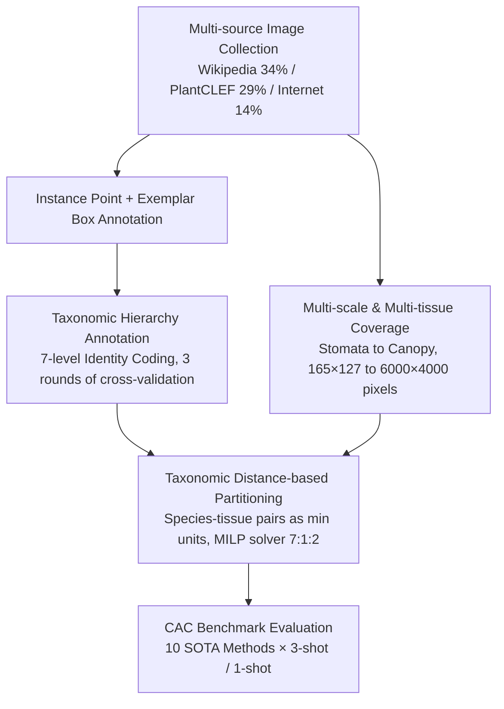

# Plant Taxonomy Meets Plant Counting: A Fine-Grained, Taxonomic Dataset for Counting Hundreds of Plant Species

**Conference**: CVPR 2026  
**arXiv**: [2603.21229](https://arxiv.org/abs/2603.21229)  
**Code**: [https://github.com/tiny-smart/TPC-268](https://github.com/tiny-smart/TPC-268)  
**Area**: Autonomous Driving  
**Keywords**: Plant Counting, Class-Agnostic Counting, Taxonomic Hierarchy, Fine-grained Dataset, Density Estimation

## TL;DR

This paper constructs TPC-268, the first large-scale counting dataset integrating plant taxonomy. It contains 10,000 images, 678,050 point annotations, and 268 countable classes (covering 242 species). Full hierarchical information is annotated according to the Linnaean system, and a comprehensive benchmark is conducted under the Class-Agnostic Counting (CAC) paradigm.

## Background & Motivation

**Background**: The field of visual counting has developed rapidly over the past decade, but has primarily focused on rigid objects such as crowd counting and vehicle counting. The emergence of Class-Agnostic Counting (CAC) allows models to generalize to unseen categories, but existing CAC datasets (e.g., FSC-147) lack fine-grained category complexity.

**Limitations of Prior Work**: Plant counting fundamentally differs from general object counting—plants exhibit non-rigid morphology, drastic morphological changes during growth cycles, phenotypic plasticity, and vast species diversity organized by taxonomic hierarchies. Crowd counting models only need to distinguish between "person" and "background," but plant counting systems need to learn subtle textural differences between hundreds of species. Existing plant counting datasets (from plant science) are small-scale, single-species, and lack taxonomic information.

**Key Challenge**: The taxonomic hierarchy of plants provides a natural prior for visual similarity (e.g., similar leaf shapes within the same family), but existing counting methods completely ignore this structural information. Furthermore, the "one model per species" paradigm is simply not scalable given the immense species space of the plant kingdom.

**Goal**: To build the first large-scale plant counting benchmark dataset integrating taxonomic hierarchies, providing a biologically grounded testing platform for CAC research in the plant domain.

**Key Insight**: Combine plant taxonomic hierarchical classification (Kingdom to Species) with instance-level point annotations. Use taxonomic distance to define data partitioning, ensuring models are evaluated for generalization across genuine cross-species gaps.

**Core Idea**: By constructing a large-scale plant counting dataset with complete Linnaean taxonomic hierarchy annotations, the generalization evaluation of CAC is elevated from simple "unseen categories" to biologically meaningful "cross-taxonomic gaps."

## Method

### Overall Architecture

TPC-268 is not a new model but a dataset and benchmark. It addresses the question: how do existing Class-Agnostic Counting (CAC) methods perform when the counting targets change from "people/cars" to "hundreds of plant species with interlaced evolutionary relationships"? The authors decompose dataset construction into four steps: aggregating images from multiple sources (Wikipedia 34%, PlantCLEF 29%, Internet 14%, etc.), annotating each image with "instance points + exemplar boxes + full taxonomic hierarchy + biological tissue category," partitioning the train/val/test sets using a constrained optimizer based on taxonomic distance rather than random splits, and finally benchmarking ten SOTA methods under the same CAC protocol.

### Key Designs

**1. Taxonomic Hierarchy Annotation: Turning "What Species It Is" into a Structured Prior rather than a Flat Label**

Traditional CAC treats each category as an independent, unrelated token. While models learn to "count this class," they lack knowledge of its relationship to others. Plants are the opposite—species in the same genus often share morphological features like leaf or fruit shapes, providing natural visual similarity priors that past datasets failed to record. This work assigns each instance a complete 7-level identity from Kingdom to Species, encoded as a 7D vector; for example, Apple (*Malus domestica*) is represented as $[1,1,1,14,39,113,136]$. The pipeline uses Pl@ntNet for initial identification and World Flora Online to complete missing levels, with all labels undergoing three rounds of manual cross-validation. This upgrades simple "counting" to "joint counting + hierarchical reasoning," allowing models to leverage structural knowledge to generalize.

**2. Taxonomic Distance-based Partitioning: Ensuring Test Species are "Unrelated" to Training Species**

Randomly splitting by category might result in relatives of test species appearing in the training set, allowing models to cheat by memorizing simple features. This paper defines the minimum indivisible unit as a "species-tissue pair" (e.g., Rice-Flower and Rice-Stoma are two units), ensuring each unit falls entirely into one subset to prevent leakage of relatives. Partitioning is performed via Mixed-Integer Linear Programming (MILP) with three constraints: each subset must cover all observation scales, average densities must be balanced ($\approx 67.81$ instances/image), and the overall ratio must approach 7:1:2. This forces models to face true cross-genus and cross-family generalization.

**3. Multi-scale & Multi-tissue Coverage: Bridging the Scale Gap from Stomata to Canopy**

Real plant counting tasks vary enormously in scale—from microscopic stomata to aerial canopy views. The dataset intentionally covers four biological tissue levels: Tissue (Stomata 1,096, Resin 228), Organ (Fruit 4,422, Flower 2,994, Seeds 602, etc.), Individual (Whole plant 214), and Group (Canopy 56), with resolutions ranging from $165 \times 127$ to $6,000 \times 4,000$ pixels. This diversity reveals how global attention models can fail during extreme scale shifts.

### Loss & Training

The dataset paper does not introduce new training objectives. Each method in the benchmark follows its own training strategy, evaluated under standard 3-shot and 1-shot CAC settings.

## Key Experimental Results

### Main Results (3-shot)

| Method | Conference | Type | Val MAE↓ | Val RMSE↓ | Test MAE↓ | Test RMSE↓ | Test R²↑ |
|------|------|------|----------|-----------|-----------|-----------|----------|
| FamNet | CVPR'21 | Regression | 28.87 | 52.51 | 30.43 | 65.62 | 0.62 |
| C-DETR | ECCV'22 | Detection | 22.66 | 77.51 | 22.68 | 57.97 | 0.74 |
| LOCA | ICCV'23 | Regression | 17.26 | 53.19 | **17.51** | **38.37** | **0.78** |
| DAVE | CVPR'24 | Regression | 16.47 | 52.87 | 17.61 | 40.06 | 0.75 |
| CACViT | AAAI'24 | Regression | 16.63 | 42.49 | 22.04 | 41.79 | 0.73 |
| CountGD | NeurIPS'24| Detection | 18.32 | 54.55 | 19.52 | 50.51 | 0.61 |
| TasselNetV4| ISPRS'26 | Regression | **13.20** | **43.93** | 22.95 | 51.36 | 0.60 |

### Cross-Dataset Transfer

| Direction | CountTR MAE | CACViT MAE | LOCA MAE |
|------|------------|------------|----------|
| FSC-147→FSC-147 | 11.90 | 10.83 | 10.72 |
| FSC-147→TPC-268 | 38.62 (+225%) | 26.73 (+147%) | 24.70 (+130%) |
| TPC-268→TPC-268 | 25.19 | 22.04 | 17.51 |
| TPC-268→FSC-147 | 26.53 (+5%) | 17.88 (-19%) | 15.16 (-13%) |

## Key Findings

- **Regression methods consistently outperform detection methods**: Dense spatial arrangements and structural entanglement in plants make explicit instance localization extremely difficult; global density estimation is more suitable.
- **Val-Test Generalization Gap**: Global attention models like CACViT and TasselNetV4 perform best on validation but degrade significantly on test sets (TasselNetV4: val 13.20 → test 22.95), indicating that local structural consistency is vital for cross-species generalization. LOCA is the most robust on the test set due to its local-global combination.
- **Asymmetry in Cross-Dataset Transfer**: Performance drops by 130-225% when transferring from FSC-147 (general) to TPC-268 (plants), whereas transferring from TPC-268 to FSC-147 shows little degradation or even improvement. This proves plant counting is a harder task than general counting.
- **Value of Taxonomic Information**: Adding species names to CountGD reduced MAE from 19.52 to 17.53; including the full hierarchy further reduced it to 16.90, confirming taxonomic priors act as effective inductive biases.

## Highlights & Insights

- **The concept of combining taxonomic hierarchy with visual counting** is highly creative. While traditional CAC treats categories as flat labels, this work uses biological structures to provide priors. This approach could be transferred to other hierarchical domains like industrial parts or animal classification.
- **The MILP-optimized partitioning** ensures rigorous evaluation—no close relatives of test species appear in training. This methodology is a valuable reference for other fine-grained datasets.
- **Transfer asymmetry** reveals a profound insight: models trained on "hard" domains generalize more easily to "easy" domains, but not vice versa. This is instructive for designing "universal" counting models.

## Limitations & Future Work

- Taxonomic coverage remains limited, focusing on angiosperms and few fungi, lacking gymnosperms and mosses.
- Density distribution is imbalanced—72.1% of images have $<50$ instances, while high-density ($>500$) samples comprise only 3%.
- Absolute performance of benchmark methods remains low (best MAE 17.51), suggesting plant counting is far from practical deployment.
- t-SNE analysis shows that SOTA features (LOCA) lack clear category-level separation, indicating models do not yet capture deep biological traits. Explicitly modeling visual similarity of taxonomic relatives is a promising direction.
- Direct backbone replacement with BioCLIP performed poorly (MAE 34.75), suggesting the need for specialized adaptation strategies.

## Related Work & Insights

- **vs FSC-147**: FSC-147 is the standard CAC benchmark (6,135 images, 147 classes) but lacks structured relationships. TPC-268 provides a stricter framework via hierarchy and features higher morphological complexity.
- **vs ShanghaiTech/NWPU**: Traditional crowd datasets are single-class and high-density but simple. TPC-268 introduces a joint "counting + recognition" challenge across 268 fine-grained classes.
- **vs CountGD**: CountGD supports text-guided open-vocabulary counting. While taxonomic text improves its performance (MAE 19.52 $\rightarrow$ 16.90), it still trails the vision-only LOCA (17.51), implying text encoding cannot fully replace visual exemplars.

## Rating

- Novelty: ⭐⭐⭐⭐ First to introduce plant taxonomy into counting dataset design; innovative evaluation protocol via taxonomic distance.
- Experimental Thoroughness: ⭐⭐⭐⭐⭐ Comprehensive comparison of 10 CAC methods + cross-dataset transfer + taxonomic ablation + error analysis + t-SNE visualization.
- Writing Quality: ⭐⭐⭐⭐ Clear construction principles and detailed analysis, though some statistical descriptions are slightly verbose.
- Value: ⭐⭐⭐⭐ Provides a challenging benchmark for CAC and has practical applications in precision agriculture and ecological monitoring.

<!-- RELATED:START -->

## Related Papers

- [\[ICCV 2025\] Counting Stacked Objects](../../ICCV2025/autonomous_driving/counting_stacked_objects.md)
- [\[CVPR 2026\] HOLO: Homography-Guided Pose Estimator Network for Fine-Grained Visual Localization on SD Maps](holo_homography-guided_pose_estimator_network_for_fine-grained_visual_localizati.md)
- [\[AAAI 2026\] Fine-Grained Representation for Lane Topology Reasoning](../../AAAI2026/autonomous_driving/fine-grained_representation_for_lane_topology_reasoning.md)
- [\[CVPR 2026\] LA-Pose: Latent Action Pretraining Meets Pose Estimation](la-pose_latent_action_pretraining_meets_pose_estimation.md)
- [\[CVPR 2025\] Point-to-Region Loss for Semi-Supervised Point-Based Crowd Counting](../../CVPR2025/autonomous_driving/point-to-region_loss_for_semi-supervised_point-based_crowd_counting.md)

<!-- RELATED:END -->
