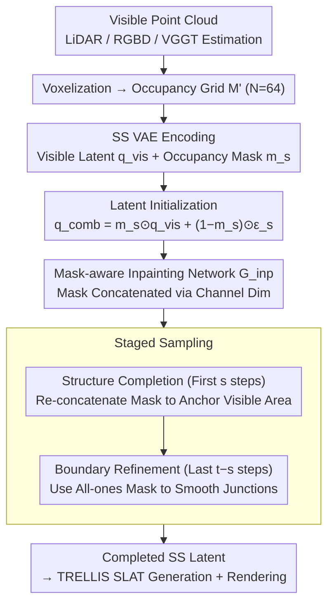

# Points-to-3D: Structure-Aware 3D Generation with Point Cloud Priors

**Conference**: CVPR 2026  
**arXiv**: [2603.18782](https://arxiv.org/abs/2603.18782)  
**Code**: [Project Page](https://jiatongxia.github.io/points2-3D/)  
**Area**: Autonomous Driving / 3D Generation  
**Keywords**: Point Cloud Priors, 3D Generation, Diffusion Models, Structure Completion, Geometric Controllability  

## TL;DR

Points-to-3D is proposed to encode partial point clouds from visible regions into the sparse structure (SS) latent space of TRELLIS, completing invisible regions via a mask-aware inpainting network. By integrating a two-stage sampling strategy (structure completion followed by boundary refinement), the method achieves high-fidelity 3D asset and scene generation with explicit geometric controllability, reaching an F-Score of 0.964 on Toys4K (0.998 for visible areas).

## Background & Motivation

**Background**: 3D generative models (e.g., TRELLIS, GaussianAnything) can synthesize realistic 3D assets from images or text. However, these models rely on 2D conditions and lack direct constraints from real 3D geometry, leading to uncontrollable geometric accuracy in generation results.

**Limitations of Prior Work**: In scenarios such as autonomous driving and robotics, point clouds of visible regions are easily obtainable via LiDAR, structured light, or feed-forward predictors like VGGT. These point clouds provide explicit geometric constraints that current generative frameworks fail to utilize.

**Technical Limitations**: The structure generation in TRELLIS initializes the SS latent from pure Gaussian noise, guided only by image/text embeddings, which cannot be anchored to real 3D observations. Simply injecting point clouds as additional conditions provides limited success; the structural prior must be embedded into the latent space itself.

**Mechanism**: Point-cloud-guided 3D generation is redefined as a **latent space inpainting** problem: visible regions are encoded as fixed constraints, while invisible regions are synthesized by a completion network.

## Method

### Overall Architecture

This paper addresses the inability of existing 3D generative models to utilize real geometry despite taking image/text conditions. The proposed approach treats point-cloud-guided generation as a **latent space inpainting** task, where visible regions provide the "known answer" and invisible regions are filled by the network. The pipeline is as follows: visible point clouds are voxelized into an occupancy grid $\mathbf{M}'$ at $N=64$ resolution and encoded into partially observed structural latents $\mathbf{q}_{\text{vis}}=\mathcal{E}_s(\mathbf{M}')$ via the SS VAE of TRELLIS. An occupancy mask $\mathbf{m}_s$ identifies observed vs. empty regions. Empty regions are filled with noise to form the combined input $\mathbf{q}_{\text{comb}}$, which is processed by a fine-tuned Inpainting Flow Transformer. A two-stage sampling strategy completes the SS latent, which is finally passed to the original TRELLIS SLAT for generation and rendering. The modifications are isolated to the "structural latent" layer, leaving downstream components unchanged.

### Key Designs

**1. Point Cloud Prior Driven Latent Initialization: Anchoring Real Geometry at the Start**

TRELLIS typically starts from pure Gaussian noise, where even strong image/text embeddings only provide implicit guidance, making it difficult to align generated geometry with LiDAR/RGBD observations. Ours treats the visible region latent as an immutable constraint:

$$\mathbf{q}_{\text{comb}} = \mathbf{m}_s \odot \mathbf{q}_{\text{vis}} + (1 - \mathbf{m}_s) \odot \boldsymbol{\epsilon}_s$$

where $\mathbf{q}_{\text{vis}}=\mathcal{E}_s(\mathbf{M}')$ is the encoded latent of the visible region, $\mathbf{m}_s$ is the occupancy mask downsampled to the latent resolution ($r=16$), and $\boldsymbol{\epsilon}_s$ represents noise in empty areas. This ensures the diffusion process is "anchored" by real 3D observations from the start, enabling an F-Score of 0.998 in visible regions.

**2. Mask-aware Structure Completion Network $\mathcal{G}_{inp}$: Explicit Inpainting Control**

The network must infer the "unseen half" from the "seen half" without altering known regions. The authors fine-tune the TRELLIS Structure Flow Transformer by concatenating the mask $\mathbf{m}_s$ along the channel dimension of $\mathbf{q}_{\text{comb}}$, replacing the input layer to accommodate $(c_s+c_m)$ channels. This explicitly informs the network which voxels are constraints and which are targets. Training pairs $(\mathbf{q}_{\text{comb}}^t,\mathbf{m}_s^t,\mathbf{I}_t,\mathbf{q}_{\text{gt}})$ are constructed by rendering depth maps from $T=24$ views of complete 3D assets. The model is supervised using Conditional Flow Matching:

$$\mathcal{L}_{CFM} = \mathbb{E}_{t, \mathbf{q}_{\text{gt}}, \epsilon} \|\mathcal{G}_{inp}(\mathbf{x}_{\text{inp}}, t) - (\epsilon - \mathbf{q}_{\text{gt}})\|_2^2$$

This forces the network to regress the velocity field from noise to ground truth. Unlike indirect attention-based fusion (e.g., SAM3D), the mask channel provides a hard distinction for explicit geometric control.

**3. Staged Sampling Strategy: Structuring then Refining**

Standard inpainting often introduces geometric "hole" artifacts at the boundary of visible and invisible regions due to downsampling. The authors divide $t$ total sampling steps into two phases. The **Structure Completion Phase** (first $s$ steps) reconstructs $\mathbf{q}_{\text{pred}}$ and immediately re-concatenates the mask $\mathbf{m}_s$ to pin visible regions to original values, ensuring global structural anchoring. The **Boundary Refinement Phase** (last $t-s$ steps) switches the mask to an all-ones $\mathbf{m}_1$, reverting to standard denoising. This allows the model to smooth boundary artifacts without rewriting the global structure. Optimal results are achieved with $s=25$ and $t=50$, improving the normal PSNR-N from 25.88 to 27.10.

### Loss & Training

- **Loss**: Conditional Flow Matching Loss, calculated solely in the SS latent space.
- **Training**: Trained on 3D-FUTURE + HSSD + ABO for 20k iterations, batch size 8, 4×A100.
- **Data Prep**: $S=50{,}000$ points per object, $T=24$ views to simulate visible/complete latent pairs.
- **Inference**: Supports (a) ground-truth point cloud priors and (b) point clouds estimated from single images via VGGT.

## Key Experimental Results

### Main Results

**Single Object Generation (Toys4K)**:

| Method | PSNR↑ | SSIM(%)↑ | LPIPS↓ | CD↓ | F-Score↑ |
|---|---|---|---|---|---|
| TRELLIS | 21.94 | 91.46 | 0.105 | 0.034 | 0.832 |
| SAM3D | 22.42 | 91.45 | 0.111 | 0.033 | 0.835 |
| Ours (VGGT) | 22.55 | 92.09 | 0.088 | 0.024 | 0.881 |
| **Ours (P.C.)** | **22.91** | **92.83** | **0.070** | **0.013** | **0.964** |

**Scene-level Generation (3D-FRONT)**:

| Method | PSNR↑ | LPIPS↓ | CD↓ | F-Score↑ |
|---|---|---|---|---|
| TRELLIS | 18.21 | 0.239 | 0.094 | 0.478 |
| MIDI | 19.23 | 0.166 | 0.075 | 0.513 |
| **Ours (P.C.)** | **21.63** | **0.124** | **0.025** | **0.886** |

### Ablation Study

| Config (Inp./Ref. steps) | CD↓ | F-Score↑ | PSNR-N↑ | Notes |
|---|---|---|---|---|
| 50/0 (Pure inpainting) | 0.014 | 0.960 | 25.88 | Boundary artifacts |
| 25/25 (Best) | **0.013** | **0.963** | **27.10** | Artifacts removed |
| 10/40 | 0.014 | 0.961 | 26.72 | Insufficient inpainting |

### Key Findings

- Visible region F-Score reaches **0.998** with a CD of **0.007**, preserving input priors almost perfectly.
- Performance remains significantly superior to baselines even when using noisy VGGT-estimated point clouds, demonstrating robust adaptability.
- While SAM3D uses point clouds, its indirect attention-based fusion fails to provide explicit geometric control.
- Gain is particularly prominent in scene-level generation (F-Score: 0.513 → 0.886), showing the value of point cloud priors for complex multi-object scenes.

## Highlights & Insights

1. **Innovations**: Redefining point-cloud-conditional generation as a latent space inpainting problem is a concise, elegant, and effective paradigm.
2. **Staged Sampling**: The separation of structure completion and boundary refinement effectively resolves inpainting boundary artifacts.
3. **Flexible Input**: Supports both sensor-captured point clouds and VGGT-predicted point clouds, covering scenarios with or without ground-truth 3D priors.
4. **Plug-and-Play**: Built on the TRELLIS framework with minimal architectural changes, only modifying the input layer and training data.

## Limitations & Future Work

1. A gap still exists between VGGT-predicted and ground-truth point clouds (F-Score 0.881 vs 0.964), limited by feed-forward prediction accuracy.
2. Voxelization resolution $N=64$ may limit the representation of fine-grained geometry.
3. Evaluated only on objects and indoor scenes; large-scale outdoor scenes (e.g., autonomous driving point clouds) remain untested.

## Related Work & Insights

- **TRELLIS**: Provides the SS latent framework that enables point cloud injection.
- **VGGT**: Feed-forward 3D predictor that provides point cloud inputs for scenarios without active sensors.
- **VoxHammer**: Also uses 3D priors but adopts a 3D inversion strategy, which performs poorly at completing unknown regions.
- **Insight**: The paradigm of "encoding priors as latent initialization + inpainting for completion" is expected to generalize to other conditional generation tasks.

## Rating

- Novelty: ⭐⭐⭐⭐ (Clean paradigm via latent space inpainting)
- Experimental Thoroughness: ⭐⭐⭐⭐ (Comprehensive object, scene, real image, and ablation studies)
- Writing Quality: ⭐⭐⭐⭐ (Clear problem-solution-result logic)
- Value: ⭐⭐⭐⭐⭐ (Introduces an explicit 3D prior paradigm for generation with broad application potential in LiDAR/RGBD contexts)

<!-- RELATED:START -->

## Related Papers

- [\[CVPR 2026\] Structure-to-Intensity Diffusion for Adverse-Weather LiDAR Generation](structure-to-intensity_diffusion_for_adverse-weather_lidar_generation.md)
- [\[CVPR 2026\] L3DR: 3D-aware LiDAR Diffusion and Rectification](l3dr_3d-aware_lidar_diffusion_and_rectification.md)
- [\[CVPR 2026\] BuildAnyPoint: 3D Building Structured Abstraction from Diverse Point Clouds](buildanypoint_3d_building_structured_abstraction_from_diverse_point_clouds.md)
- [\[CVPR 2026\] AMap: Distilling Future Priors for Ahead-Aware Online HD Map Construction](amap_distilling_future_priors_for_ahead-aware_online_hd_map_construction.md)
- [\[ICCV 2025\] TrackAny3D: Transferring Pretrained 3D Models for Category-unified 3D Point Cloud Tracking](../../ICCV2025/autonomous_driving/trackany3d_transferring_pretrained_3d_models_for_category-unified_3d_point_cloud.md)

<!-- RELATED:END -->
