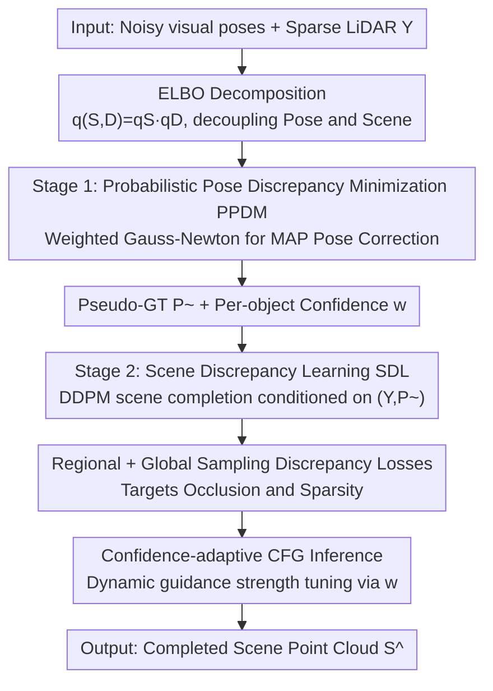

# Probabilistic Discrepancy Learning for Roadside LiDAR Scene Completion

**Conference**: CVPR 2026  
**Paper**: [CVF Open Access](https://openaccess.thecvf.com/content/CVPR2026/html/Wu_Probabilistic_Discrepancy_Learning_for_Roadside_LiDAR_Scene_Completion_CVPR_2026_paper.html)  
**Code**: TBD  
**Area**: Autonomous Driving / Roadside Perception / Point Cloud Completion  
**Keywords**: Roadside LiDAR, Scene Completion, Diffusion Model, Pose Correction, V2X Collaborative Perception

## TL;DR
PDL reformulates the challenge of "severe occlusion due to fixed viewpoints in roadside LiDAR" as a probabilistic inference problem. It first aligns noisy poses from visual detectors into high-precision pseudo-ground truth (pseudo-GT) via Probabilistic Pose Discrepancy Minimization (PPDM), then performs full-scene completion using a Scenario Discrepancy Learning (SDL) diffusion model conditioned on these pseudo-GTs. With dual-path regional/global discrepancy losses and confidence-adaptive CFG inference, PDL reduces Chamfer Distance (CD) by an average of 14.5% and 3D JSD by 6% on V2X-Seq and TUMTraf-V2X.

## Background & Motivation

**Background**: Roadside LiDAR is essential for global perception in intelligent transportation; however, point cloud quality depends on its completeness. Existing point cloud completion methods fall into two categories: **object-level** completion (learning shape priors from large-scale data to complete isolated objects) and **ego-perspective scene-level** completion (aggregating spatio-temporal information to reconstruct scenes, e.g., diffusion methods like LiDiff and LiDPM).

**Limitations of Prior Work**: Roadside sensors have fixed viewpoints and restricted mounting positions, leading to **long-term or severe occlusions**. Directly applying object-level methods to roadside scenarios fails significantly due to the neglect of scene context and object-level semantics. Ego-perspective scene-level methods also struggle to recover the geometry and semantics of occluded objects because occlusion introduces pose uncertainty for the targets. A direct approach would be incorporating roadside camera images: occluded objects are often partially visible in images, allowing off-the-shelf visual 3D detectors to estimate poses as supervision signals. However, visual detectors have limited precision and LiDAR-camera extrinsic calibration contains errors. **Using these noisy priors directly for supervision propagates geometric errors to the downstream completion model**.

**Key Challenge**: Completing occluded areas requires knowing the true pose of occluded objects, but the visual detector—the only source for pose clues—is inherently noisy. This creates a deadlock: "completion depends on pose, but the pose is unreliable." Traditional methods optimize pose $D$ and scene $S$ alternately, but strong coupling leads to error accumulation.

**Goal**: (1) Correct noisy visual poses into reliable supervision signals; (2) Use the corrected signals to robustly guide a diffusion model for scene-wide completion; (3) Decouple pose and scene optimization to avoid error accumulation.

**Key Insight**: Formalize the "uncertainty of occluded object poses" as probabilistic inference. By maximizing the ELBO for a joint probability model and introducing tractable approximations, the intractable posterior inference is **decomposed into two staged "probabilistic discrepancy minimization" sub-problems** (pose discrepancy + scene discrepancy), thereby decoupling $S$ and $D$ for staged optimization.

**Core Idea**: A two-stage framework consisting of **PPDM (Probabilistic Pose Discrepancy Minimization) + SDL (Scene Discrepancy Learning)** to separate "pose correction" from "scene completion," while propagating reliability through the stages using confidence levels during inference.

## Method

### Overall Architecture
PDL takes noisy poses from a visual 3D detector (BEVHeight) and raw sparse LiDAR point clouds $Y$ as input to output a completed scene point cloud. The theoretical starting point is a generative decomposition of the joint probability $p(Y,C,S,D)$ and maximizing the ELBO. Since the posterior $p(S,D\mid Y,C)$ is intractable, the authors use a variational approximation $q(S,D)=q_S(S)q_D(D)$ to separate $S$ and $D$, rewriting "ELBO maximization" as **staged minimization of two discrepancies**. **Stage 1 (PPDM)**: For each object, an energy function combining "visual prior + LiDAR geometric likelihood + pose prior" is constructed to find the MAP solution via weighted Gauss-Newton iteration. This yields corrected poses $\tilde{d}_i$, aligned ShapeNet templates as pseudo-GT supervision $\tilde{P}$, and per-object confidence scores $w_i$. **Stage 2 (SDL)**: A DDPM (using MinkUNet for noise prediction) is trained conditioned on $(Y,\tilde{P})$ for scene completion, incorporating regional and global sampling discrepancy losses to handle occlusion and sparsity. **Inference** utilizes classifier-free guidance (CFG) with $w$ dynamically adjust guiding strength.

### Key Designs

**1. Probabilistic Pose Discrepancy Minimization PPDM: Refining Noisy Visual Poses into High-Precision Pseudo-GT**

Addressing the point that direct supervision with visual detector poses propagates geometric errors, PPDM performs MAP estimation for each object: $\tilde{d}_i=\arg\max_{d_i}[\log p(C\mid d_i)+\log p(Y\mid d_i)+\log p(d_i)]$, equivalent to minimizing a per-object energy function:

$$E_i(d_i)=\tfrac{1}{2}(d_i-\hat{d}_i)^\top\Sigma_{det}^{-1}(d_i-\hat{d}_i)+\tfrac{1}{2\sigma_\ell^2}\sum_{\ell}\omega_\ell\min_{y\in Y}\|T_{k_i}(d_i)p_\ell-y\|^2+R(d_i)$$

The three terms are: **Visual Prior** (penalizes deviation from detector estimate $\hat{d}_i$, scaled by inverse detector covariance $\Sigma_{det}^{-1}$), **Geometric Likelihood** (aligns standard templates $T_{k_i}$ from ShapeNet with LiDAR observations $Y$, scaled by sensor noise variance $\sigma_\ell^2$), and **Pose Regularization** $R(d_i)$. The probabilistic core is **weighting residuals by uncertainty**, allowing reliable clues to dominate optimization. Since $T_{k_i}(d_i)$ is non-linear w.r.t $d_i$, a first-order Taylor expansion at $\hat{d}_i$ is used for iterative Gauss-Newton solving. Post-correction, aligned template points form the pseudo-GT $\tilde{P}_i=\{T_{k_i}(\tilde{d}_i)p_\ell\}$, and confidence $w_i=\sigma(\alpha\cdot\mathrm{conf}(\hat{d}_i)-\beta\cdot r_\ell-\kappa\cdot\mathrm{tr}(\Sigma_{d_i}))$ is computed by integrating initial detection confidence, geometric alignment residual, and pose posterior uncertainty.

**2. Regional + Global Sampling Discrepancy Learning Losses: Stabilizing Diffusion in Occluded and Sparse Zones**

During SDL, a DDPM is trained conditioned on $(Y,\tilde{P})$ with a standard noise prediction loss $L_{gen}=\mathbb{E}\|\epsilon-\epsilon_\theta(x_t,t\mid Y,\tilde{P})\|^2$. However, $L_{gen}$ is insufficient in extreme regions. **Severe Occlusion Zones** $R_{occl}$: The observation likelihood $-\log p(Y\mid S)$ is ineffective, making the ELBO rely on the prior term $\log p(S\mid\tilde{D})$. A **Regional Discrepancy Learning Loss** acts as a differentiable proxy, calculating Chamfer Distance between generated object points $\hat{S}_{\tilde{d}_i}$ and pseudo-GT $\tilde{P}_i$, weighted by $w_i$ ($L_{region}=\sum_i w_i(\cdots)$). **Sparse Zones** $R_{sparse}$: Sampling density $\rho_Y(x)$ is highly non-uniform, causing $L_{gen}$ to be dominated by dense points. A **Global Sampling Discrepancy Loss** uses importance weighting $u(x)=C_{norm}/(\rho_Y(x)+\eta)$ inversely proportional to density, $L_{global}=\sum_x u(x)\ell_{point}(x;\hat{S},S)$, to neutralize sampling bias. Total objective: $L_{total}=L_{gen}+\lambda L_{region}+\mu L_{global}$.

**3. Confidence-adaptive CFG Inference: Adjusting Sampler Trust based on Pose Reliability**

Inference employs classifier-free guidance conditioned on $\tilde{P}$: $\hat{\epsilon}=(1+s)\epsilon_\theta(x_t,t\mid Y,\tilde{P})-s\,\epsilon_\theta(x_t,t\mid Y,\varnothing)$. Instead of a fixed guidance scale, PDL **dynamically adjusts** $s$ using confidence $w$ from PPDM: in high-confidence regions (high $w$), $s$ is increased to follow $\tilde{P}$ closely; in low-confidence regions (low $w$), $s$ is decreased to encourage unconditional generation for robustness (linear mapping $s \in [s_{min},s_{max}]=[0,3]$). This propagates reliability from Stage 1 into the Stage 2 sampling process.

## Key Experimental Results

### Main Results
PDL is compared against 5 SOTA completion methods on V2X-Seq and TUMTraf-V2X. Note that baseline methods are trained with ground-truth (GT) supervision (superior to PDL's corrected visual outputs), yet PDL still outperforms them:

| Method | Dataset | 3D JSD↓ | BEV JSD↓ | Vox.IoU@0.5↑ | Vox.IoU@0.2↑ | CD↓ |
|------|--------|---------|----------|--------------|--------------|-----|
| LiDiff | V2X-Seq | 0.53 | 0.47 | 52.1 | 38.1 | 0.37 |
| LiDPM (Prev. SOTA) | V2X-Seq | 0.51 | 0.45 | 54.2 | 41.4 | 0.35 |
| **PDL (Ours)** | V2X-Seq | **0.48** | **0.44** | **55.9** | **43.7** | **0.29** |
| LiDPM | TUMTraf-V2X | 0.50 | 0.46 | 54.9 | 42.7 | 0.34 |
| **PDL (Zero-shot)** | TUMTraf-V2X | **0.47** | **0.43** | **55.4** | **44.1** | **0.30** |

Relative to LiDPM, CD is reduced by 17.1% (0.35→0.29) on V2X-Seq and 11.8% (0.34→0.30) for zero-shot tasks on TUMTraf-V2X.

### Ablation Study
Components added progressively from a conditional diffusion baseline A (V2X-Seq):

| Config | PPDM | Regional Loss | Global Loss | 3D JSD↓ | Vox.IoU@0.2↑ | CD↓ |
|------|:---:|:---:|:---:|---------|--------------|-----|
| A (Baseline, $L_{gen}$ only) | ✗ | ✗ | ✗ | 0.56 | 37.9 | 0.39 |
| B | ✗ | ✗ | ✓ | 0.54 | 41.6 | 0.37 |
| C | ✗ | ✓ | ✓ | 0.53 | 43.1 | 0.34 |
| **PDL (Full)** | ✓ | ✓ | ✓ | **0.48** | **43.7** | **0.29** |

PPDM Pose Correction Performance (BEVHeight vs. PPDM, Car 3D AP @0.5):

| Method | Easy | Moderate | Hard |
|------|------|----------|------|
| BEVHeight (Raw) | 77.78 | 65.77 | 65.85 |
| **PPDM (Corrected)** | **90.32** | **86.78** | **84.26** |

### Key Findings
- **PPDM contributes the most**: Moving from C to full PDL (adding PPDM) reduces CD from 0.34 to 0.29, the largest single Gain—suggesting that high-quality pose correction is the primary bottleneck.
- **Dual discrepancy losses are consistently effective**: Regional loss (for occlusion) and global sampling loss (for sparsity) both provide stable improvements (A→B→C).
- **Zero-shot cross-domain SOTA**: PDL outperforms baselines on TUMTraf-V2X without any fine-tuning, demonstrating a generalizable geometric prior.

## Highlights & Insights
- **Elegant two-stage probabilistic reformulation**: Decoupling the joint probability into "pose discrepancy + scene discrepancy" provides theoretical rigor while avoiding error accumulation from coupled optimization.
- **Inverting cross-modal assistance**: Leveraging sparse but precise LiDAR geometry to refine noisy camera poses reverses the standard paradigm, boosting Hard-subset AP by nearly 18 points.
- **Consistency through confidence**: Reusing $w_i$ for both loss weighting and CFG dynamic adjustment ensures that reliability information is fully utilized throughout the pipeline.
- **Zero-shot generalization**: Deployment-ready performance across different sensor configurations.

## Limitations & Future Work
- **Dependence on a fixed ShapeNet template library** (1854 vehicle templates): May struggle with unseen sub-categories; future work plans to use learned class-level shape representations.
- **Geometric likelihood assumptions**: Pose correction via template alignment might fail for non-rigid objects (pedestrians, cyclists).
- **Computational overhead**: Iterative Gauss-Newton optimization per object may impact real-time inference; efficiency analysis is missing.
- **Hyperparameter sensitivity**: Multiple coefficients ($\alpha,\beta,\kappa$, etc.) may require tuning despite zero-shot successes.

## Related Work & Insights
- **vs. LiDPM / LiDiff**: These methods struggle with fixed-viewpoint roadside occlusion where target poses are uncertain. PDL fills this gap with visual priors and pose correction, reducing CD by 17.1% over LiDPM.
- **vs. Object-level completion**: These focus on isolated objects and do not adapt to large-scale, non-uniform autonomous driving point clouds.
- **vs. Direct visual pose supervision**: Naive approaches propagate detection noise; PPDM aligns these with LiDAR geometry to create high-precision pseudo-GT.

## Rating
- Novelty: ⭐⭐⭐⭐ Reformulating occlusion completion as a two-stage ELBO decomposition is innovative.
- Experimental Thoroughness: ⭐⭐⭐⭐ Strong SOTA results and zero-shot validation; lacks efficiency and non-vehicle class analysis.
- Writing Quality: ⭐⭐⭐⭐ Clear theoretical derivation, though variable density is high.
- Value: ⭐⭐⭐⭐ Directly relevant to V2X collaborative perception with practical cross-domain benefits.

<!-- RELATED:START -->

## Related Papers

- [\[CVPR 2026\] CoLC: Communication-Efficient Collaborative Perception with LiDAR Completion](colc_communication-efficient_collaborative_perception_with_lidar_completion.md)
- [\[AAAI 2026\] Towards 3D Object-Centric Feature Learning for Semantic Scene Completion](../../AAAI2026/autonomous_driving/towards_3d_object-centric_feature_learning_for_semantic_scene_completion.md)
- [\[CVPR 2026\] Sparsity-Aware Voxel Attention and Foreground Modulation for 3D Semantic Scene Completion](sparsity-aware_voxel_attention_and_foreground_modulation_for_3d_semantic_scene_c.md)
- [\[ECCV 2024\] Hierarchical Temporal Context Learning for Camera-based Semantic Scene Completion](../../ECCV2024/autonomous_driving/hierarchical_temporal_context_learning_for_camera-based_semantic_scene_completio.md)
- [\[ICCV 2025\] Distilling Diffusion Models to Efficient 3D LiDAR Scene Completion](../../ICCV2025/autonomous_driving/distilling_diffusion_models_to_efficient_3d_lidar_scene_completion.md)

<!-- RELATED:END -->
