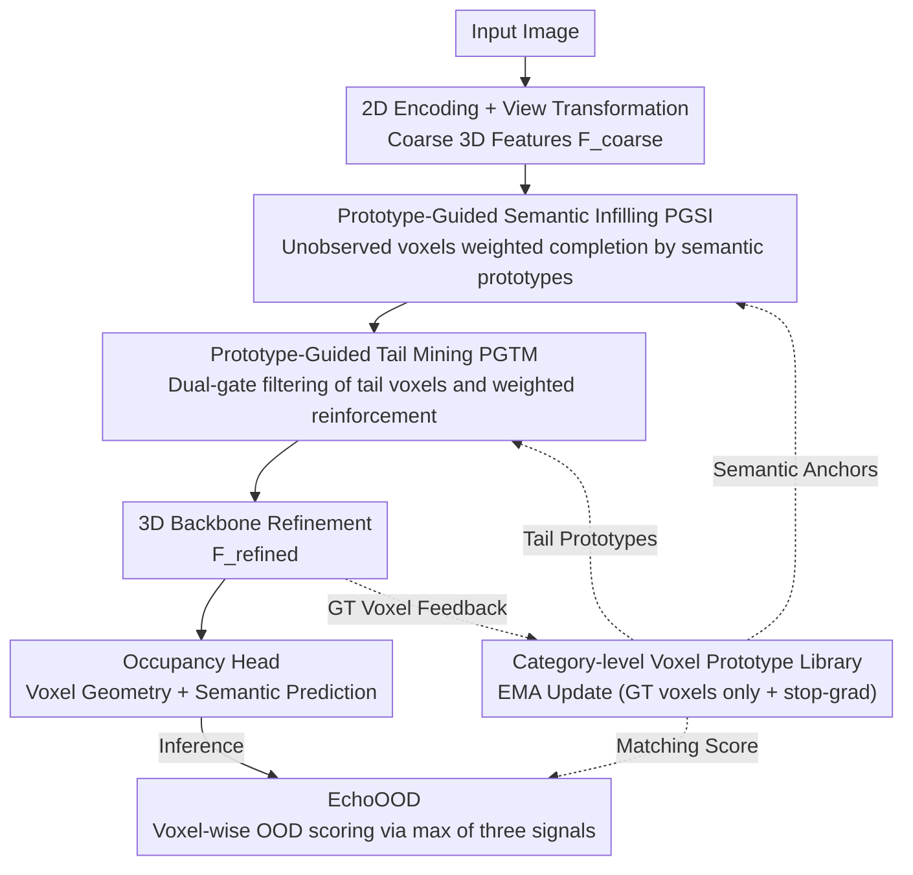

# ProOOD: Prototype-Guided Out-of-Distribution 3D Occupancy Prediction

**Conference**: CVPR 2026  
**arXiv**: [2604.01081](https://arxiv.org/abs/2604.01081)  
**Code**: [https://github.com/7uHeng/ProOOD](https://github.com/7uHeng/ProOOD)  
**Area**: Autonomous Driving / 3D Vision  
**Keywords**: 3D Occupancy Prediction, Out-of-Distribution Detection, Prototype Learning, Long-tail Distribution, Semantic Completion

## TL;DR

This paper proposes the ProOOD framework, which for the first time treats long-tail recognition and Out-of-Distribution (OOD) detection in 3D occupancy prediction from a unified perspective of voxel prototype guidance. Through Prototype-Guided Semantic Infilling (PGSI), Prototype-Guided Tail Mining (PGTM), and the training-free EchoOOD scoring mechanism, it achieves a +3.57% mIoU improvement on SemanticKITTI (+24.80% for tail classes) and a +19.34 increase in OOD detection AuPRCr on VAA-KITTI.

## Background & Motivation

1. **Background**: 3D semantic occupancy prediction is a core perception task for autonomous driving, aiming to generate geometry and semantic labels for every voxel. Recent camera-based methods (VoxFormer, CGFormer, SGN, etc.) have made significant progress on in-distribution data.
2. **Limitations of Prior Work**: Autonomous driving environments inevitably contain unknown objects (construction barriers, animals, extreme weather, etc.). Existing models are often overconfident regarding OOD inputs, forcibly classifying anomalous targets into known categories (especially rare ones). For example, a piece of clothing might be misidentified as a cyclist.
3. **Key Challenge**: OOD detection and long-tail learning are inherently coupled. In SemanticKITTI, rare categories account for less than 2% of samples, leading to ambiguous and poorly calibrated models for these classes. Existing OOD scoring methods (maximum softmax, entropy, energy) are designed for category-wise classification and show limited performance in voxel-level prediction, lacking mechanisms to capture 3D spatial structure and semantic context.
4. **Goal**: To handle long-tail learning and OOD detection uniformly: better tail class recognition → reduced prediction overconfidence → enhanced OOD sensitivity.
5. **Key Insight**: Utilize category prototypes as unified semantic anchors—used for both semantic completion and tail enhancement during training, and for OOD scoring during inference—serving as a plug-and-play module without modifying the backbone.
6. **Core Idea**: Simultaneously guide semantic completion, strengthen tail class representations, and quantify voxel-level uncertainty via category-level voxel prototypes, thereby improving both occupancy prediction and OOD detection without backbone modifications.

## Method

### Overall Architecture

ProOOD aims to answer one question: Can a single mechanism simultaneously improve "rare class recognition" and "unknown object detection"? The answer is **category-level voxel prototypes**—maintaining a set of EMA-smoothed global anchors for each semantic category in the feature space, which permeate both training and inference.

Overall, it does not alter the backbone and acts as a plug-and-play module attached to existing voxel occupancy frameworks (e.g., SGN, VoxDet). An image first passes through 2D encoding and view transformation to obtain coarse 3D features $F_{coarse}^{3D}$. Next, the prototypes perform two functions: PGSI uses prototypes to semantically complete occluded voxels, and PGTM identifies and enhances voxels suspected to be rare classes. The enhanced features then pass through a 3D backbone to be refined into $F_{refined}^{3D}$. Finally, the occupancy head generates predictions. During inference, EchoOOD uses the same set of prototypes to assign an OOD score to each voxel. Prototypes are updated during training via EMA using only ground-truth voxels, forming a positive feedback loop: "better completion → more accurate prototypes → more accurate completion."

### Key Designs

**1. Prototype-Guided Semantic Infilling (PGSI): Filling occlusions with semantic anchors rather than geometric adjacency**

Traditional completion relies on local geometric consistency to fill occluded regions, but geometric continuity does not imply semantic rationality—a blank space might be filled as road based on neighbors, when it is actually a building wall. PGSI changes the basis: an auxiliary occupancy head first identifies the set of unobserved voxels $\mathcal{U}$, and for each voxel, it calculates attention weights with all mature global prototypes $a_{ik} = \text{softmax}(-\|\mathbf{x}_i^{coarse} - \mathbf{p}_k^g\|^2 / \tau_{att})$. Finally, a residual update is performed via a weighted sum of prototypes: $\tilde{\mathbf{x}}_i = \mathbf{x}_i + \alpha_{pgsi} \sum_k a_{ik} \mathbf{p}_k^g$. This essentially allows each hole to "ask" which category prototype it most resembles and then fill in that semantic direction. Since the completed features also flow back to update the prototypes, the more accurate the completion, the cleaner the prototypes, leading to more stable semantic reasoning in the next round.

**2. Prototype-Guided Tail Mining (PGTM): Actively selecting and weighting rare category voxels**

Under long-tail distributions, models tend to "over-classify" ambiguous regions into dominant major classes; extremely rare classes like bicycle and motorcycle (which occupy only 0.03% of voxels) are easily ignored. PGTM operates on features after PGSI: it first calculates the cosine similarity $s_{ik}$ between each voxel and global prototypes, then uses two gates to filter tail candidates—first, similarity with a tail class prototype must exceed a threshold $\eta$; second, the margin between top-1 and top-2 similarity must exceed $\delta$ (to avoid including ambiguous voxels). Selected candidates are then strengthened using a weighted sum of tail prototypes through a lightweight MLP: $\tilde{\mathbf{x}}_i \leftarrow \tilde{\mathbf{x}}_i + \psi(\sum_{k \in \mathcal{C}_{tail}} w_{ik} \mathbf{p}_k^g)$, with an additional tail classification head $\phi$ supervised by CE on refined features. It shares prototypes with PGSI, the difference being that completion targets "emptiness" while mining targets "weakness."

**3. EchoOOD: Training-free, voxel-wise OOD scoring using the maximum of three signals**

Completion and enhancement occur during training; how is an OOD voxel determined during inference? EchoOOD introduces no new parameters, directly reusing existing logits and prototypes to fuse three complementary signals: Local logit consistency $s_i^{local-logit} = 1 - \cos(\mathbf{l}_i, \boldsymbol{\mu}_{\hat{y}_i})$ checks if the voxel logit deviates from the mean logit of the same class (capturing distribution shift); local prototype matching $s_i^{local-proto} = 1 - \cos(\mathbf{x}_i, \mathbf{p}_{\hat{y}_i}^\ell)$ checks similarity with local prototypes within the current scene (capturing intra-scene anomalies); global prototype matching $s_i^{global-proto} = 1 - \cos(\mathbf{x}_i, \mathbf{p}_{\hat{y}_i}^g)$ checks similarity with cross-scene EMA global prototypes (capturing cross-scene anomalies). The final score is the maximum of the normalized signals:

$$s_i^{fused} = \max(s_i^{local-logit},\ s_i^{global-proto},\ s_i^{local-proto})$$

Taking the maximum instead of the average is because different types of OOD often reveal themselves in only one signal path—if any path alarms, it should be marked as an anomaly, whereas an average might be diluted by normal signals.

### Loss & Training

Prototypes are updated via EMA (momentum $\beta$) using only ground-truth voxels with stop-gradient to prevent backward gradients from polluting features. To prevent unlearned prototypes from interfering with downstream tasks, they are only "deployed" after passing through three maturity gates: training steps $t \geq t_{warm}$ (warmup), quality score $q_k > \theta_{max}$, and cumulative count $|\Omega_k| \geq n_{min}$. The training objective adds two terms to the original occupancy loss: Tail classification loss $\mathcal{L}_{tail}$ supervises the PGTM tail head, and Prototype-based Contrastive Loss (PBCL) $\mathcal{L}_{proto}$ promotes intra-class compactness and inter-class separation on refined features, making prototypes more discriminable.

## Key Experimental Results

### Main Results (SemanticKITTI Test Set, Single Frame)

| Method | IoU | mIoU | Tail mIoU |
|------|-----|------|---------|
| CGFormer | 44.41 | 16.63 | 5.36 |
| SGN (baseline) | 41.88 | 14.01 | 3.48 |
| **Ours (+SGN)** | 43.14 | 14.51 | **4.35** (+25.0%) |
| VoxDet (baseline) | 46.69 | 17.77 | 6.17 |
| **Ours (+VoxDet)** | **46.75** | **18.12** (+3.57%) | **6.34** (+24.80%) |

### Ablation Study (OOD Detection, VAA-KITTI)

| Method | AuPRCr@0.8m | AuPRCr@1.0m | AuPRCr@1.2m | AuROC |
|------|-------------|-------------|-------------|-------|
| OccOoD (baseline) | 10.80 | 16.05 | 23.42 | 61.96 |
| Ours (+VoxDet) EchoOOD | 21.95 | 36.97 | 56.49 | 60.99 |
| Ours (+SGN) EchoOOD | **27.86** | **43.55** | **62.65** | **64.31** |

### Key Findings

- **Significant improvement for tail classes**: ProOOD improves tail mIoU from 3.48 to 4.35 (+25.0%) on SGN and from 6.17 to 6.34 (+2.8%) on VoxDet, indicating that prototype guidance effectively enhances representations for extremely rare classes like bicycle and motorcycle (0.03% of voxels).
- **Substantial gain in OOD detection**: AuPRCr@1.2m on VAA-KITTI increased from 23.42 to 62.65 (+39.23 points), showing that long-tail enhancement directly assists OOD detection—better tail calibration reduces the tendency to misclassify OOD as rare categories.
- **Plug-and-play effectiveness**: ProOOD seamlessly integrates into both SGN and VoxDet backbones, consistently bringing improvements and verifying its universality.
- **Complementary three-path OOD scoring**: The three signals of EchoOOD (local logit, local proto, global proto) each capture different types of anomalies, and max aggregation is more robust than a single score.

## Highlights & Insights

- **Unified perspective of Long-tail and OOD**: The core contribution is revealing the inherent link between long-tail learning and OOD detection in 3D occupancy—poor tail calibration causes OOD misjudgment; hence they must be handled jointly. Prototype learning serves as a "bridge."
- **Multi-use of Prototypes**: The same set of category prototypes is shared across PGSI (completion), PGTM (enhancement), PBCL (contrastive learning), and EchoOOD (detection), resulting in a compact and efficient design.
- **Training-free OOD Detection**: EchoOOD requires no additional parameters or training, utilizing existing prototypes and logits, making it a true zero-overhead OOD detection solution.

## Limitations & Future Work

- The definition of tail classes ($\mathcal{C}_{tail}$) must be pre-specified and cannot automatically adapt to different category distributions.
- EMA prototype warmup periods and maturity gate thresholds require tuning; initial representations for new categories may be unstable.
- Experiments primarily focused on camera-based methods; applicability to LiDAR-based or multi-modal fusion methods is not fully discussed.
- Lack of comparison with emerging OOD detection methods (e.g., VOS, NPOS) in the OOD section.
- Performance in non-urban scenes (e.g., off-road, parking lots with severe long-tail issues) has not been verified.

## Related Work & Insights

- **vs OccOoD**: OccOoD pioneered 3D occupancy OOD benchmarks but lacked feature-level detection and long-tail processing. ProOOD addresses both via prototype learning.
- **vs OCCUQ**: OCCUQ focuses on sensor-failure OOD (e.g., corruption, noise), whereas ProOOD focuses on semantic OOD (unknown objects); the two are complementary.
- **vs SHTOcc/CGFormer**: While these backbones excel in in-distribution performance, ProOOD's plug-and-play design can directly enhance their OOD robustness.

## Rating

- Novelty: ⭐⭐⭐⭐ First to unify long-tail and OOD detection for 3D occupancy; clever multi-use prototype design.
- Experimental Thoroughness: ⭐⭐⭐⭐ Validated on 5 datasets and multiple backbones, though ablation studies could be more granular.
- Writing Quality: ⭐⭐⭐⭐ Clear framework diagrams and detailed formulas, though some parameter choices (e.g., maturity gates) could be better justified.
- Value: ⭐⭐⭐⭐⭐ Addresses critical safety issues in autonomous driving with a practical, plug-and-play design.

<!-- RELATED:START -->

## Related Papers

- [\[CVPR 2026\] Learning to Identify Out-of-Distribution Objects for 3D LiDAR Anomaly Segmentation](learning_to_identify_out-of-distribution_objects_for_3d_lidar_anomaly_segmentati.md)
- [\[CVPR 2026\] Neural Distribution Prior for LiDAR Out-of-Distribution Detection](neural_distribution_prior_for_lidar_ood_detection.md)
- [\[CVPR 2026\] Gau-Occ: Geometry-Completed Gaussians for Multi-Modal 3D Occupancy Prediction](gau-occ_geometry-completed_gaussians_for_multi-modal_3d_occupancy_prediction.md)
- [\[CVPR 2026\] OccAny: Generalized Unconstrained Urban 3D Occupancy](occany_generalized_unconstrained_urban_3d_occupancy.md)
- [\[CVPR 2026\] TT-Occ: Test-Time 3D Occupancy Prediction](test-time_3d_occupancy_prediction.md)

<!-- RELATED:END -->
