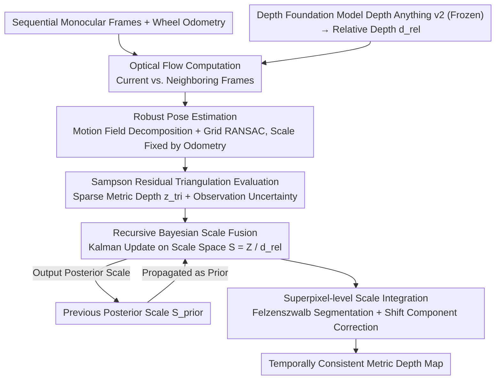

# PTC-Depth: Pose-Refined Monocular Depth Estimation with Temporal Consistency

**Conference**: CVPR 2026  
**arXiv**: [2604.01791](https://arxiv.org/abs/2604.01791)  
**Code**: [https://ptc-depth.github.io](https://ptc-depth.github.io)  
**Area**: Autonomous Driving / Depth Estimation  
**Keywords**: Monocular Depth Estimation, Temporal Consistency, Bayesian Scale Fusion, Optical Flow Triangulation, Wheel Odometry

## TL;DR

This paper proposes PTC-Depth, a monocular depth estimation framework combining optical flow triangulation and wheel odometry. By tracking the metric scale of depth foundation models through recursive Bayesian updates, it achieves temporally consistent metric depth prediction and demonstrates strong generalization across multiple datasets including KITTI, TartanAir, and thermal infrared.

## Background & Motivation

1. **Background**: Monocular Depth Estimation (MDE) is widely applied in autonomous driving and mobile robotics. Depth foundation models (e.g., Depth Anything v2) have made significant progress in zero-shot generalization but mostly predict relative depth (lacking absolute metric scale).

2. **Limitations of Prior Work**: (a) Single-frame depth estimation suffers from severe temporal inconsistency (jitter and sudden changes); (b) Video depth models (e.g., VDA) improve consistency but still lack metric depth; (c) Depth completion methods (e.g., OGNI-DC) require additional LiDAR depth, making them unsuitable for camera + odometry only scenarios.

3. **Key Challenge**: Relative depth models possess good structure preservation and generalization, while metric depth models provide absolute scale but generalize poorly (e.g., UniDepth degrades significantly in out-of-distribution (OOD) scenarios). It is difficult to simply combine the advantages of both.

4. **Goal**: To convert the relative depth of foundation models into temporally consistent metric depth using only a monocular camera and wheel odometry (without LiDAR/depth sensors).

5. **Key Insight**: The metric baseline provided by wheel odometry combined with optical flow constrains the metric scale of depth. Sparse metric depth is obtained via triangulation between consecutive frames, and global/local scale factors are tracked through a recursive Bayesian framework.

6. **Core Idea**: The conversion from relative depth to metric depth is modeled as a Bayesian recursive estimation problem of a scale field $S$, with local scale adaptation implemented via superpixel segmentation.

## Method

### Overall Architecture

The paper addresses a specific problem: depth foundation models (e.g., Depth Anything v2) can predict high-quality relative depth, but lack absolute scale and exhibit jitter over time. This work aims to transform such relative depth into temporally consistent **metric** depth using only monocular camera and wheel odometry inputs. The core strategy is to delegate "scale recovery" to geometry—odometry provides a metric baseline of known length, while optical flow provides inter-frame correspondences. Their triangulation yields sparse metric depth, which is then fused with priors from previous frames via a Bayesian filter.

Detailed frame processing: First, compute optical flow between the current and adjacent frames. Use optical flow and relative depth to estimate camera relative pose via RANSAC, fixing the pose scale using the odometry translation length. Perform triangulation with pose and optical flow to obtain sparse metric depth $z_{tri}$. Finally, perform pixel-wise recursive Bayesian updates in the scale space to fuse current triangulation observations with priors propagated from the previous frame, outputting the metric depth map. The entire pipeline contains no learnable parameters and keeps the foundation model frozen.

### Key Designs

**1. Robust Pose Estimation via Motion Fields: Isolating Ego-motion from Optical Flow in Dynamic Scenes**

Pose estimation is the pipeline's starting point. The difficulty lies in optical flow containing dynamic objects whose motion is independent of the camera. The paper adopts the Longuet-Higgins motion field formula to decompose optical flow into a rotational term $\mathbf{B}\boldsymbol{\Omega}$ and a translational term $\frac{1}{\alpha d^{rel}}\mathbf{A}\boldsymbol{T}$. Assuming relative depth $d^{rel}$ is linearly converted to metric depth by a single scale factor $\alpha$, recovering rotation $\boldsymbol{\Omega}$ and translation direction $\hat{\boldsymbol{T}}$ becomes an overdetermined linear system. To resist dynamic outliers, RANSAC sampling is performed over a grid rather than randomly across the image, ensuring hypotheses cover the entire field of view. Final refinement uses IRLS with Huber weights.

**2. Triangulation Quality via Sampson Residual: Using Epipolar Geometry as Confidence without Additional Networks**

Sparse depth from triangulation is often unreliable due to flow errors or dynamic objects. This work computes metric depth $z^{tri}$ and its corresponding Sampson residual $\rho$ for each flow correspondence. The residual $\rho$ measures how well the correspondence satisfies the epipolar constraint; smaller residuals indicate higher reliability. This score is directly fed into the observation uncertainty $V^{obs} = \sigma^2 \frac{\rho}{f_x f_y}$ for Bayesian fusion, avoiding the need for a separate confidence network.

**3. Recursive Bayesian Scale Fusion: Filtering in Scale Space rather than Depth Space to Preserve Foundation Model Structure**

This is the core contribution. Instead of weighted averaging in depth space $Z$, which would blur the sharp boundaries predicted by foundation models, the work operates in the scale space $S$, where $Z = S \cdot d^{rel}$. The prior scale $S^{prior} = Z^{prior}/d^{rel}$ is propagated from the previous frame, and the observed scale $S^{obs} = Z^{tri}/d^{rel}$ is provided by triangulation. Pixel-wise Kalman updates are performed with two safeguards: a Chi-square test using normalized innovation $\gamma$ to reject outliers, and a consistency-constrained Kalman gain $\kappa$ to control update magnitude. Filtering in scale space ensures the structural integrity of $d^{rel}$ while estimating the slowly varying scale field.

**4. Superpixel-level Scale Integration: Correcting the Shift Component**

Since foundation models are often affine-invariant, they may contain a hidden shift component that a single global scale cannot correct. The work uses Felzenszwalb segmentation to partition the image into superpixels $\Lambda_\ell$. Within each superpixel, the median posterior scale $\bar{s}_\ell$ is used as a local scale. Regions with low fitting errors use this local scale, while high-error regions fall back to the global scale. This piece-wise constant approximation effectively compensates for local depth shifts.

### Loss & Training

This method is a **training-free** inference framework. No neural network training or fine-tuning is involved. The depth foundation model (Depth Anything v2) is used in a frozen state, and all calculations are analytical (optical flow, RANSAC, Bayesian updates).

## Key Experimental Results

### Main Results

Full-range (0-80m) depth estimation:

| Dataset | Method | AbsRel ↓ | δ<1.25 ↑ | TAE ↓ |
|--------|------|----------|----------|-------|
| KITTI | UniDepth | **0.047** | **0.977** | 4.34 |
| KITTI | **Ours** | 0.137 | 0.877 | 5.35 |
| TartanAir | **Ours** | **0.427** | **0.688** | 5.42 |
| TartanAir | UniDepth | 0.503 | 0.176 | 11.11 |
| Roadside | **Ours** | **0.309** | **0.725** | 5.27 |
| Roadside | UniDepth | 0.465 | 0.201 | 11.92 |
| MS2 (TIR) | **Ours** | 0.247 | 0.700 | 5.29 |
| MS2 (TIR) | DA v2 metric | 0.405 | 0.187 | 4.87 |

Short-range (0-20m) depth estimation:

| Dataset | Method | AbsRel ↓ | δ<1.25 ↑ |
|--------|------|----------|----------|
| TartanAir | **Ours** | **0.339** | **0.712** |
| TartanAir | UniDepth | 0.485 | 0.202 |
| Roadside | **Ours** | **0.165** | **0.860** |
| Roadside | UniDepth | 0.432 | 0.241 |

### Ablation Study (Pose Source Comparison)

| Method | Pose Source | KITTI AbsRel | TartanAir AbsRel | Roadside δ1 |
|------|----------|-------------|-------------------|-------------|
| MADPose | UniDepth Metric Depth | 0.115 | 0.481 | 0.222 |
| **Ours** | Odometry + Flow | **0.115** | **0.239** | **0.649** |
| GT Pose | Ground Truth Pose | 0.130 | 0.168 | - |

### Key Findings

- While UniDepth is strongest on KITTI (in-distribution), the proposed method significantly outperforms it on all OOD datasets (TartanAir AbsRel 0.427 vs 0.503).
- MADPose relies on UniDepth's generalization; its triangulation accuracy drops sharply on OOD data, whereas the proposed method remains robust by relying on odometry.
- Triangulation is most effective at short ranges (0-20m) due to sufficient baseline; performance degrades at long ranges (20-80m) as parallax decreases.
- VDA achieves good temporal consistency (low TAE) but lacks metric accuracy in OOD scenarios (Roadside AbsRel 2.198).

## Highlights & Insights

- **Training-free General Framework**: Works on both RGB and thermal infrared without fine-tuning, making it suitable for immediate robotic deployment.
- **Fusion in Scale Space**: Performing Bayesian fusion in $S = Z/d^{rel}$ space preserves the sharp boundaries and spatial structure of foundation model predictions.
- **Sampson Residual as Reliability**: Uses satisfyability of geometric constraints as a pixel-wise weight, providing a lightweight alternative to learned confidence networks.

## Limitations & Future Work

- Triangulation accuracy at long ranges (>20m) is limited by vanishing parallax, an inherent constraint of geometric methods.
- Dependence on wheel odometry precision; errors propagate during tire slip or uneven terrain.
- Optical flow quality and odometry synchronization in the MS2 dataset limit performance.
- Hyperparameters for superpixel segmentation (Felzenszwalb threshold) might require scene-specific adjustment.

## Related Work & Insights

- **vs. UniDepth**: UniDepth excels in training domains but generalizes poorly. This method avoids dependency on specific metric training via geometric constraints.
- **vs. VDA (Video Depth Anything)**: VDA provides consistency but lacks metric scale and exhibits significant OOD degradation.
- **vs. MADPose**: MADPose uses UniDepth for pose estimation, inheriting its generalization bottlenecks. This work decouples scale recovery by using odometry.

## Rating

- Novelty: ⭐⭐⭐ A solid combination of known techniques; superpixel local scale and Sampson weighting are effective refinements.
- Experimental Thoroughness: ⭐⭐⭐⭐ Covers RGB and PIR, real and synthetic, plus in-depth short/long range analysis.
- Writing Quality: ⭐⭐⭐⭐ Clear mathematical derivations and intuitive framework diagrams.
- Value: ⭐⭐⭐⭐ High practical value for robotics—no training, no extra sensors, and cross-modal capability.

<!-- RELATED:START -->

## Related Papers

- [\[CVPR 2026\] LA-Pose: Latent Action Pretraining Meets Pose Estimation](la-pose_latent_action_pretraining_meets_pose_estimation.md)
- [\[CVPR 2025\] Prompting Depth Anything for 4K Resolution Accurate Metric Depth Estimation](../../CVPR2025/autonomous_driving/prompting_depth_anything_for_4k_resolution_accurate_metric_depth_estimation.md)
- [\[CVPR 2025\] Distilling Monocular Foundation Model for Fine-grained Depth Completion](../../CVPR2025/autonomous_driving/distilling_monocular_foundation_model_for_fine-grained_depth_completion.md)
- [\[CVPR 2026\] ELiC: Efficient LiDAR Geometry Compression via Cross-Bit-depth Feature Propagation and Bag-of-Encoders](elic_efficient_lidar_geometry_compression_via_cross-bit-depth_feature_propagatio.md)
- [\[CVPR 2026\] EMDUL: Expanding mmWave Datasets for Human Pose Estimation with Unlabeled Data and LiDAR Datasets](expanding_mmwave_datasets_for_human_pose_estimation_with_unlabeled_data_and_lida.md)

<!-- RELATED:END -->
