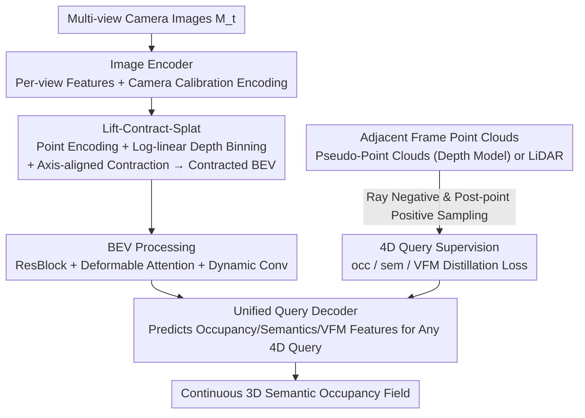

# QueryOcc: Query-based Self-Supervision for 3D Semantic Occupancy

**Conference**: CVPR 2026  
**Paper**: [CVF Open Access](https://openaccess.thecvf.com/content/CVPR2026/html/Lilja_QueryOcc_Query-based_Self-Supervision_for_3D_Semantic_Occupancy_CVPR_2026_paper.html)  
**Code**: None (Project page only)  
**Area**: Autonomous Driving / 3D Semantic Occupancy / Self-Supervised  
**Keywords**: 3D Semantic Occupancy, Self-Supervised, 4D Query Supervision, Contracted BEV, Autonomous Driving Perception

## TL;DR
QueryOcc directly supervises geometry and semantics in continuous 3D space using independent 4D spatio-temporal queries sampled from adjacent frames. Combined with a contracted BEV representation capable of handling unbounded scenes, it improves semantic RayIoU by 26% on the self-supervised Occ3D-nuScenes dataset while maintaining real-time inference at 11.6 FPS.

## Background & Motivation

**Background**: 3D semantic occupancy is a core representation in modern autonomous driving perception—it simultaneously characterizes geometry, semantics, and drivable free space. However, voxel-level annotation for 3D scenes is extremely expensive (annotating the occupancy of 850 sequences in nuScenes took approximately 4,000 hours of manual labor). Consequently, self-supervised methods that learn directly from sensor data without relying on manual annotations have become the mainstream pursuit.

**Limitations of Prior Work**: Existing self-supervised occupancy methods fall into two categories, each with severe limitations. **Rendering-based methods** (pure camera approaches such as SelfOcc, OccNeRF, and GaussianFlowOcc) treat the implicit volume as a radiance field and supervise it using the photometric and semantic consistency of 2D image reconstruction. Here, the geometric signal is a mere byproduct of image synthesis, rendering it **indirect**; the 3D structure emerges "along the way" rather than as an explicit learning objective. Furthermore, these methods often rely on externally estimated depth maps to stabilize training. **LiDAR-based methods** (such as MinkOcc and POP3D), though providing direct supervision in 3D, require accumulating LiDAR point clouds and **discretizing them into voxel grids of predefined ranges and resolutions**, which restricts spatial accuracy and scalability.

**Key Challenge**: It is exceptionally difficult to simultaneously achieve the "directness" of supervision signals and an "unbounded + high-precision" scene representation. Rendering-based methods suffer from poor directness, while LiDAR-based methods are bottlenecked by voxelization and fixed grid ranges, where the BEV grid size (and thus GPU memory and computation) grows quadratically with the scene distance.

**Goal**: (1) Provide a signal that **directly** supervises geometry and semantics in continuous 4D space-time, rather than relying on rendering or voxelization; (2) Design a scene representation that can cover unbounded real-world environments with constant GPU memory while preserving near-field details.

**Key Insight**: The authors hypothesize that **direct supervision in continuous 4D space-time provides clearer geometric feedback than rendering or voxelizing LiDAR data**. Point clouds (whether from real LiDAR or camera-based depth models) are essentially a set of labeled observation points in space. Instead of stuffing them into voxels, they should be treated as supervision sources that can be sampled at arbitrary 4D points.

**Core Idea**: Directly supervise a continuous occupancy field using **independent 4D queries** (`q = [x, y, z, t]`) sampled from adjacent frames. "Unoccupied" negative samples are sampled along sensor rays, while "occupied" positive samples are sampled in buffers behind the points. An **axis-aligned contracted BEV** is also employed to compress unbounded scenes into a fixed grid with constant GPU memory.

## Method

### Overall Architecture
QueryOcc aims to solve the problem of "how to learn multi-view camera images into a continuous 3D semantic occupancy field without relying on annotations, rendering, or voxelization." The overall pipeline follows a clear four-stage forward pass: multi-view images are first encoded view-by-view, and then lifted into contracted BEV features via a **Lift-Contract-Splat** module. After being processed by a BEV encoder, a **unified query decoder** predicts occupancy $\hat{o}$ and semantics $\hat{s}$ for any arbitrary 4D point $q$. Formally, $\langle\hat{o},\hat{s}\rangle = F_\omega(M_t, q) = D_\varrho(H_\varpi(G_\vartheta(E_\varepsilon(M_t))), q)$.

The supervision pipeline runs in parallel: starting from real LiDAR point clouds of adjacent frames or pseudo-point clouds generated by camera depth models, positive and negative 4D queries with occupancy, semantic, and VFM feature labels are sampled along the rays and point-back buffers, and fed into the same decoder to compute loss. The entire training process is end-to-end, and during inference, the continuous field is sampled at the center of the Occ3D voxels to obtain voxelized results.

### Key Designs

**1. 4D Spatiotemporal Query Self-Supervision: Using Continuous Point Clouds as Direct Supervision to Bypass Rendering and Voxelization**

This is the core innovation of the paper, tackling both the rendering-based "geometry is a byproduct" and the LiDAR-based "voxelization requirement" pain points. Given a frame of a point cloud (either pseudo-point cloud $P_{pseudo}$ from a camera depth model, LiDAR $P_{lidar}$, or their union $P_{uni}$), the authors neither aggregate nor rasterize them. Instead, they treat each point $p_i$ along with its sensor origin $o_i$ as a geometric evidence ray, from which they sample supervision queries. **Negative samples (unoccupied)** are sampled along the ray segment from the origin to the point: $D^- = \{\langle o_i + r(p_i - o_i),\, 0\rangle \mid r \in (0,1)\}$, as this ray segment must be empty since it was traversed. **Positive samples (occupied)** are sampled within a buffer of length $\zeta$ behind the point: $D^+ = \{\langle p_i + r\frac{p_i-o_i}{\|p_i-o_i\|},\, a_i\rangle \mid r \in (0,\zeta)\}$, carrying the point's occupancy, semantic, or feature label $a_i$.

Thus, each query acts as an independent, continuous 4D supervision point, sampled across adjacent frames $t \in \{T_{min},\dots,T_{max}\}$ with positive/negative balance. The beauty lies in directly supervising within 3D space, where geometry and semantics are **explicit learning objectives** rather than rendering products, avoiding the discretization of point clouds into fixed-resolution voxels. This naturally supports arbitrary sparsity, distance, and sensor configurations. In the ablation study, replacing this with image-space alpha-blending rendering supervision crashed the mRayIoU from 23.6 to 15.0, directly validating that "direct 3D supervision > indirect 2D supervision."

**2. Lift-Contract-Splat: Lifting Image Features into an Unbounded but Constant-Memory Contracted BEV**

Direct supervision alone is insufficient; to supervise long-range scenes, the BEV grid would expand quadratically with the range, leading to out-of-memory issues. Building on LSS (Lift-Splat-Shoot), the authors introduce three modifications to synthesize a lift module capable of covering unbounded scenes. **(a) Point Encoding**: Instead of directly splatting raw features $f_d = p_d \cdot \omega$, they explicitly encode visibility, uncertainty, and temporal cues: $f_d = P_\varsigma(p_d\cdot\omega + (1-p_d)e,\, p_v,\, p_d,\, t_c)$, where $e$ is a learnable empty space embedding, and $p_v$ represents the accumulated depth probability (predicted visibility). This allows the model to explicitly express "occupied" vs. "unobserved" states, improving geometric reasoning in the lifted space. **(b) Log-linear Depth Binning**: Uniform binning is replaced with exponentially increasing depth intervals: $d(r) = (1-\varsigma)d_{near}(d_{far}/d_{near})^r + \varsigma[d_{near}+r(d_{far}-d_{near})]$. This allocates high resolution to the near-field while still covering the far-field without increasing the total number of bins. **(c) Axis-aligned Contraction**: Drawing inspiration from NeRF scene parameterizations, they define a continuous contraction function to map coordinates into $[-1, 1]$:

$$f_{contr.}(\bar{\phi}) = \begin{cases} \kappa \cdot \bar{\phi}, & |\bar{\phi}| \le 1 \\ \mathrm{sign}(\bar{\phi})\left(1 - \frac{1-\kappa}{|\bar{\phi}|}\right), & |\bar{\phi}| > 1 \end{cases}$$

The near-field ($|\bar\phi|\le1$) maintains linear fidelity, while the far-field is smoothly compressed. Unlike spherical contraction, the **axis-aligned** variant preserves rectangular geometry, perfectly fitting the BEV grid. Together, these three modifications allow the model to encode unbounded scenes within a fixed grid: maintaining near-field details while compressing the far-field (where points are sparse and depth is inherently inaccurate anyway) to boost efficiency, keeping GPU memory and computation constant. Adding these components progressively (log-linear / long-range supervision / contraction / point encoding) in the ablation study monotonically improved RayIoU from 21.7 to 23.6.

**3. Unified Query Decoder: Shared Parameters for Occupancy, Semantics, and VFM Feature Distillation**

The contracted BEV feature map $Z$ functions as a spatially anchored field that can be queried at any arbitrary 4D point. The decoder first projects and contracts queries into the BEV space for alignment using Eq.(3). After being encoded by a small MLP, they are fused with the interpolated BEV features at the corresponding position. The decoder then predicts offsets $\Delta q_{x,y}$ to sample additional features from neighboring positions (mimicking the dynamic spatial reasoning of deformable attention), outputs $\hat{a} = D_\varrho(q, Z)$ through iterative refinement with shallow residual blocks. The standard configuration predicts $\hat{a}=\langle\hat o,\hat s\rangle$, which can be extended to include VFM feature vector distillation $\hat v$, yielding $\langle\hat o,\hat s,\hat v\rangle$. Having a unified, lightweight decoder with shared parameters integrates geometry, semantics, and high-level visual supervision, saving computational costs while fostering cross-task consistency. This is also key to preserving BEV computational efficiency while recovering continuous 3D expressiveness.

### Loss & Training
Each query contributes to one or more losses based on the available supervision:

$$L = \lambda_{occ}L_{occ}(\hat o(q), o) + \lambda_{sem}L_{sem}(\hat s(q), s) + \lambda_{vfm}L_{vfm}(\hat v(q), v)$$

where $L_{occ}$ is binary cross-entropy, $L_{sem}$ is categorical cross-entropy, and $L_{vfm}$ is L1 loss.

The main model, **QueryOcc**, utilizes Metric3D for depth supervision and Grounded-SAM for semantic pseudo-labels, taking $224 \times 704$ inputs with a ConvNeXt-Base backbone. It samples 30k points per sample, generating 800,000 queries, and is trained for around 13 hours on 4×A100 GPUs (~30GB GPU memory). An enhanced version, **QueryOcc+**, adds LiDAR supervision, DinoV3 ViT-base feature distillation (PCA-reduced to 16 dimensions), and takes $900 \times 1600$ high-resolution inputs.

## Key Experimental Results

### Main Results
On the self-supervised Occ3D-nuScenes dataset, QueryOcc comprehensively outperforms previous SOTA models (tabulated below are the Semantic, Dynamic, and Occupancy metrics for RayIoU and IoU):

| Method | Sem.RayIoU | Dyn.RayIoU | Occ.RayIoU | Sem.IoU | Occ.IoU |
|------|-----------|-----------|-----------|---------|---------|
| GaussTR -T2D | 14.2 | 17.7 | 33.8 | 13.9 | 44.5 |
| GaussianFlowOcc (strongest baseline) | 18.7 | – | – | 17.1 | 46.9 |
| **QueryOcc** | **23.6** | **21.7** | **45.2** | **21.3** | **55.0** |
| **QueryOcc+** | **25.8** | **23.8** | **47.4** | **23.5** | **56.9** |

Compared to the strongest baseline, GaussianFlowOcc, semantic RayIoU increases by 26% and occupancy RayIoU by 25%, while achieving a real-time rate of 11.6 FPS (total latency of 86ms, vs. 10.2 FPS for GaussianFlowOcc and only 0.2 FPS for GaussTR). Class-wise IoU indicates it takes the lead in both small objects (traffic cones, pedestrians) and large-scale categories (drivable surfaces, sidewalks, terrain), only struggling on extremely rare classes (e.g., bicycles, which account for 0.03% of the data).

### Ablation Study

| Supervision Type | Sem.RayIoU | Dyn.RayIoU | Occ.RayIoU | Description |
|---------|-----------|-----------|-----------|------|
| Rendering Supervision Only | 15.0 | 9.8 | 41.7 | In-domain signal but calculating loss in image space |
| Query Supervision | 23.6 | 21.7 | 45.2 | Direct 3D supervision |
| Query + VFM Features | 24.0 | 22.0 | 45.7 | Further improvement with feature distillation |
| Query + Rendering | 23.3 | 21.3 | 45.6 | No gain when overlaying rendering |

Ablation on components (with fixed memory/computation): progressively adding log-linear binning, long-range supervision, spatial contraction, and point encoding improves Sem.RayIoU from 21.7 $\rightarrow$ 21.7 $\rightarrow$ 22.9 $\rightarrow$ 23.1. Removing contraction drops it to 22.5, whereas fully enabling all components yields 23.6, showing that each of the four components makes a positive contribution.

### Key Findings
- **Direct 3D supervision is the primary performance engine**: Replacing query supervision with rendering supervision drops the mRayIoU from 23.6 to 15.0; adding rendering loss on top of query supervision offers zero gain (23.3), indicating that 2D rendering loss becomes redundant once strong 3D supervision is established.
- **Complementary supervision sources**: Pseudo-point clouds (high density, perfectly aligned temporally with cameras) yield better semantics, while LiDAR (precise depth) yields better geometry. Their union (the unified configuration in QueryOcc+) achieves the best overall performance (Sem. 24.6 / Occ. 48.7).
- **Data-efficient and scalable**: Subsampling the point cloud per frame from 1.4M to <100k yields nearly identical performance while drastically cutting training time. Scaling the input resolution from 256×256 to 900×1600 consistently improves mRayIoU by +3. Adding Argoverse 2 data boosts semantic RayIoU from 22.9 to 26.0 without requiring any domain adaptation or label alignment.

## Highlights & Insights
- **Pushing the "point cloud = labeled spatial evidence" concept to its limit**: The sampling strategy of negative sampling along rays and positive sampling behind points translates the physical intuition of "where it is traversed = empty, where there is a point = occupied" into continuous supervision. This is cleaner than rendering consistency and lossless compared to voxelization—serving as a transferable sampling paradigm for any point cloud-driven occupancy or reconstruction task.
- **Axis-aligned contraction fits BEV better than spherical contraction**: Compressing the far-field while maintaining rectangular geometry successfully handles "unbounded scenes + constant memory" in practice. Since the far-field is already sparse and inaccurate, compressing it incurs practically zero loss while boosting efficiency, representing a clever trade-off.
- **Single decoder for three tasks**: Sharing parameters among occupancy, semantics, and VFM feature distillation serves as an efficient design that also fosters cross-task consistency. VFM distillation additionally provides complementary cues independent of the input resolution.
- **The most "aha" moment**: The continuous query representation makes the framework almost agnostic to sensor configurations and dataset sources. Switching between LiDAR and camera or adding new datasets requires no changes to the architecture or losses—something voxelization-based methods cannot achieve.

## Limitations & Future Work
- **Author-admitted limitations**: All methods of this kind are constrained by "only being able to supervise what the sensors observe," leaving them helpless against occluded regions. Future work could incorporate self-supervised representation learning objectives (such as consistency or feature reconstruction) to provide signals in unobserved regions, or implement cooperative multi-agent supervision (overlapping views from different vehicles or timestamps to "see through corners").
- **Self-identified limitations**: Extremely poor performance on rare classes (e.g., bicycles at 0.03%) indicates that self-supervised pseudo-labels are inherently weak for long-tail categories. Evaluation is entirely based on sampling at the voxel centers of Occ3D-nuScenes, meaning the true "continuity" advantage of the continuous field is not independently quantified. Moreover, pseudo-point cloud quality heavily relies on external depth (Metric3D) and segmentation (Grounded-SAM) models, directly propagating upstream errors.
- **Future directions**: Formulate occlusion completion as an explicit self-supervised target (e.g., temporal consistency constraints); introduce active sampling or reweighting for long-tail classes; and explore using continuous fields for downstream planning rather than reverting to voxel-based evaluation alone.

## Related Work & Insights
- **vs. GaussianFlowOcc / SelfOcc (Rendering-based)**: These methods indirectly learn geometry through 2D rendering consistency, making 3D structure a byproduct that often requires external depth. In contrast, this work directly samples queries in 3D for supervision, making geometry and semantics explicit targets. The ablation study proves that under the same source signal, direct supervision (23.6) far outperforms rendering (15.0).
- **vs. MinkOcc / POP3D (LiDAR Voxel-based)**: These accumulate LiDAR points into fixed-range and fixed-resolution voxel grids, which limits precision and range. In contrast, this work samples directly from continuous point clouds without accumulation or voxelization, and supports unbounded long-range scenes via contracted BEV.
- **vs. GASP / UnO / ALSO (Query-based LiDAR Perception)**: These utilize the query paradigm for LiDAR pretraining. This paper is the first to bring query self-supervision to **camera-only** semantic occupancy, addressing three new challenges: image-derived geometric noise, semantic supervision, and long-range efficient inference.

## Rating
- Novelty: ⭐⭐⭐⭐⭐ Bringing direct 4D query supervision to camera semantic occupancy, combined with unbounded contracted BEV, is highly novel and self-consistent.
- Experimental Thoroughness: ⭐⭐⭐⭐⭐ Comprehensive ablation across supervision types, components, sources, sampling, resolutions, and datasets, presenting a complete chain of evidence.
- Writing Quality: ⭐⭐⭐⭐ Clear methodological exposition and well-designed figures; formulas are slightly dense but highly readable.
- Value: ⭐⭐⭐⭐⭐ SOTA +26% with real-time 11.6 FPS, requiring no architectural changes across sensors/datasets, indicating high practical value.

<!-- RELATED:START -->

## Related Papers

- [\[CVPR 2026\] ShelfOcc: Native 3D Supervision beyond LiDAR for Vision-Based Occupancy Estimation](shelfocc_native_3d_supervision_beyond_lidar_for_vision-based_occupancy_estimatio.md)
- [\[CVPR 2026\] OneOcc: Semantic Occupancy Prediction for Legged Robots with a Single Panoramic Camera](oneocc_semantic_occupancy_prediction_for_legged_robots_with_a_single_panoramic_c.md)
- [\[CVPR 2026\] OccAny: Generalized Unconstrained Urban 3D Occupancy](occany_generalized_unconstrained_urban_3d_occupancy.md)
- [\[ECCV 2024\] Equivariant Spatio-Temporal Self-Supervision for LiDAR Object Detection](../../ECCV2024/autonomous_driving/equivariant_spatio-temporal_self-supervision_for_lidar_object_detection.md)
- [\[CVPR 2026\] TT-Occ: Test-Time 3D Occupancy Prediction](test-time_3d_occupancy_prediction.md)

<!-- RELATED:END -->
