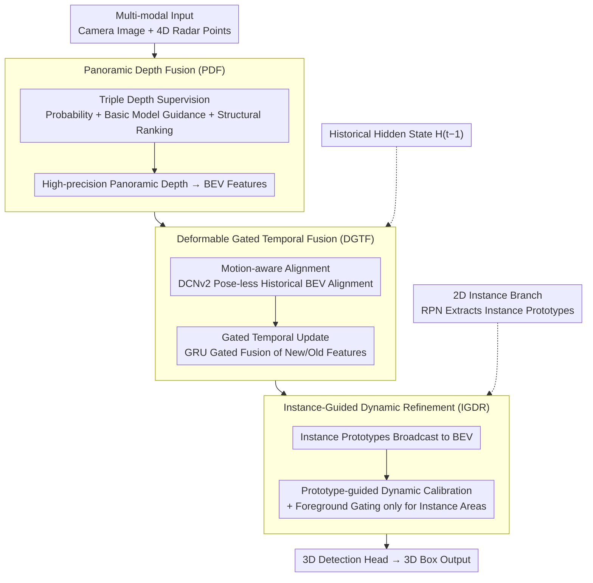

# R4Det: 4D Radar-Camera Fusion for High-Performance 3D Object Detection

**Conference**: CVPR 2026  
**arXiv**: [2603.11566](https://arxiv.org/abs/2603.11566)  
**Code**: None  
**Area**: Autonomous Driving  
**Keywords**: 4D Radar, Radar-Camera Fusion, 3D Object Detection, Depth Estimation, Temporal Fusion

## TL;DR

R4Det is proposed to systematically address three major challenges in 4D radar-camera fusion—inaccurate depth estimation, pose-less temporal fusion, and small object detection—via three plug-and-play BEV modules: Panoramic Depth Fusion (PDF), Deformable Gated Temporal Fusion (DGTF), and Instance-Guided Dynamic Refinement (IGDR). It achieves 47.29% 3D mAP (+5.47%) on TJ4DRadSet and 66.69% mAP on VoD.

## Background & Motivation

**Background**: 4D millimeter-wave radar has become an essential sensor for autonomous driving perception due to its all-weather capability, long range, and low cost. However, its point clouds are sparse and noisy, necessitating fusion with cameras. Existing methods (CRN, SGDet3D, CVFusion, etc.) have made preliminary progress in multi-modal fusion within the BEV space.

**Challenge 1—Inaccurate Depth Estimation**: Existing frameworks (SGDet3D, RCBEVDet) only apply absolute depth supervision to foreground points, leading to sparse depth supervision, poor panoramic depth estimation quality, and inaccurate 3D localization. Meanwhile, although powerful relative depth models (Metric3D) possess excellent generalization capabilities, how to effectively leverage them to obtain accurate panoramic absolute depth remains unresolved.

**Challenge 2—Pose-less Temporal Fusion**: Temporal information is crucial for detecting occluded objects, but mainstream datasets like TJ4DRadSet lack ego-vehicle poses. Existing methods rely on simple BEV feature concatenation, yielding limited effectiveness.

**Challenge 3—Small Object Detection**: Small objects such as distant cyclists may be visible in images but lack radar echoes entirely, necessitating reliance on visual priors. Existing Transformer solutions extract instance proposals but are incompatible with CNN frameworks.

## Method

### Overall Architecture

R4Det is a progressive BEV feature purification pipeline: (1) **PDF** generates high-precision BEV features from multi-modal inputs; (2) **DGTF** performs pose-less temporal alignment + gated aggregation; (3) **IGDR** purifies BEV features using 2D instance prototypes → 3D detection head. The base is the BEV paradigm of SGDet3D (Neighborhood Cross-Attention + LSS).

### Key Designs

**1. Panoramic Depth Fusion (PDF): Expanding sparse depth supervision from "foreground-only" to triple supervision covering the full scene with coherent structure.**

Addressing the pain point that frameworks like SGDet3D and RCBEVDet only supervise absolute depth on foreground points, leaving background and distant areas unguided. PDF stacks three complementary supervisions. The first is **Probability Supervision**: using sparse LiDAR depth to construct a Gaussian target distribution for each labeled pixel, and making the predicted depth probability $\mathcal{P}_i$ approach it by minimizing KL divergence:

$$\mathcal{L}_{prob} = \frac{1}{|\mathcal{M}_{\text{sparse}}|} \sum_{i \in \mathcal{M}_{\text{sparse}}} \text{KL}(\mathcal{G}(d_{g_i}^{\text{sparse}}) \| \mathcal{P}_i)$$

This ensures depth precision at key points. The second is **Foundation Model Guided Supervision**: applying Smooth L1 absolute depth loss using both sparse radar and dense Metric3D pseudo-GT. The former provides keypoint precision while the latter covers the full scene.

However, the first two supervisions only provide constraints at the "point-wise" level; the overall relative structure of the depth map remains unassured. This is the core innovation of PDF—**Structural Ranking Supervision**. It applies a relative depth ranking loss to pairs of pixels, where $s_{ij}$ indicates whether $i$ should be closer than $j$ in the pseudo-GT:

$$\mathcal{L}_{pair}(i,j) = \text{Softplus}(-s_{ij}(\hat{d}_i - \hat{d}_j))$$

To prevent noisy ranking signals from pairs with similar depths in flat regions, a depth-adaptive dynamic threshold is used: $\tau_{ij} = \max(\tau_{abs},\, \tau_{rel} \cdot (d_{g_i}^{\text{dense}} + d_{g_j}^{\text{dense}})/2)$. In sampling, **Foreground Bias** is utilized: $\mathcal{L}_{edge}$ specifically samples pairs between the dilated mask ring (outside object boundaries) and the object interior, forcing the network to learn sharp depth transitions at edges.

**2. Deformable Gated Temporal Fusion (DGTF): Aligning and fusing historical BEV features on datasets without ego-vehicle poses.**

DGTF explicitly decouples "alignment" and "update" into two branches. The **Motion-aware Alignment Branch** uses DCNv2 to predict deformable offsets $\Delta p$ and a modulation mask $m$ from the current frame $X_t$ and historical hidden state $H_{t-1}$, then samples historical features based on the offsets:

$$\tilde{H}_{t-1} = \text{DCNv2}(H_{t-1}, \Delta p, m)$$

The learned offsets implicitly reconstruct the relative motion flow, while the modulation mask suppresses unreliable background regions. The **Gated Temporal Update Branch** then fuses the aligned features using a GRU-style gate: a reset gate $r_t$ decides how much history to discard, and an update gate $z_t$ balances contributions: $H_t = (1 - z_t) \odot X_t + z_t \odot \tilde{H}_t$.

**3. Instance-Guided Dynamic Refinement (IGDR): Using clean 2D instance semantics as "templates" to calibrate contaminated BEV features and recover distant small targets.**

IGDR uses relatively clean instance semantics from a 2D detection branch to generate calibration parameters. Instance prototypes $E_{proj}$ are extracted from the 2D RPN and broadcast back to BEV space using Softmax weighting based on the LSS projection distribution $S_{BEV}$:

$$E_{BEV} = \text{BMM}(\text{Softmax}(S_{BEV}/\tau),\, E_{proj})$$

The core innovation is **Prototype-guided Dynamic Calibration**: $E_{BEV}$ is not added directly; instead, it predicts position-wise affine parameters $(\gamma_{BEV}, \beta_{BEV})$ to perform a feature-wise affine transformation on the fused features $F_{RC}$: $F_{calibrated} = F_{RC} \odot \gamma_{BEV} + \beta_{BEV}$. Finally, **Foreground Gating** ensures modifications only occur in relevant areas by generating a gate $G_{bg}$ through Gate-conv + Sigmoid on all instance $S_{BEV}$ sums:

$$F_{final} = (1 - G_{bg}) \odot F_{RC} + G_{bg} \odot F_{calibrated}$$

### Loss & Training

- **Depth Loss**: $\mathcal{L}_{depth} = \lambda_1 \mathcal{L}_{prob} + \lambda_2 \mathcal{L}_{found} + \lambda_3 \mathcal{L}_{relative}$, with weights $\lambda_1=0.1, \lambda_{abs}=0.01, \lambda_{dense}=0.03, \lambda_3=0.05$.
- **Training Strategy**: (i) 15-epoch space-aware pre-training (freezing DGTF/IGDR/head) to initialize PDF and 2D instance branches; (ii) 15-epoch end-to-end fine-tuning.
- **Optimizer**: AdamW, lr=4e-4, cosine decay.
- **IGDR Strategy**: Uses proposals dynamically generated by the 2D detector rather than GT bboxes to avoid exposure bias.

## Key Experimental Results

### Main Results

**TJ4DRadSet Test Set**:

| Method | Modality | mAP$_{3D}$ | mAP$_{BEV}$ | Cyclist AP | Gain |
|---|---|---|---|---|---|
| SGDet3D | R+C | 41.82 | 47.16 | 51.30 | Baseline |
| CVFusion | R+C | 40.00 | 44.07 | 49.41 | - |
| **Ours** | **R+C** | **47.29** | **54.07** | **62.84** | **+5.47/+6.91** |

**VoD Validation Set**:

| Method | Modality | mAP$_{EAA}$ | mAP$_{DC}$ | FPS |
|---|---|---|---|---|
| SGDet3D | R+C | 59.75 | 77.42 | 9.2 |
| CVFusion | R+C | 65.41 | 82.42 | 5.4 |
| **Ours** | **R+C** | **66.69** | **83.68** | **8.3** |

### Ablation Study

**Module Stacking (TJ4DRadSet Val)**:

| PDF | DGTF | IGDR | mAP$_{BEV}$ | mAP$_{3D}$ | Description |
|---|---|---|---|---|---|
| | | | 45.15 | 39.86 | SGDet3D Baseline |
| ✓ | | | 46.86 | 41.41 | +1.71 (Depth Gain) |
| ✓ | ✓ | | 50.41 | 44.86 | +3.55 (Temporal Gain) |
| ✓ | ✓ | ✓ | **54.07** | **47.29** | +3.66 (Instance Gain) |

**DGTF Module Ablation**:

| Config | BEV mAP | 3D mAP | Description |
|---|---|---|---|
| No Temporal | 46.86 | 41.41 | Baseline |
| +Concat | 47.82 | 42.01 | Simple Concat |
| +DCN | 48.86 | 43.32 | Deformable Alignment |
| **+DCN+ConvGRU** | **50.41** | **44.86** | Full DGTF |

### Key Findings

- Cyclist (small object) improvement is most significant: **+11.54 AP** (51.30→62.84), validating IGDR's effectiveness.
- Three modules are fully plug-and-play: applying them to BEVFusion/RCBEVDet yields **+6.34/+5.34 mAP** gains.
- ConvGRU in DGTF provides the largest gain (+3.45 3D mAP).
- The Conv calibrator in IGDR > Attention calibrator > MLP calibrator, suggesting local spatial patterns are more effective than global attention.
- The edge ranking loss (boundary sampling) in PDF is critical for sharp depth edges.

## Highlights & Insights

1. **Problem-Driven Modular Design**: Three distinct technical challenges → three decoupled modules, offering both engineering and research value.
2. **Pose-less Temporal Fusion**: The decoupled DCN+GRU design elegantly solves the temporal fusion challenge when ego-vehicle poses are absent.
3. **Boundary Sampling in Structural Ranking**: The dilated ring sampling strategy forcing the network to focus on depth jump edges is a practical and valuable technique.
4. **Thorough Plug-and-Play Validation**: Not only validated in its own framework but also successfully ported to BEVFusion/RCBEVDet, enhancing credibility.

## Limitations & Future Work

1. Reliance on Metric3D as pseudo-GT means its errors may propagate to depth supervision.
2. DGTF uses GRU-like recursion, which may suffer from information decay over long sequences; Transformer-based temporal modeling could be explored.
3. IGDR's 2D instance branch depends on RPN quality; weak detectors may limit refinement.
4. Validated only on TJ4DRadSet and VoD; evaluation on larger datasets like nuScenes is needed.

## Related Work & Insights

- **SGDet3D**: Direct baseline; R4Det adds three modules to its BEV framework.
- **Metric3D**: Provides dense pseudo-depth GT, enabling panoramic depth supervision.
- **BEVFormer**: Performs temporal fusion in BEV but relies on ego-pose, complementing DGTF's pose-less approach.
- **Insights**: (a) "Using clean parallel features to calibrate the main feature stream" (IGDR) is a generalizable strategy for handling BEV feature contamination. (b) Combining absolute, relative, and structural ranking supervisions can be extended to other depth tasks.

## Rating

- Novelty: ⭐⭐⭐⭐ (Innovation in all three modules, especially DGTF and IGDR)
- Experimental Thoroughness: ⭐⭐⭐⭐⭐ (SOTA on two datasets + plug-and-play validation)
- Writing Quality: ⭐⭐⭐⭐ (Clear problem-solution mapping)
- Value: TBD

<!-- RELATED:START -->

## Related Papers

- [\[CVPR 2026\] RPGFusion: 4D Radar Prior-Guided Multi-Modal Fusion for 3D Detection](rpgfusion_4d_radar_prior-guided_multi-modal_fusion_for_3d_detection.md)
- [\[CVPR 2025\] RaCFormer: Towards High-Quality 3D Object Detection via Query-based Radar-Camera Fusion](../../CVPR2025/autonomous_driving/racformer_towards_high-quality_3d_object_detection_via_query-based_radar-camera_.md)
- [\[ICCV 2025\] CVFusion: Cross-View Fusion of 4D Radar and Camera for 3D Object Detection](../../ICCV2025/autonomous_driving/cvfusion_cross-view_fusion_of_4d_radar_and_camera_for_3d_object_detection.md)
- [\[CVPR 2026\] DSERT-RoLL: Robust Multi-Modal Perception for Diverse Driving Conditions with Stereo Event-RGB-Thermal Cameras, 4D Radar, and Dual-LiDAR](dsert-roll_robust_multi-modal_perception_for_diverse_driving_conditions_with_ste.md)
- [\[CVPR 2026\] Look Before You Fuse: 2D-Guided Cross-Modal Alignment for Robust 3D Detection](look_before_you_fuse_2d-guided_cross-modal_alignment_for_robust_3d_detection.md)

<!-- RELATED:END -->
