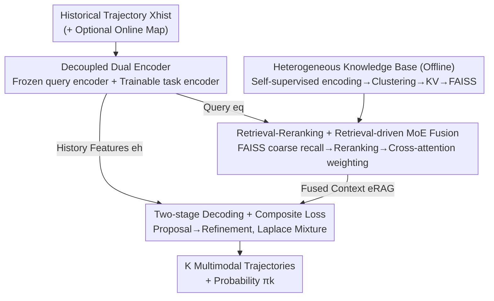

# RAG-TP: A General Framework for Vehicle Trajectory Prediction via Retrieval-Augmented Generation

**Conference**: CVPR 2026  
**Paper**: [CVF Open Access](https://openaccess.thecvf.com/content/CVPR2026/html/Wang_RAG-TP_A_General_Framework_for_Vehicle_Trajectory_Prediction_via_Retrieval-Augmented_CVPR_2026_paper.html)  
**Code**: None  
**Area**: Autonomous Driving / Trajectory Prediction  
**Keywords**: Trajectory Prediction, Retrieval-Augmented Generation, Mixture of Experts, Cross-domain Generalization, Knowledge Base

## TL;DR
This work reformulates vehicle trajectory prediction from "dependency on online perception priors" to a Retrieval-Augmented Generation (RAG) problem that retrieves historical experiences from large-scale offline knowledge bases. By dynamically fusing retrieved priors into the decoder using a retrieval-driven MoE, RAG-TP matches map-based SOTA, outperforms map-free methods on Argoverse/WOMD, and demonstrates significant advantages in zero-shot cross-domain transfer.

## Background & Motivation

**Background**: Conventional vehicle trajectory prediction models encode knowledge statically into parameters. They either rely on High-Definition (HD) maps as strong topological priors or follow map-free approaches to implicitly learn traffic rules from agent interactions. Both categories achieve high accuracy on standard benchmarks.

**Limitations of Prior Work**: "Hard-coding" knowledge into parameters brings two specific issues. First, performance drops sharply in Out-of-Distribution (OOD) scenarios—models tend to memorize training set patterns rather than robust driving principles, leading to failure when switching cities or datasets, which is fatal for safety. Second, map-based methods are limited by HD map maintenance costs and regional differences, while map-free methods struggle to guarantee the plausibility of long-range trajectories in complex scenes due to the lack of explicit geometric constraints.

**Key Challenge**: Regardless of being map-based or map-free, the fundamental bottleneck is the **heavy dependency on online perception inputs**. Prediction capability is strictly bound to online priors (maps, perception) of the current frame, thus locking the generalization ceiling.

**Goal**: Decouple "general reasoning capability" from "scalable external knowledge," allowing the model to compensate for missing priors through retrieval rather than retraining when encountering unseen scenarios.

**Key Insight**: The authors draw inspiration from Retrieval-Augmented Generation (RAG) in NLP. During prediction, the model no longer relies solely on parametric memory but dynamically retrieves similar historical experiences as priors from a structured knowledge base. The difficulty lies in porting this paradigm to a non-linguistic spatio-temporal prediction architecture: (1) how to construct a unified knowledge base from heterogeneous data sources; (2) how to intelligently and dynamically fuse the retrieved priors.

**Core Idea**: Replace "dependence on uncertain online perception" with "retrieval of historical driving experiences from an offline knowledge base." Treat retrieved knowledge units as dynamic experts and fuse them via cross-attention to mitigate model hallucinations, compensate for unreliable priors, and enhance cross-domain robustness.

## Method

### Overall Architecture
RAG-TP models trajectory prediction as a posterior $p(Y|X_{hist}, K)$ conditioned on an external knowledge base $K$. The pipeline is an encoder-retriever-decoder: first, the historical trajectory $X_{hist}$ is encoded as a query to retrieve relevant "driving experiences" from a structured offline knowledge base; then, an MoE module fuses these priors into a dense context; finally, a multimodal decoder outputs $K$ future trajectories with probabilities. Following the RAG paradigm, the posterior is marginalized over the retrieved units $v$: $p(Y|X_{hist}) = \sum_{v \in K} p_\eta(v|X_{hist}) \cdot p_\theta(Y|X_{hist}, v)$, where the former is the retriever and the latter is the generator. Since exact marginalization over the entire KB is infeasible, the authors approximate this by projecting top-N retrieved priors into a shared latent space for feature-level continuous fusion.

The system consists of three phases: offline knowledge base construction, online retrieval and fusion, and probabilistic trajectory decoding. The four key designs (Decoupled Dual Encoder → Heterogeneous KB → Retrieval-Reranking+MoE Fusion → Two-stage Decoding) correspond to these phases.

### Key Designs

**1. RAG Reformulation and Decoupled Dual Encoder: Decoupling Prediction from "Online Priors"**

To address the key challenge of online perception dependency, RAG-TP reformulates prediction as a retrieval task. A critical engineering problem is that the query representation used for retrieval must remain semantically aligned with the offline FAISS index to prevent retrieval drift, while the representation for downstream prediction must be end-to-end trainable. The authors solve this with **Decoupled Dual Encoders**: the query encoder $E_{query}$ (initialized by a pre-trained $E_{hist}$) is **strictly frozen** to encode $X_{hist}$ into a query $e_q$ for similarity retrieval; a separate **trainable** task encoder $E_{task}$ encodes $X_{hist}$ into dense historical features $e_h$ for the decoder. This division of labor ensures stable retrieval semantics while maintaining prediction capacity.

**2. Heterogeneous Knowledge Base Construction: Distilling Diverse Driving Data into Structured KV Pairs**

Map-free methods often struggle with "long-range plausibility" due to the lack of high-quality geometric/behavioral priors. RAG-TP standardizes large-scale data (Argoverse 2, WOMD) into a unified dataset $D_{std}$ and distills it into a KB via three steps (Algorithm 1): (1) **Self-supervised multi-branch autoencoding**—training independent encoder-decoders for history/scene/future modalities to obtain decoupled embeddings $e_h, e_m, e_f$ using a joint reconstruction loss $L_{joint} = \lambda_h L_{hist} + \lambda_m L_{scene} + \lambda_f L_{fut}$. (2) **Behavioral clustering**—applying K-Means to the concatenated $[e_h; e_m]$ to minimize intra-cluster variance $\arg\min_C \sum_j \sum_{[e_h;e_m]\in C_j} \|[e_h;e_m]-\zeta_j\|_2^2$. Each cluster represents a driving mode (e.g., left turn). Representative instances $S$ are sampled near centroids to ensure quality and coverage. (3) **Key-Value construction**—using $e_{h,i}$ as key $k_i$ and $[e_{m,i}; e_{f,i}]$ as value $v_i$, indexed with FAISS for Approximate Nearest Neighbor (ANN) search.

**3. Retrieval-Reranking and Retrieval-driven MoE Fusion: Treating Priors as Dynamic Experts**

Retrieval occurs in two steps: given $e_q$, $N_{cand}$ candidates are recalled via cosine similarity, then a learnable reranking network (MLPs $F_q, F_k$) calculates refined scores $\omega_i = \frac{F_q(e_q) F_k(k_i)^T}{\|F_q(e_q)\|_2 \|F_k(k_i)\|_2}$ to select top-N units. For fusion, a **Retrieval-driven MoE** is used: unlike traditional MoE with static branches, each retrieved unit is an "expert." A shared projection $\phi_{expert}$ maps priors to a unified space, and a cross-attention gating mechanism using $e_q$ calculates routing weights $\alpha = \text{Softmax}\!\left(\frac{(e_q W_Q)(K_{retrieved} W_K)^T}{\sqrt{d_k}}\right)$ to produce $e_{RAG} = \sum_{i=1}^N \alpha_i \cdot \phi_{expert}(v_i)$. Notably, the authors **intentionally omit the load balancing loss**. Since retrieved experts are naturally ordered by relevance, forcing a uniform distribution would destroy the semantic hierarchy.

**4. Two-stage Decoding and Composite Laplace Loss: Isolating RAG Gains**

To attribute gains solely to the RAG module, the authors employ a standard Proposal-Refinement architecture: the proposal decoder $D_{propose}$ generates initial trajectories using $e_h$, and the refinement decoder $D_{refine}$ adjusts them using the rich context $e_{RAG}$. The $K$ modes are parameterized as a **Laplace Mixture Model** using $L_{total} = \lambda_{prop} L_{prop} + \lambda_{ref} L_{ref} + L_{cls}$. Regression uses a winner-takes-all approach on the best mode $k^*$ with Laplace negative log-likelihood, while $L_{cls}$ optimizes mode probabilities $\pi_k$ via cross-entropy.

### Loss & Training
The offline phase uses $L_{joint}$ to pre-train the autoencoders for KB construction. The online phase uses $L_{total}$ to end-to-end train the task encoder, reranking network, MoE gating, and decoders, while the query encoder remains frozen.

## Key Experimental Results

### Main Results
Metrics include $minADE_6$, $minFDE_6$, and $MR_6$ (averaged over 3 runs). Map-based tests use AV2 (5s→6s), and map-free tests use AV1 (2s→3s).

| Setting | Model | minADE6↓ | minFDE6↓ | MR6↓ |
|------|------|----------|----------|------|
| Map-based (AV2) | QCNet | 0.67 | 1.27 | 0.16 |
| Map-based (AV2) | DeMo++ | 0.62 | 1.16 | 0.13 |
| Map-based (AV2) | MTR | 0.82 | 1.55 | 0.22 |
| Map-based (AV2) | MTR + RAG | 0.76 | 1.39 | 0.18 |
| Map-based (AV2) | Forecast-MAE | 0.80 | 1.40 | 0.17 |
| Map-based (AV2) | Forecast-MAE + RAG | 0.73 | 1.28 | 0.15 |
| Map-based (AV2) | **RAG-TP (Ours)** | **0.60** | **1.14** | **0.13** |
| Map-free (AV1) | STAM-P | 0.82 | 1.30 | 0.15 |
| Map-free (AV1) | MLB-Traj | 0.77 | 1.25 | 0.14 |
| Map-free (AV1) | **RAG-TP (Ours)** | **0.72** | 1.31 | **0.13** |

RAG-TP leads in the map-based setting. Integrating the RAG module into MTR and Forecast-MAE yields consistent improvements, proving its versatility. ใน map-free settings, it outperforms specialized models in $minADE_6$ and $MR_6$.

### Ablation Study
Ablation on AV2 validation set (M1: Baseline → M5: Full Model):

| Config | Retrieval | Map in RAG | Clustering | MoE | minADE6↓ | minFDE6↓ | MR6↓ |
|------|-----------|-----------|-----------|-----|----------|----------|------|
| M1 Baseline | × | × | × | × | 0.81 | 1.51 | 0.21 |
| M2 w/o Map Info | ✓ | × | ✓ | ✓ | 0.73 | 1.34 | 0.18 |
| M3 w/o Clustering | ✓ | ✓ | × | ✓ | 0.68 | 1.27 | 0.16 |
| M4 w/o MoE Fusion | ✓ | ✓ | ✓ | × | 0.65 | 1.21 | 0.15 |
| M5 Full Model | ✓ | ✓ | ✓ | ✓ | **0.60** | **1.14** | **0.13** |

### Key Findings
- **Retrieval is the primary contributor**: Introducing retrieval alone (M2) significantly drops $minADE_6$ from 0.81 to 0.73.
- **Clustering is essential**: Using random sampling (M3) instead of clustering degrades performance, proving that structured KBs are vital.
- **Zero-shot Cross-domain is the highlight**: In AV2 ↔ WOMD cross-domain protocols, baseline models drop significantly in OOD domains. RAG-TP achieves superior target-domain performance simply by swapping the retrieval KB, enabling adaptation without retraining.

## Highlights & Insights
- **Clean Adaptation of RAG to Spatio-temporal Prediction**: The core contribution is not just "adding retrieval" but designing unified KB construction and retrieval-driven MoE fusion.
- **Counter-intuitive Insight on Load Balancing**: Omitting the load balancing loss in MoE is a strategic decision; since experts are pre-ranked by relevance, enforcing uniformity would be counterproductive.
- **Decoupled Reasoning and Knowledge**: The RAG module acts as a plug-and-play enhancer for existing architectures like MTR.
- **Frozen Query Encoder for Stability**: Using a frozen encoder to align with offline indices while using a trainable encoder for prediction capacity is a robust trick to prevent representation drift.

## Limitations & Future Work
- **Map-free $minFDE_6$ Gap**: The endpoint error still lags behind MLB-Traj, suggesting that purely retrieval-based geometric priors need further refinement for long-range accuracy.
- **Knowledge Base Dependency**: The KB quality affects performance; rare scenarios must be covered during clustering, and the engineering of KB updates requires care.
- **Decoder Innovation**: Since the decoder was kept standard to isolate RAG gains, combining RAG-TP with more advanced decoders remains to be explored.

## Related Work & Insights
- **vs Map-based (QCNet / MTR)**: These rely on online HD maps; RAG-TP encodes this knowledge into offline KBs and compensates via retrieval, showing superior generalization.
- **vs Map-free (STAM-P / MLB-Traj)**: RAG-TP provides the explicit geometric constraints these methods lack through historical experience retrieval.
- **vs Driving-RAG**: While both use RAG, RAG-TP is a dedicated framework for non-linguistic spatio-temporal architectures, specifically addressing cross-domain generalization.

## Rating
- Novelty: ⭐⭐⭐⭐⭐ 
- Experimental Thoroughness: ⭐⭐⭐⭐☆ 
- Writing Quality: ⭐⭐⭐⭐☆ 
- Value: ⭐⭐⭐⭐⭐ 

<!-- RELATED:START -->

## Related Papers

- [\[CVPR 2026\] Den-TP: A Density-Balanced Data Curation and Evaluation Framework for Trajectory Prediction](den_tp_a_density_balanced_data_curation_and_evaluation_framework_for_trajectory.md)
- [\[AAAI 2026\] RAST: A Retrieval Augmented Spatio-Temporal Framework for Traffic Prediction](../../AAAI2026/autonomous_driving/rast_a_retrieval_augmented_spatio-temporal_framework_for_traffic_prediction.md)
- [\[ECCV 2024\] UniTraj: A Unified Framework for Scalable Vehicle Trajectory Prediction](../../ECCV2024/autonomous_driving/unitraj_a_unified_framework_for_scalable_vehicle_trajectory_prediction.md)
- [\[CVPR 2026\] W2W: Language-Model-Based Trajectory Prediction with Reinforcement Learning](w2w_language-model-based_trajectory_prediction_with_reinforcement_learning.md)
- [\[CVPR 2026\] A Prediction-as-Perception Framework for 3D Object Detection](a_prediction-as-perception_framework_for_3d_object_detection.md)

<!-- RELATED:END -->
