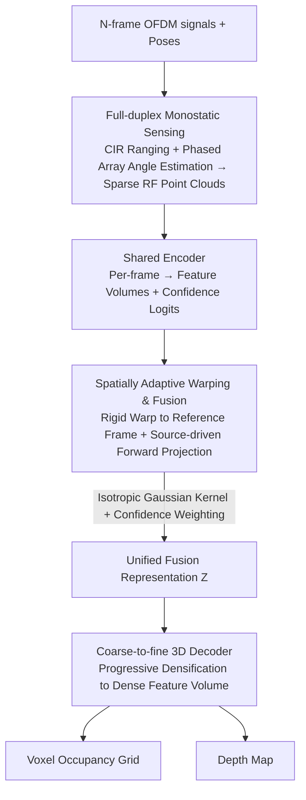

# Rascene: High-Fidelity 3D Scene Imaging with mmWave Communication Signals

**Conference**: CVPR 2026  
**arXiv**: [2604.02603](https://arxiv.org/abs/2604.02603)  
**Code**: None  
**Area**: Autonomous Driving / 3D Perception / Integrated Sensing and Communication (ISAC)  
**Keywords**: mmWave Communication, 3D Scene Imaging, OFDM Signals, Multi-frame Fusion, ISAC

## TL;DR

Rascene is proposed as an Integrated Sensing and Communication (ISAC) framework that utilizes mmWave OFDM communication signals (e.g., 5G/Wi-Fi) for high-fidelity 3D scene imaging. It achieves geometrically consistent recovery from sparse, multipath-interfered RF observations through confidence-weighted multi-frame fusion.

## Background & Motivation

3D environmental perception is critical for autonomous driving and robot navigation. Existing mainstream solutions have significant limitations:
- **Cameras**: Strictly constrained by lighting conditions; fail in harsh environments such as smoke or fog.
- **LiDAR**: Expensive, bulky, and power-hungry; also affected by adverse weather.
- **Specialized Radar**: While capable of penetrating obstacles, it requires ultra-wideband hardware (multiple GHz bandwidth) and dedicated spectrum licensing, leading to high costs and poor scalability.

**Key Insight**: mmWave communication devices (e.g., 5G and Wi-Fi) are widely deployed, and their OFDM waveforms inherently contain range and angle information. Multiplexing these existing communication signals for sensing enables low-cost, scalable 3D perception without additional dedicated hardware or spectrum.

**Key Finding**: Commercial mmWave devices can perform monostatic sensing in full-duplex mode. Due to the high directivity of phased array antennas and short carrier wavelengths, sufficient RF isolation exists between the transmit and receive paths.

## Method

### Overall Architecture

Rascene aims to reconstruct high-fidelity 3D scenes by multiplexing ubiquitous mmWave communication devices without specialized radar. The pipeline consists of two stages: first, extracting CIR and angular information from OFDM waveforms using the full-duplex monostatic capability to transform each RF observation into a sparse 3D RF point cloud; second, employing a multi-frame imaging network to perform confidence-weighted forward projection fusion on $N$ frames of point clouds $\mathcal{S} = \{\mathbf{S}_i\}_{i=1}^N$ with known poses $\mathcal{G} = \{\mathbf{G}_i\}_{i=1}^N$. The network learns a mapping $\mathcal{F}$ to output a dense voxel grid $\hat{\mathbf{V}}_r$ and depth map $\hat{\mathbf{D}}_r$. Internally, a shared encoder encodes each point cloud into feature volumes and confidence scores, followed by warping fusion and a coarse-to-fine decoder for densification.

### Key Designs

**1. Full-duplex Monostatic Sensing: Ranging using a single communication device**

Specialized radars require ultra-wideband hardware and dedicated spectrum. Rascene enables commercial mmWave devices to sense by simultaneously transmitting and receiving OFDM signals. High directivity and short wavelengths provide RF isolation, while co-located antennas ensure clock synchronization. The CIR is used to measure distance: $r = nc/(2B)$. Combined with phased array angle estimation (beamforming weights $w_{i,j}(\theta,\phi)$), RF data is converted into 3D point clouds $\mathbf{S}$ in spherical coordinates.

**2. Spatially Adaptive Warping & Fusion: Dense geometry from sparse multi-frame RF via source-driven projection**

Single-frame RF observations are sparse and subject to multipath interference. Traditional target-voxel "querying" methods waste computation on empty regions. Rascene utilizes source-driven forward projection: each source voxel is mapped to the reference frame via rigid transformation, and contributions are distributed using an isotropic Gaussian kernel $K_\sigma$ within a local support region. Fusion weights combine geometric proximity and learned confidence (mapped via softplus and raised to power $\eta$ to control sharpness). The unified representation $\mathbf{Z}_r$ is obtained through normalized weighted averaging. This preserves sparse but information-rich RF responses, while higher $\eta$ values prioritize high-confidence geometric signals and suppress multipath artifacts.

**3. Coarse-to-fine 3D Decoder: Progressive densification of sparse representations**

Both encoder and decoder utilize 4-layer convolutions (channel multipliers 1, 2, 4, 8). Stage-level warping and fusion are inserted after each encoder stage to ensure multi-scale fusion. The decoder progressively densifies sparse fusion representations into dense feature volumes, followed by two heads for voxel occupancy and depth prediction.

### Loss & Training

The total loss is a weighted sum of voxel and depth losses, accumulated by treating each frame in the window as a reference frame:

$$\mathcal{L} = \sum_{r=1}^N (\lambda_v \mathcal{L}_{\text{voxel}}^{(r)} + \lambda_d \mathcal{L}_{\text{depth}}^{(r)})$$

Voxel loss $\mathcal{L}_{\text{voxel}}$ uses binary cross-entropy (BCE), and depth loss $\mathcal{L}_{\text{depth}}$ uses L1 loss against ground truth. Hardware prototype: 60 GHz band, 1.2288 GHz bandwidth, 16 Tx + 16 Rx antennas, 7m sensing range, 120°×60° FoV, 64×64×32 voxel grid (12 cm resolution).

## Key Experimental Results

### Main Results

Dataset: 20 indoor environments (12 training / 8 testing for cross-scene evaluation).

| Method | Frames | AbsRel | MAE (cm) | CD (cm) | CD_Diag (%) |
| :--- | :--- | :--- | :--- | :--- | :--- |
| PanoRadar | 1 | 14.7% | 34.1 | 32.2 | 3.8% |
| CartoRadar | 5 | — | — | 26.8 | 3.1% |
| **Ours** | 1 | 14.1% | 32.9 | 31.6 | 3.6% |
| **Ours** | 5 | **9.4%** | **20.2** | **19.7** | **2.3%** |

Cross-scene generalization average: AbsRel 9.4%, MAE 20.2cm, RMSE 38.0cm, CD 19.7cm, CD_Diag 2.3%.

### Ablation Study

| Fusion Frames | AbsRel | MAE (cm) | CD (cm) | CD_Diag (%) |
| :--- | :--- | :--- | :--- | :--- |
| 1 | 14.1% | 32.9 | 31.6 | 3.6% |
| 2 | 11.1% | 24.6 | 26.0 | 3.0% |
| 3 | 9.8% | 21.8 | 21.9 | 2.5% |
| 5 | 9.4% | 20.2 | 19.7 | 2.3% |

Pose robustness: Highly stable against translation (15cm perturbation had negligible impact); more sensitive to rotation (10° error increased CD_Diag from 2.3% to 3.6%).

### Key Findings

- Improvement from 1 to 2 frames is most significant, indicating strong geometric constraints from even one additional viewpoint.
- Median absolute depth error is only 6.1cm; 90% of pixel errors are below 37.6cm.
- Multi-frame fusion effectively suppresses hallucinated structures and fills in missed detection regions.
- Rascene recovers coherent geometry in areas where LiDAR fails due to absorption or specular reflection (e.g., dark carpets, glass).

## Highlights & Insights

- **Novelty**: First to demonstrate high-fidelity 3D imaging using OFDM communication signals without specialized sensing hardware or spectrum.
- **Key Insight**: Source-driven fusion outperforms target-driven fusion by avoiding redundant sampling of empty space and better preserving sparse RF responses.
- **Value**: RF sensing is naturally robust to optical failure modes (low albedo absorption, specular reflection), providing complementarity to LiDAR.
- **Mechanism**: The confidence sharpness parameter $\eta$ allows the fusion process to be dominated by high-confidence geometric signals.

## Limitations & Future Work

- Sensing range is limited to 7m, suitable for indoor environments; outdoor wide-area scenarios require verification.
- Relies on known 6-DoF pose information (currently using external IMU).
- Angular resolution is constrained by the antenna array size (currently 16×16).
- Generalization in real-world outdoor autonomous driving scenarios is unknown.
- Extreme multipath scenarios (e.g., highly complex occlusions) remain challenging despite fusion-based suppression.

## Related Work & Insights

- **Comparison to Prior Work**: Unlike PanoRadar or CartoRadar which rely on specialized FMCW radar hardware, Rascene multiplexes communication devices.
- **Comparison to Vision-based Methods**: Vision-based methods (NeRF/MVS) depend on texture-rich RGB images, whereas RF observations are neither texture-rich nor geometrically explicit.
- **ISAC Trends**: Integrated Sensing and Communication is a 6G hotspot; Rascene provides a concrete paradigm for 3D imaging.
- **Inspiration**: The forward projection + confidence-weighted fusion strategy is applicable to other sparse multi-view reconstruction tasks.

## Rating

- **Novelty**: ⭐⭐⭐⭐⭐ — First to use mmWave communication signals for high-fidelity 3D imaging with a complete monostatic fusion system.
- **Experimental Thoroughness**: ⭐⭐⭐⭐ — Comprehensive cross-scene evaluation in 20 indoor environments, though lacking outdoor large-scale verification.
- **Writing Quality**: ⭐⭐⭐⭐ — Clear structure with professional articulation of physical principles and system design.
- **Value**: ⭐⭐⭐⭐⭐ — Opens a new path for low-cost, scalable 3D perception with significant implications for ISAC and autonomous driving.

<!-- RELATED:START -->

## Related Papers

- [\[NeurIPS 2025\] X-Scene: Large-Scale Driving Scene Generation with High Fidelity and Flexible Controllability](../../NeurIPS2025/autonomous_driving/x-scene_large-scale_driving_scene_generation_with_high_fidelity_and_flexible_con.md)
- [\[CVPR 2026\] HG-Lane: High-Fidelity Generation of Lane Scenes under Adverse Weather and Lighting Conditions without Re-annotation](hg-lane_high-fidelity_generation_of_lane_scenes_under_adverse_weather_and_lighti.md)
- [\[CVPR 2026\] CoLC: Communication-Efficient Collaborative Perception with LiDAR Completion](colc_communication-efficient_collaborative_perception_with_lidar_completion.md)
- [\[CVPR 2026\] R4Det: 4D Radar-Camera Fusion for High-Performance 3D Object Detection](r4det_4d_radar-camera_fusion_for_high-performance_3d_object_detection.md)
- [\[ICCV 2025\] Free-running vs. Synchronous: Single-Photon Lidar for High-flux 3D Imaging](../../ICCV2025/autonomous_driving/free-running_vs_synchronous_single-photon_lidar_for_high-flux_3d_imaging.md)

<!-- RELATED:END -->
