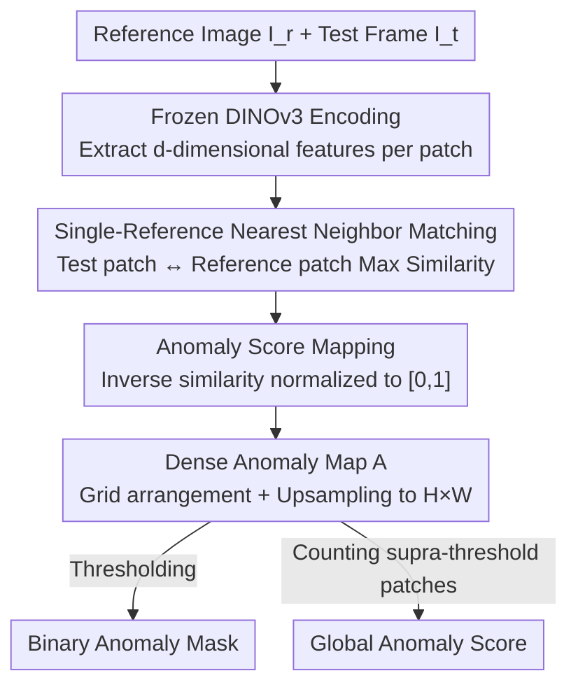

# Real-World On-Vehicle Evaluation of Embedding-Based Anomaly Detection

**Conference**: CVPR2026  
**arXiv**: [2605.19744](https://arxiv.org/abs/2605.19744)  
**Code**: None  
**Area**: Autonomous Driving  
**Keywords**: Anomaly Detection, Autonomous Driving, DINOv3, Single Reference Image, Real-world Deployment

## TL;DR
This paper proposes a **training-free, single-reference-image** semantic anomaly detection method. It utilizes a frozen DINOv3 to extract patch-level features and performs nearest-neighbor cosine similarity matching between test patches and a single "normal scene" reference image. Low-similarity regions are classified as anomalies. This work marks the **first time such embedding-based anomaly detection has been deployed on a real autonomous vehicle** (12.5 Hz real-time), achieving 70.83% AP on the Road Anomaly dataset.

## Background & Motivation

**Background**: Semantic anomaly detection in autonomous driving primarily focuses on identifying unexpected objects outside the training distribution (e.g., animals, lost cargo, strange obstacles). Current methods generally fall into two categories: **supervised + anomaly exposure**, which involves explicit training on curated OOD samples to learn anomaly boundaries (scoring highest on leaderboards like Fishyscapes and SegmentMeIfYouCan); and **unsupervised/training-free**, which models only the normal driving distribution and detects deviations via density estimation, reconstruction residuals, or foundation model feature similarity.

**Limitations of Prior Work**: Leaderboard-topping methods are mostly highly specialized and engineered supervised approaches. Their definition of "normal" is strictly tied to specific semantic categories (e.g., Cityscapes), making them difficult to transfer to diverse real-world scenes. Furthermore, these methods are almost exclusively evaluated on benchmarks or in simulation, **failing to address the challenges of real-vehicle deployment**, such as sensor noise, environmental variability, and real-time constraints. Even work closely related to this paper, like Ronecker et al., was only validated in CARLA simulation.

**Key Challenge**: There exists a tension between leaderboard performance and "deployability." Chasing high scores often increases reliance on large-scale anomaly sample collection and specialized training. However, in real robotic/on-vehicle scenarios, anomalies are rare, diverse, and unpredictable, making it nearly impossible to assemble a representative labeled dataset.

**Goal**: To develop a **simple, robust, adaptable, and easily deployable** anomaly detection method that requires no additional training or large-scale data collection and can run in real-time on an actual vehicle.

**Key Insight**: The authors argue that the "feature space of foundation models is already sufficient." If patch features from pre-trained ViTs like DINOv3 encode semantics effectively, then "normality" can perhaps be characterized by **a single reference image**. Anomalies then become regions furthest from the reference in this feature space. This simplifies the problem from "learning an anomaly classifier" to "performing nearest-neighbor comparison in a frozen feature space."

**Core Idea**: Replace specialized anomaly detectors with **nearest-neighbor similarity between a single reference image and DINOv3 patch features**, and validate the efficacy of this minimalist scheme under real conditions through on-vehicle deployment.

## Method

### Overall Architecture
The method solves the problem: "Given a frame of driving footage, label which regions are semantic anomalies pixel-wise." The pipeline is extremely lightweight: take a **reference image $I_r$** representing normal road conditions and the current **test frame $I_t$**, pass both through the same frozen DINOv3 encoder $f(\cdot)$ to obtain patch-level feature vectors. For each patch in the test frame, the method finds its "most similar" counterpart across all patches in the reference image. The degree of similarity (maximum cosine similarity) represents its "normality" score, the inverse of which is the anomaly score. These scores are arranged in a spatial grid and upsampled to the original resolution to produce a dense anomaly map $A$. This map can either be thresholded for a binary segmentation mask or processed by counting patches exceeding the threshold to yield a global anomaly score. The entire process involves **no training, no gradients, and a frozen backbone**, allowing the reference image to be swapped online at any time.

### Key Designs

**1. Modeling Normality via Single Reference Image: Compressing "Normal" into One Frame**

Prior methods often rely on large OOD samples (supervised) or a memory bank of multiple normal images (unsupervised), which are heavy for deployment. This work pushes the boundary by **using only one reference image $I_r$ to define the normal scene**. The encoder partitions each image into non-overlapping patches, mapping them to $d$-dimensional features to form reference set $F_r=\{\mathbf{z}_i^r\}_{i=1}^{N_r}$ and test set $F_t=\{\mathbf{z}_j^t\}_{j=1}^{N_t}$. The advantage is minimal deployment overhead and "on-the-fly" reference swapping, though a change in reference might trigger false positives for visual elements that are different but still normal. This represents a deliberate trade-off of "minimalism vs. robustness" to **test the upper performance limit of a single-reference, training-free setup**.

**2. Anomaly Scoring via Nearest Neighbor Similarity: Finding the Best Match**

The core assumption is that "a test patch is normal if it is similar to **at least one** reference patch." All features are first normalized by the Euclidean norm, denoted as $\tilde{\mathbf{z}}$. The normality of patch $j$ is defined as the maximum similarity with all reference patches:

$$s_j = \max_i s_{ij}$$

This is precisely nearest-neighbor matching in feature space. The anomaly score is derived by inverting the similarity; as cosine similarity falls within $[-1, 1]$, it is mapped to a $[0, 1]$ interval $a_j$. A lower $a_j$ indicates high similarity to the reference (normal), while a higher value indicates deviation. The "max" operation is crucial—it allows normal objects to appear in different spatial locations than in the reference image (provided the semantic patch exists in the reference), offering robustness to spatial layout changes rather than performing a rigid pixel-to-pixel comparison.

**3. Dense Anomaly Map + Dual Output: Pixel Localization and Global Scoring**

Patch-level anomaly scores $\{a_j\}$ are arranged according to the ViT spatial grid and upsampled to the original resolution, resulting in a dense anomaly map $A \in \mathbb{R}^{H \times W}$. This enables **pixel-level anomaly localization** rather than just image-level labeling. On this map: thresholding produces a binary segmentation mask; counting patches exceeding the threshold yields a scalar global anomaly score, reflecting the overall severity or spatial extent of deviation. This dual-output design supports both pixel-level monitoring and frame-level alerts within the same mechanism. Since the method does not assume only one anomaly per frame, multiple anomalous objects are highlighted individually.

### Loss & Training
**Training-free, No Loss Function**. The DINOv3 backbone remains frozen in inference mode with no gradient computation. There are no learnable parameters. The only "configurations" required are the reference image, input resolution (to ensure consistent patch grids), and the segmentation threshold.

## Key Experimental Results

### Main Results
Evaluated on three standard anomaly benchmarks using the single-reference, training-free setup. Metrics: AP (Higher is better), FPR95 (Lower is better), AUROC (Higher is better). The authors note that, to their knowledge, **no prior training-free methods have been evaluated on these benchmarks for comparison**, so the table only lists their own performance.

| Dataset | AP (%) ↑ | FPR95 (%) ↓ | AUROC (%) ↑ |
|:---|:---:|:---:|:---:|
| Fishyscapes L&F | 26.43 | 92.76 | 61.95 |
| Fishyscapes Static | 41.15 | 81.70 | 74.62 |
| Road Anomaly | 70.81 | 39.82 | 92.83 |

Performance is highest on **Road Anomaly** (AP 70.83%, AUROC 92.83%) because its anomalies are typically large, salient foreground objects that fit the "semantic deviation" criterion. Conversely, the high FPR95 (92.76%) on Fishyscapes L&F suggests the single-reference setup prone to misidentifying complex backgrounds as anomalies.

### On-vehicle Evaluation (Core Contribution)
This section is the highlight: the **first real-time, real-vehicle evaluation of embedding-based anomaly detection**:

| Item | Configuration / Result |
|:---|:---|
| Platform | CoCar NextGen Research Vehicle (Audi A6, licensed for German roads) |
| Integration | ROS2 node, subscribed to front camera topics, online inference |
| Backbone | Pre-trained DINOv3, reference image loaded at init (hot-swappable) |
| Output | PCA embedding visualization + anomaly heatmap + binary mask |
| Real-time Performance | **12.5 Hz**, input 960×592 px, NVIDIA RTX A6000 |
| Test Scenarios | Urban + rural sequences; manual placement of toys, tires, inflatables; pedestrians intentionally excluded from "normal" set to act as anomalies |

### Key Findings
- **Nearest-Neighbor + Single Reference works for salient foreground anomalies**: In scenarios like Road Anomaly, the method approaches practical utility (AP 70.83%). However, it suffers from false positives in small-target/cluttered background scenarios (Fishyscapes L&F).
- **Isolation of Multiple Anomalies**: The method does not assume a single anomaly per frame; multiple anomalous objects in complex scenes are highlighted separately.
- **Compact Response in Simple Scenes**: For a single dominant anomaly, the map focuses tightly on the unexpected foreground structure, showing clear semantic separation.

## Ablation Study
As a **deployment-oriented study of a minimalist method**, the pipeline consists only of "frozen encoding → single-reference nearest neighbor → thresholding." There are no modular components to remove; hence, **no standard ablation table is provided**. Instead, the authors use comparative discussion: they explicitly state that adding **multiple reference images** would improve benchmark scores, but this would deviate from the goal of "evaluating the limits of a single-reference setup." The high FPR95 on Fishyscapes L&F is attributed to the limited coverage of a single reference for small targets/complex backgrounds.

## Highlights & Insights
- **Reducing Anomaly Detection to Nearest Neighbor**: The core insight is that foundation model features are already excellent, meaning normality doesn't need to be learned; it just needs a reference. This enables zero-training, zero-labeling, and hot-swappable references—a classic approach to minimizing engineering complexity.
- **"Real-time on Real Vehicle" is a Contribution**: While many papers stop at benchmarks, this work implements a ROS2 node on a road-legal vehicle at 12.5 Hz, proving the feasibility of embedding detection under real sensor noise and compute constraints.
- **"Max" Similarity Trick**: Using the "similar to any reference patch" logic allows for spatial displacement of normal objects, which is critical for robustness in single-reference settings.
- **Honest Reporting of Negative Results**: The authors do not hide the high FPR95 on Fishyscapes L&F, attributing it to the inherent limitations of single-reference coverage, which strengthens the definition of the method's boundaries.

## Limitations & Future Work
- **Fundamental Limitations of Single Reference**: Changes in the reference image can lead to false positives for normal elements; the poor performance on small objects/complex backgrounds is a direct result of this.
- **Weak Quantitative Evaluation**: The on-vehicle section lacks quantitative metrics, relying instead on qualitative results (images/short sequences). Benchmarks also lack horizontal comparison with similar training-free methods.
- **Lack of Temporal Consistency**: Frames are processed independently. The anomaly map can become fragmented in complex scenes; authors identify temporal consistency as future work.
- **Pedestrians as Anomalies**: Treating pedestrians as anomalies is an artificial setup for testing semantic deviation, which differs from real deployments where pedestrians are normal agents.

## Related Work & Insights
- **vs. AnomalyDINO (Damm et al. 2025)**: Also uses DINO features + patch nearest neighbor, but AnomalyDINO builds a memory bank from one or more reference images (with augmentations/masks) and only evaluates on industrial defect benchmarks. This work strips it to a single reference and performs real-vehicle testing.
- **vs. SubspaceAD (Lendering et al. 2026)**: Uses augmented reference images to build a low-dimensional PCA subspace; this work uses direct feature matching, which is lighter and verified on-vehicle.
- **vs. Ronecker et al. (2025)**: Uses DINOv2 and nearest neighbor but relies on an embedding database of multiple driving scenes and **only validates in CARLA simulation**. The differentiator here is the "Single Reference + Real Vehicle" focus.

## Rating
- **Novelty**: ⭐⭐⭐ The algorithm is a simplification of existing DINO-based nearest-neighbor schemes; the primary innovation lies in the "first real-vehicle real-time evaluation" positioning.
- **Experimental Thoroughness**: ⭐⭐⭐ Only three benchmarks with no direct comparisons; the on-vehicle results are qualitative and lack quantitative metrics.
- **Writing Quality**: ⭐⭐⭐⭐ Clear motivation, honest about limitations, and concise method description.
- **Value**: ⭐⭐⭐⭐ Demonstrating that embedding-based anomaly detection can actually run on a real vehicle with real-time performance is highly valuable for autonomous driving safety research.

## Related Papers

- [\[CVPR 2026\] V2U4Real: A Real-world Large-scale Dataset for Vehicle-to-UAV Cooperative Perception](v2u4real_a_real-world_large-scale_dataset_for_vehicle-to-uav_cooperative_percept.md)
- [\[CVPR 2026\] WorldLens: Full-Spectrum Evaluations of Driving World Models in Real World](worldlens_full-spectrum_evaluations_of_driving_world_models_in_real_world.md)
- [\[CVPR 2026\] SimScale: Learning to Drive via Real-World Simulation at Scale](simscale_learning_to_drive_via_real-world_simulation_at_scale.md)
- [\[CVPR 2026\] Unposed-to-3D: Learning Simulation-Ready Vehicles from Real-World Images](unposed-to-3d_learning_simulation-ready_vehicles_from_real-world_images.md)
- [\[AAAI 2026\] Unlocking Efficient Vehicle Dynamics Modeling via Analytic World Models](../../AAAI2026/autonomous_driving/unlocking_efficient_vehicle_dynamics_modeling_via_analytic_world_models.md)

<!-- RELATED:END -->

<!-- RELATED:START -->

## Related Papers

- [\[CVPR 2026\] WorldLens: Full-Spectrum Evaluations of Driving World Models in Real World](worldlens_full-spectrum_evaluations_of_driving_world_models_in_real_world.md)
- [\[CVPR 2026\] V2U4Real: A Real-world Large-scale Dataset for Vehicle-to-UAV Cooperative Perception](v2u4real_a_real-world_large-scale_dataset_for_vehicle-to-uav_cooperative_percept.md)
- [\[CVPR 2026\] SimScale: Learning to Drive via Real-World Simulation at Scale](simscale_learning_to_drive_via_real-world_simulation_at_scale.md)
- [\[CVPR 2026\] Unposed-to-3D: Learning Simulation-Ready Vehicles from Real-World Images](unposed-to-3d_learning_simulation-ready_vehicles_from_real-world_images.md)
- [\[CVPR 2026\] Learning to Identify Out-of-Distribution Objects for 3D LiDAR Anomaly Segmentation](learning_to_identify_out-of-distribution_objects_for_3d_lidar_anomaly_segmentati.md)

<!-- RELATED:END -->
