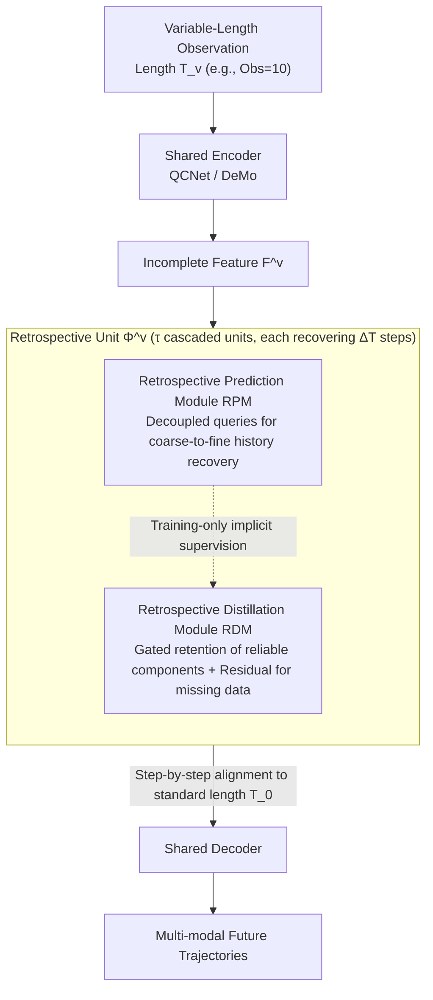

# Recover to Predict: Progressive Retrospective Learning for Variable-Length Trajectory Prediction

**Conference**: CVPR2026  
**arXiv**: [2603.10597](https://arxiv.org/abs/2603.10597)  
**Code**: [zhouhao94/PRF](https://github.com/zhouhao94/PRF)  
**Area**: Autonomous Driving  
**Keywords**: Trajectory Prediction, Variable-Length Observation, Progressive Retrospective, Knowledge Distillation, Autonomous Driving

## TL;DR

Ours proposes PRF, a progressive retrospective framework that gradually aligns features of incomplete observations to complete ones through cascaded retrospective units. It significantly improves variable-length trajectory prediction performance and is plug-and-play compatible with existing methods.

## Background & Motivation

1.  **Trajectory prediction is a core task for autonomous driving**: Accurately predicting the future motion of dynamic traffic participants is crucial for safety planning and collision avoidance.
2.  **Existing methods rely on fixed-length observations**: The vast majority of methods are optimized for standard input lengths (e.g., 50 steps/20 steps) and are highly sensitive to variations in observation length.
3.  **Incomplete observations are prevalent in real-world scenarios**: Scenarios such as vehicles newly entering the perception range, being re-detected after occlusion, or tracking loss result in variable-length/incomplete trajectories.
4.  **Performance drops sharply as observations shorten**: The SOTA method DeMo sees its mADE6 deteriorate from 0.658 to 0.861 under 10-step observations (Argoverse 2), a significant degradation.
5.  **"One-step mapping" strategy struggles with short trajectories**: Existing methods (DTO, FLN, LaKD, CLLS) directly map incomplete features to complete ones, which performs poorly when the information gap is large.
6.  **Independent training (IT) is costly with low returns**: Training separate models for each length yields minor improvements but incurs massive computational and storage overhead.

## Method

### Overall Architecture

PRF addresses a practical pain point: existing trajectory predictors are trained on fixed-length observations. Once a vehicle just enters the perception range, is re-detected, or tracking is lost, performance collapses (DeMo's mADE6 worsens from 0.658 to 0.861 at Obs=10). Previous methods often used "one-step mapping" to force short features into long ones, which fails when the information gap is too large. PRF adopts a different approach: inserting $\tau$ cascaded retrospective units between the encoder and decoder. Each unit $\Phi^v$ only recovers feature length $T_v$ by $\Delta T$ steps to align with $T_{v-1}$. During inference, an input of length $T_v$ passes through $\Phi^v, \Phi^{v-1}, \dots, \Phi^1$ sequentially to recover the standard length $T_0$ before being fed into a shared decoder. Each unit consists of two modules: the Retrospective Distillation Module (RDM) handles feature alignment (used during inference), and the Retrospective Prediction Module (RPM) provides implicit supervision during training (disabled during inference). All variable-length observations share the same encoder and decoder, making PRF plug-and-play for methods like QCNet and DeMo.

### Key Designs

**1. Retrospective Distillation Module (RDM): Recovering missing steps via residual distillation without destroying reliable components**

The shared encoder generates conflicting features for the same trajectory at different lengths. Direct alignment risks biasing correctly encoded parts. RDM thus models missing timesteps as learnable residuals rather than overwriting the whole feature. It first fuses agent features with HD Map features $\mathbf{F}_m$ via cross-attention to inject scene context, then splits into two branches: the Logit branch (self-attention → MLP → Sigmoid) produces an element-wise gating vector $\mathbf{g}^v$, and the Residual branch (self-attention → MLP → ReLU) learns the residual feature $\mathbf{F}_r^v$.

These are fused via $\tilde{\mathbf{F}}^{v-1} = \mathbf{g}^v \odot \mathbf{F}^v + \mathbf{F}_r^v$. The gate preserves reliable components in the input, while the residual only fills in missing information. Each retrospective step is an "incremental addition" rather than a "complete rewrite."

**2. Retrospective Prediction Module (RPM): "Predicting" back missing history via decoupled queries in a coarse-to-fine manner**

Aligning features is insufficient; the missing $\Delta T$ historical timesteps must be physically recovered. RPM uses two sets of decoupled queries for coarse-to-fine estimation: $K$ Anchor-Free Mode Queries (MLP initialization → cross-attention for scene features → self-attention for modality interaction) predict coarse multi-modal trajectory proposals; then $\Delta T$ Anchor-Based State Queries (MLP initialization → cross-attention + Mamba for temporal dynamics) use the coarse proposals as anchors for refinement. Since the retrospective step $\Delta T$ is fixed, all units share the same RPM, enabling training acceleration via batch processing.

Crucially, RPM is only used during training—it provides implicit supervision for RDM and is disabled during inference, adding zero inference overhead.

### A Full Example

Take a short observation of Obs=10 on Argoverse 2: It first enters the corresponding retrospective unit $\Phi$. The RDM aligns it while the RPM implicitly supervises the recovery of $\Delta T$ steps of history, resulting in a feature equivalent to Obs=20. This feature then passes through the next unit to become Obs=30, and so on. Each hop only bridges a small $\Delta T$ interval until the standard length Obs=50 is reached and sent to the shared decoder. Because each hop has a lower learning difficulty, inputs with large information gaps like 10 steps can be recovered step-by-step—at the cost of passing through all $\tau$ units, making the inference time approximately 1.9x the standard length (0.268s vs 0.140s).

### Loss & Training

A Rolling Start Training Strategy (RSTS) is used to generate variable-length samples. From a sequence, besides the standard sample $([1,50], [51,110])$, segments like $([1,40],[41,100])$, $([1,30],[31,90])$, and $([1,20],[21,80])$ are extracted. Consequently, one Argoverse 2 sequence generates 4 decoder samples and $\{4,3,2,1\}$ retrospective unit samples—shorter observations, being harder to recover, naturally receive more training data.

The end-to-end loss consists of three parts: Decoder loss (Smooth-L1 trajectory regression + Cross-Entropy mode classification, following QCNet/DeMo), RPM loss $\mathcal{L}_{rpm} = \frac{1}{\tau}\sum_{v=1}^{\tau}(\mathcal{L}_{mq}^v + \mathcal{L}_{sq}^v)$ (supervising mode/state queries), and RDM loss $\mathcal{L}_{rdm} = \frac{1}{\tau}\sum_{v=1}^{\tau}\text{SmoothL1}(\tilde{\mathbf{F}}^{v-1}, \mathbf{F}^{v-1})$.

## Key Experimental Results

### Variable-Length Trajectory Prediction (Argoverse 2 Val, mADE6/mFDE6)

| Method | Obs=10 | Obs=20 | Obs=30 | Obs=40 | Obs=50 | Avg-Δ50 |
|------|--------|--------|--------|--------|--------|---------|
| DeMo-Ori | 0.861/1.533 | 0.700/1.358 | 0.671/1.306 | 0.662/1.288 | 0.658/1.278 | 0.066/0.093 |
| DeMo-CLLS | 0.641/1.258 | 0.630/1.249 | 0.623/1.234 | 0.614/1.225 | 0.615/1.223 | 0.012/0.019 |
| **DeMo-PRF** | **0.617/1.183** | **0.603/1.155** | **0.598/1.143** | **0.599/1.145** | **0.596/1.142** | **0.008/0.015** |
| QCNet-CLLS | 0.735/1.247 | 0.727/1.232 | 0.725/1.227 | 0.719/1.222 | 0.714/1.215 | 0.013/0.017 |
| **QCNet-PRF** | **0.727/1.213** | **0.711/1.181** | **0.706/1.169** | **0.702/1.164** | **0.702/1.166** | **0.010/0.016** |

### Main Results: Argoverse 2 Leaderboard (b-mFDE6)

| Method | b-mFDE6 | mADE6 | mFDE6 | MR6 |
|------|---------|-------|-------|-----|
| DeMo+ReMo | 1.84 | 0.61 | 1.17 | 0.13 |
| **DeMo-PRF** | **1.81** | **0.60** | **1.14** | **0.13** |

### Ablation Study (Argoverse 2 Val, DeMo backbone)

| RDM | RPM | RSTS | Obs=10 | Obs=50 |
|-----|-----|------|--------|--------|
| ✗ | ✗ | ✗ | 0.876/1.455 | 0.725/1.256 |
| ✓ | ✗ | ✗ | 0.655/1.257 | 0.639/1.231 |
| ✓ | ✓ | ✗ | 0.652/1.241 | 0.635/1.208 |
| ✓ | ✓ | ✓ | **0.617/1.183** | **0.596/1.142** |

- RDM contributes most: reduces mADE6 from 0.876 to 0.655 at Obs=10 (↓25.2%).
- RPM further reduces mFDE6 by ~1.3% on top of RDM.
- RSTS improves performance across all lengths; mADE6 drops another 5.3% at Obs=10.
- Progressive vs. Direct Distillation: mADE6 is 0.652 vs 0.663 at Obs=10, showing greater advantage for short sequences.
- Mamba vs. GRU vs. Attention (RPM temporal modeling): Mamba is superior across the board for mFDE6.
- Inference overhead: Each additional retrospective stage adds only ~0.07G FLOPs + 0.03s latency.

## Highlights & Insights

1.  **Progressive retrospective concept is simple yet effective**: Decomposing "long-distance feature alignment" into multiple "short-distance alignments" significantly lowers learning difficulty, as verified by t-SNE visualization.
2.  **Plug-and-play design**: Successfully adapted to two SOTA methods, QCNet and DeMo, by inserting between encoder and decoder.
3.  **RPM used only during training**: Provides implicit supervision without adding inference overhead, making it engineering-friendly.
4.  **Clever RSTS data augmentation**: Leverages variable-length characteristics to generate multiple samples from one sequence, giving more training data to short trajectories.
5.  **Dual-track SOTA**: Not only leads in variable-length prediction but also refreshes records on the standard Argoverse 2 leaderboard.

## Limitations & Future Work

1.  **Discretization of observation lengths**: Currently supports observation lengths in multiples of $\Delta T$; intermediate lengths must be truncated to the nearest valid value (e.g., 32→30), potentially wasting information.
2.  **Linear increase in inference latency with missing data**: The shortest observations must pass through all $\tau$ units; inference time for Obs=10 is 1.9x that of the standard (0.268s vs 0.140s).
3.  **Backbone validation is limited**: Although claimed to be plug-and-play, it was only validated on QCNet and DeMo; Diffusion/GPT-based predictors were not tested.
4.  **Lack of discussion on extremely short observations**: The effect of observations with only 1-5 steps was not explored.
5.  **Training cost not detailed**: RSTS generates multiple samples per sequence; the total training time for 60 epochs on 8×RTX4090 was not compared with baselines.
6.  **Missing real-world deployment validation**: All experiments were on offline datasets; online/on-vehicle deployment effects were not showcased.

## Related Work & Insights

| Method | Strategy | Short Traj. Performance | Inference Overhead | Compatibility |
|------|------|-----------|---------|--------|
| DTO | Teacher-Student Distillation | Medium | None | Medium |
| FLN | Temporal Invariant Rep. | Medium | None | Medium |
| LaKD | Length-Agnostic Distillation | Good | None | Medium |
| CLLS | Contrastive Learning | Good | None | Medium |
| **PRF** | **Progressive Retro. Distill.** | **Best** | **Minor increase** | **High (Plug-and-play)** |

Key Difference: Previous methods attempt "one-step mapping" from short to long features, whereas PRF aligns them progressively through cascaded units—the advantage becomes more pronounced as the information gap increases.

## Rating

- Novelty: ⭐⭐⭐⭐ (Combination of progressive retrospection, residual distillation, and decoupled queries is innovative and elegant.)
- Experimental Thoroughness: ⭐⭐⭐⭐⭐ (Two datasets, two backbones, six baselines, detailed ablations, t-SNE, and efficiency analysis.)
- Writing Quality: ⭐⭐⭐⭐ (Clear structure, standardized formulas, and rich tables/figures.)
- Value: ⭐⭐⭐⭐ (Variable-length observation is a critical pain point in real-world driving; the method is practical and achieves SOTA.)

<!-- RELATED:START -->

## Related Papers

- [\[ECCV 2024\] Progressive Pretext Task Learning for Human Trajectory Prediction](../../ECCV2024/autonomous_driving/progressive_pretext_task_learning_for_human_trajectory_prediction.md)
- [\[CVPR 2026\] W2W: Language-Model-Based Trajectory Prediction with Reinforcement Learning](w2w_language-model-based_trajectory_prediction_with_reinforcement_learning.md)
- [\[CVPR 2026\] RAG-TP: A General Framework for Vehicle Trajectory Prediction via Retrieval-Augmented Generation](rag-tp_a_general_framework_for_vehicle_trajectory_prediction_via_retrieval-augme.md)
- [\[CVPR 2026\] Den-TP: A Density-Balanced Data Curation and Evaluation Framework for Trajectory Prediction](den_tp_a_density_balanced_data_curation_and_evaluation_framework_for_trajectory.md)
- [\[CVPR 2026\] DrivePTS: A Progressive Learning Framework with Textual and Structural Enhancement for Driving Scene Generation](drivepts_a_progressive_learning_framework_with_textual_and_structural_enhancemen.md)

<!-- RELATED:END -->
