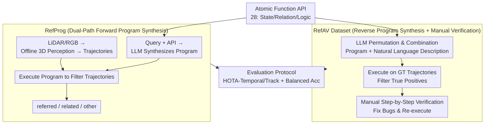

# RefAV: Towards Planning-Centric Scenario Mining

**Conference**: CVPR 2026  
**Paper**: [CVF Open Access](https://openaccess.thecvf.com/content/CVPR2026/html/Davidson_RefAV_Towards_Planning-Centric_Scenario_Mining_CVPR_2026_paper.html)  
**Code**: Yes (The paper states it is open-sourced on GitHub and Argoverse, though no specific URL is provided in the text)  
**Area**: Autonomous Driving / Scenario Mining / Referring Tracking  
**Keywords**: Scenario Mining, Referring Multi-Object Tracking, Program Synthesis, Argoverse 2, VLM

## TL;DR
This paper reformulates the task of "retrieving safety-critical scenarios from massive autonomous driving logs" as **spatiotemporal scenario mining**: given a natural language query, determining whether it occurs within a 20-second driving log and precisely locating the referred targets in 3D space-time. To this end, the authors construct the RefAV dataset (consisting of 10,000 multi-agent interaction queries based on Argoverse 2) and propose RefProg—a dual-path approach that uses LLMs to synthesize complex queries into executable programs and then filters reconstructed 3D trajectories. Under zero-shot settings, RefProg significantly outperforms various baselines that directly employ VLMs.

## Background & Motivation
**Background**: Autonomous driving fleets collect terabytes of multimodal data (RGB, LiDAR, HD maps) during routine road testing and pseudo-label 3D trajectories. To establish a "safety case" for end-to-end autonomous driving, it is essential to extract interesting, safety-critical scenarios (e.g., another vehicle aggressively making a left turn across the ego-vehicle's path) from real-world road test data. Related research is scattered across three lines: referring multi-object tracking (RMOT), multimodal visual question answering (VQA), and VLM-based motion planning.

**Limitations of Prior Work**: Traditional scenario mining relies on manually written structured queries, which is error-prone and extremely time-consuming—essentially searching for a needle in a haystack within massive unscreened logs. Applying off-the-shelf referring trackers or VLMs directly works reasonably well for simple queries (e.g., "find all cars"), but fails on those involving **combinatorial reasoning and motion understanding** (e.g., "find all cars that accelerate while changing lanes").

**Key Challenge**: Scenario mining differs from all three adjacent tasks and cannot be directly applied. RMOT assumes the referred target always exists in the sequence, whereas many logs in scenario mining do not contain the target scenario (requiring support for negative samples). VQA outputs textual answers, whereas scenario mining must output 3D trajectories. VLM planners only estimate the ego-vehicle's future trajectory, while scenario mining must reason about interactions **between non-ego agents**. In other words, scenario mining requires starting from raw sensor data, determining whether the described scenario occurs, and, if so, precisely locating the 3D trajectories of **all referred targets** in space-time.

**Goal**: To formally establish this overlooked task, providing both a benchmark (data) that covers dynamic multi-agent interactions and a method capable of handling compositional queries.

**Key Insight**: The authors observe that complex scenarios (e.g., "a car accelerating while changing lanes") can always be decomposed into simpler atomic actions ("find car" + "accelerate" + "change lanes"), and a large number of atomic actions can be combined into highly diverse scenarios. This "composability" can be leveraged both to **programmatically generate data** and to **programmatically parse queries**.

**Core Idea**: Define a set of atomic function APIs describing object states, relations, and logic, allowing LLMs to perform program synthesis in two directions: reverse synthesis to generate datasets (program $\rightarrow$ description) and forward synthesis for inference (query $\rightarrow$ program $\rightarrow$ filter trajectories).

## Method

### Overall Architecture
This paper presents two interlocking products that share the same **atomic function API**:

1. **RefAV Dataset (Offline, Reverse)**: Based on 80 planning scenario templates from nuPlan, 28 atomic functions are defined. LLMs are used to assemble these functions to generate "programs + corresponding natural language descriptions". These are executed on the ground-truth trajectories of all 1,000 logs to filter out true-positive matches. After manual verification of each case, a final set of 8,000 true-positive and 2,000 true-negative query-log pairs is obtained.
2. **RefProg Method (Online, Forward)**: A dual-path parallel framework—one path converts raw LiDAR/RGB data into high-quality 3D trajectories using an offline 3D perception model; the other path feeds the query along with the atomic function API to an LLM to synthesize a Python program. Finally, the program is executed to filter the 3D trajectories, categorizing all targets into **referred**, **related**, and **other** targets.

The key difference between the two lies in the direction of program synthesis and whether verification is involved: dataset generation is "program first, description second, with manual revision", whereas RefProg inference is "query first, program second, and executed directly without verification". The authors argue that the reverse direction is easier—a program has many valid natural language expressions, but a natural language query has far fewer corresponding valid programs. Therefore, the generator runs in reverse with manual checks, while the inference engine runs forward to test the LLM.

### Key Designs

**1. Atomic Function API: Decomposing Complex Scenarios into Composable Motion Primitives**

The difficulty in scenario mining lies in combinatorial reasoning and motion understanding, where direct end-to-end model predictions are both uncontrollable and imprecise. To address this, the authors define 28 atomic functions (Figure 2 and Appendix J in the paper), categorized into three types: ① **Object states**, such as `moving`, `accelerating`, `changing_lanes`, `turning`, `category`; ② **Object relations**, established on an underlying scene graph, such as `near`, `in_direction`, `heading_toward`, `in_same_lane`, `on_intersection`; ③ **Logical operators**, such as `scenario_and` / `scenario_or` / `scenario_not`, supporting function compositions and negative conditions. This API is the cornerstone of the entire work—both dataset generation and RefProg inference rely on it to bridge the gap between "natural language $\leftrightarrow$ executable programs". For example, "a car following a bicycle" is represented as `behind(moving(car), moving(bike)) and in_same_lane(car, bike)`. Because these atomics represent **general motion primitives** rather than dataset-specific rules, the authors can subsequently transfer them to nuPrompt with almost zero modification.

**2. RefAV Dataset: Scalable Construction via Reverse Program Synthesis and Manual Verification**

Manually writing structured queries is not scalable, but relying query generation purely on LLMs is unreliable. The authors take a pragmatic path of "machine mass production and manual safeguarding": the complete set of 28 atomic function APIs, along with realistic combinatorial in-context examples, is fed into an LLM (specifically Claude 3.7 Sonnet) to generate new programs with matching natural language descriptions. These programs are executed on the ground-truth trajectories of all 1,000 logs to filter true-positive log-query matches (accumulating over 50k instances). Then, 8,000 true-positive pairs are sampled to **maximize scenario diversity**, alongside 2,000 randomly sampled true-negative pairs. The average success rate of automated generation is approximately 70%. The manual verification phase is crucial: the authors find that LLMs make two types of high-frequency errors—first, they only cover "typical cases" of a scenario while omitting or misclassifying edge cases (e.g., "car following bicycle" might falsely include instances where they travel in opposite directions); second, they often reverse the relationship between the "referred object" and the "related object" (e.g., writing "bicycle in front of car" as "car in front of bicycle"). Annotators spent an average of 3 minutes per case reviewing video feeds, revising programs, and re-executing them, totaling around 200 hours. Additionally, the validation and test sets are manually annotated frame-by-frame for weather (sunny/cloudy/rainy/snowy/foggy) and lighting conditions (daytime/dawn-dusk/nighttime), as these attributes are critical for safety cases.

**3. RefProg: Dual-Path Program Synthesis for Referring Tracking**

Direct end-to-end scenario mining using VLMs performs poorly. The authors thus decouple "language understanding" and "geometric localization" into two independent paths (Figure 4 in the paper). One path is **offline 3D perception**: a standard high-precision 3D tracker (e.g., Le3DE2E) is used to yield 3D trajectories from raw LiDAR/RGB data, assuring geometric localization quality. The other path is **LLM program synthesis**: the query, along with the atomic function API (and visual tools like SigLIPv2 to judge visual properties like color), is fed to an LLM to generate executable code for that specific query. Finally, the code is executed to filter the 3D trajectories, outputting three classes: referred, related, and other. RefProg provides a **code scaffolding** (an explicit API list) compared to treating the LLM as a black box—which is the main reason it outperforms black-box approaches. While a black-box GPT-5 can write code from scratch to parse inputs, the lack of scaffolding limits its accuracy. This approach bridges interpretable, composable program logic with the geometric precision of off-the-shelf perception models.

**4. Evaluation Protocol: HOTA-Temporal/Track + Balanced Accuracy + Negative Samples**

Scenario mining must evaluate both "tracking accuracy" and "decision correctness" (whether the scenario actually occurred), which cannot be adequately captured by a single metric. The authors adopt three sets of metrics: **HOTA-Temporal** is a temporal variant of HOTA, which only counts timestamps where the referred action actually occurs as true positives (e.g., a "right-turning car" only counts during the right-turn frames); **HOTA-Track** is similar but does not penalize mispredicted start/end times of the motion (any frame in the referred trajectory is treated as a true positive); plus **log balanced accuracy** (log-level classification of whether the log contains the target scenario) and **timestamp balanced accuracy** (timestamp-level classification). Due to positive-negative sample imbalance, balanced accuracy is used instead of $F_1$. All targets are categorized into referred, related, and other, with the main table calculating HOTA only for the referred class. The inclusion of negative samples (2,000 true negatives) allows the quantification of "false alarms"—a feature that distinguishes RefAV from most RMOT benchmarks.

## Key Experimental Results

### Main Results
A comparison against five zero-shot baselines (higher HOTA-Temporal/Track is better; "Ground Truth" in the table represents the oracle upper-bound analysis using ground-truth trajectories, while Le3DE2E etc. are predicted trajectories). RefProg leads comprehensively:

| Method (Trajectory Source) | HOTA | HOTA-Temporal | HOTA-Track | Log Balanced Acc | Timestamp Balanced Acc |
|------|------|------|------|------|------|
| Treat all as referred (Blind Baseline, GT) | 100.0 | 13.3 | 20.5 | 50.0 | 50.0 |
| Filter by Referred Class (Le3DE2E) | 74.4 | 19.2 | 30.0 | 53.4 | 55.0 |
| Image-Embedding Similarity (Le3DE2E) | 74.4 | 17.2 | 24.4 | 51.1 | 51.1 |
| ReferGPT (Le3DE2E) | 74.4 | 20.2 | 30.8 | 57.0 | 57.1 |
| Black-box LLM GPT-5 (Le3DE2E) | 74.4 | 37.2 | 39.2 | 58.4 | 62.3 |
| **RefProg (Le3DE2E)** | 74.4 | **50.1** | **51.1** | 71.8 | 74.6 |
| RefProg (GT Trajectory Upper Bound) | 100.0 | 64.8 | 68.7 | 81.1 | 80.7 |

Using Le3DE2E trajectories, RefProg achieves a HOTA-Temporal of 50.1, outperforming the "black-box LLM" baseline (37.2) by roughly 13 percentage points (the original paper states a 13.8% gain, ⚠️ subject to the original paper). The Top 3 competition entries (Zeekr UMCV 53.4 / Mi3 UCM 52.4 / ZXH 52.1 HOTA-Temporal) are also built upon RefProg. Several counter-intuitive findings emerge: the naive "Filter by Referred Class" is an unexpectedly strong baseline and outperforms Image-Embedding Similarity (as CLIP image features are too sensitive to 3D bounding box positions, and single-frame crops lack multi-agent context); moreover, directly using LLMs as a black box is clearly superior to the manually designed ReferGPT.

### LLM Ablation Study
With fixed Le3DE2E trajectories and the same prompt, only the LLM performing program synthesis in RefProg is varied (Failure Rate = proportion of generated programs that throw exceptions at runtime):

| LLM | Failure Rate ↓ | HOTA-Temporal ↑ | HOTA-Track ↑ | Log Balanced Acc | Timestamp Balanced Acc |
|------|------|------|------|------|------|
| Qwen-2.5-7B-Instruct | 18.1 | 31.6 | 34.4 | 62.1 | 62.0 |
| gemini-2.0-flash | 2.6 | 45.2 | 46.6 | 72.1 | 74.6 |
| gemini-2.5-flash-preview | 15.4 | 47.8 | 47.6 | 71.0 | 73.8 |
| claude-3.5-sonnet | **0.5** | 46.1 | 47.5 | 71.8 | 71.8 |
| claude-3.7-sonnet | 2.9 | **50.1** | 51.1 | 71.8 | 74.6 |

Claude 3.5 Sonnet achieves the lowest failure rate (with 99.5% of programs being syntactically valid), while Claude 3.7 Sonnet achieves the highest HOTA-Temporal (50.1, which the authors attribute to its targeted optimization for code generation and instruction following). In contrast, Gemini-2.5-Flash and Qwen tend to write entire programs with invalid imports, leading to higher failure rates.

### Cross-Dataset Generalization (nuPrompt Zero-Shot)
By only replacing the AV2 category map with the nuScenes category map and removing atomic functions dependent on HD maps, **without modifying any atomic action definitions**, RefProg achieves zero-shot performance on nuPrompt that exceeds the state-of-the-art (SOTA) trained on this dataset:

| Method | Decoder | AMOTA ↑ | AMOTP ↓ | Recall ↑ | MOTA ↑ |
|------|------|------|------|------|------|
| PromptTrack (Trained SOTA) | PETR | 0.259 | 1.513 | 0.366 | 0.280 |
| RefProg (Ours) | PETR | 0.265 | 1.278 | 0.498 | 0.274 |
| RefProg (Ours) | StreamPETR | **0.321** | **1.238** | **0.504** | **0.329** |

### Key Findings
- **Code scaffolding is the key to RefProg's success**: Given the same LLM inference, providing the atomic function API boosts HOTA-Temporal from 37.2 (black-box) to 50.1. This indicates that making composable logic explicit dramatically improves the reliability of combinatorial reasoning.
- **The fundamental flaw of CLIP/VLM is the lack of temporal context**: Image-Embedding and ReferGPT underperform because single-frame 2D projection crops contain only the target object, omitting past/future frame information, thereby precluding any understanding of multi-agent interactions.
- **Failure modes are locatable**: RefProg failures are concentrated in queries where the API lacks expressive power (e.g., prompts involving weather or lighting). Although one could theoretically keep adding atomic actions, the authors explicitly note this path is "not scalable."
- **High temporal resolution is beneficial**: AV2 (10Hz) is chosen over nuScenes (2Hz) because fine-grained motion (accelerating, lane-changing, turning) requires high frame rates for reliable identification (ablation in Appendix F).

## Highlights & Insights
- **Dual bidirectional reuse of the atomic API**: Reverse application for "program $\rightarrow$ description" data creation, and forward application for "query $\rightarrow$ program" inference. This unified abstraction simultaneously addresses data scarcity and method controllability, resulting in an elegant, economical design.
- **Pragmatic data engineering via "machine mass production + manual safeguarding"**: The authors did not falsely assume that LLMs can directly generate flawless datasets. Instead, they honestly quantified the process: a 70% success rate, two typical error patterns, 3 minutes per entry, and 200 hours of total effort. The insight that "reverse generation is easier to verify" (since a program has many descriptions, but a query has few valid programs) is highly transferable to other instruction dataset construction efforts.
- **Decoupling "language" and "geometry"**: Delegating fragile natural language understanding to executable programs and precise localization to mature 3D perception models avoids the uncontrollability of end-to-end VLMs. This paradigm of "program synthesis + off-the-shelf perception tools" can directly generalize to other video understanding tasks requiring spatiotemporal localization.
- **The value of task definition**: The paper cleanly demarcates scenario mining from RMOT, VQA, and planning (requiring 3D trajectories, supporting negative samples, and reasoning about non-ego interactions) while introducing negative samples and balanced accuracy metrics, establishing a comparable benchmark for the community.

## Limitations & Future Work
- **Data quality is limited by AV2 ground-truth perception labels**: Jittery trajectories lead to motion classification errors within short time windows. While the authors mitigate this through extensive post-processing and manual verification, it demonstrates that the pipeline is sensitive to label noise.
- **Limited scale and scope**: AV2 remains small compared to industrial-scale datasets, and target trajectories are restricted to within 50m—because current 3D perception struggle with long-range detection and tracking. Consequently, "the community is not yet ready for long-range spatiotemporal scenario mining."
- **Expressive ceiling of the API**: RefProg cannot handle queries outside the coverage of its atomic functions (e.g., weather, lighting). Constantly adding new atomic actions is unscalable—how to automatically expand the expressible scenario space remains an open question.
- **Zero-shot but reliant on powerful LLMs**: Performance is highly sensitive to the code-generation capabilities of the underlying LLM (Claude 3.7 is significantly better than Qwen/Gemini); switching to weaker models results in substantial performance degradation.

## Related Work & Insights
- **vs RMOT (ReferKITTI / nuPrompt)**: RMOT assumes that the referred target always exists and relies heavily on static attributes (color, orientation). In contrast, RefAV requires handling negative samples, focuses on dynamic multi-agent interactions, and outputs multimodal 3D trajectories, representing a significantly higher level of difficulty. RefProg also outperforms trained SOTA methods on nuPrompt in a zero-shot manner.
- **vs VQA-like methods (DriveLM / OmniDrive / nuScenes-QA)**: While these methods provide textual answers and perform scene-level analysis, RefAV requires instance-level 3D spatiotemporal localization.
- **vs Program Synthesis (VisProg / ViperGPT)**: These methods similarly use LLMs to generate executable code and call tools, but they primarily focus on single-frame reasoning. RefProg extends this paradigm to dynamic multi-agent interactions in video sequences.
- **vs Black-box VLM Planning/Grounding**: Directly deploying VLMs yields poor performance on combinatorial queries. This paper demonstrates that "explicit atomic APIs + program execution + off-the-shelf 3D perception" is a far more reliable pathway.

## Rating
- **Novelty**: ⭐⭐⭐⭐ The task definition is highly clear, and the bi-directional reuse of the atomic API is clever. However, the method itself represents an adaptation of the program synthesis paradigm rather than a completely new mechanism.
- **Experimental Thoroughness**: ⭐⭐⭐⭐ Complete with five baselines, LLM ablation, cross-dataset generalization, and failure analyses; the oracle upper-bound analysis is thoroughly executed.
- **Writing Quality**: ⭐⭐⭐⭐⭐ The task motivation, details of data engineering (including success rates, labor hours, and error modes), and metric design are presented clearly and honestly.
- **Value**: ⭐⭐⭐⭐⭐ Establishes a comparable benchmark and strong baselines for safety-critical scenario mining, which offers direct engineering value for safety validation in autonomous driving.

<!-- RELATED:START -->

## Related Papers

- [\[CVPR 2026\] URScenes: A Multi-scenario Dataset for Unstructured Road Environments](urscenes_a_multi-scenario_dataset_for_unstructured_road_environments.md)
- [\[CVPR 2026\] TrafficAlign: Aligning Large Language Models for Traffic Scenario Generation](trafficalign_aligning_large_language_models_for_traffic_scenario_generation.md)
- [\[CVPR 2026\] An Instance-Centric Panoptic Occupancy Prediction Benchmark for Autonomous Driving](an_instance-centric_panoptic_occupancy_prediction_benchmark_for_autonomous_drivi.md)
- [\[CVPR 2026\] E3AD: An Emotion-Aware Vision-Language-Action Model for Human-Centric End-to-End Autonomous Driving](e3ad_an_emotion-aware_vision-language-action_model_for_human-centric_end-to-end_.md)
- [\[CVPR 2026\] DLWM: Dual Latent World Models enable Holistic Gaussian-centric Pre-training in Autonomous Driving](dlwm_dual_latent_world_models_enable_holistic_gaussian-centric_pre-training_in_a.md)

<!-- RELATED:END -->
