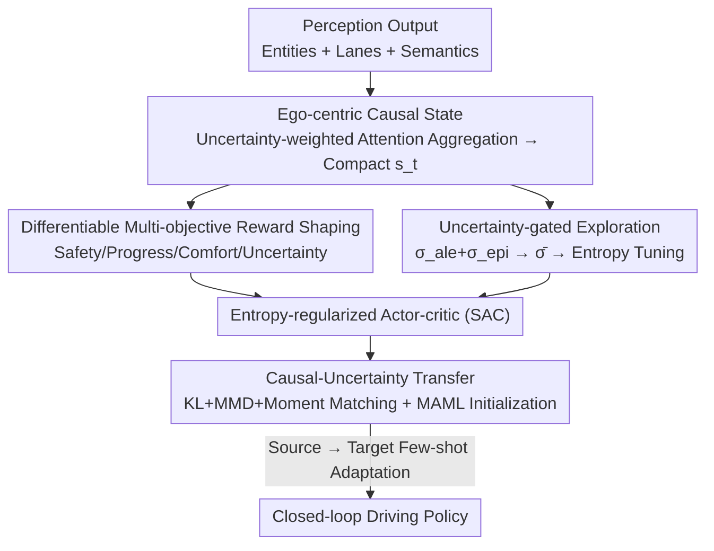

# Reliable Policy Transfer for Safety-Aware End-to-End Driving with Deep Reinforcement Learning

**Conference**: CVPR 2026  
**Paper**: [CVF Open Access](https://openaccess.thecvf.com/content/CVPR2026/html/Borhan_Reliable_Policy_Transfer_for_Safety-Aware_End-to-End_Driving_with_Deep_Reinforcement_CVPR_2026_paper.html)  
**Code**: https://github.com/szu-ai/safe-driving-drl/  
**Area**: Autonomous Driving  
**Keywords**: End-to-end driving, Deep reinforcement learning, Uncertainty modeling, Policy transfer, Safety control

## TL;DR
This paper proposes an end-to-end (E2E) driving deep reinforcement learning (DRL) framework organized around a "reliability interface at the control layer." A single normalized uncertainty signal $\bar{\sigma}$ simultaneously drives ego-centric relational attention, gated policy entropy, and regularizes cross-domain transfer alignment. Experiments in CARLA under adverse weather and cross-city closed-loop tests demonstrate significant improvements in success rate, reduced violation rates, and better lane keeping compared to strong baselines.

## Background & Motivation
**Background**: E2E autonomous driving has shifted from modularized perception-planning-control pipelines toward unified networks that couple scene understanding with control, using RL to directly optimize closed-loop behavior. These methods exhibit strength in open-loop accuracy and architectural scalability, and evaluations increasingly emphasize online metrics such as success rate and infractions per kilometer.

**Limitations of Prior Work**: Closed-loop robustness remains poor under distribution shifts, dense traffic, and adverse weather. The authors attribute the root causes to four fragmented components: (1) State encoders compress perception into global tensors, losing "which entities causally affect the ego vehicle" and their confidence levels; (2) Rewards are sparse or have threshold jumps, leading to weak or discontinuous gradients at safety-critical control points; (3) Uncertainty estimation methods vary and are rarely used to regulate exploration in the loop; (4) Transfer mainly aligns perceptual features, ignoring causal semantics and uncertainty statistics at the control layer.

**Key Challenge**: These four components are treated as independent modules. Consequently, uncertainty—a signal that should permeate from "perception $\rightarrow$ decision $\rightarrow$ exploration $\rightarrow$ transfer"—is redefined at each step and remains inconsistent, leading to fragile closed-loop behavior and degradation after transfer.

**Goal**: To align causality and uncertainty at the control layer so that safety-aware E2E driving policies can transfer reliably under distribution shifts. This is broken down into: constructing compact control states that expose causal influence, providing everywhere-differentiable multi-objective rewards, jointly estimating two types of uncertainty to gate exploration, and aligning policies/attention/uncertainty statistics across domains.

**Key Insight**: The authors observe that the aforementioned four components can actually share the same scalar signal—the normalized decision-time uncertainty $\bar{\sigma} \in [0,1]$. By making it "calculated once and reused four times," the four modules are linked into a consistent reliability interface.

**Core Idea**: Use a unified uncertainty signal $\bar{\sigma}$ to simultaneously (a) weight relational attention, (b) enter reward terms, (c) gate policy entropy, and (d) regularize transfer alignment, replacing the fragmented uncertainty processing of separate modules.

## Method

### Overall Architecture
Closed-loop driving is modeled as an MDP $\mathcal{M}=(S,A,r,P,s_0,\gamma)$. Actions are continuous controls $a_t=[a_t^{\text{thr}}, a_t^{\text{brk}}, a_t^{\text{str}}]$ (throttle/brake/steering), and the policy $\pi_\theta$ is trained using entropy-regularized actor-critic (SAC) to maximize the discounted return $J(\theta)=\mathbb{E}\big[\sum_t \gamma^t r(s_t, a_t, s_{t+1})\big]$. The "main axis" of the framework is the decision-time uncertainty decomposed into aleatoric (data noise) and epistemic (model knowledge) components $\sigma_{\text{dec}}^2 = \sigma_{\text{ale}}^2 + \sigma_{\text{epi}}^2$, which is then normalized into a single scalar $\bar{\sigma}$. This $\bar{\sigma}$ serves as the reliability interface throughout the control layer.

**Data Flow**: Perception outputs are aggregated via an "ego-centric relational graph" into a compact decision state $s_t$ (while injecting the aleatoric variance of each edge into the attention); $s_t$ is fed to the stochastic policy to produce control; differentiable multi-objective rewards shape feedback for safety, progress, and comfort using $\bar{\sigma}$; the critic ensemble provides epistemic variance, which combines with aleatoric variance to form $\bar{\sigma}$ for gating policy entropy (low confidence $\rightarrow$ convergence/conservatism, high confidence $\rightarrow$ resumed exploration); finally, the causal-uncertainty transfer objective aligns policy distributions, attention, and uncertainty statistics between source and target domains, complemented by MAML initialization for few-shot adaptation. The critic ensemble and MAML operate only during training; inference involves a single actor forward pass and top-K relational aggregation with almost zero additional overhead.

### Key Designs

**1. Ego-centric Causal Relation State: Letting the policy see "who affects me and with what confidence"**

To address the loss of causality and confidence in global tensor encoding, this paper builds a directed edge from every entity $i$ to the ego node. Edge features $\mathbf{e}_i^t = [\Delta p_i, \Delta v_i, c_i, \kappa_i, \sigma_i^2]$ carry relative position/velocity, semantic class (car/pedestrian/traffic light), local lane geometry (curvature, heading offset), and the aleatoric variance of that edge. Crucially, attention weights are not a black box but are explicitly determined by distance and uncertainty: $\alpha_i = \mathrm{softmax}_i\!\big(-\tfrac{\|\Delta p_i\|_2^2}{\sigma_i^2+\varepsilon}\big)$, resulting in $z_t = \sum_i \alpha_i W_e \mathbf{e}_i^t$. This formulation ensures that "closer + more certain" entities receive higher weights, automatically suppressing noisy distant targets. The decision state then concatenates control-related scalars: $s_t = [z_t; v_{\text{ego}}; a_{\text{ego}}^{t-1}; d_{\text{goal}}; \phi_{\text{lane}}; \sigma_{\text{ale}}^2]$, exposing ego dynamics, lane geometry, path progress, and aggregated aleatoric uncertainty to $\pi_\theta$.

**2. Differentiable Multi-objective Reward Shaping: Replacing sparse/jumpy penalties with smooth safety feedback**

To address weak gradients and cross-domain instability caused by sparse threshold rewards, per-step reward is defined as a convex combination $r_t = w_s r_s + w_p r_p + w_c r_c + w_u r_u$. All four terms are continuous, bounded, and differentiable: the safety term $r_s = 1 - \kappa_L \psi_L(d_L, \mu_A) - \kappa_P \psi_P - \kappa_R \rho_t$ uses a soft barrier $\psi_L = \tanh(d_L/\tau_d)$ for lane deviations, $\psi_P = \exp(-\text{dist}/\tau_p)$ for proximity, and $\rho_t$ for traffic light/stop line violations. The progress term $r_p = \tanh(\Delta s_t/\tau_s)$ tracks progress along the path; the comfort term $r_c = -\kappa_j j_t^2 - \kappa_\delta \dot{\delta}_t^2$ quadraticially penalizes longitudinal jerk and steering rate; and the uncertainty term $r_u = 1 - \bar{\sigma}$ encourages action in high-confidence states. Here $\mu_A \in [0,1]$ is context membership (tightening the lane corridor $\epsilon(\mu_A)$ in dense traffic or low visibility). Unlike treating uncertainty as a standalone penalty, $r_u$ reuses the same $\bar{\sigma}$ that drives attention and entry gating.

**3. Uncertainty-gated Exploration: Letting confidence directly regulate policy entropy**

To ensure uncertainty informs the exploration loop, the framework jointly estimates two types of uncertainty: aleatoric variance $\sigma_i^2$ from each edge injected into attention, and epistemic variance $\sigma_{\text{epi}}^2(s_t, a_t) = \mathrm{Var}_k[Q_{\phi_k}(s_t, a_t)]$ from a critic ensemble. These are calibrated via temperature-scaled min-max/logistic functions into a stable $\bar{\sigma} \in [0,1]$. The core mechanism uses $\bar{\sigma}$ to modulate the entropy coefficient: $\mathcal{L}_{\text{ent}} = -\beta(\bar{\sigma})H(\pi_\theta(\cdot|s_t))$, where $\beta(\bar{\sigma}) = \beta_0(1-\bar{\sigma})$. Thus, at low confidence ($\bar{\sigma} \uparrow$), entropy is suppressed to reduce risky actions, while exploration resumes at high confidence.

**4. Causal-Uncertainty Transfer: Aligning policy, attention, and uncertainty across domains**

To prevent the misalignment of control-layer causality, a causal-uncertainty transfer loss is defined as $\mathcal{L}_{\text{trans}} = \mathcal{L}_{\text{KL}} + \lambda_\alpha \mathrm{MMD}(\boldsymbol{\alpha}_s, \boldsymbol{\alpha}_t) + \lambda_u \|u_s - u_t\|_2^2$. These terms align the action distribution ($\mathcal{L}_{\text{KL}} = \mathrm{KL}(\pi_{\theta_s} \| \pi_{\theta_t})$), uncertainty-weighted attention (MMD), and uncertainty moments. A MAML-style initialization $\theta^\star = \arg\min_\theta \sum_{d} \mathcal{L}_{\text{RL}}^{(d)}(\theta - \alpha \nabla_\theta \mathcal{L}_{\text{RL}}^{(d)}(\theta))$ is used for few-shot adaptation. Because it aligns control-layer semantics and confidence calibration, the attention and uncertainty profiles remain consistent across cities and weather.

### Loss & Training
The full training objective is: $\min_{\theta, \phi} \mathcal{L}_{\text{RL}}(\theta, \phi; r_d) + \lambda_{\text{ent}} \mathcal{L}_{\text{ent}} + \lambda_T \mathcal{L}_{\text{trans}}$, with Lagrangian penalties incorporated into the return. Standard SAC optimization is used: replay buffer size $2 \times 10^5$, batch size 512, $\gamma=0.99$, target network update $\tau=5 \times 10^{-3}$, Adam learning rate $3 \times 10^{-4}$. Training is conducted on Town10HD under adverse conditions (night, heavy rain, dense fog).

## Key Experimental Results

### Main Results
Evaluated on CARLA 0.9.15, comparing ST-P3, ThinkTwice, TransFuser, and RaSc. Cross-city and zero-shot closed-loop results (Town02 transfer, Town05 zero-shot, Town10HD source):

| Domain | Variant | SR (%) | RC (%) | DS | IS | Coll./km |
| :--- | :--- | :--- | :--- | :--- | :--- | :--- |
| Town10HD (Source) | Source agent | 91.2 | 94.1 | 94.1 | 1.00 | 0.000 |
| Town05 (Zero-shot) | Source agent | 100.0 | 94.6 | 94.6 | 1.00 | 0.000 |
| Town02 (Cross-city) | Target training only | 72.1 | 75.2 | 188.6 | 0.88 | 0.007 |
| Town02 (Cross-city) | Source agent | 80.3 | 82.6 | 205.7 | 0.92 | 0.006 |
| Town02 (Cross-city) | Ours (Full Transfer) | 85.0 | 84.1 | 214.3 | 0.94 | 0.005 |

Component results (Town10HD): Causal relationship states reduced average CTE to 0.65 (28.6% lower than ST-P3). Differentiable rewards achieved an average episode reward of 265.3 (45.1% higher than RaSc). Uncertainty gating reduced exploration variance to 0.62 and collision rate to 0.006.

### Ablation Study
Ablation on components (Town10HD / Town02):

| Variant | CTE↓ | Coll./km↓ | DS (T02)↑ | Stab.↑ |
| :--- | :--- | :--- | :--- | :--- |
| w/o Uncertainty Attention | 0.76 | 0.008 | 203.5 | 0.84 |
| w/o Critic Ensemble | 0.68 | 0.009 | 208.1 | 0.87 |
| w/o Entropy Gating | 0.71 | 0.008 | 206.7 | 0.86 |
| Event-based Reward | 0.74 | 0.009 | 195.9 | 0.83 |
| w/o Transfer Objective | 0.65 | 0.006 | 194.1 | 0.91 |
| w/o MAML | 0.65 | 0.006 | 200.8 | 0.91 |
| Full Model (Ours) | 0.65 | 0.006 | 214.3 | 0.91 |

### Key Findings
- **Uncertainty-weighted attention is most critical**: Removing it increases CTE and heading error significantly; confidence-aware prioritization is essential for stability.
- **Entropy gating manages safe exploration**: Verification shows that $\bar{\sigma}$-epistemic-randomness coupling reduces collision rates.
- **Differentiable vs. Event rewards**: Switching to event-based penalties dropped the DS by 18.4 points, confirming optimization instability from sparse rewards.
- **Transfer and MAML are complementary**: Both contribute to cross-city performance. Zero-shot Success Rate on Town05 reached 100%, indicating the interface generalizes across disparate topologies.

## Highlights & Insights
- **One scalar for four modules**: Designing $\bar{\sigma}$ as a "calculate once, use four times" reliability interface is the most elegant part—uncertainty is a unified signal throughout the pipeline.
- **Analytical attention formula**: Encoding "proximal + certain" directly into the softmax is interpretable and automatically weights down noisy distant targets.
- **Heavy training, light inference**: Critic ensembles and MAML are only used during training. Inference overhead is minimal ($\le 3$ ms), making it deployable for real-time applications.

## Limitations & Future Work
- The study is limited to CARLA simulation; Sim2Real and real-vehicle deployment are planned.
- Uncertainty modeling is currently correlational; authors plan to extend this to "interventional causal modeling."
- Training with critic ensembles incurs overhead; the trade-off between ensemble size $K$ and stability requires further investigation.

## Related Work & Insights
- **vs. ST-P3 / ThinkTwice**: These use global feature tensors; ours uses ego-centric relational graphs with uncertainty, leading to lower CTE and infraction rates.
- **vs. TransFuser**: While TransFuser emphasizes geometric alignment for perception, ours focuses on compact control semantics.
- **vs. RaSc**: RaSc incorporates risk awareness in IL but does not use uncertainty to gate exploration. Ours adaptively adjusts risk tolerance with confidence, enabling earlier collision avoidance in fog or pedestrian scenarios.

## Rating
- Novelty: ⭐⭐⭐⭐ Interface design using a single uncertainty signal is a clear insight.
- Experimental Thoroughness: ⭐⭐⭐⭐ Comprehensive cross-city/zero-shot tests, though limited to simulation.
- Writing Quality: ⭐⭐⭐⭐ Clear organization around the $\bar{\sigma}$ main axis.
- Value: ⭐⭐⭐⭐ Meaningful reference for consistent uncertainty modeling in E2E driving.

<!-- RELATED:START -->

## Related Papers

- [\[CVPR 2026\] LEAD: Minimizing Learner-Expert Asymmetry in End-to-End Driving](lead_minimizing_learner-expert_asymmetry_in_end-to-end_driving.md)
- [\[CVPR 2026\] EE-RL: Vision Language Guided Reinforcement Learning with Explorer and Expert model for End-to-End Autonomous Driving](ee-rl_vision_language_guided_reinforcement_learning_with_explorer_and_expert_mod.md)
- [\[CVPR 2026\] Scaling-Aware Data Selection for End-to-End Autonomous Driving Systems](scaling-aware_data_selection_for_end-to-end_autonomous_driving_systems.md)
- [\[CVPR 2026\] WOD-E2E: Waymo Open Dataset for End-to-End Driving in Challenging Long-tail Scenarios](wod-e2e_waymo_open_dataset_for_end-to-end_driving_in_challenging_long-tail_scena.md)
- [\[NeurIPS 2025\] DriveDPO: Policy Learning via Safety DPO For End-to-End Autonomous Driving](../../NeurIPS2025/autonomous_driving/drivedpo_policy_learning_via_safety_dpo_for_end-to-end_autonomous_driving.md)

<!-- RELATED:END -->
