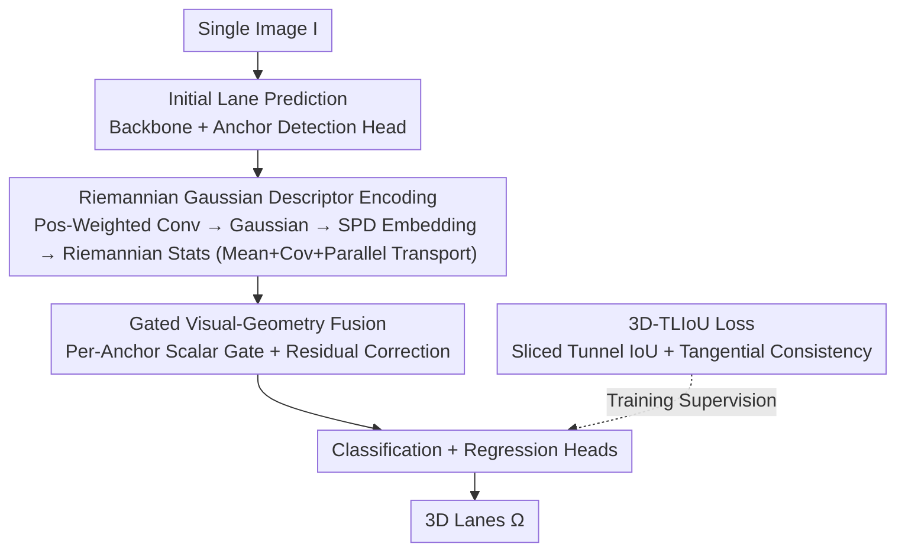

# ReManNet: A Riemannian Manifold Network for Monocular 3D Lane Detection

**Conference**: CVPR 2026  
**Paper**: [CVF Open Access](https://openaccess.thecvf.com/content/CVPR2026/html/Hong_ReManNet_A_Riemannian_Manifold_Network_for_Monocular_3D_Lane_Detection_CVPR_2026_paper.html)  
**Code**: https://github.com/changehome717/ReManNet  
**Area**: Autonomous Driving / 3D Lane Detection  
**Keywords**: Monocular 3D Lane Detection, Riemannian Manifold, SPD Matrix, Manifold Learning, Geometric Consistency

## TL;DR
To address the issue where "2D-to-3D lifting collapses (forming dips, bumps, or twists) due to a lack of geometric invariants" in monocular 3D lane detection, this paper proposes the road manifold hypothesis: "roads are smooth 2D manifolds in $\mathbb{R}^3$, and lanes are 1D submanifolds embedded upon them." Lane geometry is encoded as Riemannian Gaussian descriptors on Symmetric Positive Definite (SPD) manifolds and integrated into visual features via gated fusion. A sliced 3D tunnel lane IoU loss is introduced, achieving an +8.2% F1 improvement over the baseline and +1.8% over the previous SOTA on OpenLane.

## Background & Motivation

**Background**: Monocular 3D lane detection generally falls into three categories: (i) Depth-guided—estimating depth or voxels first to lift image evidence to 3D; (ii) BEV-centric—projecting image features onto a Bird's-Eye View to regress lanes, implying a ground plane assumption; (iii) Line modeling—explicitly parameterizing lanes using anchors, polynomials/splines, or keypoints.

**Limitations of Prior Work**: A common tendency in these methods is to **treat 2D image features as the primary prediction signal**, heavily investing in image-derived intermediate representations like depth maps, BEV features, or plane reconstruction, while relegating actual 3D lane coordinates to secondary roles (e.g., as RoI sampling targets, training supervision, or weak geometric regularization). Consequently, the value of 3D coordinates as "carriers of metric constraints and topological structures" is wasted. Depth-guided methods are extremely sensitive to depth quality, leading to error propagation; BEV methods suffer from systematic distortion on ramps, slopes, and banked curves due to the flat-plane assumption; line modeling becomes unstable in visual degradation scenarios where local cues are missing, causing mismatches between point predictions and line models.

**Key Challenge**: There is a lack of an **invariant "metric-topology coupling"** between lanes and the road surface. Directly learning from high-dimensional observations without imposing explicit structure is ill-posed and fragile (curse of dimensionality)—once predicted lanes are lifted to 3D, the reconstructed road space suffers from structural collapse, manifesting as false dips, bumps, and twists. Even reconstruction-centric or graph optimization methods restore surfaces externally in Euclidean space, inheriting the chordal Euclidean metric rather than the intrinsic geodesic metric on the road surface. This metric incompatibility smooths out fine structures, distorts curvature, and generates false topological shortcuts.

**Goal**: To establish an intrinsically consistent representation that aligns metrics and topological structures across three levels: the road surface, lane curves, and sampled points, thereby stabilizing the 2D-to-3D lifting at its root.

**Key Insight**: Road geometry design principles require continuous alignment and gradual changes in curvature and slope. Therefore, despite global undulations, **every local neighborhood can be well-approximated by a smooth non-singular surface**. Based on this, the authors propose the road manifold hypothesis and implement it by modeling local correlations in the tangent space using SPD matrices.

**Core Idea**: Upgrade lane geometry from "coordinate points in Euclidean space" to "Gaussian descriptors on a Riemannian manifold (SPD cone)." Use intrinsic geodesic metrics to preserve metric and topological invariants, then fuse these with visual features via a gated module for geometrically consistent 3D lane reasoning.

## Method

### Overall Architecture
ReManNet takes a single image $I \in \mathbb{R}^{3\times H\times W}$ and outputs a set of 3D lanes $\Omega = \{L_j\}_{j=1}^K$, where each lane consists of a category label and a fixed-length sequence of points. The process begins with an image backbone and anchor-based detection head (following Anchor3DLane) to provide initial 3D lane predictions, stacking initial point sequences into a tensor $X_{in}\in\mathbb{R}^{Q\times K\times 3}$. After encoding compact geometric features via position-weighted convolution, K-Means grouping is performed. Each group is summarized by a Gaussian distribution and embedded into an SPD manifold. Riemannian Gaussian descriptors are obtained by calculating the manifold mean, tangent space covariance, and parallel-transported local features. The SPD matrices are mapped to the Lie algebra via matrix logarithms, vectorized, and projected into compact Euclidean features, which are adaptively fused with visual features by a gated module. Finally, classification and regression heads produce the final predictions. The entire pipeline is trained end-to-end with a geometrically consistent 3D-TLIoU loss alongside standard regression and classification objectives.

Among the four key designs below, Design 1 (Road Manifold Hypothesis) is the geometric premise for Design 2, while Designs 2, 3, and 4 correspond to the contribution nodes in the architecture: "Geometric Descriptor Encoding → Gated Fusion → Loss Supervision."

### Key Designs

**1. Road Manifold Hypothesis: Explicit Geometric Premise of "Road as a Smooth Manifold"**

To address the lack of metric invariants in Euclidean space causing lifting collapse, the authors no longer treat lanes as scattered points. Instead, they explicitly assume: the road surface is a smooth two-dimensional manifold $\mathcal{M}$ embedded in $\mathbb{R}^3$, admitting a smooth atlas of Euclidean charts; a lane is a smooth one-dimensional submanifold $\gamma\subset\mathcal{M}$ embedded upon it, inheriting local smoothness and global coherence from $\mathcal{M}$; lane points are sufficiently dense samples from these submanifolds. Equipped with a metric $g$ pulled back from the ambient Euclidean metric to $\mathcal{M}$, $(\mathcal{M}, g)$ forms a Riemannian manifold providing intrinsic distances and supporting coordinate-independent objectives and regularization. The authors emphasize that many SPD networks apply Riemannian operations without verifying if the data possesses a well-defined manifold structure; this paper explicates this requirement as the road manifold hypothesis, serving as the geometric foundation to align metrics and topology across surfaces, curves, and point sets.

**2. Riemannian Gaussian Descriptors on SPD Manifolds: Encoding Local Lane Geometry via Intrinsic Geodesic Metrics**

This is the core module for converting the hypothesis into a learnable representation. First, **position-weighted convolution** strengthens spatial relationships: for the $i$-th point of lane $j$, a distance-aware weighting is applied over the neighborhood $E_i=\{i-1,i,i+1\}$ as $x^{out}_{i,j}=\sum_{i'\in E_i}\alpha^{(j)}_{i,i'} \tilde{W}_r x^{in}_{i',j}$. The weights $\alpha^{(j)}_{i,i'}\propto \exp(-\frac{1}{\tau}|y^j_i-y^j_{i'}|)$ are adjusted by a learnable temperature $\tau$, and the relative position kernel $\tilde W_r$ distinguishes $r\in\{-1,0,+1\}$. Encoded features are then grouped into $S$ clusters via K-Means, each summarized by a Gaussian $\mathcal{N}(\mu_s,\Sigma_s)$ and mapped to a **unit-determinant SPD matrix** $P_s$ via a Gaussian-to-SPD construction (using Schur complement to ensure $\det(P_s)=1$ for scale independence and $P_s\in\mathrm{Sym}^{d+\rho}_+$ for positive definiteness). Riemannian statistics are then calculated under the Affine-Invariant Riemannian Metric (AIRM): geodesic distance $d_R(A,B)=\|\log(A^{-1/2}BA^{-1/2})\|_F$, with the Riemannian mean $P_m$ solved via log-average-exp iterations. To unify tangential features into the same coordinate system, **parallel transport** $\tilde X_s=CX_sC^\top$ is performed along the AIRM geodesic to a learnable SPD reference point $P_{ref}$, followed by calculating the tangent space covariance $P_c$, yielding the mean-covariance pair (Riemannian Gaussian descriptor). Finally, SPD matrices are mapped to the Lie algebra via matrix logarithms, coupled using semidirect product parameterization of mean coordinates and covariance Cholesky factors, passed through a learnable lower-triangular transform, projected back to the SPD cone, then logged, vectorized, and linearly projected into a compact fusion descriptor $H\in\mathbb{R}^{d_h}$. The entire chain operates on intrinsic geometry, preserving coordinate invariance, anisotropy, and correlation.

**3. Gated Visual-Geometry Fusion: Geometry as "Residual Correction" Rather than Dominant Signal**

The geometric descriptor must fuse with visual features without overshadowing the primary visual signal. Given anchor-level visual features $F_{anchor}\in\mathbb{R}^{B\times A\times d_a}$ and geometric descriptors $H$ broadcasted along the anchor dimension as $\tilde H$, a **per-anchor scalar gate** $s_{gate}=ZW_{gate}$ is predicted from their concatenation. Visual anchor features are projected to the geometric channel dimension $F'_{anchor}=F_{anchor}W_a$, and a per-anchor gated residual update is applied as $F=F'_{anchor}+g\odot\tilde H$, where $g=\sigma(s_{gate})$. This "primary visual + geometric residual" design allows geometric information to yield when visual cues are reliable and compensate in scenarios with weak vision or strong geometric variations.

**4. 3D Tunnel Lane IoU Loss: Upgrading from Point-wise Distance to Sliced Shape-level Supervision**

Traditional point-wise distance losses score each point independently, underestimating their global contribution to lane shape and being sensitive to local outliers or jitter. Inspired by 2D LineIoU, the authors slice each lane into $Q$ sections along $Y_{ref}$. Within each slice plane, a monotonic proxy measure for the overlap of constant-radius discs is used: $\widehat{IoU}_i=\frac{2r_{tube}-d_i}{2r_{tube}+d_i}$ (where $d_i$ is the distance between predicted and ground truth points, allowed to be negative to represent separation). A directional penalty $C_i=\frac{1-Sim_i}{2}$ is calculated using tangential cosine similarity $Sim_i$. These are aggregated into a curve-level objective $\mathcal{L}_{3D\text{-}TLIoU}=1-\frac{\sum_i(2r_{tube}-d_i)}{\sum_i(2r_{tube}+d_i)}+\lambda_{sim}\frac{1}{Q-1}\sum_{i=2}^Q C_i$, which simultaneously rewards tubular neighborhood overlap and regularizes tangential consistency, making it more robust to small noise and improving geometric fidelity. The total loss is $\mathcal{L}_{total}=\lambda_{cls}\mathcal{L}_{cls}+\lambda_{reg}(\mathcal{L}_x+\mathcal{L}_z)+\lambda_{tliou}\mathcal{L}_{3D\text{-}TLIoU}$.

### Loss & Training
The position-weighted convolution outputs $d=3$ channels. K-Means uses $S=30$ groups and 20 iterations. The embedding dimension is $\rho=1$, and the geometric descriptor dimension is $d_h=256$. For 3D-TLIoU, the tube radius $r_{tube}=1.5$ m and cosine weight $\lambda_{sim}=0.4$. Global weights are $\lambda_{cls}=1, \lambda_{reg}=1, \lambda_{tliou}=0.5$. Training is conducted for 60K/50K iterations for OpenLane/ApolloSim respectively using the AdanW optimizer (lr $2\times10^{-4}$, weight decay $1\times10^{-4}$), batch size 4, on a single RTX 4090.

## Key Experimental Results

### Main Results
Evaluation metrics: F1, Category Accuracy (Cate Acc), and near/far lateral/longitudinal errors (Ex/N, Ex/F, Ez/N, Ez/F, where near is 0–40 m and far is 40–100 m). The matching threshold is $\tau=1.5$ m, requiring at least 75% of points to fall within the threshold for a TP. Main results on OpenLane:

| Method | F1(%)↑ | Cate Acc↑ | Ex/N↓ | Ex/F↓ | Ez/N↓ | Ez/F↓ |
|------|--------|-----------|-------|-------|-------|-------|
| Anchor3DLane (R50)† Baseline | 57.5 | 91.6 | 0.233 | 0.246 | 0.080 | 0.106 |
| LATR (R50) | 61.9 | 92.0 | 0.219 | 0.259 | 0.075 | 0.104 |
| Glane3D (R50) Prev. SOTA | 63.9 | – | 0.193 | 0.234 | 0.065 | 0.090 |
| **ReManNet (R18)** | 63.5 | 92.8 | 0.222 | 0.265 | 0.069 | 0.089 |
| **ReManNet (R50)** | **65.7** | **94.7** | **0.189** | **0.205** | **0.060** | **0.072** |

ReManNet (R50) achieves SOTA: F1 improves +8.2% over the Anchor3DLane R50 baseline and +1.8% over the previous SOTA Glane3D R50. It also yields the highest Cate Acc and lowest near/far localization errors. Gains are concentrated in scenarios with weak vision or strong geometric variations: Extreme Weather +6.6%, Intersection +5.2%, Night +5.1%, and Up & Down +5.0%. Results for Merge & Split are slightly lower, attributed to complex topological interactions locally violating manifold consistency. On ApolloSim, ReManNet (R50) achieves the most balanced far-range errors, with an F1 gain of +1.6% on the Visual Variations subset.

### Ablation Study
Component ablation on OpenLane (Baseline = Anchor3DLane R50, F1 57.5):

| Configuration | F1(%)↑ | Relative Gain |
|------|--------|---------|
| Baseline | 57.5 | — |
| + 3D-TLIoU Loss | 60.5 | +3.0 |
| + Riemannian Gaussian Module | 62.0 | +4.5 |
| Full ReManNet | **65.7** | **+8.2** |

Internal ablation of 3D-TLIoU loss (Baseline 57.5):

| Configuration | F1(%)↑ | Relative Gain |
|------|--------|---------|
| + $C_i$ (Tangential Cosine Penalty) | 58.6 | +1.1 |
| + 3D LIoU Term | 59.9 | +2.4 |
| Full 3D-TLIoU | 60.5 | +3.0 |

### Key Findings
- **Complementarity and Super-additivity**: The 3D-TLIoU loss alone yields +3.0%, and the Riemannian Gaussian module alone yields +4.5%. Combined, they yield +8.2% > the sum of parts, proving geometric encoding and shape-level supervision are mutually beneficial.
- **Riemannian Gaussian module provides higher individual contribution** (+4.5% vs +3.0%), showing that shifting geometric descriptors to SPD manifolds significantly enhances spatial reasoning stability.
- **3D-TLIoU components are complementary**: The tangential consistency $C_i$ handles direction (+1.1%), while the 3D LIoU term handles geometric overlap (+2.4%). Together they achieve +3.0%.
- **Greater gains in geometry-critical scenarios**: The highest gains are observed in extreme weather, night, slopes, and intersections. This validates the value of intrinsic geometric consistency as compensation when visual cues are degraded.

## Highlights & Insights
- **Explicit Validation of the Manifold Hypothesis**: The authors note that many SPD networks apply Riemannian operations without verifying if the data structure warrants it. By using road design principles to justify that roads are locally smooth surfaces, they provide a solid foundation for Riemannian operations.
- **Intrinsic Geodesic Metric vs. Chordal Euclidean Metric**: The method directly targets the root cause of structural collapse and false topological shortcuts found in reconstruction/graph methods by using AIRM geodesic metrics rather than incompatible Euclidean metrics.
- **Gated Residual Fusion**: Treating geometry as a residual correction to the visual primary branch prevents the geometric stream from overwhelming visual signals, providing a robust paradigm for multi-modal fusion.
- **3D-TLIoU as a 3D Shape Supervisor**: By lifting 2D LineIoU to 3D tunnel shape supervision, it explicitly incorporates "shape-level alignment" into the loss, which is transferable to other curve/tubular 3D detection tasks.

## Limitations & Future Work
- **Merge & Split Scenarios**: Complex topological interactions (lane additions, merges, splits) can locally violate smooth manifold assumptions, representing a blind spot for the current hypothesis.
- **Reliance on Initial Prediction Quality**: Since the Riemannian encoding is built on initial lane points from the backbone/anchors, it cannot fully recover if the initial prediction is severely missing.
- **SPD Manifold Computation Overhead**: Riemannian operations (logarithms, parallel transport, covariance inversion) require ridge regularization for numerical stability and are computationally intensive; no inference latency comparisons were provided.
- **Future Directions**: Designing local multi-chart or piecewise manifold models for topological change zones, or introducing adaptive tube radii for 3D-TLIoU to accommodate lanes of varying curvature.

## Related Work & Insights
- **vs. Depth-guided (e.g., SALAD)**: These rely on intermediate depth maps where errors propagate; ReManNet constrains 3D structure via intrinsic geometry, bypassing depth quality bottlenecks.
- **vs. BEV-centric (e.g., 3DLaneNet/PersFormer)**: These imply ground plane assumptions that fail on slopes and banked curves; ReManNet's manifold hypothesis only requires local smoothness, leading to significant gains on undulated terrain.
- **vs. Line Modeling and Reconstruction (Anchor3DLane/LaneCPP/GLane3D/GP)**: These use Euclidean reconstruction or priors like parallelism that aren't always universal; ReManNet uses AIRM geodesic metrics to preserve intrinsic invariants, outperforming GLane3D by +1.8% F1 on OpenLane.

## Rating
- Novelty: ⭐⭐⭐⭐⭐ Reframing monocular 3D lane detection on SPD Riemannian manifolds with an explicit manifold hypothesis is novel and self-consistent.
- Experimental Thoroughness: ⭐⭐⭐⭐☆ Extensive evaluation on OpenLane/ApolloSim with scenario-level analysis and two-tier ablations, though lacks inference efficiency/latency data.
- Writing Quality: ⭐⭐⭐⭐☆ Rigorous geometric motivation and derivation, though the barrier to entry is high; readers may need background in Riemannian geometry.
- Value: ⭐⭐⭐⭐⭐ Provides a transferable paradigm for intrinsic geometric modeling and shape-level supervision for geometry-aware 3D lane and road reconstruction.

<!-- RELATED:START -->

## Related Papers

- [\[CVPR 2026\] RaGS: Unleashing 3D Gaussian Splatting from 4D Radar and Monocular Cue for 3D Object Detection](rags_unleashing_3d_gaussian_splatting_from_4d_radar_and_monocular_cue_for_3d_obj.md)
- [\[CVPR 2025\] Rethinking Lanes and Points in Complex Scenarios for Monocular 3D Lane Detection](../../CVPR2025/autonomous_driving/rethinking_lanes_and_points_in_complex_scenarios_for_monocular_3d_lane_detection.md)
- [\[CVPR 2026\] HG-Lane: High-Fidelity Generation of Lane Scenes under Adverse Weather and Lighting Conditions without Re-annotation](hg-lane_high-fidelity_generation_of_lane_scenes_under_adverse_weather_and_lighti.md)
- [\[CVPR 2026\] A Prediction-as-Perception Framework for 3D Object Detection](a_prediction-as-perception_framework_for_3d_object_detection.md)
- [\[AAAI 2026\] Difficulty-Aware Label-Guided Denoising for Monocular 3D Object Detection](../../AAAI2026/autonomous_driving/difficulty-aware_label-guided_denoising_for_monocular_3d_object_detection.md)

<!-- RELATED:END -->
