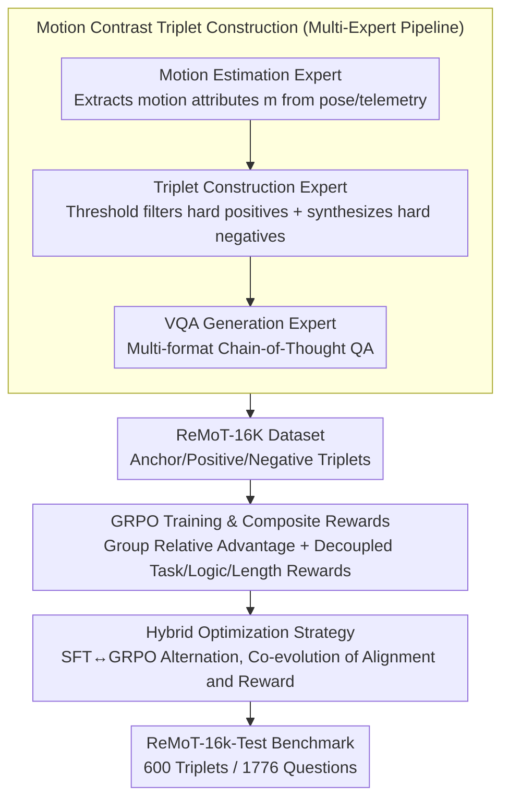

# ReMoT: Reinforcement Learning with Motion Contrast Triplets

**Conference**: CVPR 2026  
**arXiv**: [2603.00461](https://arxiv.org/abs/2603.00461)  
**Code**: None  
**Area**: Vision-Language Models / Spatio-temporal Reasoning  
**Keywords**: Motion Contrast Triplets, GRPO, Spatio-temporal Reasoning, VLM, Data Construction

## TL;DR

Ours proposes ReMoT—a unified training paradigm that constructs a 16.5K motion contrast triplet dataset (ReMoT-16K) through a rule-driven multi-expert collaboration. Combined with GRPO reinforcement learning optimization featuring logical consistency rewards and length regularization, it systematically addresses fine-grained spatio-temporal reasoning deficiencies of VLMs in scenarios such as navigation, robotic manipulation, and autonomous driving.

## Background & Motivation

**Background**: VLMs (e.g., GPT-4o, Claude, Gemini, Qwen3-VL) have become general-purpose perception systems but perform poorly on tasks requiring understanding of physical changes across frames or views. They frequently confuse camera rotation with object motion, misjudge gripper states, and incorrectly infer character movement directions.

**Limitations of Prior Work**:
1. Existing VLM training data is dominated by static image-text pairs, lacking explicit modeling of fine-grained motion attributes.
2. Prior attempts at architectural modifications or data augmentation are disjointed patches rather than systematic solutions covering data, training, and evaluation.
3. Using VLMs directly to generate triplet data results in a 55% format error rate and high API costs.

**Key Challenge**: VLMs excel at semantic alignment but lack deep understanding of physical-spatial laws, while acquiring large-scale, high-quality motion contrast training data is extremely difficult.

**Goal**: How to efficiently construct large-scale motion contrast data and identify the optimal training paradigm to enhance the spatio-temporal reasoning capabilities of VLMs?

**Key Insight**: Approaching systematically from three dimensions—data, training, and evaluation—using rule-driven multi-expert data construction instead of expensive manual labeling, GRPO instead of SFT for better reasoning consistency, and building the first fine-grained motion contrast benchmark for rigorous evaluation.

**Core Idea**: Motion Contrast Triplets + GRPO Optimization = Systematic enhancement of VLM spatio-temporal reasoning.

## Method

### Overall Architecture

ReMoT targets a specific weakness in VLMs: while they can perform semantic alignment, they often confuse camera rotation with object movement, misjudge gripper states, or mistake movement directions, essentially due to a lack of explicit modeling of fine-grained motion attributes in training data. ReMoT provides a systematic solution across three dimensions: constructing the ReMoT-16K motion contrast triplet dataset via a multi-expert pipeline, comparing SFT, GRPO, and sequential/alternating hybrid strategies with composite rewards, and establishing the ReMoT-16k-Test benchmark (600 triplets / 1776 questions) for rigorous measurement.

### Key Designs

**1. Motion Contrast Triplet Construction: Rule-driven Multi-expert Pipeline replacing expensive and error-prone VLM generation**

Directly using VLMs to generate triplets results in a 55% format error rate and high costs, while manual annotation is unscalable. ReMoT uses a rule-based pipeline with three experts: for each triplet $(I_{anchor}, I_{pos}, I_{neg})$, the anchor-positive pair demonstrates a motion attribute $m$, while the anchor-negative pair is visually similar but has the opposite attribute—

- *Motion Estimation Expert* $g: (I_t, I_{t'}, \mathcal{A}) \to m$, extracting motion attributes from structured metadata (e.g., $SE(3)$ pose matrices, robot telemetry).
- *Triplet Construction Expert* uses attribute thresholds $\phi(I_t, I_{t'}, m)$ to filter significant positives (e.g., camera rotation between $[10°, 50°]$) and uses geometric transformations or attribute retrieval to create hard negatives $\mathcal{N}(I_{anchor}, I_{pos}, m)$.
- *VQA Generation Expert* designs multi-angle CoT questions for each triplet, covering selection, judgment, fill-in-the-blank, and comparative reasoning.

Since attributes come from deterministic metadata rather than model guessing, the data quality and scalability of this pipeline far exceed VLM generation.

**2. GRPO Training and Composite Rewards: Group Relative Advantage + Decoupled Rewards to suppress logical contradictions**

SFT only learns to align answer tokens, making it difficult to ensure self-consistency in reasoning chains (31.4% of baseline errors stem from logical contradictions). ReMoT uses Qwen3-VL-4B-Thinking as a backbone with GRPO: calculating group-normalized advantage $\hat{A}_i = \frac{R_i - \bar{R}}{\sigma(\{R_j\})}$ for a group of $G$ sampled responses. The reward is decoupled into $R_i = R_{task} + \lambda_1 R_{logic} + \lambda_2 R_{length}$—CoT length regularization $R_{length}(o_i) = -\max(0, |o_i^{think}| - L_{target})$ suppresses redundant reasoning, and a logical consistency reward checks transitivity (e.g., $L_1 < L_2, L_2 < L_3$ but $L_3 < L_1$ is a contradiction) to yield $R_{logic} \in \{-1, 0, +1\}$.

Isolating logical consistency as a specific reward is a key insight: it directly penalizes "transitivity violations," raising accuracy from 68.6% to 78.0%.

**3. Hybrid Optimization Strategy: Joint Evolution of Language Alignment and Reward Alignment**

Pure SFT is stable but lacks reasoning; pure GRPO reasons well but suffers from unstable cold starts. ReMoT explores two hybrids: Sequential (SFT→GRPO), which uses SFT for stable initialization before refining with GRPO, and Alternating (SFT↔GRPO), which periodically switches between steps. The alternating strategy proved optimal, outperforming the baseline by +17.3 Overall / +25.1 Partial.

### Loss & Training

Cross-entropy is used during the SFT phase, with loss calculated only on tokens within `<answer>`: $\mathcal{L}_{SFT} = -\sum_{u \in \text{<answer>}} \log \pi_\theta(y_u | q)$. The GRPO phase uses the standard PPO objective with KL regularization (coefficient 0.01). Training is conducted for 2 epochs on 8×A800 with mixed precision.

## Key Experimental Results

### Main Results (ReMoT-16k-Test Benchmark)

| Model | Overall Acc. | Partial Acc. |
|------|-------------|-------------|
| Qwen2.5-VL-7B | 5.1 | 25.4 |
| Qwen3-VL-CoT-4B (Baseline) | 20.7 | 38.9 |
| InternVL3-8B | 12.2 | 28.9 |
| LLaVA-One-Vision | 9.7 | 27.9 |
| GRPO (Ours) | 33.6 | 61.6 |
| SFT→GRPO (Ours) | 35.0 | 63.3 |
| **SFT↔GRPO (Ours)** | **38.0** | **64.0** |

The alternating hybrid strategy achieves a leap of +17.3 Overall / +25.1 Partial over the Qwen3-VL baseline.

### Ablation Study

| Training Data Composition | Overall Acc. | Partial Acc. |
|-------------|-------------|-------------|
| No Training (Qwen3-VL) | 20.7 | 38.9 |
| Manipulation Only | 23.9 | 46.7 |
| + Navigation | 32.4 | 57.6 |
| + Simulation | **38.0** | **64.0** |

| Logic Reward Ablation | Overall | Partial | Logical Consistency |
|-------------|---------|---------|-----------|
| Qwen3-VL Baseline | 16.2 | 39.6 | 46.6% |
| GRPO w/o Logic Reward | 68.6 | 77.3 | 98.6% |
| **GRPO w/ Logic Reward** | **78.0** | **81.3** | **99.3%** |

### Key Findings

- GRPO significantly outperforms SFT, and the alternating hybrid (SFT↔GRPO) is the optimal strategy.
- Scalability of multi-expert constructed data is far superior to VLM-generated data.
- The logical consistency reward improves accuracy from 68.6% to 78.0%; decoupled design is essential.
- Navigation data contributes most to spatial relationship reasoning (+8.4%), validating the core role of spatial reasoning.

## Highlights & Insights

- **Systematic Solution**: The first work to systematically address VLM spatio-temporal reasoning across data, training, and evaluation dimensions.
- **Engineering Wisdom of Multi-expert Pipelines**: Rule-driven methods replace VLM generation, fundamentally solving format errors and scalability issues.
- **Insight into Logical Consistency Rewards**: 31.4% of errors originate from logical contradictions (e.g., transitivity violations); explicit modeling of consistency is highly effective.
- **Small Model Outperforms Large Model**: ReMoT-4B surpasses the 7.5× larger Qwen3-VL-30B on spatio-temporal benchmarks and even matches GPT-4o.

## Limitations & Future Work

- Data sources depend on video datasets with metadata like poses, not yet covering all scene domains.
- Validated only on Qwen3-VL-4B; performance on larger base models remains to be explored.
- Motion attributes cover discrete categories (left/right, open/close); reasoning for continuous motion magnitudes is not included.
- Optimal cycle lengths $(K_{SFT}, K_{GRPO})$ for the alternating hybrid strategy require further ablation.

## Related Work & Insights

- **vs 3D/4D Perception Methods**: While these methods integrate geometric priors via depth/reconstruction, they require expensive sensors, and static encoders weaken spatio-temporal associations. ReMoT addresses this through contrastive learning and reasoning optimization.
- **vs DPO/RLHF**: DPO relies on preference data with limited consistency. GRPO’s group-normalized advantage avoids preference pair labeling, and logical rewards guarantee reasoning chain self-consistency.
- **Insights**: The construction paradigm for motion contrast triplets can be generalized to any task requiring differentiation of "similar but different" instances. Logical consistency rewards can be integrated into any RL training involving CoT reasoning.

## Rating

- Novelty: ⭐⭐⭐⭐⭐ First work to systematically solve VLM spatio-temporal reasoning across three dimensions.
- Technical Depth: ⭐⭐⭐⭐ Sophisticated multi-expert pipeline and theoretically motivated composite rewards.
- Experimental Thoroughness: ⭐⭐⭐⭐⭐ Self-built benchmark + 7 external benchmarks, detailed ablations, and comprehensive comparisons.
- Writing Quality: ⭐⭐⭐⭐ Systematically clear structure with effective illustrations.
- Value: ⭐⭐⭐⭐⭐ Data construction pipeline and training paradigm are directly reusable with significant gains.

<!-- RELATED:START -->

## Related Papers

- [\[CVPR 2026\] W2W: Language-Model-Based Trajectory Prediction with Reinforcement Learning](w2w_language-model-based_trajectory_prediction_with_reinforcement_learning.md)
- [\[CVPR 2026\] Reliable Policy Transfer for Safety-Aware End-to-End Driving with Deep Reinforcement Learning](reliable_policy_transfer_for_safety-aware_end-to-end_driving_with_deep_reinforce.md)
- [\[CVPR 2026\] RLFTSim: Realistic and Controllable Multi-Agent Traffic Simulation via Reinforcement Learning Fine-Tuning](rlftsim_realistic_and_controllable_multi-agent_traffic_simulation_via_reinforcem.md)
- [\[ICML 2026\] Constrained Multi-Objective Reinforcement Learning with Max-Min Criterion](../../ICML2026/autonomous_driving/constrained_multi-objective_reinforcement_learning_with_max-min_criterion.md)
- [\[CVPR 2026\] WAM-Flow: Parallel Coarse-to-Fine Motion Planning via Discrete Flow Matching for Autonomous Driving](wam-flow_parallel_coarse-to-fine_motion_planning_via_discrete_flow_matching_for_.md)

<!-- RELATED:END -->
