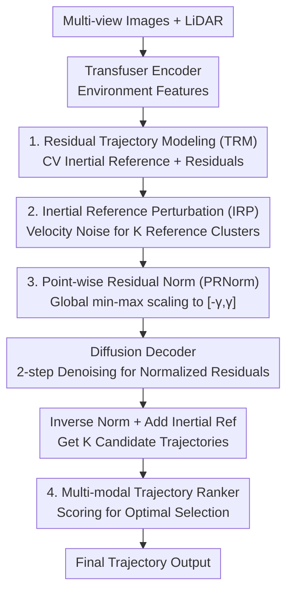

# ResAD: Normalized Residual Trajectory Modeling for End-to-End Autonomous Driving

**Conference**: CVPR 2026  
**Paper**: [CVF Open Access](https://openaccess.thecvf.com/content/CVPR2026/html/Zheng_ResAD_Normalized_Residual_Trajectory_Modeling_for_End-to-End_Autonomous_Driving_CVPR_2026_paper.html)  
**Code**: https://duckyee728.github.io/ResAD (Project Page)  
**Area**: Autonomous Driving / End-to-End Planning  
**Keywords**: End-to-End Autonomous Driving, Residual Trajectory Modeling, Inertial Reference, Diffusion Planning, NAVSIM

## TL;DR
ResAD reformulates trajectory prediction in end-to-end driving from "direct future trajectory prediction" to "predicting normalized residuals relative to an inertial reference trajectory." By using perturbed inertial references for multi-modal generation, diffusion decoding, and trajectory ranking, it achieves SOTA results on NAVSIM v1/v2 with 88.8 PDMS / 85.5 EPDMS using only 2 denoising steps.

## Background & Motivation

**Background**: End-to-end autonomous driving (E2EAD) aims to map raw sensor data (multi-view cameras + LiDAR) directly to a future trajectory, bypassing error propagation in sequential "perception-prediction-planning" pipelines. Recent works focus on stronger representations, sensor fusion, and architectures (UniAD, VAD, DiffusionDrive, GoalFlow, etc.), yet they all address the same question: "What does the future trajectory look like?"

**Limitations of Prior Work**: The authors point out that raw trajectory data exhibits **spatiotemporal imbalance**, and direct prediction leads to two specific issues. First, **spurious correlations**: when mapping high-dimensional sensor data to complete trajectories, models easily learn shortcuts (e.g., "braking simply because the vehicle ahead's brake lights are on") rather than the underlying driving logic (the lead vehicle is stopping due to a red light), resulting in dangerous behaviors like following a car through a red light. Second, the **planning horizon dilemma**: uncertainty increases with distance, and prediction errors for distant waypoints are naturally large. Optimization becomes dominated by these large distant errors, sacrificing the precision of near-term waypoints crucial for collision safety.

**Key Challenge**: Raw trajectories suffer from a distribution problem characterized by "mean drift + variance increasing over time" (Fig. 1a). Moreover, the tasks of "learning driving decisions" and "learning spatiotemporal dynamics" are conflated, causing complex spatiotemporal patterns to consume model capacity that should be reserved for actual decision-making.

**Goal**: To restructure the learning target without changing E2EAD input/output, concentrating model capacity on "where and why to deviate" while mitigating the dominance of distant uncertainty during optimization.

**Key Insight**: When driving, humans essentially apply corrections based on a default path—coasting at the current velocity if no action is taken. By treating this constant-velocity extrapolation as a deterministic physical prior (inertial reference), the model only needs to learn deviations relative to it.

**Core Idea**: Redefine the task from "what is the future trajectory" to "why must the trajectory change." The model predicts **residuals** relative to an inertial reference, applies **point-wise normalization** to eliminate spatiotemporal scale differences, and generates context-aware multi-modal candidates via **perturbed inertial references**.

## Method

### Overall Architecture
ResAD receives multi-view images + LiDAR point clouds, fused into environment representations using a Transfuser-style encoder. It extrapolates an **inertial reference trajectory** from the ego-vehicle's current state (position + velocity) using a constant-velocity model. Gaussian perturbations are applied to the initial velocity to generate a set (K) of references and corresponding residuals. These residuals, after point-wise normalization, serve as data samples for the diffusion decoder. Conditioned on environmental features and positional encodings of the references, the decoder iteratively predicts normalized residuals. These are de-normalized and added back to the inertial references to obtain a set of candidate trajectories. Finally, a trajectory ranker scores and selects the optimal path. Only 2 DDIM denoising steps are used during inference.

### Key Designs

**1. Residual Trajectory Modeling (TRM): Using Physical Priors to Shift from "Learning Trajectories" to "Learning Corrections"**

To address the issue where direct prediction leads to spurious correlations and consumed capacity, ResAD establishes an **inertial reference** $\tau_{ref}$. Given current position $p_0=(x_0,y_0)$ and velocity $v_0=(v_{x,0},v_{y,0})$, reference points at future time $t_i$ are extrapolated as $p_{t_i}=p_0+v_0\cdot\Delta t_i$, representing the path if no control input is applied. The model predicts the **residual** $r=\tau_{gt}-\tau_{ref}$, the point-wise deviation from this reference. The learning objective shifts to "what corrections did the driver make for obstacles/yielding/turning," assigning the predictable physics to the prior. Ablations show TRM provides significant gains (DAC +2.3, EP +2.5, PDMS +1.2), confirming it forces the model to learn real driving logic.

**2. Inertial Reference Perturbation (IRP): Generating Context-Aware Candidates via Velocity Noise**

Driving is inherently multi-modal, but methods like DiffusionDrive or Hydra-MDP rely on **fixed trajectory vocabularies**. Most options in these vocabularies are irrelevant to the current scene, which is inefficient and limits optimal solutions. IRP applies zero-mean Gaussian perturbation $\delta_{v,k}\sim\mathcal{N}(0,\Sigma)$ to the initial velocity, yielding K perturbed velocities $v'_{0,k}=v_0+\delta_{v,k}$. This generates K distinct inertial references and residuals. This approach generates diverse, physically reasonable intent hypotheses within the neighborhood of the original reference and improves robustness to sensor noise. IRP provides the largest single-component gain (M3→M4, PDMS +1.6, EP +2.0, DAC +0.8) by providing the ranker with high-quality, non-collapsed candidates.

**3. Point-wise Residual Normalization (PRNorm): Eliminating Variance to Prevent Distant Error Dominance**

Even with residuals, values at distant waypoints remain larger, causing optimization to ignore safety-critical near-field adjustments. PRNorm applies **global** per-component min-max normalization. Extremes $r^d_{min},r^d_{max}$ for each dimension $d\in\{x,y\}$ are pre-computed across the training set and mapped to a symmetric interval $[-\gamma,\gamma]$:

$$\tilde{r}^d_t = 2\gamma\left(\frac{r^d_t-r^d_{min}}{r^d_{max}-r^d_{min}+\epsilon_0}\right)-\gamma$$

Where $\gamma>0$ controls the distribution boundary. Normalized residuals $\tilde r=\mathrm{PRNorm}(r)$ are used for diffusion denoising and transformed back during inference. This balances near-field adjustments and distant deviations on the same scale, leading to faster and more stable convergence (Fig. 4).

**4. Multi-modal Trajectory Ranker: Distilling Knowledge from Rule-based Planners**

The ranker takes candidate trajectories via positional encoding $V=\mathrm{PosEmb}(v_k)$ and interacts with environment representations $E_{env}$ and ego-state $E$ using a Transformer cross-attention mechanism. MLP heads predict scores $\hat S^m_i$ for each candidate across PDMS/EPDMS sub-metrics. Training involves supervision from ground-truth scores and trajectories to distill knowledge from rule-based planners:

$$\mathcal{L}_{ranker}=\sum_{i=1}^k y_i\log(\hat S^m_i)+\sum_{m,i}\mathrm{BCE}(S^m_i,\hat S^m_i),\quad y_i=\frac{e^{-(\tau_{gt}-\hat\tau_i)^2}}{\sum_j e^{-(\tau_{gt}-\hat\tau_j)^2}}$$

During inference, the trajectory with the highest weighted score is selected. Note that the ranker alone (M0→M1) yields minimal improvement (+0.2 PDMS) without the high-quality candidates provided by IRP.

### Loss & Training
The diffusion component uses standard DDPM: noise is added to PRNorm-normalized residuals $z^{(i)}_k=\sqrt{\bar\alpha_i}\tilde r_k+\sqrt{1-\bar\alpha_i}\epsilon$. The decoder $f_\theta$ predicts denoising results with reconstruction loss $\mathcal{L}_{diff}$. The condition $c$ consists of encoder features, timestep embeddings, and positional encodings of perturbed references. Models are trained on NAVTRAIN for 100 epochs, $T=1000$, with $K_{train}=20$ and $K_{infer}=200$. DDIM uses 2 denoising steps. Predictions cover $T_f=8$ waypoints at 0.5s intervals.

## Key Experimental Results

### Main Results
Comparison on NAVSIM v1 NAVTEST (PDMS) and v2 (EPDMS). Metrics: NC (No Collision), DAC (Drivable Area Compliance), EP (Ego Progress), TTC (Time to Collision), C (Comfort).

| Dataset / Backbone | Metric | ResAD | Prev. SOTA | Note |
|--------|------|------|----------|------|
| NAVSIM v1 / ResNet-34 | PDMS | **88.8** | 88.3 (WoTE) / 88.1 (DiffusionDrive) | SOTA with same backbone |
| NAVSIM v1 / V2-99 | PDMS | **90.6** | 90.3 (GoalFlow / Hydra-MDP) | Further lead with stronger backbone |
| NAVSIM v2 / ResNet-34 | EPDMS | **85.5** | 84.5 (DiffusionDrive) | DAC 97.2 vs 95.9, EP 88.2 vs 87.5 |

The improvement in v2 primarily stems from better route completion (EP) and drivable area compliance (DAC) using only 2 denoising steps.

### Ablation Study
Incremental component testing (NAVSIM v1, ResNet-34):

| Config | Description | DAC ↑ | EP ↑ | PDMS ↑ | Gain/Note |
|------|------|-------|------|--------|------|
| M0 | Base Model | 94.2 | 78.1 | 84.9 | Direct trajectory prediction |
| M1 | + Ranker | 94.3 | 77.8 | 85.1 | Ranker alone is ineffective (+0.2) |
| M2 | + TRM | 96.6 | 80.3 | 86.3 | Residual modeling is a core driver (+1.2) |
| M3 | + PRNorm | 96.7 | 81.4 | 87.2 | Convergence stability, EP +1.1 |
| M4 | + IRP | 97.5 | 83.4 | 88.8 | Single largest gain (+1.6) |

Plug-and-play validation: Applying TRM(+PRNorm) to Transfuser (MLP planner) improved PDMS from 84.0 to 85.6. Applying it to TransfuserDP (Diffusion planner) also yielded gains, proving NRTM is a method-agnostic drop-in strategy.

### Key Findings
- **TRM and IRP are the primary contributors**: TRM enables learning real driving logic, while IRP unlocks context-aware multi-modality. The ranker only provides value when paired with IRP's high-quality candidates.
- **Efficiency Advantage**: Compared to DiffusionDrive, ResAD's additional overhead comes almost entirely from the ranker. ResAD achieves an average PDMS ($P_m$) of 86.1 vs DiffusionDrive's 60.3, indicating superior candidate quality. Inference runs at 11.4ms (37 FPS) on a 4090.
- **PRNorm Accelerates Convergence**: Compared to standard min-max normalization, PRNorm leads to lower L1 loss and higher PDMS per step.

## Highlights & Insights
- **Reformulating "predicting trajectories" to "predicting residuals" is a simple but effective paradigm shift**: It requires no changes to inputs, outputs, or backbones, yet acts as a drop-in improvement for various planners.
- **Replacing fixed vocabularies with perturbed inertial references** avoids the inefficiency of irrelevant options. Candidates are naturally centered around the scene context, a clever departure from DiffusionDrive/Hydra-MDP.
- **Introducing $P_m$ (average candidate quality)** serves as a reminder that multi-modal planning should not only be judged by Top-1 performance; the overall quality of the candidate set is equally important.

## Limitations & Future Work
- The inertial reference relies on a **constant-velocity model**. In scenarios with extreme acceleration or high curvature, the reference itself may deviate significantly, which might hinder optimization.
- PRNorm's extremes are pre-computed on the **entire training set**, requiring re-calculation for new datasets/sensor setups and potential sensitivity to outliers.
- Evaluation is limited to NAVSIM (open-loop, rule-based). Real-world closed-loop performance requires further validation beyond the mentioned internal demos.

## Related Work & Insights
- **vs. DiffusionDrive / Hydra-MDP (Fixed Vocab)**: These anchor to or select from static pre-defined trajectory sets where many options are irrelevant; ResAD generates candidates via denoising and exploration around perturbed references, ensuring context relevance.
- **vs. GoalFlow (Goal-conditioned)**: GoalFlow selects a goal then uses Flow Matching; ResAD simplifies the generation problem using physical priors (inertial reference) + residuals.
- **vs. UniAD / VAD (Direct Prediction)**: While both are end-to-end, they answer "what is the trajectory," whereas ResAD answers "why does the trajectory change," dedicating model capacity to decision-making rather than predictable physics.

## Rating
- Novelty: ⭐⭐⭐⭐ Residual modeling + perturbed reference exploration is a practical and clean paradigm shift.
- Experimental Thoroughness: ⭐⭐⭐⭐ Strong results on NAVSIM v1/v2, solid ablations, and plug-and-play tests; closed-loop results are less detailed.
- Writing Quality: ⭐⭐⭐⭐⭐ Clear motivation and framework diagrams; the "what to why" narrative is compelling.
- Value: ⭐⭐⭐⭐ High utility due to its drop-in nature for existing E2EAD methods.

<!-- RELATED:START -->

## Related Papers

- [\[ICLR 2026\] ResWorld: Temporal Residual World Model for End-to-End Autonomous Driving](../../ICLR2026/autonomous_driving/resworld_temporal_residual_world_model_for_end-to-end_autonomous_driving.md)
- [\[CVPR 2026\] ActiveAD: Planning-Oriented Active Learning for End-to-End Autonomous Driving](activead_planning-oriented_active_learning_for_end-to-end_autonomous_driving.md)
- [\[CVPR 2026\] Scaling-Aware Data Selection for End-to-End Autonomous Driving Systems](scaling-aware_data_selection_for_end-to-end_autonomous_driving_systems.md)
- [\[CVPR 2026\] DriveMoE: Mixture-of-Experts for Vision-Language-Action Model in End-to-End Autonomous Driving](drivemoe_mixture-of-experts_for_vision-language-action_model_in_end-to-end_auton.md)
- [\[CVPR 2026\] MeanFuser: Fast One-Step Multi-Modal Trajectory Generation and Adaptive Reconstruction via MeanFlow for End-to-End Autonomous Driving](meanfuser_fast_one-step_multi-modal_trajectory_generation_and_adaptive_reconstru.md)

<!-- RELATED:END -->
